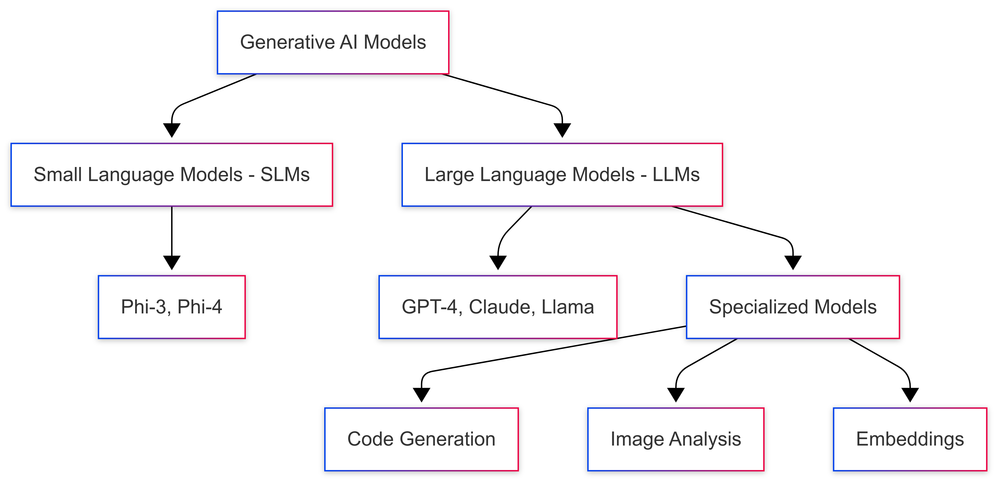
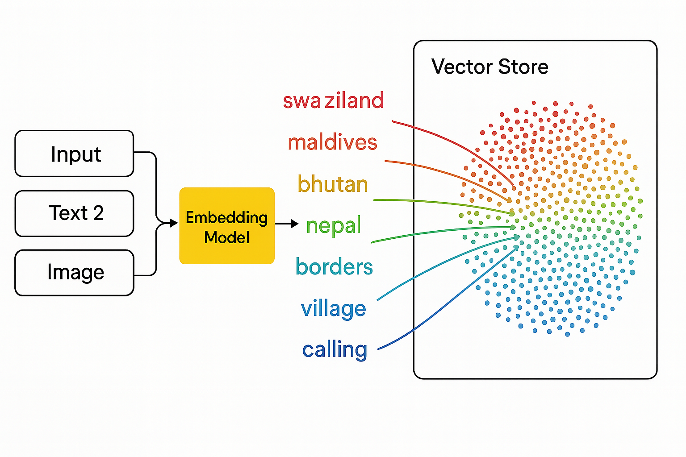
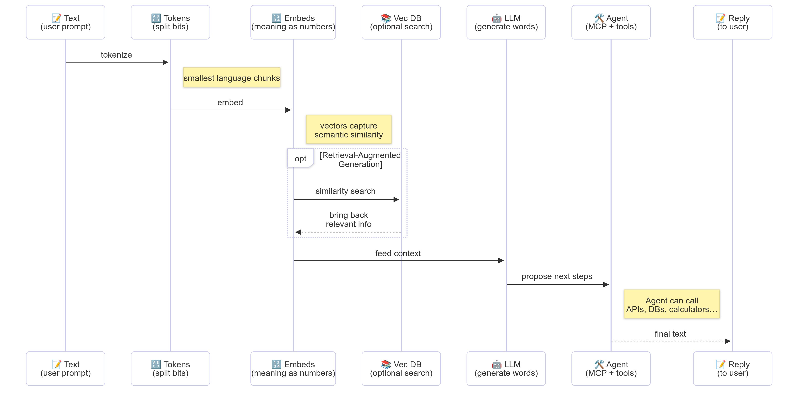

# Introduction to Generative AI - Java Edition

## What You'll Learn

- **Generative AI fundamentals** including LLMs, prompt engineering, tokens, embeddings, and vector databases
- **Compare Java AI development tools** including Azure OpenAI SDK, Spring AI, and OpenAI Java SDK
- **Discover the Model Context Protocol** and its role in AI agent communication

## Table of Contents

- [Introduction](#introduction)
- [A quick refresh on Generative AI concepts](#a-quick-refresh-on-generative-ai-concepts)
- [Prompt engineering review](#prompt-engineering-review)
- [Tokens, embeddings, and agents](#tokens-embeddings-and-agents)
- [AI Development Tools and Libraries for Java](#ai-development-tools-and-libraries-for-java)
  - [OpenAI Java SDK](#openai-java-sdk)
  - [Spring AI](#spring-ai)
  - [Azure OpenAI Java SDK](#azure-openai-java-sdk)
- [Summary](#summary)
- [Next Steps](#next-steps)

## Introduction

Welcome to the first chapter of Generative AI for Beginners - Java Edition! This foundational lesson introduces you to the core concepts of generative AI and how to work with them using Java. You'll learn about the essential building blocks of AI applications, including Large Language Models (LLMs), tokens, embeddings, and AI agents. We'll also explore the primary Java tooling you'll use throughout this course.

### A quick refresh on Generative AI concepts

Generative AI is a type of artificial intelligence that creates new content, such as text, images, or code, based on patterns and relationships learned from data. Generative AI models can generate human-like responses, understand context, and sometimes even create content that seems human-like.

As you develop your Java AI applications, you'll work with **generative AI models** to create content. Some capabilities of generative AI models include:

- **Text Generation**: Crafting human-like text for chatbots, content, and text completion.
- **Image Generation and Analysis**: Producing realistic images, enhancing photos, and detecting objects.
- **Code Generation**: Writing code snippets or scripts.

There are specific types of models that are optimized for different tasks. For example, both **Small Language Models (SLMs)** and **Large Language Models (LLMs)** can handle text generation, with LLMs typically offering better performance for complex tasks. For image-related tasks, you would use specialized vision models or multi-modal models.

Of course, the responses from these models are not perfect all the time. You've probably heard about models "hallucinating" or generating incorrect information in an authoritative manner. But you can help guide the model to generate better responses by providing them with clear instructions and context. This is where **prompt engineering** comes in.

#### Prompt engineering review

Prompt engineering is the practice of designing effective inputs to guide AI models toward desired outputs. It involves:

- **Clarity**: Making instructions clear and unambiguous.
- **Context**: Providing necessary background information.
- **Constraints**: Specifying any limitations or formats.

Some best practices for prompt engineering include prompt design, clear instructions, task breakdown, one-shot and few-shot learning, and prompt tuning. Testing different prompts is essential to find what works best for your specific use case.

When developing applications, you'll work with different prompt types:
- **System prompts**: Set the base rules and context for the model's behavior
- **User prompts**: The input data from your application users
- **Assistant prompts**: The model's responses based on system and user prompts

> **Learn more**: Learn more about prompt engineering in [Prompt Engineering chapter of GenAI for Beginners course](https://github.com/microsoft/generative-ai-for-beginners/tree/main/04-prompt-engineering-fundamentals)

#### Tokens, embeddings, and agents

When working with generative AI models, you'll encounter terms like **tokens**, **embeddings**, **agents**, and **Model Context Protocol (MCP)**. Here's a detailed overview of these concepts:

- **Tokens**: Tokens are the smallest unit of text in a model. They can be words, characters, or subwords. Tokens are used to represent text data in a format that the model can understand. For example, the sentence "The quick brown fox jumped over the lazy dog" might be tokenized as ["The", " quick", " brown", " fox", " jumped", " over", " the", " lazy", " dog"] or ["The", " qu", "ick", " br", "own", " fox", " jump", "ed", " over", " the", " la", "zy", " dog"] depending on the tokenization strategy.

Tokenization is the process of breaking down text into these smaller units. This is crucial because models operate on tokens rather than raw text. The number of tokens in a prompt affects the model's response length and quality, as models have token limits for their context window (e.g., 128K tokens for GPT-4o's total context, including both input and output).

  In Java, you can use libraries like the OpenAI SDK to handle tokenization automatically when sending requests to AI models.

- **Embeddings**: Embeddings are vector representations of tokens that capture semantic meaning. They're numerical representations (typically arrays of floating-point numbers) that allow models to understand relationships between words and generate contextually relevant responses. Similar words have similar embeddings, enabling the model to understand concepts like synonyms and semantic relationships.

  In Java, you can generate embeddings using the OpenAI SDK or other libraries that support embedding generation. These embeddings are essential for tasks like semantic search, where you want to find similar content based on meaning rather than exact text matches.

- **Vector databases**: Vector databases are specialized storage systems optimized for embeddings. They enable efficient similarity search and are crucial for Retrieval-Augmented Generation (RAG) patterns where you need to find relevant information from large datasets based on semantic similarity rather than exact matches.

> **Note**: In this course, we'll not cover Vector databases but think they are worth mentioning as they are commonly used in real-world applications.

- **Agents & MCP**: AI components that autonomously interact with models, tools, and external systems. The Model Context Protocol (MCP) provides a standardized way for agents to securely access external data sources and tools. Learn more in our [MCP for Beginners](https://github.com/microsoft/mcp-for-beginners) course.

In Java AI applications, you'll use tokens for text processing, embeddings for semantic search and RAG, vector databases for data retrieval, and agents with MCP for building intelligent, tool-using systems. 

### AI Development Tools and Libraries for Java

Java offers excellent tooling for AI development. There are three main libraries that we'll explore throughout this course - OpenAI Java SDK, Azure OpenAI SDK, and Spring AI.

Here's a quick reference table showing which SDK is used in each chapter's examples:

| Chapter | Sample | SDK |
|---------|--------|-----|
| 02-SetupDevEnvironment | src/github-models/ | OpenAI Java SDK |
| 02-SetupDevEnvironment | src/basic-chat-azure/ | Spring AI Azure OpenAI |
| 03-CoreGenerativeAITechniques | examples/ | Azure OpenAI SDK |
| 04-PracticalSamples | petstory/ | OpenAI Java SDK |
| 04-PracticalSamples | foundrylocal/ | OpenAI Java SDK |
| 04-PracticalSamples | calculator/ | Spring AI MCP SDK + LangChain4j |

**SDK Documentation Links:**
- [Azure OpenAI Java SDK](https://github.com/Azure/azure-sdk-for-java/tree/azure-ai-openai_1.0.0-beta.16/sdk/openai/azure-ai-openai)
- [Spring AI](https://docs.spring.io/spring-ai/reference/)
- [OpenAI Java SDK](https://github.com/openai/openai-java)
- [LangChain4j](https://docs.langchain4j.dev/)

#### OpenAI Java SDK

The OpenAI SDK is the official Java library for the OpenAI API. It provides a simple and consistent interface for interacting with OpenAI's models, making it easy to integrate AI capabilities into Java applications. Chapter 2's GitHub Models example, Chapter 4's Pet Story application and Foundry Local example demonstrate the OpenAI SDK approach.

#### Spring AI

Spring AI is a comprehensive framework that brings AI capabilities to Spring applications, providing a consistent abstraction layer across different AI providers. It integrates seamlessly with the Spring ecosystem, making it the ideal choice for enterprise Java applications that need AI capabilities.

Spring AI's strength lies in its seamless integration with the Spring ecosystem, making it easy to build production-ready AI applications with familiar Spring patterns like dependency injection, configuration management, and testing frameworks. You'll use Spring AI in Chapter 2 and 4 to build applications that leverage both OpenAI and the Model Context Protocol (MCP) Spring AI libraries.

##### Model Context Protocol (MCP)

The [Model Context Protocol (MCP)](https://modelcontextprotocol.io/) is an emerging standard that enables AI applications to interact securely with external data sources and tools. MCP provides a standardized way for AI models to access contextual information and execute actions in your applications.

In Chapter 4, you'll build a simple MCP calculator service that demonstrates the fundamentals of Model Context Protocol with Spring AI, showing how to create basic tool integrations and service architectures.

#### Azure OpenAI Java SDK

The Azure OpenAI client library for Java is an adaptation of OpenAI's REST APIs that provides an idiomatic interface and integration with the rest of the Azure SDK ecosystem. In Chapter 3, you'll build applications using the Azure OpenAI SDK, including chat applications, function calling, and RAG (Retrieval-Augmented Generation) patterns.

> Note: Azure OpenAI SDK lags behind the OpenAI Java SDK in terms of features so for future projects, consider using the OpenAI Java SDK.

## Summary

**Congratulations!** You have successfully:

- **Learned about Generative AI fundamentals** including LLMs, prompt engineering, tokens, embeddings, and vector databases
- **Compared Java AI development tools** including Azure OpenAI SDK, Spring AI, and OpenAI Java SDK
- **Discovered the Model Context Protocol** and its role in AI agent communication

## Next Steps

[Chapter 2: Setting Up the Development Environment](../02-SetupDevEnvironment/README.md)
