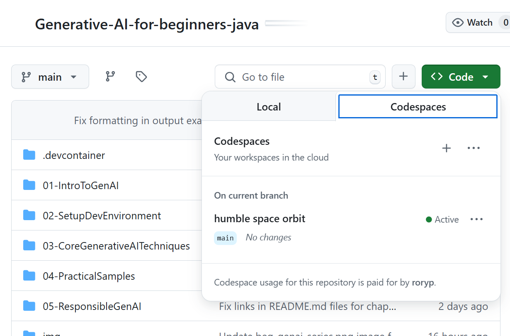

# Setting Up the Development Environment for Azure OpenAI

> **Quick Start**: This guide is for Azure OpenAI setup. For immediate start with free models, use [GitHub Models with Codespaces](./README.md#quick-start-cloud).

This guide will help you set up Azure AI Foundry models for your Java AI apps in this course.

## Table of Contents

- [Quick Setup Overview](#quick-setup-overview)
- [Step 1: Create Azure AI Foundry Resources](#step-1-create-azure-ai-foundry-resources)
  - [Create a Hub and Project](#create-a-hub-and-project)
  - [Deploy GPT-4o-mini Model](#deploy-gpt-4o-mini-model)
- [Step 2: Create Your Codespace](#step-2-create-your-codespace)
- [Step 3: Configure Your Environment](#step-3-configure-your-environment)
- [Step 4: Test Your Setup](#step-4-test-your-setup)
- [What's Next?](#whats-next)
- [Resources](#resources)
- [Additional Resources](#additional-resources)

## Quick Setup Overview

1. Create Azure AI Foundry resources (Hub, Project, Model)
2. Create a Codespace with Java development container
3. Configure your .env file with Azure OpenAI credentials
4. Test your setup with the example project

## Step 1: Create Azure AI Foundry Resources

### Create a Hub and Project

1. Go to [Azure AI Foundry Portal](https://ai.azure.com/) and sign in
2. Click **+ Create** → **New hub** (or navigate to **Management** → **All hubs** → **+ New hub**)
3. Configure your hub:
   - **Hub name**: e.g., "MyAIHub"
   - **Subscription**: Select your Azure subscription
   - **Resource group**: Create new or select existing
   - **Location**: Choose closest to you
   - **Storage account**: Use default or configure custom
   - **Key vault**: Use default or configure custom
   - Click **Next** → **Review + create** → **Create**
4. Once created, click **+ New project** (or **Create project** from hub overview)
   - **Project name**: e.g., "GenAIJava"
   - Click **Create**

### Deploy GPT-4o-mini Model

1. In your project, go to **Model catalog** and search for **gpt-4o-mini**
   - *Alternative: Go to **Deployments** → **+ Create deployment***
2. Click **Deploy** on the gpt-4o-mini model card
3. Configure deployment:
   - **Deployment name**: "gpt-4o-mini"
   - **Model version**: Use latest
   - **Deployment type**: Standard
4. Click **Deploy**
5. Once deployed, go to **Deployments** tab and copy these values:
   - **Deployment name** (e.g., "gpt-4o-mini")
   - **Target URI** (e.g., `https://your-hub-name.openai.azure.com/`) 
      > **Important**: Copy only the base URL (e.g., `https://myhub.openai.azure.com/`) not the full endpoint path.
   - **Key** (from the Keys and Endpoint section)

> **Still having trouble?** Visit the official [Azure AI Foundry Documentation](https://learn.microsoft.com/azure/ai-foundry/how-to/create-projects?tabs=ai-foundry&pivots=hub-project)

## Step 2: Create Your Codespace

1. Fork this repository to your GitHub account
   > **Note**: If you want to edit the basic config please have a look at the [Dev Container Configuration](../.devcontainer/devcontainer.json)
2. In your forked repo, click **Code** → **Codespaces** tab
3. Click **...** → **New with options...**

4. Select **Dev container configuration**: 
   - **Generative AI Java Development Environment**
5. Click **Create codespace**


## Step 3: Configure Your Environment

Once your Codespace is ready, set up your Azure OpenAI credentials:

1. **Navigate to the example project from the repository root:**
   ```bash
   cd 02-SetupDevEnvironment/src/basic-chat-azure
   ```

2. **Create your .env file:**
   ```bash
   cp .env.example .env
   ```

3. **Edit the .env file with your Azure OpenAI credentials:**
   ```bash
   # Your Azure OpenAI API key (from Azure AI Foundry portal)
   AZURE_AI_KEY=your-actual-api-key-here
   
   # Your Azure OpenAI endpoint URL (e.g., https://myhub.openai.azure.com/)
   AZURE_AI_ENDPOINT=https://your-hub-name.openai.azure.com/
   ```

   > **Security Note**: 
   > - Never commit your `.env` file to version control
   > - The `.env` file is already included in `.gitignore`
   > - Keep your API keys secure and rotate them regularly

## Step 4: Test Your Setup

Run the example application to test your Azure OpenAI connection:

```bash
mvn clean spring-boot:run
```

You should see a response from the GPT-4o-mini model!

> **VS Code Users**: You can also press `F5` in VS Code to run the application. The launch configuration is already set up to load your `.env` file automatically.

> **Full example**: See the [End-to-End Azure OpenAI Example](./src/basic-chat-azure/README.md) for detailed instructions and troubleshooting.

## What's Next?

**Setup Complete!** You now have:
- Azure OpenAI with gpt-4o-mini deployed
- Local .env file configuration
- Java development environment ready

**Continue to** [Chapter 3: Core Generative AI Techniques](../03-CoreGenerativeAITechniques/README.md) to start building AI applications!

## Resources

- [Azure AI Foundry Documentation](https://learn.microsoft.com/azure/ai-services/)
- [Spring AI Azure OpenAI Documentation](https://docs.spring.io/spring-ai/reference/api/clients/azure-openai-chat.html)
- [Azure OpenAI Java SDK](https://learn.microsoft.com/java/api/overview/azure/ai-openai-readme)

## Additional Resources

- [Download VS Code](https://code.visualstudio.com/Download)
- [Get Docker Desktop](https://www.docker.com/products/docker-desktop)
- [Dev Container Configuration](../.devcontainer/devcontainer.json)
