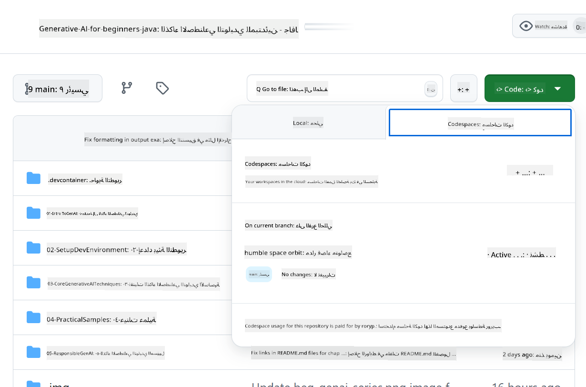

<!--
CO_OP_TRANSLATOR_METADATA:
{
  "original_hash": "bfdb4b4eadbee3a59ef742439f58326a",
  "translation_date": "2025-07-27T12:51:54+00:00",
  "source_file": "02-SetupDevEnvironment/getting-started-azure-openai.md",
  "language_code": "ar"
}
-->
# إعداد بيئة التطوير لـ Azure OpenAI

> **البدء السريع**: هذا الدليل مخصص لإعداد Azure OpenAI. للبدء الفوري باستخدام النماذج المجانية، استخدم [نماذج GitHub مع Codespaces](./README.md#quick-start-cloud).

سيساعدك هذا الدليل في إعداد نماذج Azure AI Foundry لتطبيقات Java AI الخاصة بك في هذه الدورة.

## جدول المحتويات

- [نظرة عامة على الإعداد السريع](../../../02-SetupDevEnvironment)
- [الخطوة 1: إنشاء موارد Azure AI Foundry](../../../02-SetupDevEnvironment)
  - [إنشاء مركز ومشروع](../../../02-SetupDevEnvironment)
  - [نشر نموذج GPT-4o-mini](../../../02-SetupDevEnvironment)
- [الخطوة 2: إنشاء Codespace الخاص بك](../../../02-SetupDevEnvironment)
- [الخطوة 3: تكوين بيئتك](../../../02-SetupDevEnvironment)
- [الخطوة 4: اختبار الإعداد الخاص بك](../../../02-SetupDevEnvironment)
- [ماذا بعد؟](../../../02-SetupDevEnvironment)
- [المصادر](../../../02-SetupDevEnvironment)
- [مصادر إضافية](../../../02-SetupDevEnvironment)

## نظرة عامة على الإعداد السريع

1. إنشاء موارد Azure AI Foundry (مركز، مشروع، نموذج)
2. إنشاء Codespace مع حاوية تطوير Java
3. تكوين ملف .env باستخدام بيانات اعتماد Azure OpenAI
4. اختبار الإعداد باستخدام المشروع النموذجي

## الخطوة 1: إنشاء موارد Azure AI Foundry

### إنشاء مركز ومشروع

1. انتقل إلى [بوابة Azure AI Foundry](https://ai.azure.com/) وقم بتسجيل الدخول
2. انقر على **+ إنشاء** → **مركز جديد** (أو انتقل إلى **الإدارة** → **كل المراكز** → **+ مركز جديد**)
3. قم بتكوين المركز الخاص بك:
   - **اسم المركز**: مثل "MyAIHub"
   - **الاشتراك**: اختر اشتراك Azure الخاص بك
   - **مجموعة الموارد**: أنشئ جديدًا أو اختر الموجود
   - **الموقع**: اختر الأقرب إليك
   - **حساب التخزين**: استخدم الافتراضي أو قم بتكوين مخصص
   - **Key vault**: استخدم الافتراضي أو قم بتكوين مخصص
   - انقر على **التالي** → **مراجعة + إنشاء** → **إنشاء**
4. بمجرد الإنشاء، انقر على **+ مشروع جديد** (أو **إنشاء مشروع** من نظرة عامة على المركز)
   - **اسم المشروع**: مثل "GenAIJava"
   - انقر على **إنشاء**

### نشر نموذج GPT-4o-mini

1. في مشروعك، انتقل إلى **كتالوج النماذج** وابحث عن **gpt-4o-mini**
   - *بديل: انتقل إلى **النشر** → **+ إنشاء نشر***
2. انقر على **نشر** على بطاقة نموذج gpt-4o-mini
3. قم بتكوين النشر:
   - **اسم النشر**: "gpt-4o-mini"
   - **إصدار النموذج**: استخدم الأحدث
   - **نوع النشر**: قياسي
4. انقر على **نشر**
5. بمجرد النشر، انتقل إلى علامة تبويب **النشر** ونسخ القيم التالية:
   - **اسم النشر** (مثل "gpt-4o-mini")
   - **عنوان URI الهدف** (مثل `https://your-hub-name.openai.azure.com/`) 
      > **هام**: انسخ فقط عنوان URL الأساسي (مثل `https://myhub.openai.azure.com/`) وليس المسار الكامل لنقطة النهاية.
   - **المفتاح** (من قسم المفاتيح ونقطة النهاية)

> **ما زلت تواجه مشكلة؟** قم بزيارة [وثائق Azure AI Foundry الرسمية](https://learn.microsoft.com/azure/ai-foundry/how-to/create-projects?tabs=ai-foundry&pivots=hub-project)

## الخطوة 2: إنشاء Codespace الخاص بك

1. قم بعمل Fork لهذا المستودع إلى حساب GitHub الخاص بك
   > **ملاحظة**: إذا كنت ترغب في تعديل التكوين الأساسي، يرجى الاطلاع على [تكوين حاوية التطوير](../../../.devcontainer/devcontainer.json)
2. في المستودع الذي قمت بعمل Fork له، انقر على **Code** → علامة تبويب **Codespaces**
3. انقر على **...** → **جديد مع الخيارات...**

4. اختر **تكوين حاوية التطوير**: 
   - **بيئة تطوير Java للذكاء الاصطناعي التوليدي**
5. انقر على **إنشاء Codespace**

## الخطوة 3: تكوين بيئتك

بمجرد أن يصبح Codespace جاهزًا، قم بإعداد بيانات اعتماد Azure OpenAI:

1. **انتقل إلى المشروع النموذجي من جذر المستودع:**
   ```bash
   cd 02-SetupDevEnvironment/examples/basic-chat-azure
   ```

2. **قم بإنشاء ملف .env:**
   ```bash
   cp .env.example .env
   ```

3. **قم بتحرير ملف .env باستخدام بيانات اعتماد Azure OpenAI الخاصة بك:**
   ```bash
   # Your Azure OpenAI API key (from Azure AI Foundry portal)
   AZURE_AI_KEY=your-actual-api-key-here
   
   # Your Azure OpenAI endpoint URL (e.g., https://myhub.openai.azure.com/)
   AZURE_AI_ENDPOINT=https://your-hub-name.openai.azure.com/
   ```

   > **ملاحظة أمنية**: 
   > - لا تقم أبدًا بإضافة ملف `.env` إلى التحكم في الإصدار
   > - ملف `.env` مدرج بالفعل في `.gitignore`
   > - حافظ على أمان مفاتيح API الخاصة بك وقم بتدويرها بانتظام

## الخطوة 4: اختبار الإعداد الخاص بك

قم بتشغيل التطبيق النموذجي لاختبار اتصال Azure OpenAI الخاص بك:

```bash
mvn clean spring-boot:run
```

يجب أن ترى استجابة من نموذج GPT-4o-mini!

> **مستخدمي VS Code**: يمكنك أيضًا الضغط على `F5` في VS Code لتشغيل التطبيق. تم إعداد تكوين التشغيل بالفعل لتحميل ملف `.env` الخاص بك تلقائيًا.

> **مثال كامل**: راجع [مثال Azure OpenAI من البداية إلى النهاية](./examples/basic-chat-azure/README.md) للحصول على تعليمات مفصلة وحل المشكلات.

## ماذا بعد؟

**تم الإعداد بنجاح!** لديك الآن:
- Azure OpenAI مع gpt-4o-mini منشور
- تكوين ملف .env محلي
- بيئة تطوير Java جاهزة

**تابع إلى** [الفصل 3: تقنيات الذكاء الاصطناعي التوليدي الأساسية](../03-CoreGenerativeAITechniques/README.md) لبدء بناء تطبيقات الذكاء الاصطناعي!

## المصادر

- [وثائق Azure AI Foundry](https://learn.microsoft.com/azure/ai-services/)
- [وثائق Spring AI Azure OpenAI](https://docs.spring.io/spring-ai/reference/api/clients/azure-openai-chat.html)
- [Azure OpenAI Java SDK](https://learn.microsoft.com/java/api/overview/azure/ai-openai-readme)

## مصادر إضافية

- [تحميل VS Code](https://code.visualstudio.com/Download)
- [الحصول على Docker Desktop](https://www.docker.com/products/docker-desktop)
- [تكوين حاوية التطوير](../../../.devcontainer/devcontainer.json)

**إخلاء المسؤولية**:  
تم ترجمة هذا المستند باستخدام خدمة الترجمة بالذكاء الاصطناعي [Co-op Translator](https://github.com/Azure/co-op-translator). بينما نسعى لتحقيق الدقة، يرجى العلم أن الترجمات الآلية قد تحتوي على أخطاء أو معلومات غير دقيقة. يجب اعتبار المستند الأصلي بلغته الأصلية هو المصدر الموثوق. للحصول على معلومات حاسمة، يُوصى بالاستعانة بترجمة بشرية احترافية. نحن غير مسؤولين عن أي سوء فهم أو تفسيرات خاطئة ناتجة عن استخدام هذه الترجمة.