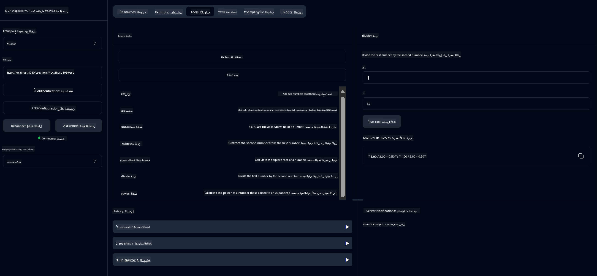

<!--
CO_OP_TRANSLATOR_METADATA:
{
  "original_hash": "5bd7a347d6ed1d706443f9129dd29dd9",
  "translation_date": "2025-07-25T08:49:23+00:00",
  "source_file": "04-PracticalSamples/mcp/calculator/README.md",
  "language_code": "ar"
}
-->
# خدمة الحاسبة الأساسية باستخدام MCP

>**ملاحظة**: يتضمن هذا الفصل [**دليل تعليمي**](./TUTORIAL.md) يوجهك خلال الأمثلة.

مرحبًا بك في أول تجربة عملية مع **بروتوكول سياق النموذج (MCP)**! في الفصول السابقة، تعلمت أساسيات الذكاء الاصطناعي التوليدي وقمت بإعداد بيئة التطوير الخاصة بك. الآن حان الوقت لبناء شيء عملي.

توضح خدمة الحاسبة هذه كيف يمكن لنماذج الذكاء الاصطناعي التفاعل بأمان مع الأدوات الخارجية باستخدام MCP. بدلاً من الاعتماد على قدرات النماذج الرياضية غير الموثوقة أحيانًا، سنوضح كيفية بناء نظام قوي حيث يمكن للذكاء الاصطناعي استدعاء خدمات متخصصة لإجراء حسابات دقيقة.

## جدول المحتويات

- [ما ستتعلمه](../../../../../04-PracticalSamples/mcp/calculator)
- [المتطلبات الأساسية](../../../../../04-PracticalSamples/mcp/calculator)
- [المفاهيم الرئيسية](../../../../../04-PracticalSamples/mcp/calculator)
- [البدء السريع](../../../../../04-PracticalSamples/mcp/calculator)
- [العمليات المتاحة في الحاسبة](../../../../../04-PracticalSamples/mcp/calculator)
- [عملاء الاختبار](../../../../../04-PracticalSamples/mcp/calculator)
  - [1. عميل MCP المباشر (SDKClient)](../../../../../04-PracticalSamples/mcp/calculator)
  - [2. العميل المدعوم بالذكاء الاصطناعي (LangChain4jClient)](../../../../../04-PracticalSamples/mcp/calculator)
- [مفتش MCP (واجهة ويب)](../../../../../04-PracticalSamples/mcp/calculator)
  - [تعليمات خطوة بخطوة](../../../../../04-PracticalSamples/mcp/calculator)

## ما ستتعلمه

من خلال العمل على هذا المثال، ستفهم:
- كيفية إنشاء خدمات متوافقة مع MCP باستخدام Spring Boot
- الفرق بين الاتصال المباشر بالبروتوكول والتفاعل المدعوم بالذكاء الاصطناعي
- كيفية اتخاذ نماذج الذكاء الاصطناعي قرارات بشأن متى وكيفية استخدام الأدوات الخارجية
- أفضل الممارسات لبناء تطبيقات ذكاء اصطناعي مدعومة بالأدوات

هذا المثال مثالي للمبتدئين الذين يتعلمون مفاهيم MCP ومستعدين لبناء أول تكامل لأدوات الذكاء الاصطناعي!

## المتطلبات الأساسية

- Java 21+
- Maven 3.6+
- **رمز GitHub**: مطلوب للعميل المدعوم بالذكاء الاصطناعي. إذا لم تقم بإعداده بعد، راجع [الفصل 2: إعداد بيئة التطوير الخاصة بك](../../../02-SetupDevEnvironment/README.md) للحصول على التعليمات.

## المفاهيم الرئيسية

**بروتوكول سياق النموذج (MCP)** هو طريقة موحدة لتطبيقات الذكاء الاصطناعي للاتصال بأمان بالأدوات الخارجية. فكر فيه كـ "جسر" يسمح لنماذج الذكاء الاصطناعي باستخدام خدمات خارجية مثل الحاسبة الخاصة بنا. بدلاً من محاولة النموذج إجراء الحسابات بنفسه (وهو ما قد يكون غير موثوق)، يمكنه استدعاء خدمة الحاسبة للحصول على نتائج دقيقة. يضمن MCP أن يتم هذا الاتصال بأمان وبشكل متسق.

**الأحداث المرسلة من الخادم (SSE)** تمكن الاتصال في الوقت الحقيقي بين الخادم والعملاء. على عكس طلبات HTTP التقليدية حيث تسأل وتنتظر الرد، يسمح SSE للخادم بإرسال تحديثات مستمرة إلى العميل. هذا مثالي لتطبيقات الذكاء الاصطناعي حيث قد يتم بث الردود أو تستغرق وقتًا للمعالجة.

**أدوات الذكاء الاصطناعي واستدعاء الوظائف** تسمح لنماذج الذكاء الاصطناعي باختيار واستخدام الوظائف الخارجية تلقائيًا (مثل عمليات الحاسبة) بناءً على طلبات المستخدم. عندما تسأل "ما نتيجة 15 + 27؟"، يفهم النموذج أنك تريد عملية الجمع، ويستدعي أداة `add` مع المعلمات الصحيحة (15، 27)، ويعيد النتيجة بلغة طبيعية. يعمل الذكاء الاصطناعي كمنسق ذكي يعرف متى وكيف يستخدم كل أداة.

## البدء السريع

### 1. انتقل إلى دليل تطبيق الحاسبة
```bash
cd Generative-AI-for-beginners-java/04-PracticalSamples/mcp/calculator
```

### 2. قم بالبناء والتشغيل
```bash
mvn clean install -DskipTests
java -jar target/calculator-server-0.0.1-SNAPSHOT.jar
```

### 3. اختبر باستخدام العملاء
- **SDKClient**: تفاعل مباشر مع بروتوكول MCP
- **LangChain4jClient**: تفاعل بلغة طبيعية مدعوم بالذكاء الاصطناعي (يتطلب رمز GitHub)

## العمليات المتاحة في الحاسبة

- `add(a, b)`, `subtract(a, b)`, `multiply(a, b)`, `divide(a, b)`
- `power(base, exponent)`, `squareRoot(number)`, `absolute(number)`
- `modulus(a, b)`, `help()`

## عملاء الاختبار

### 1. عميل MCP المباشر (SDKClient)
يختبر الاتصال الخام ببروتوكول MCP. قم بالتشغيل باستخدام:
```bash
mvn test-compile exec:java -Dexec.mainClass="com.microsoft.mcp.sample.client.SDKClient" -Dexec.classpathScope=test
```

### 2. العميل المدعوم بالذكاء الاصطناعي (LangChain4jClient)
يوضح التفاعل بلغة طبيعية مع نماذج GitHub. يتطلب رمز GitHub (راجع [المتطلبات الأساسية](../../../../../04-PracticalSamples/mcp/calculator)).

**تشغيل:**
```bash
mvn test-compile exec:java -Dexec.mainClass="com.microsoft.mcp.sample.client.LangChain4jClient" -Dexec.classpathScope=test
```

## مفتش MCP (واجهة ويب)

يوفر مفتش MCP واجهة ويب مرئية لاختبار خدمة MCP الخاصة بك دون كتابة أي كود. مثالي للمبتدئين لفهم كيفية عمل MCP!

### تعليمات خطوة بخطوة:

1. **ابدأ خادم الحاسبة** (إذا لم يكن قيد التشغيل بالفعل):
   ```bash
   java -jar target/calculator-server-0.0.1-SNAPSHOT.jar
   ```

2. **قم بتثبيت وتشغيل مفتش MCP** في نافذة طرفية جديدة:
   ```bash
   npx @modelcontextprotocol/inspector
   ```

3. **افتح واجهة الويب**:
   - ابحث عن رسالة مثل "المفتش يعمل على http://localhost:6274"
   - افتح هذا الرابط في متصفح الويب الخاص بك

4. **اتصل بخدمة الحاسبة الخاصة بك**:
   - في واجهة الويب، قم بتعيين نوع النقل إلى "SSE"
   - قم بتعيين الرابط إلى: `http://localhost:8080/sse`
   - اضغط على زر "Connect"

5. **استكشف الأدوات المتاحة**:
   - اضغط على "List Tools" لرؤية جميع عمليات الحاسبة
   - سترى وظائف مثل `add`, `subtract`, `multiply`, إلخ.

6. **اختبر عملية حاسبة**:
   - اختر أداة (مثل "add")
   - أدخل المعلمات (مثل `a: 15`, `b: 27`)
   - اضغط على "Run Tool"
   - شاهد النتيجة التي تعيدها خدمة MCP الخاصة بك!

هذا النهج المرئي يساعدك على فهم كيفية عمل اتصال MCP قبل بناء العملاء الخاصين بك.



---
**المرجع:** [وثائق MCP Server Boot Starter](https://docs.spring.io/spring-ai/reference/api/mcp/mcp-server-boot-starter-docs.html)

**إخلاء المسؤولية**:  
تم ترجمة هذا المستند باستخدام خدمة الترجمة بالذكاء الاصطناعي [Co-op Translator](https://github.com/Azure/co-op-translator). بينما نسعى لتحقيق الدقة، يرجى العلم أن الترجمات الآلية قد تحتوي على أخطاء أو معلومات غير دقيقة. يجب اعتبار المستند الأصلي بلغته الأصلية المصدر الرسمي. للحصول على معلومات حاسمة، يُوصى بالاستعانة بترجمة بشرية احترافية. نحن غير مسؤولين عن أي سوء فهم أو تفسيرات خاطئة تنشأ عن استخدام هذه الترجمة.