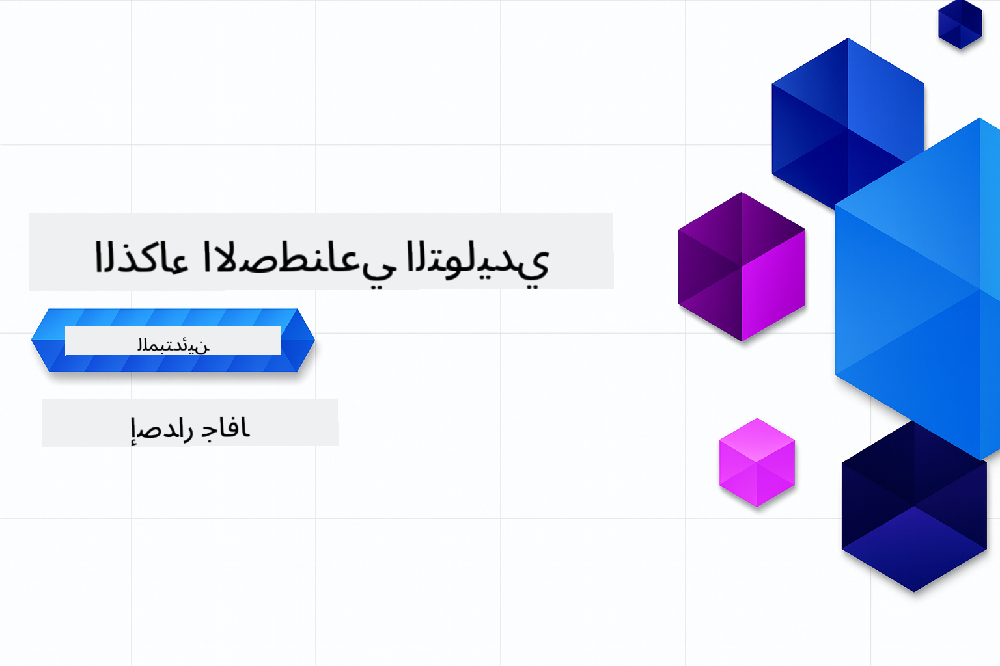

<!--
CO_OP_TRANSLATOR_METADATA:
{
  "original_hash": "b4c05c53b67571aee42e9532404f2fb8",
  "translation_date": "2025-07-28T10:18:49+00:00",
  "source_file": "README.md",
  "language_code": "ar"
}
-->
# الذكاء الاصطناعي التوليدي للمبتدئين - إصدار Java

**الوقت المطلوب**: يمكن إكمال الورشة بالكامل عبر الإنترنت دون الحاجة إلى إعداد محلي. إعداد البيئة يستغرق دقيقتين، بينما استكشاف الأمثلة يتطلب من 1 إلى 3 ساعات حسب عمق الاستكشاف.

> **البدء السريع**

1. قم بعمل Fork لهذا المستودع إلى حساب GitHub الخاص بك
2. انقر على **Code** → علامة تبويب **Codespaces** → **...** → **New with options...**
3. استخدم الإعدادات الافتراضية – سيتم اختيار حاوية التطوير التي تم إنشاؤها لهذه الدورة
4. انقر على **Create codespace**
5. انتظر حوالي دقيقتين حتى تكون البيئة جاهزة
6. انتقل مباشرة إلى [المثال الأول](./02-SetupDevEnvironment/README.md#step-2-create-a-github-personal-access-token)

## دعم متعدد اللغات

### مدعوم عبر GitHub Action (تلقائي ودائم التحديث)

[French](../fr/README.md) | [Spanish](../es/README.md) | [German](../de/README.md) | [Russian](../ru/README.md) | [Arabic](./README.md) | [Persian (Farsi)](../fa/README.md) | [Urdu](../ur/README.md) | [Chinese (Simplified)](../zh/README.md) | [Chinese (Traditional, Macau)](../mo/README.md) | [Chinese (Traditional, Hong Kong)](../hk/README.md) | [Chinese (Traditional, Taiwan)](../tw/README.md) | [Japanese](../ja/README.md) | [Korean](../ko/README.md) | [Hindi](../hi/README.md) | [Bengali](../bn/README.md) | [Marathi](../mr/README.md) | [Nepali](../ne/README.md) | [Punjabi (Gurmukhi)](../pa/README.md) | [Portuguese (Portugal)](../pt/README.md) | [Portuguese (Brazil)](../br/README.md) | [Italian](../it/README.md) | [Polish](../pl/README.md) | [Turkish](../tr/README.md) | [Greek](../el/README.md) | [Thai](../th/README.md) | [Swedish](../sv/README.md) | [Danish](../da/README.md) | [Norwegian](../no/README.md) | [Finnish](../fi/README.md) | [Dutch](../nl/README.md) | [Hebrew](../he/README.md) | [Vietnamese](../vi/README.md) | [Indonesian](../id/README.md) | [Malay](../ms/README.md) | [Tagalog (Filipino)](../tl/README.md) | [Swahili](../sw/README.md) | [Hungarian](../hu/README.md) | [Czech](../cs/README.md) | [Slovak](../sk/README.md) | [Romanian](../ro/README.md) | [Bulgarian](../bg/README.md) | [Serbian (Cyrillic)](../sr/README.md) | [Croatian](../hr/README.md) | [Slovenian](../sl/README.md) | [Ukrainian](../uk/README.md) | [Burmese (Myanmar)](../my/README.md)

## هيكل الدورة ومسار التعلم

### **الفصل الأول: مقدمة في الذكاء الاصطناعي التوليدي**
- **المفاهيم الأساسية**: فهم نماذج اللغة الكبيرة، الرموز، التضمينات، وقدرات الذكاء الاصطناعي
- **نظام الذكاء الاصطناعي في Java**: نظرة عامة على Spring AI و OpenAI SDKs
- **بروتوكول سياق النموذج**: مقدمة عن MCP ودوره في تواصل وكلاء الذكاء الاصطناعي
- **التطبيقات العملية**: سيناريوهات واقعية تشمل روبوتات الدردشة وتوليد المحتوى
- **[→ ابدأ الفصل الأول](./01-IntroToGenAI/README.md)**

### **الفصل الثاني: إعداد بيئة التطوير**
- **إعداد متعدد المزودين**: تكامل نماذج GitHub و Azure OpenAI و OpenAI Java SDK
- **Spring Boot + Spring AI**: أفضل الممارسات لتطوير تطبيقات الذكاء الاصطناعي للمؤسسات
- **نماذج GitHub**: الوصول إلى نماذج الذكاء الاصطناعي مجانًا للتجربة والتعلم (لا حاجة لبطاقة ائتمان)
- **أدوات التطوير**: إعداد حاويات Docker، VS Code، و GitHub Codespaces
- **[→ ابدأ الفصل الثاني](./02-SetupDevEnvironment/README.md)**

### **الفصل الثالث: تقنيات الذكاء الاصطناعي التوليدي الأساسية**
- **هندسة التوجيه**: تقنيات للحصول على استجابات مثالية من نماذج الذكاء الاصطناعي
- **التضمينات وعمليات المتجهات**: تنفيذ البحث الدلالي ومطابقة التشابه
- **توليد البيانات المعزز بالاسترجاع (RAG)**: دمج الذكاء الاصطناعي مع مصادر البيانات الخاصة بك
- **استدعاء الوظائف**: توسيع قدرات الذكاء الاصطناعي باستخدام أدوات ومكونات إضافية مخصصة
- **[→ ابدأ الفصل الثالث](./03-CoreGenerativeAITechniques/README.md)**

### **الفصل الرابع: التطبيقات العملية والمشاريع**
- **مولد قصص الحيوانات الأليفة** (`petstory/`): توليد محتوى إبداعي باستخدام نماذج GitHub
- **عرض محلي لـ Foundry** (`foundrylocal/`): تكامل نماذج الذكاء الاصطناعي المحلية مع OpenAI Java SDK
- **خدمة حاسبة MCP** (`calculator/`): تنفيذ بروتوكول سياق النموذج الأساسي باستخدام Spring AI
- **[→ ابدأ الفصل الرابع](./04-PracticalSamples/README.md)**

### **الفصل الخامس: تطوير الذكاء الاصطناعي المسؤول**
- **أمان نماذج GitHub**: اختبار آليات تصفية المحتوى والسلامة المدمجة
- **عرض الذكاء الاصطناعي المسؤول**: مثال عملي يوضح كيفية عمل فلاتر أمان الذكاء الاصطناعي
- **أفضل الممارسات**: إرشادات أساسية لتطوير ونشر الذكاء الاصطناعي الأخلاقي
- **[→ ابدأ الفصل الخامس](./05-ResponsibleGenAI/README.md)**

## موارد إضافية

- [وكلاء الذكاء الاصطناعي للمبتدئين](https://github.com/microsoft/ai-agents-for-beginners)
- [الذكاء الاصطناعي التوليدي للمبتدئين باستخدام .NET](https://github.com/microsoft/Generative-AI-for-beginners-dotnet)
- [الذكاء الاصطناعي التوليدي للمبتدئين باستخدام JavaScript](https://github.com/microsoft/generative-ai-with-javascript)
- [الذكاء الاصطناعي التوليدي للمبتدئين](https://github.com/microsoft/generative-ai-for-beginners)
- [تعلم الآلة للمبتدئين](https://aka.ms/ml-beginners)
- [علم البيانات للمبتدئين](https://aka.ms/datascience-beginners)
- [الذكاء الاصطناعي للمبتدئين](https://aka.ms/ai-beginners)
- [الأمن السيبراني للمبتدئين](https://github.com/microsoft/Security-101)
- [تطوير الويب للمبتدئين](https://aka.ms/webdev-beginners)
- [إنترنت الأشياء للمبتدئين](https://aka.ms/iot-beginners)
- [تطوير الواقع الممتد للمبتدئين](https://github.com/microsoft/xr-development-for-beginners)
- [إتقان GitHub Copilot للبرمجة المزدوجة بالذكاء الاصطناعي](https://aka.ms/GitHubCopilotAI)
- [إتقان GitHub Copilot لمطوري C#/.NET](https://github.com/microsoft/mastering-github-copilot-for-dotnet-csharp-developers)
- [اختر مغامرتك الخاصة مع Copilot](https://github.com/microsoft/CopilotAdventures)
- [تطبيق دردشة RAG مع خدمات Azure AI](https://github.com/Azure-Samples/azure-search-openai-demo-java)

**إخلاء المسؤولية**:  
تم ترجمة هذا المستند باستخدام خدمة الترجمة بالذكاء الاصطناعي [Co-op Translator](https://github.com/Azure/co-op-translator). بينما نسعى لتحقيق الدقة، يرجى العلم أن الترجمات الآلية قد تحتوي على أخطاء أو معلومات غير دقيقة. يجب اعتبار المستند الأصلي بلغته الأصلية المصدر الموثوق. للحصول على معلومات حاسمة، يُوصى بالاستعانة بترجمة بشرية احترافية. نحن غير مسؤولين عن أي سوء فهم أو تفسيرات خاطئة تنشأ عن استخدام هذه الترجمة.