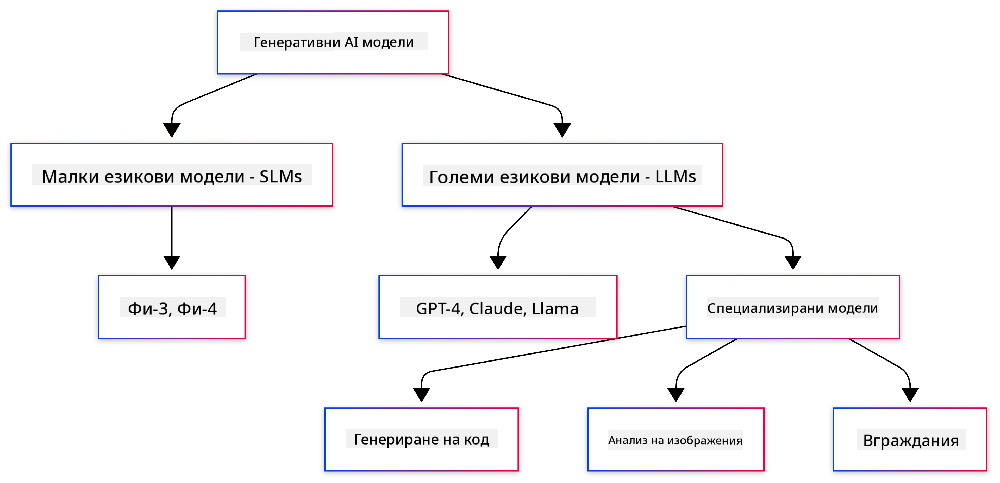
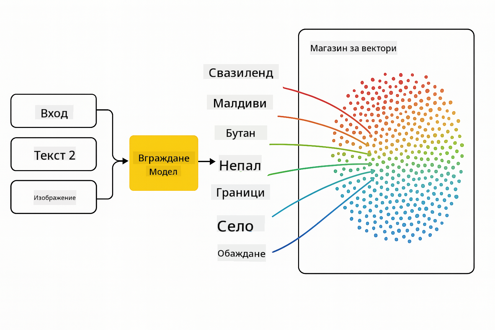
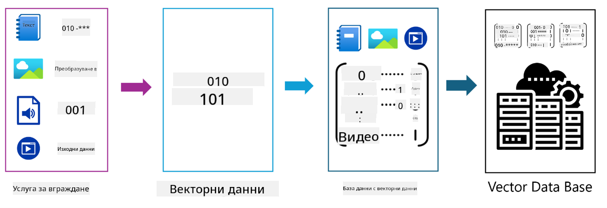
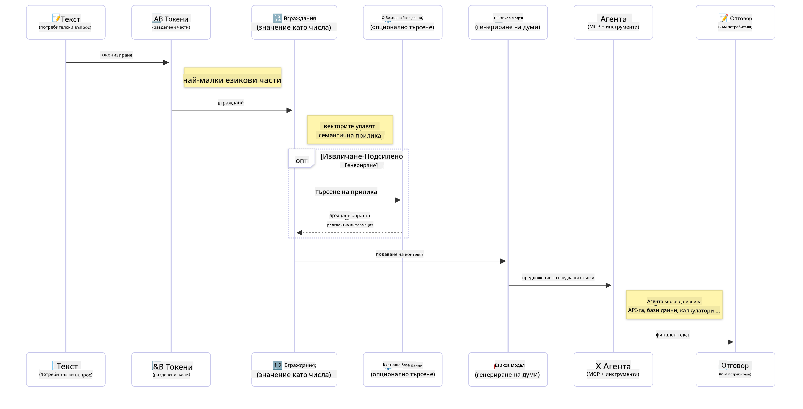

<!--
CO_OP_TRANSLATOR_METADATA:
{
  "original_hash": "6d8b4a0d774dc2a1e97c95859a6d6e4b",
  "translation_date": "2025-07-21T21:47:40+00:00",
  "source_file": "01-IntroToGenAI/README.md",
  "language_code": "bg"
}
-->
# Въведение в Генеративния AI - Java издание

## Какво ще научите

- **Основи на Генеративния AI**, включително LLMs, инженеринг на подканите, токени, вграждания и векторни бази данни
- **Сравнение на инструменти за разработка на AI с Java**, като Azure OpenAI SDK, Spring AI и OpenAI Java SDK
- **Откриване на Протокола за Контекст на Модела (MCP)** и неговата роля в комуникацията на AI агентите

## Съдържание

- [Въведение](../../../01-IntroToGenAI)
- [Бърз преглед на концепциите за Генеративен AI](../../../01-IntroToGenAI)
- [Преглед на инженеринг на подканите](../../../01-IntroToGenAI)
- [Токени, вграждания и агенти](../../../01-IntroToGenAI)
- [Инструменти и библиотеки за разработка на AI с Java](../../../01-IntroToGenAI)
  - [OpenAI Java SDK](../../../01-IntroToGenAI)
  - [Spring AI](../../../01-IntroToGenAI)
  - [Azure OpenAI Java SDK](../../../01-IntroToGenAI)
- [Обобщение](../../../01-IntroToGenAI)
- [Следващи стъпки](../../../01-IntroToGenAI)

## Въведение

Добре дошли в първата глава на Генеративен AI за начинаещи - Java издание! Този основополагащ урок ще ви запознае с основните концепции на генеративния AI и как да работите с тях, използвайки Java. Ще научите за основните градивни елементи на AI приложенията, включително Големи Езикови Модели (LLMs), токени, вграждания и AI агенти. Ще разгледаме и основните инструменти за Java, които ще използвате в този курс.

### Бърз преглед на концепциите за Генеративен AI

Генеративният AI е вид изкуствен интелект, който създава ново съдържание, като текст, изображения или код, въз основа на модели и връзки, научени от данни. Генеративните AI модели могат да генерират отговори, подобни на човешките, да разбират контекст и понякога дори да създават съдържание, което изглежда като създадено от човек.

Когато разработвате Java AI приложения, ще работите с **генеративни AI модели**, за да създавате съдържание. Някои от възможностите на генеративните AI модели включват:

- **Генериране на текст**: Създаване на текст, подобен на човешкия, за чатботове, съдържание и завършване на текст.
- **Генериране и анализ на изображения**: Създаване на реалистични изображения, подобряване на снимки и разпознаване на обекти.
- **Генериране на код**: Писане на кодови фрагменти или скриптове.

Съществуват специфични видове модели, оптимизирани за различни задачи. Например, както **Малки Езикови Модели (SLMs)**, така и **Големи Езикови Модели (LLMs)** могат да обработват генериране на текст, като LLMs обикновено предлагат по-добра производителност за сложни задачи. За задачи, свързани с изображения, бихте използвали специализирани модели за визия или мултимодални модели.

Разбира се, отговорите на тези модели не винаги са перфектни. Вероятно сте чували за случаи, когато моделите "халюцинират" или генерират грешна информация с уверен тон. Но можете да помогнете на модела да генерира по-добри отговори, като му предоставите ясни инструкции и контекст. Тук се намесва **инженерингът на подканите**.

#### Преглед на инженеринг на подканите

Инженерингът на подканите е практиката на проектиране на ефективни входни данни, за да насочите AI моделите към желаните изходи. Това включва:

- **Яснота**: Правене на инструкциите ясни и недвусмислени.
- **Контекст**: Предоставяне на необходимата фонова информация.
- **Ограничения**: Посочване на всякакви ограничения или формати.

Някои добри практики за инженеринг на подканите включват проектиране на подканите, ясни инструкции, разбиване на задачите, обучение с един или няколко примера и настройка на подканите. Тестването на различни подканите е от съществено значение, за да откриете какво работи най-добре за вашия конкретен случай.

Когато разработвате приложения, ще работите с различни типове подканите:
- **Системни подканите**: Задават основните правила и контекст за поведението на модела.
- **Потребителски подканите**: Входните данни от потребителите на вашето приложение.
- **Асистентски подканите**: Отговорите на модела, базирани на системни и потребителски подканите.

> **Научете повече**: Научете повече за инженеринг на подканите в [главата за Инженеринг на подканите от курса GenAI за начинаещи](https://github.com/microsoft/generative-ai-for-beginners/tree/main/04-prompt-engineering-fundamentals)

#### Токени, вграждания и агенти

Когато работите с генеративни AI модели, ще срещнете термини като **токени**, **вграждания**, **агенти** и **Протокол за Контекст на Модела (MCP)**. Ето подробен преглед на тези концепции:

- **Токени**: Токените са най-малката единица текст в модела. Те могат да бъдат думи, символи или поддуми. Токените се използват за представяне на текстови данни във формат, който моделът може да разбере. Например, изречението "The quick brown fox jumped over the lazy dog" може да бъде токенизирано като ["The", " quick", " brown", " fox", " jumped", " over", " the", " lazy", " dog"] или ["The", " qu", "ick", " br", "own", " fox", " jump", "ed", " over", " the", " la", "zy", " dog"] в зависимост от стратегията за токенизация.

Токенизацията е процесът на разбиване на текста на тези по-малки единици. Това е от съществено значение, защото моделите работят с токени, а не с необработен текст. Броят на токените в подканата влияе върху дължината и качеството на отговора на модела, тъй като моделите имат ограничения за броя токени в контекстния прозорец (например, 128K токена за общия контекст на GPT-4, включително вход и изход).

  В Java можете да използвате библиотеки като OpenAI SDK, за да обработвате токенизацията автоматично, когато изпращате заявки към AI модели.

- **Вграждания**: Вгражданията са векторни представяния на токени, които улавят семантичното значение. Те са числови представяния (обикновено масиви от числа с плаваща запетая), които позволяват на моделите да разбират връзките между думите и да генерират контекстуално релевантни отговори. Подобни думи имат подобни вграждания, което позволява на модела да разбира концепции като синоними и семантични връзки.

  В Java можете да генерирате вграждания, използвайки OpenAI SDK или други библиотеки, които поддържат генериране на вграждания. Тези вграждания са от съществено значение за задачи като семантично търсене, където искате да намерите подобно съдържание въз основа на значението, а не на точните текстови съвпадения.

- **Векторни бази данни**: Векторните бази данни са специализирани системи за съхранение, оптимизирани за вграждания. Те позволяват ефективно търсене по сходство и са от ключово значение за модели на Генерация с Подобрено Извличане (RAG), където трябва да намерите релевантна информация от големи набори от данни въз основа на семантично сходство, а не на точни съвпадения.

> **Забележка**: В този курс няма да разглеждаме векторни бази данни, но смятаме, че те заслужават споменаване, тъй като често се използват в реални приложения.

- **Агенти и MCP**: AI компоненти, които автономно взаимодействат с модели, инструменти и външни системи. Протоколът за Контекст на Модела (MCP) предоставя стандартизиран начин за агентите да получават сигурен достъп до външни източници на данни и инструменти. Научете повече в нашия [курс MCP за начинаещи](https://github.com/microsoft/mcp-for-beginners).

В Java AI приложенията ще използвате токени за обработка на текст, вграждания за семантично търсене и RAG, векторни бази данни за извличане на данни и агенти с MCP за изграждане на интелигентни системи, използващи инструменти.

### Инструменти и библиотеки за разработка на AI с Java

Java предлага отлични инструменти за разработка на AI. Има три основни библиотеки, които ще разгледаме в този курс - OpenAI Java SDK, Azure OpenAI SDK и Spring AI.

Ето бърза справка за това коя SDK се използва в примерите на всяка глава:

| Глава | Пример | SDK |
|-------|--------|-----|
| 02-SetupDevEnvironment | src/github-models/ | OpenAI Java SDK |
| 02-SetupDevEnvironment | src/basic-chat-azure/ | Spring AI Azure OpenAI |
| 03-CoreGenerativeAITechniques | examples/ | Azure OpenAI SDK |
| 04-PracticalSamples | petstory/ | OpenAI Java SDK |
| 04-PracticalSamples | foundrylocal/ | OpenAI Java SDK |
| 04-PracticalSamples | mcp/calculator/ | Spring AI MCP SDK + LangChain4j |

**Линкове към документация на SDK:**
- [Azure OpenAI Java SDK](https://github.com/Azure/azure-sdk-for-java/tree/azure-ai-openai_1.0.0-beta.16/sdk/openai/azure-ai-openai)
- [Spring AI](https://docs.spring.io/spring-ai/reference/)
- [OpenAI Java SDK](https://github.com/openai/openai-java)
- [LangChain4j](https://docs.langchain4j.dev/)

#### OpenAI Java SDK

OpenAI SDK е официалната Java библиотека за OpenAI API. Тя предоставя прост и последователен интерфейс за взаимодействие с моделите на OpenAI, което улеснява интегрирането на AI възможности в Java приложения. Примерите за GitHub модели от глава 2, приложението Pet Story от глава 4 и примерът Foundry Local демонстрират подхода с OpenAI SDK.

#### Spring AI

Spring AI е цялостна рамка, която добавя AI възможности към Spring приложенията, предоставяйки последователен слой на абстракция за различни AI доставчици. Тя се интегрира безпроблемно с екосистемата на Spring, което я прави идеален избор за корпоративни Java приложения, които се нуждаят от AI възможности.

Силата на Spring AI се крие в нейната безпроблемна интеграция с екосистемата на Spring, което улеснява създаването на готови за производство AI приложения с познати Spring модели като инжектиране на зависимости, управление на конфигурации и тестови рамки. Ще използвате Spring AI в глава 2 и 4, за да изградите приложения, които използват както OpenAI, така и библиотеките на Spring AI за Протокола за Контекст на Модела (MCP).

##### Протокол за Контекст на Модела (MCP)

[Протоколът за Контекст на Модела (MCP)](https://modelcontextprotocol.io/) е нов стандарт, който позволява на AI приложенията да взаимодействат сигурно с външни източници на данни и инструменти. MCP предоставя стандартизиран начин за AI моделите да получават контекстуална информация и да изпълняват действия във вашите приложения.

В глава 4 ще изградите проста MCP услуга за калкулатор, която демонстрира основите на Протокола за Контекст на Модела със Spring AI, показвайки как да създавате основни интеграции на инструменти и архитектури на услуги.

#### Azure OpenAI Java SDK

Клиентската библиотека Azure OpenAI за Java е адаптация на REST API на OpenAI, която предоставя идиоматичен интерфейс и интеграция с останалата част от екосистемата на Azure SDK. В глава 3 ще изградите приложения, използвайки Azure OpenAI SDK, включително чат приложения, извикване на функции и модели на Генерация с Подобрено Извличане (RAG).

> Забележка: Azure OpenAI SDK изостава от OpenAI Java SDK по отношение на функциите, така че за бъдещи проекти обмислете използването на OpenAI Java SDK.

## Обобщение

**Поздравления!** Успешно:

- **Научихте основите на Генеративния AI**, включително LLMs, инженеринг на подканите, токени, вграждания и векторни бази данни
- **Сравнихте инструменти за разработка на AI с Java**, като Azure OpenAI SDK, Spring AI и OpenAI Java SDK
- **Открихте Протокола за Контекст на Модела** и неговата роля в комуникацията на AI агентите

## Следващи стъпки

[Глава 2: Настройка на средата за разработка](../02-SetupDevEnvironment/README.md)

**Отказ от отговорност**:  
Този документ е преведен с помощта на AI услуга за превод [Co-op Translator](https://github.com/Azure/co-op-translator). Въпреки че се стремим към точност, моля, имайте предвид, че автоматизираните преводи може да съдържат грешки или неточности. Оригиналният документ на неговия роден език трябва да се счита за авторитетен източник. За критична информация се препоръчва професионален човешки превод. Ние не носим отговорност за недоразумения или погрешни интерпретации, произтичащи от използването на този превод.