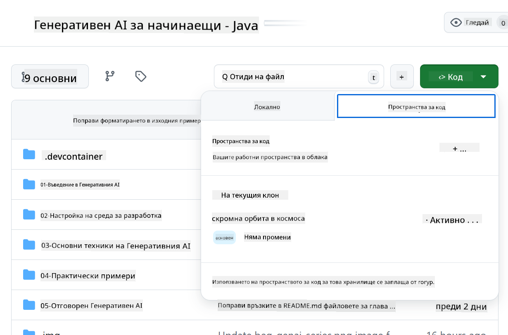

<!--
CO_OP_TRANSLATOR_METADATA:
{
  "original_hash": "e00bbea0f95c611aa3bec676d23e8b43",
  "translation_date": "2025-07-21T21:05:09+00:00",
  "source_file": "02-SetupDevEnvironment/getting-started-azure-openai.md",
  "language_code": "bg"
}
-->
# Настройка на среда за разработка за Azure OpenAI

> **Бърз старт**: Това ръководство е за настройка на Azure OpenAI. За незабавен старт с безплатни модели, използвайте [GitHub Models with Codespaces](./README.md#quick-start-cloud).

Това ръководство ще ви помогне да настроите моделите на Azure AI Foundry за вашите Java AI приложения в този курс.

## Съдържание

- [Общ преглед на бързата настройка](../../../02-SetupDevEnvironment)
- [Стъпка 1: Създаване на ресурси в Azure AI Foundry](../../../02-SetupDevEnvironment)
  - [Създаване на Hub и проект](../../../02-SetupDevEnvironment)
  - [Деплой на модела GPT-4o-mini](../../../02-SetupDevEnvironment)
- [Стъпка 2: Създаване на Codespace](../../../02-SetupDevEnvironment)
- [Стъпка 3: Конфигуриране на средата](../../../02-SetupDevEnvironment)
- [Стъпка 4: Тестване на настройката](../../../02-SetupDevEnvironment)
- [Какво следва?](../../../02-SetupDevEnvironment)
- [Ресурси](../../../02-SetupDevEnvironment)
- [Допълнителни ресурси](../../../02-SetupDevEnvironment)

## Общ преглед на бързата настройка

1. Създайте ресурси в Azure AI Foundry (Hub, проект, модел)
2. Създайте Codespace с контейнер за разработка на Java
3. Конфигурирайте вашия .env файл с идентификационни данни за Azure OpenAI
4. Тествайте настройката с примерния проект

## Стъпка 1: Създаване на ресурси в Azure AI Foundry

### Създаване на Hub и проект

1. Отидете на [Azure AI Foundry Portal](https://ai.azure.com/) и влезте в профила си
2. Кликнете **+ Create** → **New hub** (или навигирайте до **Management** → **All hubs** → **+ New hub**)
3. Конфигурирайте вашия Hub:
   - **Име на Hub**: напр. "MyAIHub"
   - **Абонамент**: Изберете вашия Azure абонамент
   - **Ресурсна група**: Създайте нова или изберете съществуваща
   - **Локация**: Изберете най-близката до вас
   - **Акаунт за съхранение**: Използвайте по подразбиране или конфигурирайте персонализиран
   - **Key vault**: Използвайте по подразбиране или конфигурирайте персонализиран
   - Кликнете **Next** → **Review + create** → **Create**
4. След като е създаден, кликнете **+ New project** (или **Create project** от прегледа на Hub)
   - **Име на проект**: напр. "GenAIJava"
   - Кликнете **Create**

### Деплой на модела GPT-4o-mini

1. Във вашия проект, отидете на **Model catalog** и потърсете **gpt-4o-mini**
   - *Алтернатива: Отидете на **Deployments** → **+ Create deployment***
2. Кликнете **Deploy** на картата на модела gpt-4o-mini
3. Конфигурирайте деплоя:
   - **Име на деплой**: "gpt-4o-mini"
   - **Версия на модела**: Използвайте последната
   - **Тип на деплой**: Standard
4. Кликнете **Deploy**
5. След като е деплойнат, отидете на таба **Deployments** и копирайте следните стойности:
   - **Име на деплой** (напр. "gpt-4o-mini")
   - **Целеви URI** (напр. `https://your-hub-name.openai.azure.com/`) 
      > **Важно**: Копирайте само базовия URL (напр. `https://myhub.openai.azure.com/`), а не пълния път на крайна точка.
   - **Ключ** (от секцията Keys and Endpoint)

> **Все още имате проблеми?** Посетете официалната [документация на Azure AI Foundry](https://learn.microsoft.com/azure/ai-foundry/how-to/create-projects?tabs=ai-foundry&pivots=hub-project)

## Стъпка 2: Създаване на Codespace

1. Форкнете това хранилище във вашия GitHub акаунт
   > **Забележка**: Ако искате да редактирате основната конфигурация, разгледайте [Dev Container Configuration](../../../.devcontainer/devcontainer.json)
2. Във вашето форкнато хранилище, кликнете **Code** → таб **Codespaces**
3. Кликнете **...** → **New with options...**

4. Изберете **Dev container configuration**: 
   - **Generative AI Java Development Environment**
5. Кликнете **Create codespace**

## Стъпка 3: Конфигуриране на средата

След като вашият Codespace е готов, настройте вашите идентификационни данни за Azure OpenAI:

1. **Навигирайте до примерния проект от корена на хранилището:**
   ```bash
   cd 02-SetupDevEnvironment/src/basic-chat-azure
   ```

2. **Създайте вашия .env файл:**
   ```bash
   cp .env.example .env
   ```

3. **Редактирайте .env файла с вашите идентификационни данни за Azure OpenAI:**
   ```bash
   # Your Azure OpenAI API key (from Azure AI Foundry portal)
   AZURE_AI_KEY=your-actual-api-key-here
   
   # Your Azure OpenAI endpoint URL (e.g., https://myhub.openai.azure.com/)
   AZURE_AI_ENDPOINT=https://your-hub-name.openai.azure.com/
   ```

   > **Бележка за сигурност**: 
   > - Никога не комитвайте вашия `.env` файл във версия контрол
   > - `.env` файлът вече е включен в `.gitignore`
   > - Пазете вашите API ключове сигурни и ги обновявайте редовно

## Стъпка 4: Тестване на настройката

Стартирайте примерното приложение, за да тествате връзката си с Azure OpenAI:

```bash
mvn clean spring-boot:run
```

Трябва да видите отговор от модела GPT-4o-mini!

> **Потребители на VS Code**: Можете също да натиснете `F5` в VS Code, за да стартирате приложението. Конфигурацията за стартиране вече е настроена да зарежда вашия `.env` файл автоматично.

> **Пълен пример**: Вижте [End-to-End Azure OpenAI Example](./src/basic-chat-azure/README.md) за подробни инструкции и отстраняване на проблеми.

## Какво следва?

**Настройката е завършена!** Вече имате:
- Azure OpenAI с деплойнат gpt-4o-mini
- Локална конфигурация на .env файл
- Готова среда за разработка на Java

**Продължете към** [Глава 3: Основни техники за генериращ AI](../03-CoreGenerativeAITechniques/README.md), за да започнете да изграждате AI приложения!

## Ресурси

- [Документация на Azure AI Foundry](https://learn.microsoft.com/azure/ai-services/)
- [Spring AI Azure OpenAI Документация](https://docs.spring.io/spring-ai/reference/api/clients/azure-openai-chat.html)
- [Azure OpenAI Java SDK](https://learn.microsoft.com/java/api/overview/azure/ai-openai-readme)

## Допълнителни ресурси

- [Изтеглете VS Code](https://code.visualstudio.com/Download)
- [Вземете Docker Desktop](https://www.docker.com/products/docker-desktop)
- [Конфигурация на Dev Container](../../../.devcontainer/devcontainer.json)

**Отказ от отговорност**:  
Този документ е преведен с помощта на AI услуга за превод [Co-op Translator](https://github.com/Azure/co-op-translator). Въпреки че се стремим към точност, моля, имайте предвид, че автоматизираните преводи може да съдържат грешки или неточности. Оригиналният документ на неговия роден език трябва да се счита за авторитетен източник. За критична информация се препоръчва професионален човешки превод. Ние не носим отговорност за недоразумения или погрешни интерпретации, произтичащи от използването на този превод.