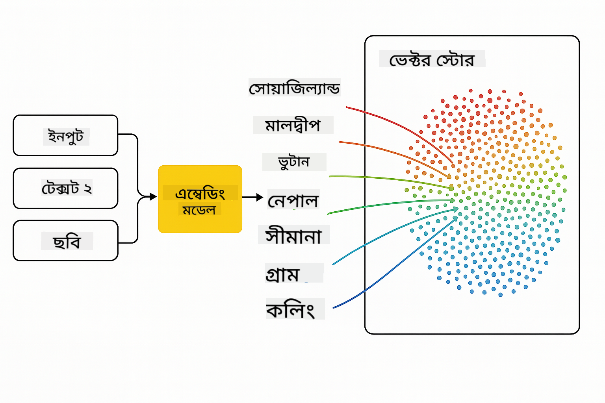
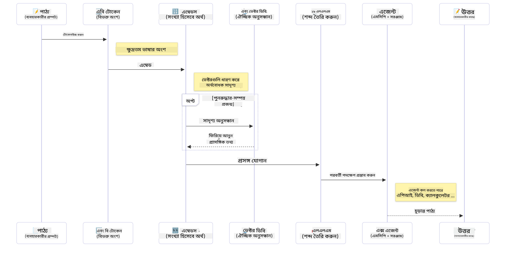

<!--
CO_OP_TRANSLATOR_METADATA:
{
  "original_hash": "6d8b4a0d774dc2a1e97c95859a6d6e4b",
  "translation_date": "2025-07-21T18:39:56+00:00",
  "source_file": "01-IntroToGenAI/README.md",
  "language_code": "bn"
}
-->
# জেনারেটিভ এআই - জাভা সংস্করণে পরিচিতি

## আপনি যা শিখবেন

- **জেনারেটিভ এআই এর মৌলিক ধারণা** যেমন LLMs, প্রম্পট ইঞ্জিনিয়ারিং, টোকেন, এম্বেডিংস এবং ভেক্টর ডেটাবেস
- **জাভা এআই ডেভেলপমেন্ট টুলসের তুলনা** যেমন Azure OpenAI SDK, Spring AI, এবং OpenAI Java SDK
- **মডেল কনটেক্সট প্রোটোকল** এবং এটির এআই এজেন্ট যোগাযোগে ভূমিকা

## বিষয়সূচি

- [পরিচিতি](../../../01-IntroToGenAI)
- [জেনারেটিভ এআই ধারণার দ্রুত পুনরালোচনা](../../../01-IntroToGenAI)
- [প্রম্পট ইঞ্জিনিয়ারিং পর্যালোচনা](../../../01-IntroToGenAI)
- [টোকেন, এম্বেডিংস, এবং এজেন্টস](../../../01-IntroToGenAI)
- [জাভার জন্য এআই ডেভেলপমেন্ট টুলস এবং লাইব্রেরি](../../../01-IntroToGenAI)
  - [OpenAI Java SDK](../../../01-IntroToGenAI)
  - [Spring AI](../../../01-IntroToGenAI)
  - [Azure OpenAI Java SDK](../../../01-IntroToGenAI)
- [সারাংশ](../../../01-IntroToGenAI)
- [পরবর্তী ধাপ](../../../01-IntroToGenAI)

## পরিচিতি

জেনারেটিভ এআই ফর বিগিনারস - জাভা সংস্করণের প্রথম অধ্যায়ে আপনাকে স্বাগতম! এই প্রাথমিক পাঠে জেনারেটিভ এআই এর মূল ধারণাগুলি এবং জাভা ব্যবহার করে সেগুলোর সাথে কাজ করার পদ্ধতি সম্পর্কে আলোচনা করা হবে। আপনি এআই অ্যাপ্লিকেশনগুলির প্রয়োজনীয় উপাদানগুলি সম্পর্কে শিখবেন, যেমন লার্জ ল্যাঙ্গুয়েজ মডেলস (LLMs), টোকেন, এম্বেডিংস এবং এআই এজেন্টস। এছাড়াও, আমরা এই কোর্সে ব্যবহৃত প্রধান জাভা টুলিংগুলি অন্বেষণ করব।

### জেনারেটিভ এআই ধারণার দ্রুত পুনরালোচনা

জেনারেটিভ এআই এমন একটি কৃত্রিম বুদ্ধিমত্তা যা ডেটা থেকে শেখা প্যাটার্ন এবং সম্পর্কের উপর ভিত্তি করে নতুন কন্টেন্ট তৈরি করে, যেমন টেক্সট, ছবি বা কোড। জেনারেটিভ এআই মডেলগুলি মানবসদৃশ প্রতিক্রিয়া তৈরি করতে পারে, প্রসঙ্গ বুঝতে পারে এবং কখনও কখনও এমন কন্টেন্ট তৈরি করতে পারে যা মানবসদৃশ মনে হয়।

আপনার জাভা এআই অ্যাপ্লিকেশনগুলি তৈরি করার সময়, আপনি **জেনারেটিভ এআই মডেল** ব্যবহার করবেন কন্টেন্ট তৈরি করতে। জেনারেটিভ এআই মডেলগুলির কিছু ক্ষমতা অন্তর্ভুক্ত করে:

- **টেক্সট জেনারেশন**: চ্যাটবট, কন্টেন্ট এবং টেক্সট কমপ্লিশনের জন্য মানবসদৃশ টেক্সট তৈরি করা।
- **ইমেজ জেনারেশন এবং অ্যানালাইসিস**: বাস্তবসম্মত ছবি তৈরি করা, ফটো উন্নত করা এবং অবজেক্ট সনাক্ত করা।
- **কোড জেনারেশন**: কোড স্নিপেট বা স্ক্রিপ্ট লেখা।

বিভিন্ন কাজের জন্য নির্দিষ্ট মডেলগুলি অপ্টিমাইজ করা হয়। উদাহরণস্বরূপ, **স্মল ল্যাঙ্গুয়েজ মডেলস (SLMs)** এবং **লার্জ ল্যাঙ্গুয়েজ মডেলস (LLMs)** উভয়ই টেক্সট জেনারেশন পরিচালনা করতে পারে, যেখানে LLMs সাধারণত জটিল কাজের জন্য আরও ভালো পারফরম্যান্স প্রদান করে। ছবি সম্পর্কিত কাজের জন্য, আপনি বিশেষ ভিশন মডেল বা মাল্টি-মডাল মডেল ব্যবহার করবেন।

অবশ্যই, এই মডেলগুলির প্রতিক্রিয়া সবসময় নিখুঁত হয় না। আপনি হয়তো শুনেছেন যে মডেলগুলি "হ্যালুসিনেট" করে বা ভুল তথ্য তৈরি করে যা নির্ভুল বলে মনে হয়। তবে আপনি মডেলটিকে আরও ভালো প্রতিক্রিয়া দিতে সাহায্য করতে পারেন স্পষ্ট নির্দেশনা এবং প্রসঙ্গ প্রদান করে। এখানেই **প্রম্পট ইঞ্জিনিয়ারিং** গুরুত্বপূর্ণ ভূমিকা পালন করে।

#### প্রম্পট ইঞ্জিনিয়ারিং পর্যালোচনা

প্রম্পট ইঞ্জিনিয়ারিং হল কার্যকর ইনপুট ডিজাইন করার অনুশীলন যা এআই মডেলগুলিকে কাঙ্ক্ষিত আউটপুটের দিকে পরিচালিত করে। এটি অন্তর্ভুক্ত করে:

- **স্পষ্টতা**: নির্দেশনাগুলি স্পষ্ট এবং দ্ব্যর্থহীন করা।
- **প্রসঙ্গ**: প্রয়োজনীয় পটভূমি তথ্য প্রদান করা।
- **সীমাবদ্ধতা**: যেকোনো সীমাবদ্ধতা বা ফরম্যাট নির্দিষ্ট করা।

প্রম্পট ইঞ্জিনিয়ারিংয়ের কিছু সেরা অনুশীলন অন্তর্ভুক্ত করে প্রম্পট ডিজাইন, স্পষ্ট নির্দেশনা, কাজের ভাঙন, ওয়ান-শট এবং ফিউ-শট লার্নিং, এবং প্রম্পট টিউনিং। আপনার নির্দিষ্ট ব্যবহারের ক্ষেত্রে কী কাজ করে তা খুঁজে বের করতে বিভিন্ন প্রম্পট পরীক্ষা করা অপরিহার্য।

অ্যাপ্লিকেশন তৈরি করার সময়, আপনি বিভিন্ন প্রম্পট প্রকারের সাথে কাজ করবেন:
- **সিস্টেম প্রম্পট**: মডেলের আচরণের জন্য বেস নিয়ম এবং প্রসঙ্গ সেট করে
- **ইউজার প্রম্পট**: আপনার অ্যাপ্লিকেশন ব্যবহারকারীদের ইনপুট ডেটা
- **অ্যাসিস্ট্যান্ট প্রম্পট**: সিস্টেম এবং ইউজার প্রম্পটের উপর ভিত্তি করে মডেলের প্রতিক্রিয়া

> **আরও জানুন**: [জেনারেটিভ এআই ফর বিগিনারস কোর্সের প্রম্পট ইঞ্জিনিয়ারিং অধ্যায়ে](https://github.com/microsoft/generative-ai-for-beginners/tree/main/04-prompt-engineering-fundamentals) প্রম্পট ইঞ্জিনিয়ারিং সম্পর্কে আরও জানুন।

#### টোকেন, এম্বেডিংস, এবং এজেন্টস

জেনারেটিভ এআই মডেলের সাথে কাজ করার সময়, আপনি **টোকেন**, **এম্বেডিংস**, **এজেন্টস**, এবং **মডেল কনটেক্সট প্রোটোকল (MCP)** এর মতো শব্দগুলির সাথে পরিচিত হবেন। এখানে এই ধারণাগুলির বিস্তারিত বিবরণ দেওয়া হল:

- **টোকেন**: টোকেন হল মডেলের মধ্যে টেক্সটের ক্ষুদ্রতম একক। এগুলি শব্দ, অক্ষর বা সাবওয়ার্ড হতে পারে। টোকেনগুলি টেক্সট ডেটাকে এমন একটি ফরম্যাটে উপস্থাপন করতে ব্যবহৃত হয় যা মডেল বুঝতে পারে। উদাহরণস্বরূপ, "The quick brown fox jumped over the lazy dog" বাক্যটি ["The", " quick", " brown", " fox", " jumped", " over", " the", " lazy", " dog"] বা ["The", " qu", "ick", " br", "own", " fox", " jump", "ed", " over", " the", " la", "zy", " dog"] হিসাবে টোকেনাইজ করা হতে পারে টোকেনাইজেশন কৌশলের উপর নির্ভর করে।

টোকেনাইজেশন হল টেক্সটকে এই ক্ষুদ্র এককগুলিতে ভেঙে ফেলার প্রক্রিয়া। এটি গুরুত্বপূর্ণ কারণ মডেলগুলি কাঁচা টেক্সটের পরিবর্তে টোকেনের উপর কাজ করে। প্রম্পটে টোকেনের সংখ্যা মডেলের প্রতিক্রিয়ার দৈর্ঘ্য এবং গুণমানকে প্রভাবিত করে, কারণ মডেলের প্রসঙ্গ উইন্ডোর জন্য টোকেন সীমা থাকে (যেমন, GPT-4o এর জন্য মোট প্রসঙ্গ 128K টোকেন, ইনপুট এবং আউটপুট উভয়ই অন্তর্ভুক্ত)।

  জাভাতে, আপনি OpenAI SDK এর মতো লাইব্রেরি ব্যবহার করে টোকেনাইজেশন স্বয়ংক্রিয়ভাবে পরিচালনা করতে পারেন যখন এআই মডেলে অনুরোধ পাঠানো হয়।

- **এম্বেডিংস**: এম্বেডিংস হল টোকেনের ভেক্টর উপস্থাপনা যা অর্থপূর্ণ সম্পর্ক ধারণ করে। এগুলি সংখ্যাসূচক উপস্থাপনা (সাধারণত ফ্লোটিং-পয়েন্ট সংখ্যার অ্যারে) যা মডেলকে শব্দগুলির মধ্যে সম্পর্ক বুঝতে এবং প্রসঙ্গগতভাবে প্রাসঙ্গিক প্রতিক্রিয়া তৈরি করতে সক্ষম করে। অনুরূপ শব্দগুলির অনুরূপ এম্বেডিংস থাকে, যা মডেলকে সমার্থক শব্দ এবং অর্থপূর্ণ সম্পর্ক বুঝতে সাহায্য করে।

  জাভাতে, আপনি OpenAI SDK বা এম্বেডিং জেনারেশন সমর্থন করে এমন অন্যান্য লাইব্রেরি ব্যবহার করে এম্বেডিংস তৈরি করতে পারেন। এই এম্বেডিংস সেমান্টিক সার্চের মতো কাজের জন্য অপরিহার্য, যেখানে আপনি অর্থের উপর ভিত্তি করে অনুরূপ কন্টেন্ট খুঁজতে চান, সঠিক টেক্সট ম্যাচের পরিবর্তে।

- **ভেক্টর ডেটাবেস**: ভেক্টর ডেটাবেস হল এম্বেডিংসের জন্য অপ্টিমাইজ করা বিশেষ স্টোরেজ সিস্টেম। এগুলি দক্ষ সাদৃশ্য অনুসন্ধান সক্ষম করে এবং রিট্রিভাল-অগমেন্টেড জেনারেশন (RAG) প্যাটার্নগুলির জন্য গুরুত্বপূর্ণ যেখানে আপনাকে সঠিক ম্যাচের পরিবর্তে সেমান্টিক সাদৃশ্যের উপর ভিত্তি করে বড় ডেটাসেট থেকে প্রাসঙ্গিক তথ্য খুঁজে বের করতে হয়।

> **নোট**: এই কোর্সে আমরা ভেক্টর ডেটাবেস কভার করব না, তবে এগুলি উল্লেখযোগ্য কারণ এগুলি বাস্তব জীবনের অ্যাপ্লিকেশনগুলিতে সাধারণত ব্যবহৃত হয়।

- **এজেন্টস এবং MCP**: এআই উপাদানগুলি যা মডেল, টুল এবং বাহ্যিক সিস্টেমের সাথে স্বয়ংক্রিয়ভাবে যোগাযোগ করে। মডেল কনটেক্সট প্রোটোকল (MCP) এজেন্টদের বাহ্যিক ডেটা সোর্স এবং টুলগুলিতে নিরাপদে অ্যাক্সেস করার জন্য একটি মানক উপায় প্রদান করে। আমাদের [MCP ফর বিগিনারস](https://github.com/microsoft/mcp-for-beginners) কোর্সে আরও জানুন।

জাভা এআই অ্যাপ্লিকেশনগুলিতে, আপনি টোকেন ব্যবহার করবেন টেক্সট প্রসেসিংয়ের জন্য, এম্বেডিংস ব্যবহার করবেন সেমান্টিক সার্চ এবং RAG এর জন্য, ভেক্টর ডেটাবেস ব্যবহার করবেন ডেটা রিট্রিভালের জন্য এবং MCP সহ এজেন্ট ব্যবহার করবেন বুদ্ধিমান, টুল-ব্যবহারকারী সিস্টেম তৈরি করতে।

### জাভার জন্য এআই ডেভেলপমেন্ট টুলস এবং লাইব্রেরি

জাভা এআই ডেভেলপমেন্টের জন্য চমৎকার টুলিং অফার করে। এই কোর্সে আমরা তিনটি প্রধান লাইব্রেরি অন্বেষণ করব - OpenAI Java SDK, Azure OpenAI SDK, এবং Spring AI।

এখানে একটি দ্রুত রেফারেন্স টেবিল রয়েছে যা দেখায় কোন অধ্যায়ের উদাহরণে কোন SDK ব্যবহার করা হয়েছে:

| অধ্যায় | নমুনা | SDK |
|---------|--------|-----|
| 02-SetupDevEnvironment | src/github-models/ | OpenAI Java SDK |
| 02-SetupDevEnvironment | src/basic-chat-azure/ | Spring AI Azure OpenAI |
| 03-CoreGenerativeAITechniques | examples/ | Azure OpenAI SDK |
| 04-PracticalSamples | petstory/ | OpenAI Java SDK |
| 04-PracticalSamples | foundrylocal/ | OpenAI Java SDK |
| 04-PracticalSamples | mcp/calculator/ | Spring AI MCP SDK + LangChain4j |

**SDK ডকুমেন্টেশন লিঙ্ক:**
- [Azure OpenAI Java SDK](https://github.com/Azure/azure-sdk-for-java/tree/azure-ai-openai_1.0.0-beta.16/sdk/openai/azure-ai-openai)
- [Spring AI](https://docs.spring.io/spring-ai/reference/)
- [OpenAI Java SDK](https://github.com/openai/openai-java)
- [LangChain4j](https://docs.langchain4j.dev/)

#### OpenAI Java SDK

OpenAI SDK হল OpenAI API এর জন্য অফিসিয়াল জাভা লাইব্রেরি। এটি OpenAI এর মডেলগুলির সাথে ইন্টারঅ্যাক্ট করার জন্য একটি সহজ এবং সামঞ্জস্যপূর্ণ ইন্টারফেস প্রদান করে, যা জাভা অ্যাপ্লিকেশনে এআই ক্ষমতা সংহত করা সহজ করে তোলে। অধ্যায় ২ এর GitHub মডেল উদাহরণ, অধ্যায় ৪ এর Pet Story অ্যাপ্লিকেশন এবং Foundry Local উদাহরণ OpenAI SDK পদ্ধতি প্রদর্শন করে।

#### Spring AI

Spring AI হল একটি বিস্তৃত ফ্রেমওয়ার্ক যা Spring অ্যাপ্লিকেশনে এআই ক্ষমতা নিয়ে আসে, বিভিন্ন এআই প্রদানকারীর মধ্যে একটি সামঞ্জস্যপূর্ণ অ্যাবস্ট্রাকশন লেয়ার প্রদান করে। এটি Spring ইকোসিস্টেমের সাথে নির্বিঘ্নে সংহত হয়, যা এআই ক্ষমতা সহ এন্টারপ্রাইজ জাভা অ্যাপ্লিকেশনের জন্য এটি আদর্শ পছন্দ করে তোলে।

Spring AI এর শক্তি Spring ইকোসিস্টেমের সাথে এর নির্বিঘ্ন সংহতকরণে নিহিত, যা পরিচিত Spring প্যাটার্ন যেমন ডিপেনডেন্সি ইনজেকশন, কনফিগারেশন ম্যানেজমেন্ট এবং টেস্টিং ফ্রেমওয়ার্ক ব্যবহার করে প্রোডাকশন-রেডি এআই অ্যাপ্লিকেশন তৈরি করা সহজ করে তোলে। আপনি অধ্যায় ২ এবং ৪ এ Spring AI ব্যবহার করবেন OpenAI এবং Model Context Protocol (MCP) Spring AI লাইব্রেরি উভয়ই কাজে লাগিয়ে অ্যাপ্লিকেশন তৈরি করতে।

##### মডেল কনটেক্সট প্রোটোকল (MCP)

[মডেল কনটেক্সট প্রোটোকল (MCP)](https://modelcontextprotocol.io/) একটি উদীয়মান মান যা এআই অ্যাপ্লিকেশনগুলিকে বাহ্যিক ডেটা সোর্স এবং টুলগুলির সাথে নিরাপদে ইন্টারঅ্যাক্ট করতে সক্ষম করে। MCP এআই মডেলগুলিকে প্রসঙ্গগত তথ্য অ্যাক্সেস করতে এবং আপনার অ্যাপ্লিকেশনে অ্যাকশন সম্পাদন করতে একটি মানক উপায় প্রদান করে।

অধ্যায় ৪ এ, আপনি একটি সাধারণ MCP ক্যালকুলেটর সার্ভিস তৈরি করবেন যা Spring AI এর সাথে মডেল কনটেক্সট প্রোটোকলের মৌলিক বিষয়গুলি প্রদর্শন করে, দেখাবে কীভাবে মৌলিক টুল ইন্টিগ্রেশন এবং সার্ভিস আর্কিটেকচার তৈরি করা যায়।

#### Azure OpenAI Java SDK

Azure OpenAI ক্লায়েন্ট লাইব্রেরি জাভার জন্য OpenAI এর REST API এর একটি অভিযোজন যা একটি স্বাভাবিক ইন্টারফেস এবং Azure SDK ইকোসিস্টেমের সাথে সংহতকরণ প্রদান করে। অধ্যায় ৩ এ, আপনি Azure OpenAI SDK ব্যবহার করে অ্যাপ্লিকেশন তৈরি করবেন, যার মধ্যে চ্যাট অ্যাপ্লিকেশন, ফাংশন কলিং এবং RAG (Retrieval-Augmented Generation) প্যাটার্ন অন্তর্ভুক্ত।

> নোট: Azure OpenAI SDK বৈশিষ্ট্যের ক্ষেত্রে OpenAI Java SDK এর তুলনায় পিছিয়ে রয়েছে, তাই ভবিষ্যতের প্রকল্পগুলির জন্য OpenAI Java SDK ব্যবহার করার কথা বিবেচনা করুন।

## সারাংশ

**অভিনন্দন!** আপনি সফলভাবে:

- **জেনারেটিভ এআই এর মৌলিক বিষয়গুলি শিখেছেন** যেমন LLMs, প্রম্পট ইঞ্জিনিয়ারিং, টোকেন, এম্বেডিংস এবং ভেক্টর ডেটাবেস
- **জাভা এআই ডেভেলপমেন্ট টুলসের তুলনা করেছেন** যেমন Azure OpenAI SDK, Spring AI, এবং OpenAI Java SDK
- **মডেল কনটেক্সট প্রোটোকল আবিষ্কার করেছেন** এবং এটির এআই এজেন্ট যোগাযোগে ভূমিকা

## পরবর্তী ধাপ

[অধ্যায় ২: ডেভেলপমেন্ট এনভায়রনমেন্ট সেটআপ](../02-SetupDevEnvironment/README.md)

**অস্বীকৃতি**:  
এই নথিটি AI অনুবাদ পরিষেবা [Co-op Translator](https://github.com/Azure/co-op-translator) ব্যবহার করে অনুবাদ করা হয়েছে। আমরা যথাসাধ্য সঠিকতা নিশ্চিত করার চেষ্টা করি, তবে অনুগ্রহ করে মনে রাখবেন যে স্বয়ংক্রিয় অনুবাদে ত্রুটি বা অসঙ্গতি থাকতে পারে। মূল ভাষায় থাকা নথিটিকে প্রামাণিক উৎস হিসেবে বিবেচনা করা উচিত। গুরুত্বপূর্ণ তথ্যের জন্য, পেশাদার মানব অনুবাদ সুপারিশ করা হয়। এই অনুবাদ ব্যবহারের ফলে কোনো ভুল বোঝাবুঝি বা ভুল ব্যাখ্যা হলে আমরা দায়বদ্ধ থাকব না।