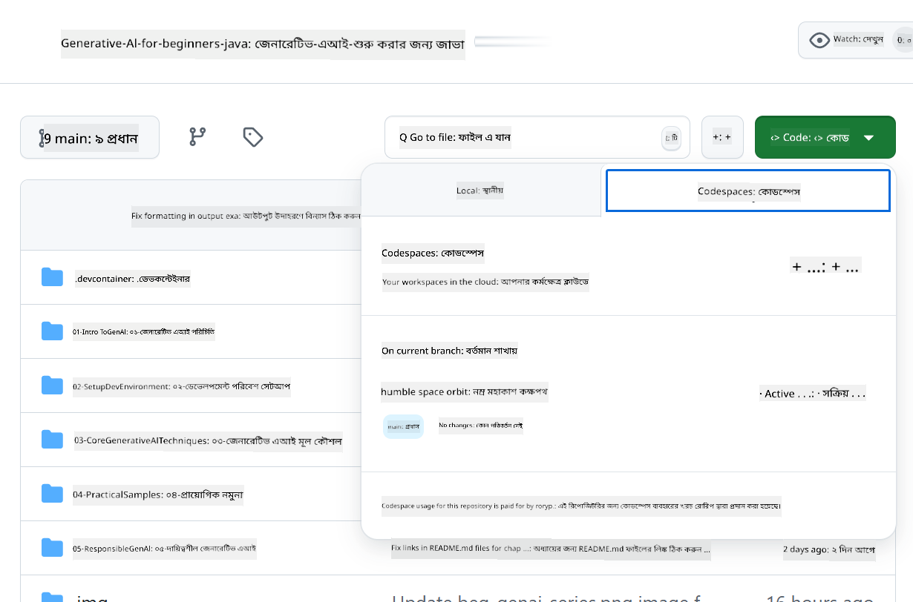

<!--
CO_OP_TRANSLATOR_METADATA:
{
  "original_hash": "e00bbea0f95c611aa3bec676d23e8b43",
  "translation_date": "2025-07-21T18:01:23+00:00",
  "source_file": "02-SetupDevEnvironment/getting-started-azure-openai.md",
  "language_code": "bn"
}
-->
# Azure OpenAI এর জন্য ডেভেলপমেন্ট এনভায়রনমেন্ট সেটআপ

> **দ্রুত শুরু**: এই গাইডটি Azure OpenAI সেটআপের জন্য। বিনামূল্যের মডেল দিয়ে তাত্ক্ষণিক শুরু করতে, [GitHub Models with Codespaces](./README.md#quick-start-cloud) ব্যবহার করুন।

এই গাইডটি আপনাকে এই কোর্সে আপনার জাভা AI অ্যাপ্লিকেশনের জন্য Azure AI Foundry মডেল সেটআপ করতে সাহায্য করবে।

## বিষয়বস্তু সূচি

- [দ্রুত সেটআপ ওভারভিউ](../../../02-SetupDevEnvironment)
- [ধাপ ১: Azure AI Foundry রিসোর্স তৈরি করুন](../../../02-SetupDevEnvironment)
  - [হাব এবং প্রজেক্ট তৈরি করুন](../../../02-SetupDevEnvironment)
  - [GPT-4o-mini মডেল ডিপ্লয় করুন](../../../02-SetupDevEnvironment)
- [ধাপ ২: আপনার কোডস্পেস তৈরি করুন](../../../02-SetupDevEnvironment)
- [ধাপ ৩: আপনার এনভায়রনমেন্ট কনফিগার করুন](../../../02-SetupDevEnvironment)
- [ধাপ ৪: আপনার সেটআপ পরীক্ষা করুন](../../../02-SetupDevEnvironment)
- [পরবর্তী কী?](../../../02-SetupDevEnvironment)
- [রিসোর্স](../../../02-SetupDevEnvironment)
- [অতিরিক্ত রিসোর্স](../../../02-SetupDevEnvironment)

## দ্রুত সেটআপ ওভারভিউ

1. Azure AI Foundry রিসোর্স তৈরি করুন (হাব, প্রজেক্ট, মডেল)
2. জাভা ডেভেলপমেন্ট কন্টেইনার সহ একটি কোডস্পেস তৈরি করুন
3. Azure OpenAI ক্রেডেনশিয়াল সহ আপনার `.env` ফাইল কনফিগার করুন
4. উদাহরণ প্রজেক্ট দিয়ে আপনার সেটআপ পরীক্ষা করুন

## ধাপ ১: Azure AI Foundry রিসোর্স তৈরি করুন

### হাব এবং প্রজেক্ট তৈরি করুন

1. [Azure AI Foundry পোর্টাল](https://ai.azure.com/) এ যান এবং সাইন ইন করুন
2. **+ Create** → **New hub** এ ক্লিক করুন (অথবা **Management** → **All hubs** → **+ New hub** এ যান)
3. আপনার হাব কনফিগার করুন:
   - **Hub name**: উদাহরণস্বরূপ, "MyAIHub"
   - **Subscription**: আপনার Azure সাবস্ক্রিপশন নির্বাচন করুন
   - **Resource group**: নতুন তৈরি করুন বা বিদ্যমানটি নির্বাচন করুন
   - **Location**: আপনার নিকটস্থ অবস্থান নির্বাচন করুন
   - **Storage account**: ডিফল্ট ব্যবহার করুন বা কাস্টম কনফিগার করুন
   - **Key vault**: ডিফল্ট ব্যবহার করুন বা কাস্টম কনফিগার করুন
   - **Next** → **Review + create** → **Create** এ ক্লিক করুন
4. তৈরি হওয়ার পরে, **+ New project** (অথবা হাব ওভারভিউ থেকে **Create project**) এ ক্লিক করুন
   - **Project name**: উদাহরণস্বরূপ, "GenAIJava"
   - **Create** এ ক্লিক করুন

### GPT-4o-mini মডেল ডিপ্লয় করুন

1. আপনার প্রজেক্টে, **Model catalog** এ যান এবং **gpt-4o-mini** অনুসন্ধান করুন
   - *বিকল্প: **Deployments** → **+ Create deployment** এ যান*
2. gpt-4o-mini মডেল কার্ডে **Deploy** এ ক্লিক করুন
3. ডিপ্লয়মেন্ট কনফিগার করুন:
   - **Deployment name**: "gpt-4o-mini"
   - **Model version**: সর্বশেষটি ব্যবহার করুন
   - **Deployment type**: Standard
4. **Deploy** এ ক্লিক করুন
5. ডিপ্লয় হওয়ার পরে, **Deployments** ট্যাবে যান এবং এই মানগুলি কপি করুন:
   - **Deployment name** (যেমন, "gpt-4o-mini")
   - **Target URI** (যেমন, `https://your-hub-name.openai.azure.com/`)  
      > **গুরুত্বপূর্ণ**: শুধুমাত্র বেস URL কপি করুন (যেমন, `https://myhub.openai.azure.com/`) সম্পূর্ণ এন্ডপয়েন্ট পথ নয়।
   - **Key** (Keys and Endpoint সেকশন থেকে)

> **এখনও সমস্যা হচ্ছে?** অফিসিয়াল [Azure AI Foundry ডকুমেন্টেশন](https://learn.microsoft.com/azure/ai-foundry/how-to/create-projects?tabs=ai-foundry&pivots=hub-project) দেখুন

## ধাপ ২: আপনার কোডস্পেস তৈরি করুন

1. এই রিপোজিটরিটি আপনার GitHub অ্যাকাউন্টে ফর্ক করুন
   > **নোট**: যদি আপনি বেসিক কনফিগারেশন সম্পাদনা করতে চান, দয়া করে [Dev Container Configuration](../../../.devcontainer/devcontainer.json) দেখুন
2. আপনার ফর্ক করা রিপোতে, **Code** → **Codespaces** ট্যাবে ক্লিক করুন
3. **...** → **New with options...** এ ক্লিক করুন  

4. **Dev container configuration** নির্বাচন করুন: 
   - **Generative AI Java Development Environment**
5. **Create codespace** এ ক্লিক করুন

## ধাপ ৩: আপনার এনভায়রনমেন্ট কনফিগার করুন

আপনার কোডস্পেস প্রস্তুত হলে, আপনার Azure OpenAI ক্রেডেনশিয়াল সেটআপ করুন:

1. **রিপোজিটরির রুট থেকে উদাহরণ প্রজেক্টে যান:**
   ```bash
   cd 02-SetupDevEnvironment/src/basic-chat-azure
   ```

2. **আপনার .env ফাইল তৈরি করুন:**
   ```bash
   cp .env.example .env
   ```

3. **আপনার .env ফাইলটি Azure OpenAI ক্রেডেনশিয়াল দিয়ে সম্পাদনা করুন:**
   ```bash
   # Your Azure OpenAI API key (from Azure AI Foundry portal)
   AZURE_AI_KEY=your-actual-api-key-here
   
   # Your Azure OpenAI endpoint URL (e.g., https://myhub.openai.azure.com/)
   AZURE_AI_ENDPOINT=https://your-hub-name.openai.azure.com/
   ```

   > **নিরাপত্তা নোট**: 
   > - কখনোই আপনার `.env` ফাইল ভার্সন কন্ট্রোলে কমিট করবেন না
   > - `.env` ফাইলটি ইতিমধ্যেই `.gitignore` এ অন্তর্ভুক্ত
   > - আপনার API কী নিরাপদ রাখুন এবং নিয়মিত ঘুরিয়ে নিন

## ধাপ ৪: আপনার সেটআপ পরীক্ষা করুন

Azure OpenAI সংযোগ পরীক্ষা করতে উদাহরণ অ্যাপ্লিকেশন চালান:

```bash
mvn clean spring-boot:run
```

আপনার gpt-4o-mini মডেল থেকে একটি প্রতিক্রিয়া দেখতে পাবেন!

> **VS Code ব্যবহারকারীরা**: অ্যাপ্লিকেশন চালানোর জন্য আপনি `F5` প্রেস করতে পারেন। লঞ্চ কনফিগারেশন ইতিমধ্যেই আপনার `.env` ফাইল স্বয়ংক্রিয়ভাবে লোড করার জন্য সেটআপ করা আছে।

> **সম্পূর্ণ উদাহরণ**: বিস্তারিত নির্দেশনা এবং সমস্যা সমাধানের জন্য [End-to-End Azure OpenAI Example](./src/basic-chat-azure/README.md) দেখুন।

## পরবর্তী কী?

**সেটআপ সম্পন্ন!** এখন আপনার কাছে রয়েছে:
- gpt-4o-mini সহ Azure OpenAI ডিপ্লয় করা
- স্থানীয় `.env` ফাইল কনফিগারেশন
- জাভা ডেভেলপমেন্ট এনভায়রনমেন্ট প্রস্তুত

**পরবর্তী অধ্যায়ে যান** [Chapter 3: Core Generative AI Techniques](../03-CoreGenerativeAITechniques/README.md) এবং AI অ্যাপ্লিকেশন তৈরি শুরু করুন!

## রিসোর্স

- [Azure AI Foundry ডকুমেন্টেশন](https://learn.microsoft.com/azure/ai-services/)
- [Spring AI Azure OpenAI ডকুমেন্টেশন](https://docs.spring.io/spring-ai/reference/api/clients/azure-openai-chat.html)
- [Azure OpenAI Java SDK](https://learn.microsoft.com/java/api/overview/azure/ai-openai-readme)

## অতিরিক্ত রিসোর্স

- [VS Code ডাউনলোড করুন](https://code.visualstudio.com/Download)
- [Docker Desktop পান](https://www.docker.com/products/docker-desktop)
- [Dev Container Configuration](../../../.devcontainer/devcontainer.json)

**অস্বীকৃতি**:  
এই নথিটি AI অনুবাদ পরিষেবা [Co-op Translator](https://github.com/Azure/co-op-translator) ব্যবহার করে অনুবাদ করা হয়েছে। আমরা যথাসাধ্য সঠিকতা নিশ্চিত করার চেষ্টা করি, তবে অনুগ্রহ করে মনে রাখবেন যে স্বয়ংক্রিয় অনুবাদে ত্রুটি বা অসঙ্গতি থাকতে পারে। মূল ভাষায় থাকা নথিটিকে প্রামাণিক উৎস হিসেবে বিবেচনা করা উচিত। গুরুত্বপূর্ণ তথ্যের জন্য, পেশাদার মানব অনুবাদ সুপারিশ করা হয়। এই অনুবাদ ব্যবহারের ফলে কোনো ভুল বোঝাবুঝি বা ভুল ব্যাখ্যা হলে আমরা দায়বদ্ধ থাকব না।