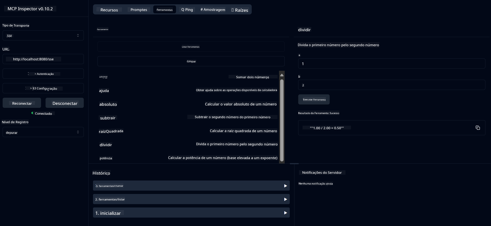

<!--
CO_OP_TRANSLATOR_METADATA:
{
  "original_hash": "7bf9a4a832911269a8bd0decb97ff36c",
  "translation_date": "2025-07-21T18:24:39+00:00",
  "source_file": "04-PracticalSamples/mcp/calculator/README.md",
  "language_code": "br"
}
-->
# Serviço Básico de Calculadora MCP

>**Nota**: Este capítulo inclui um [**Tutorial**](./TUTORIAL.md) que orienta você a executar os exemplos finalizados.

Bem-vindo à sua primeira experiência prática com o **Model Context Protocol (MCP)**! Nos capítulos anteriores, você aprendeu os fundamentos da IA generativa e configurou seu ambiente de desenvolvimento. Agora é hora de construir algo prático.

Este serviço de calculadora demonstra como modelos de IA podem interagir de forma segura com ferramentas externas usando o MCP. Em vez de depender das capacidades matemáticas, às vezes pouco confiáveis, do modelo de IA, mostraremos como construir um sistema robusto onde a IA pode chamar serviços especializados para cálculos precisos.

## Índice

- [O Que Você Vai Aprender](../../../../../04-PracticalSamples/mcp/calculator)
- [Pré-requisitos](../../../../../04-PracticalSamples/mcp/calculator)
- [Conceitos-Chave](../../../../../04-PracticalSamples/mcp/calculator)
- [Início Rápido](../../../../../04-PracticalSamples/mcp/calculator)
- [Operações Disponíveis da Calculadora](../../../../../04-PracticalSamples/mcp/calculator)
- [Clientes de Teste](../../../../../04-PracticalSamples/mcp/calculator)
  - [1. Cliente MCP Direto (SDKClient)](../../../../../04-PracticalSamples/mcp/calculator)
  - [2. Cliente com IA (LangChain4jClient)](../../../../../04-PracticalSamples/mcp/calculator)
- [MCP Inspector (Interface Web)](../../../../../04-PracticalSamples/mcp/calculator)
  - [Instruções Passo a Passo](../../../../../04-PracticalSamples/mcp/calculator)

## O Que Você Vai Aprender

Ao trabalhar neste exemplo, você entenderá:
- Como criar serviços compatíveis com MCP usando Spring Boot
- A diferença entre comunicação direta via protocolo e interação mediada por IA
- Como modelos de IA decidem quando e como usar ferramentas externas
- Melhores práticas para construir aplicações de IA habilitadas com ferramentas

Perfeito para iniciantes que estão aprendendo os conceitos do MCP e prontos para construir sua primeira integração de ferramentas com IA!

## Pré-requisitos

- Java 21+
- Maven 3.6+
- **Token do GitHub**: Necessário para o cliente com IA. Se você ainda não configurou isso, consulte [Capítulo 2: Configurando seu ambiente de desenvolvimento](../../../02-SetupDevEnvironment/README.md) para instruções.

## Conceitos-Chave

**Model Context Protocol (MCP)** é uma forma padronizada para que aplicações de IA se conectem de forma segura a ferramentas externas. Pense nele como uma "ponte" que permite que modelos de IA usem serviços externos, como nossa calculadora. Em vez de o modelo de IA tentar fazer cálculos por conta própria (o que pode ser pouco confiável), ele pode chamar nosso serviço de calculadora para obter resultados precisos. O MCP garante que essa comunicação aconteça de forma segura e consistente.

**Server-Sent Events (SSE)** permite comunicação em tempo real entre o servidor e os clientes. Diferente de requisições HTTP tradicionais, onde você faz uma solicitação e espera uma resposta, o SSE permite que o servidor envie atualizações continuamente para o cliente. Isso é perfeito para aplicações de IA onde as respostas podem ser transmitidas ou levar tempo para serem processadas.

**Ferramentas de IA e Chamadas de Função** permitem que modelos de IA escolham e usem automaticamente funções externas (como operações da calculadora) com base nas solicitações do usuário. Quando você pergunta "Quanto é 15 + 27?", o modelo de IA entende que você quer uma soma, chama automaticamente nossa ferramenta `add` com os parâmetros corretos (15, 27) e retorna o resultado em linguagem natural. A IA atua como um coordenador inteligente que sabe quando e como usar cada ferramenta.

## Início Rápido

### 1. Navegue até o diretório da aplicação da calculadora
```bash
cd Generative-AI-for-beginners-java/04-PracticalSamples/mcp/calculator
```

### 2. Compile e Execute
```bash
mvn clean install -DskipTests
java -jar target/calculator-server-0.0.1-SNAPSHOT.jar
```

### 3. Teste com os Clientes
- **SDKClient**: Interação direta com o protocolo MCP
- **LangChain4jClient**: Interação em linguagem natural com IA (requer token do GitHub)

## Operações Disponíveis da Calculadora

- `add(a, b)`, `subtract(a, b)`, `multiply(a, b)`, `divide(a, b)`
- `power(base, exponent)`, `squareRoot(number)`, `absolute(number)`
- `modulus(a, b)`, `help()`

## Clientes de Teste

### 1. Cliente MCP Direto (SDKClient)
Testa a comunicação bruta do protocolo MCP. Execute com:
```bash
mvn test-compile exec:java -Dexec.mainClass="com.microsoft.mcp.sample.client.SDKClient" -Dexec.classpathScope=test
```

### 2. Cliente com IA (LangChain4jClient)
Demonstra interação em linguagem natural com modelos do GitHub. Requer token do GitHub (consulte [Pré-requisitos](../../../../../04-PracticalSamples/mcp/calculator)).

**Execute:**
```bash
mvn test-compile exec:java -Dexec.mainClass="com.microsoft.mcp.sample.client.LangChain4jClient" -Dexec.classpathScope=test
```

## MCP Inspector (Interface Web)

O MCP Inspector fornece uma interface web visual para testar seu serviço MCP sem precisar escrever código. Perfeito para iniciantes entenderem como o MCP funciona!

### Instruções Passo a Passo:

1. **Inicie o servidor da calculadora** (se ainda não estiver em execução):
   ```bash
   java -jar target/calculator-server-0.0.1-SNAPSHOT.jar
   ```

2. **Instale e execute o MCP Inspector** em um novo terminal:
   ```bash
   npx @modelcontextprotocol/inspector
   ```

3. **Abra a interface web**:
   - Procure uma mensagem como "Inspector running at http://localhost:6274"
   - Abra essa URL no seu navegador

4. **Conecte-se ao serviço da calculadora**:
   - Na interface web, defina o tipo de transporte como "SSE"
   - Defina a URL como: `http://localhost:8080/sse`
   - Clique no botão "Connect"

5. **Explore as ferramentas disponíveis**:
   - Clique em "List Tools" para ver todas as operações da calculadora
   - Você verá funções como `add`, `subtract`, `multiply`, etc.

6. **Teste uma operação da calculadora**:
   - Selecione uma ferramenta (por exemplo, "add")
   - Insira os parâmetros (por exemplo, `a: 15`, `b: 27`)
   - Clique em "Run Tool"
   - Veja o resultado retornado pelo seu serviço MCP!

Essa abordagem visual ajuda você a entender exatamente como a comunicação MCP funciona antes de construir seus próprios clientes.



---
**Referência:** [Documentação do MCP Server Boot Starter](https://docs.spring.io/spring-ai/reference/api/mcp/mcp-server-boot-starter-docs.html)

**Aviso Legal**:  
Este documento foi traduzido utilizando o serviço de tradução por IA [Co-op Translator](https://github.com/Azure/co-op-translator). Embora nos esforcemos para garantir a precisão, esteja ciente de que traduções automatizadas podem conter erros ou imprecisões. O documento original em seu idioma nativo deve ser considerado a fonte autoritativa. Para informações críticas, recomenda-se a tradução profissional realizada por humanos. Não nos responsabilizamos por quaisquer mal-entendidos ou interpretações equivocadas decorrentes do uso desta tradução.