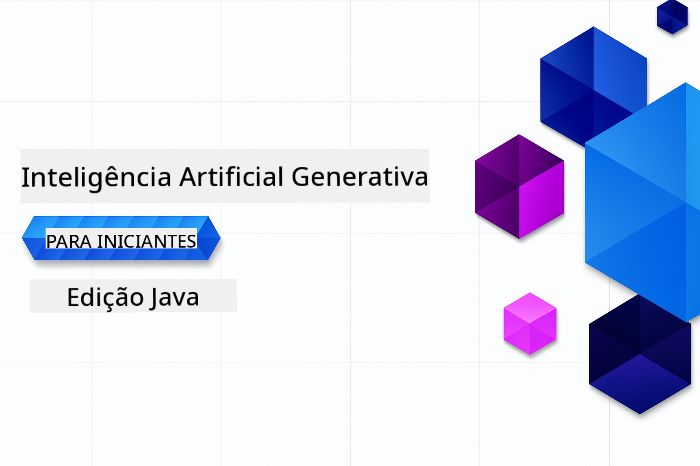

<!--
CO_OP_TRANSLATOR_METADATA:
{
  "original_hash": "a49b35508745c032a0033d914df7901b",
  "translation_date": "2025-07-25T09:21:48+00:00",
  "source_file": "README.md",
  "language_code": "br"
}
-->
# IA Generativa para Iniciantes - Edição Java

**Compromisso de Tempo**: Todo o workshop pode ser concluído online sem necessidade de configuração local. Se você quiser executar os exemplos, a configuração do ambiente leva 2 minutos, e explorar os exemplos pode levar de 1 a 3 horas, dependendo da profundidade da exploração.

> **Início Rápido**

1. Faça um fork deste repositório na sua conta do GitHub
2. Clique em **Code** → aba **Codespaces** → **...** → **New with options...**
3. Use as configurações padrão – isso selecionará o container de desenvolvimento criado para este curso
4. Clique em **Create codespace**
5. Aguarde cerca de 2 minutos para o ambiente estar pronto
6. Vá direto para [Criando seu Token de Modelos do GitHub](./02-SetupDevEnvironment/README.md#step-2-create-a-github-personal-access-token)

## Suporte a Múltiplos Idiomas

### Suportado via GitHub Action (Automatizado e Sempre Atualizado)

[Francês](../fr/README.md) | [Espanhol](../es/README.md) | [Alemão](../de/README.md) | [Russo](../ru/README.md) | [Árabe](../ar/README.md) | [Persa (Farsi)](../fa/README.md) | [Urdu](../ur/README.md) | [Chinês (Simplificado)](../zh/README.md) | [Chinês (Tradicional, Macau)](../mo/README.md) | [Chinês (Tradicional, Hong Kong)](../hk/README.md) | [Chinês (Tradicional, Taiwan)](../tw/README.md) | [Japonês](../ja/README.md) | [Coreano](../ko/README.md) | [Hindi](../hi/README.md) | [Bengali](../bn/README.md) | [Marathi](../mr/README.md) | [Nepali](../ne/README.md) | [Punjabi (Gurmukhi)](../pa/README.md) | [Português (Portugal)](../pt/README.md) | [Português (Brasil)](./README.md) | [Italiano](../it/README.md) | [Polonês](../pl/README.md) | [Turco](../tr/README.md) | [Grego](../el/README.md) | [Tailandês](../th/README.md) | [Sueco](../sv/README.md) | [Dinamarquês](../da/README.md) | [Norueguês](../no/README.md) | [Finlandês](../fi/README.md) | [Holandês](../nl/README.md) | [Hebraico](../he/README.md) | [Vietnamita](../vi/README.md) | [Indonésio](../id/README.md) | [Malaio](../ms/README.md) | [Tagalog (Filipino)](../tl/README.md) | [Suaíli](../sw/README.md) | [Húngaro](../hu/README.md) | [Tcheco](../cs/README.md) | [Eslovaco](../sk/README.md) | [Romeno](../ro/README.md) | [Búlgaro](../bg/README.md) | [Sérvio (Cirílico)](../sr/README.md) | [Croata](../hr/README.md) | [Esloveno](../sl/README.md) | [Ucraniano](../uk/README.md) | [Birmanês (Myanmar)](../my/README.md)

## Estrutura do Curso e Caminho de Aprendizado

### **Capítulo 1: Introdução à IA Generativa**
- **Conceitos Fundamentais**: Compreendendo Modelos de Linguagem Grandes, tokens, embeddings e capacidades de IA
- **Ecossistema de IA em Java**: Visão geral do Spring AI e SDKs OpenAI
- **Protocolo de Contexto de Modelo**: Introdução ao MCP e seu papel na comunicação de agentes de IA
- **Aplicações Práticas**: Cenários do mundo real, incluindo chatbots e geração de conteúdo
- **[→ Começar o Capítulo 1](./01-IntroToGenAI/README.md)**

### **Capítulo 2: Configuração do Ambiente de Desenvolvimento**
- **Configuração Multi-Provedor**: Configure integrações com GitHub Models, Azure OpenAI e OpenAI Java SDK
- **Spring Boot + Spring AI**: Melhores práticas para desenvolvimento de aplicações empresariais de IA
- **GitHub Models**: Acesso gratuito a modelos de IA para prototipagem e aprendizado (sem necessidade de cartão de crédito)
- **Ferramentas de Desenvolvimento**: Configuração de containers Docker, VS Code e GitHub Codespaces
- **[→ Começar o Capítulo 2](./02-SetupDevEnvironment/README.md)**

### **Capítulo 3: Técnicas Fundamentais de IA Generativa**
- **Engenharia de Prompt**: Técnicas para respostas ideais de modelos de IA
- **Embeddings e Operações com Vetores**: Implementação de busca semântica e correspondência de similaridade
- **Geração Aumentada por Recuperação (RAG)**: Combine IA com suas próprias fontes de dados
- **Chamadas de Função**: Expanda as capacidades da IA com ferramentas e plugins personalizados
- **[→ Começar o Capítulo 3](./03-CoreGenerativeAITechniques/README.md)**

### **Capítulo 4: Aplicações Práticas e Projetos**
- **Gerador de Histórias de Animais de Estimação** (`petstory/`): Geração criativa de conteúdo com GitHub Models
- **Demo Local Foundry** (`foundrylocal/`): Integração local de modelos de IA com OpenAI Java SDK
- **Serviço de Calculadora MCP** (`mcp/calculator/`): Implementação básica do Protocolo de Contexto de Modelo com Spring AI
- **[→ Começar o Capítulo 4](./04-PracticalSamples/README.md)**

### **Capítulo 5: Desenvolvimento de IA Responsável**
- **Segurança dos Modelos do GitHub**: Teste os mecanismos de filtragem de conteúdo e segurança integrados
- **Demo de IA Responsável**: Exemplo prático mostrando como os filtros de segurança de IA funcionam na prática
- **Melhores Práticas**: Diretrizes essenciais para desenvolvimento e implantação ética de IA
- **[→ Começar o Capítulo 5](./05-ResponsibleGenAI/README.md)**

## Recursos Adicionais 

- [Agentes de IA para Iniciantes](https://github.com/microsoft/ai-agents-for-beginners)
- [IA Generativa para Iniciantes usando .NET](https://github.com/microsoft/Generative-AI-for-beginners-dotnet)
- [IA Generativa para Iniciantes usando JavaScript](https://github.com/microsoft/generative-ai-with-javascript)
- [IA Generativa para Iniciantes](https://github.com/microsoft/generative-ai-for-beginners)
- [ML para Iniciantes](https://aka.ms/ml-beginners)
- [Ciência de Dados para Iniciantes](https://aka.ms/datascience-beginners)
- [IA para Iniciantes](https://aka.ms/ai-beginners)
- [Cibersegurança para Iniciantes](https://github.com/microsoft/Security-101)
- [Desenvolvimento Web para Iniciantes](https://aka.ms/webdev-beginners)
- [IoT para Iniciantes](https://aka.ms/iot-beginners)
- [Desenvolvimento XR para Iniciantes](https://github.com/microsoft/xr-development-for-beginners)
- [Dominando o GitHub Copilot para Programação em Parceria com IA](https://aka.ms/GitHubCopilotAI)
- [Dominando o GitHub Copilot para Desenvolvedores C#/.NET](https://github.com/microsoft/mastering-github-copilot-for-dotnet-csharp-developers)
- [Escolha Sua Própria Aventura com Copilot](https://github.com/microsoft/CopilotAdventures)
- [App de Chat RAG com Serviços de IA do Azure](https://github.com/Azure-Samples/azure-search-openai-demo-java)

**Aviso Legal**:  
Este documento foi traduzido utilizando o serviço de tradução por IA [Co-op Translator](https://github.com/Azure/co-op-translator). Embora nos esforcemos para garantir a precisão, esteja ciente de que traduções automatizadas podem conter erros ou imprecisões. O documento original em seu idioma nativo deve ser considerado a fonte autoritativa. Para informações críticas, recomenda-se a tradução profissional realizada por humanos. Não nos responsabilizamos por quaisquer mal-entendidos ou interpretações equivocadas decorrentes do uso desta tradução.