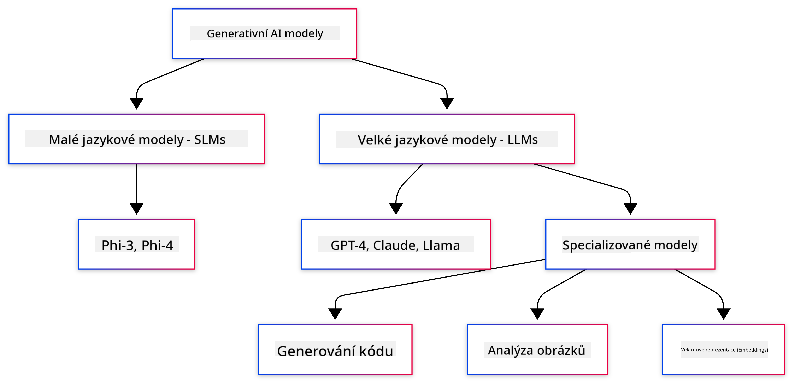
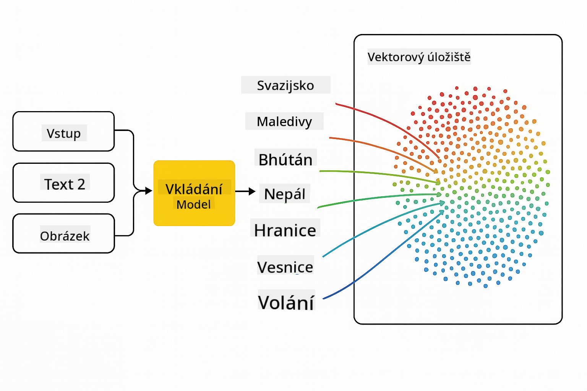
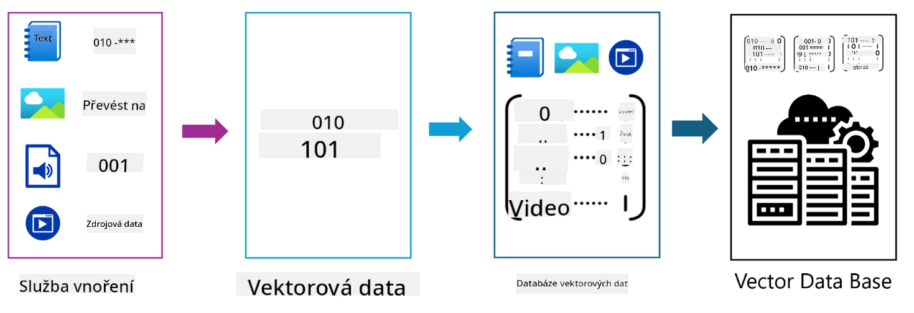

<!--
CO_OP_TRANSLATOR_METADATA:
{
  "original_hash": "6d8b4a0d774dc2a1e97c95859a6d6e4b",
  "translation_date": "2025-07-21T21:45:31+00:00",
  "source_file": "01-IntroToGenAI/README.md",
  "language_code": "cs"
}
-->
# Úvod do Generativní AI - Java Edition

## Co se naučíte

- **Základy generativní AI**, včetně LLM, návrhu promptů, tokenů, embeddingů a vektorových databází  
- **Porovnání nástrojů pro vývoj AI v Javě**, včetně Azure OpenAI SDK, Spring AI a OpenAI Java SDK  
- **Objevte Model Context Protocol** a jeho roli v komunikaci AI agentů  

## Obsah

- [Úvod](../../../01-IntroToGenAI)  
- [Rychlé zopakování konceptů generativní AI](../../../01-IntroToGenAI)  
- [Přehled návrhu promptů](../../../01-IntroToGenAI)  
- [Tokeny, embeddingy a agenti](../../../01-IntroToGenAI)  
- [Nástroje a knihovny pro vývoj AI v Javě](../../../01-IntroToGenAI)  
  - [OpenAI Java SDK](../../../01-IntroToGenAI)  
  - [Spring AI](../../../01-IntroToGenAI)  
  - [Azure OpenAI Java SDK](../../../01-IntroToGenAI)  
- [Shrnutí](../../../01-IntroToGenAI)  
- [Další kroky](../../../01-IntroToGenAI)  

## Úvod

Vítejte v první kapitole Generativní AI pro začátečníky - Java Edition! Tato úvodní lekce vás seznámí se základními koncepty generativní AI a s tím, jak s nimi pracovat v Javě. Naučíte se o klíčových stavebních prvcích AI aplikací, včetně velkých jazykových modelů (LLM), tokenů, embeddingů a AI agentů. Také prozkoumáme hlavní nástroje pro Javu, které budete používat v průběhu tohoto kurzu.

### Rychlé zopakování konceptů generativní AI

Generativní AI je typ umělé inteligence, která vytváří nový obsah, jako je text, obrázky nebo kód, na základě vzorců a vztahů naučených z dat. Modely generativní AI dokážou generovat odpovědi podobné těm lidským, rozumět kontextu a někdy dokonce vytvářet obsah, který působí jako lidský.

Při vývoji vašich Java AI aplikací budete pracovat s **modely generativní AI**, abyste vytvářeli obsah. Některé schopnosti těchto modelů zahrnují:

- **Generování textu**: Tvorba textu podobného lidskému pro chatboty, obsah a doplňování textu.  
- **Generování a analýza obrázků**: Vytváření realistických obrázků, vylepšování fotografií a detekce objektů.  
- **Generování kódu**: Psaní úryvků kódu nebo skriptů.  

Existují specifické typy modelů optimalizované pro různé úkoly. Například jak **malé jazykové modely (SLM)**, tak **velké jazykové modely (LLM)** zvládají generování textu, přičemž LLM obvykle nabízejí lepší výkon pro složitější úkoly. Pro úkoly související s obrázky byste použili specializované vizuální modely nebo multimodální modely.

Samozřejmě, odpovědi těchto modelů nejsou vždy dokonalé. Pravděpodobně jste slyšeli o tom, že modely "halucinují" nebo generují nesprávné informace autoritativním způsobem. Můžete však modelu pomoci generovat lepší odpovědi tím, že mu poskytnete jasné instrukce a kontext. A právě zde přichází na řadu **návrh promptů**.

#### Přehled návrhu promptů

Návrh promptů je praxe navrhování efektivních vstupů, které vedou AI modely k požadovaným výstupům. Zahrnuje:

- **Jasnost**: Zajištění, že instrukce jsou jasné a jednoznačné.  
- **Kontext**: Poskytnutí potřebných informací na pozadí.  
- **Omezení**: Specifikace jakýchkoli limitů nebo formátů.  

Mezi osvědčené postupy návrhu promptů patří návrh promptů, jasné instrukce, rozdělení úkolů, one-shot a few-shot učení a ladění promptů. Testování různých promptů je klíčové pro nalezení toho, co nejlépe funguje pro váš konkrétní případ použití.

Při vývoji aplikací budete pracovat s různými typy promptů:
- **Systémové prompty**: Nastavují základní pravidla a kontext pro chování modelu.  
- **Uživatelské prompty**: Vstupní data od uživatelů vaší aplikace.  
- **Asistentské prompty**: Odpovědi modelu na základě systémových a uživatelských promptů.  

> **Další informace**: Více o návrhu promptů se dozvíte v [kapitole o návrhu promptů kurzu GenAI pro začátečníky](https://github.com/microsoft/generative-ai-for-beginners/tree/main/04-prompt-engineering-fundamentals).

#### Tokeny, embeddingy a agenti

Při práci s modely generativní AI se setkáte s pojmy jako **tokeny**, **embeddingy**, **agenti** a **Model Context Protocol (MCP)**. Zde je podrobný přehled těchto konceptů:

- **Tokeny**: Tokeny jsou nejmenší jednotkou textu v modelu. Mohou to být slova, znaky nebo podslova. Tokeny se používají k reprezentaci textových dat ve formátu, kterému model rozumí. Například věta "The quick brown fox jumped over the lazy dog" může být tokenizována jako ["The", " quick", " brown", " fox", " jumped", " over", " the", " lazy", " dog"] nebo ["The", " qu", "ick", " br", "own", " fox", " jump", "ed", " over", " the", " la", "zy", " dog"] v závislosti na strategii tokenizace.

Tokenizace je proces rozdělení textu na tyto menší jednotky. To je klíčové, protože modely pracují s tokeny, nikoli s neupraveným textem. Počet tokenů v promptu ovlivňuje délku a kvalitu odpovědi modelu, protože modely mají limity na počet tokenů v kontextovém okně (např. 128K tokenů pro celkový kontext GPT-4o, včetně vstupu i výstupu).

  V Javě můžete použít knihovny jako OpenAI SDK, které automaticky zpracovávají tokenizaci při odesílání požadavků na AI modely.

- **Embeddingy**: Embeddingy jsou vektorové reprezentace tokenů, které zachycují sémantický význam. Jsou to číselné reprezentace (obvykle pole čísel s plovoucí desetinnou čárkou), které umožňují modelům chápat vztahy mezi slovy a generovat kontextově relevantní odpovědi. Podobná slova mají podobné embeddingy, což modelu umožňuje chápat koncepty jako synonyma a sémantické vztahy.

  V Javě můžete generovat embeddingy pomocí OpenAI SDK nebo jiných knihoven, které podporují generování embeddingů. Tyto embeddingy jsou zásadní pro úkoly jako sémantické vyhledávání, kde chcete najít podobný obsah na základě významu, nikoli přesné shody textu.

- **Vektorové databáze**: Vektorové databáze jsou specializované úložné systémy optimalizované pro embeddingy. Umožňují efektivní vyhledávání podobností a jsou klíčové pro vzory Retrieval-Augmented Generation (RAG), kde potřebujete najít relevantní informace z velkých datových sad na základě sémantické podobnosti, nikoli přesných shod.

> **Poznámka**: V tomto kurzu nebudeme pokrývat vektorové databáze, ale stojí za zmínku, protože jsou běžně používány v reálných aplikacích.

- **Agenti a MCP**: AI komponenty, které autonomně interagují s modely, nástroji a externími systémy. Model Context Protocol (MCP) poskytuje standardizovaný způsob, jak mohou agenti bezpečně přistupovat k externím datovým zdrojům a nástrojům. Více se dozvíte v našem [kurzu MCP pro začátečníky](https://github.com/microsoft/mcp-for-beginners).

V Java AI aplikacích budete používat tokeny pro zpracování textu, embeddingy pro sémantické vyhledávání a RAG, vektorové databáze pro vyhledávání dat a agenty s MCP pro budování inteligentních systémů využívajících nástroje.

### Nástroje a knihovny pro vývoj AI v Javě

Java nabízí vynikající nástroje pro vývoj AI. V tomto kurzu prozkoumáme tři hlavní knihovny - OpenAI Java SDK, Azure OpenAI SDK a Spring AI.

Zde je rychlá referenční tabulka ukazující, která SDK je použita v příkladech jednotlivých kapitol:

| Kapitola | Ukázka | SDK |  
|---------|--------|-----|  
| 02-SetupDevEnvironment | src/github-models/ | OpenAI Java SDK |  
| 02-SetupDevEnvironment | src/basic-chat-azure/ | Spring AI Azure OpenAI |  
| 03-CoreGenerativeAITechniques | examples/ | Azure OpenAI SDK |  
| 04-PracticalSamples | petstory/ | OpenAI Java SDK |  
| 04-PracticalSamples | foundrylocal/ | OpenAI Java SDK |  
| 04-PracticalSamples | mcp/calculator/ | Spring AI MCP SDK + LangChain4j |  

**Odkazy na dokumentaci SDK:**  
- [Azure OpenAI Java SDK](https://github.com/Azure/azure-sdk-for-java/tree/azure-ai-openai_1.0.0-beta.16/sdk/openai/azure-ai-openai)  
- [Spring AI](https://docs.spring.io/spring-ai/reference/)  
- [OpenAI Java SDK](https://github.com/openai/openai-java)  
- [LangChain4j](https://docs.langchain4j.dev/)  

#### OpenAI Java SDK

OpenAI SDK je oficiální Java knihovna pro OpenAI API. Poskytuje jednoduché a konzistentní rozhraní pro interakci s modely OpenAI, což usnadňuje integraci AI schopností do Java aplikací. Příklad GitHub Models v kapitole 2, aplikace Pet Story v kapitole 4 a příklad Foundry Local demonstrují přístup OpenAI SDK.

#### Spring AI

Spring AI je komplexní framework, který přináší AI schopnosti do Spring aplikací a poskytuje konzistentní abstrakční vrstvu napříč různými AI poskytovateli. Bezproblémově se integruje s ekosystémem Spring, což z něj činí ideální volbu pro podnikové Java aplikace, které potřebují AI schopnosti.

Síla Spring AI spočívá v jeho bezproblémové integraci s ekosystémem Spring, což usnadňuje vytváření produkčně připravených AI aplikací s využitím známých Spring vzorů, jako je injekce závislostí, správa konfigurace a testovací frameworky. Spring AI použijete v kapitolách 2 a 4 k vytváření aplikací, které využívají knihovny OpenAI i Model Context Protocol (MCP) Spring AI.

##### Model Context Protocol (MCP)

[Model Context Protocol (MCP)](https://modelcontextprotocol.io/) je vznikající standard, který umožňuje AI aplikacím bezpečně interagovat s externími datovými zdroji a nástroji. MCP poskytuje standardizovaný způsob, jak mohou AI modely přistupovat ke kontextovým informacím a provádět akce ve vašich aplikacích.

V kapitole 4 vytvoříte jednoduchou MCP kalkulační službu, která demonstruje základy Model Context Protocol se Spring AI a ukáže, jak vytvořit základní integrace nástrojů a architektury služeb.

#### Azure OpenAI Java SDK

Knihovna klienta Azure OpenAI pro Javu je adaptací REST API OpenAI, která poskytuje idiomatické rozhraní a integraci se zbytkem ekosystému Azure SDK. V kapitole 3 vytvoříte aplikace pomocí Azure OpenAI SDK, včetně chatovacích aplikací, volání funkcí a vzorů RAG (Retrieval-Augmented Generation).

> Poznámka: Azure OpenAI SDK zaostává za OpenAI Java SDK, pokud jde o funkce, takže pro budoucí projekty zvažte použití OpenAI Java SDK.

## Shrnutí

**Gratulujeme!** Úspěšně jste:  

- **Naučili se základy generativní AI**, včetně LLM, návrhu promptů, tokenů, embeddingů a vektorových databází  
- **Porovnali nástroje pro vývoj AI v Javě**, včetně Azure OpenAI SDK, Spring AI a OpenAI Java SDK  
- **Objevili Model Context Protocol** a jeho roli v komunikaci AI agentů  

## Další kroky

[2. kapitola: Nastavení vývojového prostředí](../02-SetupDevEnvironment/README.md)  

**Prohlášení:**  
Tento dokument byl přeložen pomocí služby pro automatický překlad [Co-op Translator](https://github.com/Azure/co-op-translator). Ačkoli se snažíme o přesnost, mějte prosím na paměti, že automatické překlady mohou obsahovat chyby nebo nepřesnosti. Původní dokument v jeho původním jazyce by měl být považován za autoritativní zdroj. Pro důležité informace se doporučuje profesionální lidský překlad. Neodpovídáme za žádná nedorozumění nebo nesprávné interpretace vyplývající z použití tohoto překladu.