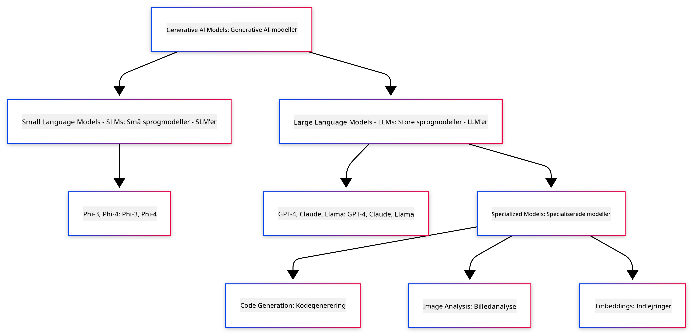
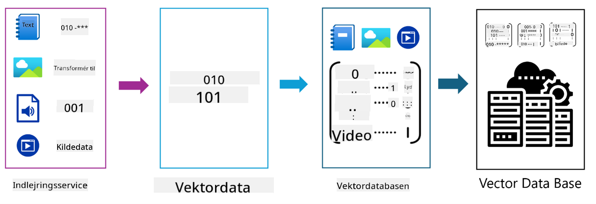

<!--
CO_OP_TRANSLATOR_METADATA:
{
  "original_hash": "6d8b4a0d774dc2a1e97c95859a6d6e4b",
  "translation_date": "2025-07-21T20:15:02+00:00",
  "source_file": "01-IntroToGenAI/README.md",
  "language_code": "da"
}
-->
# Introduktion til Generativ AI - Java Edition

## Hvad Du Vil Lære

- **Grundlæggende om generativ AI**, herunder LLM'er, prompt engineering, tokens, embeddings og vektordatabaser
- **Sammenligning af Java AI-udviklingsværktøjer**, herunder Azure OpenAI SDK, Spring AI og OpenAI Java SDK
- **Opdag Model Context Protocol** og dens rolle i AI-agentkommunikation

## Indholdsfortegnelse

- [Introduktion](../../../01-IntroToGenAI)
- [En hurtig genopfriskning af generativ AI-koncept](../../../01-IntroToGenAI)
- [Gennemgang af prompt engineering](../../../01-IntroToGenAI)
- [Tokens, embeddings og agenter](../../../01-IntroToGenAI)
- [AI-udviklingsværktøjer og biblioteker til Java](../../../01-IntroToGenAI)
  - [OpenAI Java SDK](../../../01-IntroToGenAI)
  - [Spring AI](../../../01-IntroToGenAI)
  - [Azure OpenAI Java SDK](../../../01-IntroToGenAI)
- [Opsummering](../../../01-IntroToGenAI)
- [Næste Skridt](../../../01-IntroToGenAI)

## Introduktion

Velkommen til det første kapitel af Generativ AI for Begyndere - Java Edition! Denne grundlæggende lektion introducerer dig til de centrale begreber inden for generativ AI og hvordan du arbejder med dem ved hjælp af Java. Du vil lære om de essentielle byggesten i AI-applikationer, herunder Large Language Models (LLM'er), tokens, embeddings og AI-agenter. Vi vil også udforske de primære Java-værktøjer, du vil bruge gennem hele kurset.

### En hurtig genopfriskning af generativ AI-koncept

Generativ AI er en type kunstig intelligens, der skaber nyt indhold, såsom tekst, billeder eller kode, baseret på mønstre og relationer lært fra data. Generative AI-modeller kan generere menneskelignende svar, forstå kontekst og nogle gange endda skabe indhold, der virker menneskeligt.

Når du udvikler dine Java AI-applikationer, vil du arbejde med **generative AI-modeller** for at skabe indhold. Nogle af de funktioner, generative AI-modeller tilbyder, inkluderer:

- **Tekstgenerering**: Skabe menneskelignende tekst til chatbots, indhold og tekstfuldførelse.
- **Billedgenerering og analyse**: Producere realistiske billeder, forbedre fotos og identificere objekter.
- **Kodegenerering**: Skrive kodeuddrag eller scripts.

Der findes specifikke typer modeller, der er optimeret til forskellige opgaver. For eksempel kan både **Small Language Models (SLM'er)** og **Large Language Models (LLM'er)** håndtere tekstgenerering, hvor LLM'er typisk tilbyder bedre ydeevne til komplekse opgaver. Til billedrelaterede opgaver vil du bruge specialiserede vision-modeller eller multimodale modeller.

Selvfølgelig er svarene fra disse modeller ikke altid perfekte. Du har sikkert hørt om modeller, der "hallucinerer" eller genererer forkert information på en autoritativ måde. Men du kan hjælpe med at guide modellen til at generere bedre svar ved at give klare instruktioner og kontekst. Det er her **prompt engineering** kommer ind i billedet.

#### Gennemgang af prompt engineering

Prompt engineering er praksissen med at designe effektive input for at guide AI-modeller mod ønskede output. Det indebærer:

- **Klarhed**: At gøre instruktionerne klare og entydige.
- **Kontekst**: At give nødvendig baggrundsinformation.
- **Begrænsninger**: At specificere eventuelle begrænsninger eller formater.

Nogle bedste praksisser for prompt engineering inkluderer promptdesign, klare instruktioner, opdeling af opgaver, one-shot og few-shot learning samt prompt tuning. Det er vigtigt at teste forskellige prompts for at finde ud af, hvad der fungerer bedst for din specifikke anvendelse.

Når du udvikler applikationer, vil du arbejde med forskellige typer prompts:
- **Systemprompts**: Sætter grundreglerne og konteksten for modellens adfærd
- **Brugerprompts**: Inputdata fra dine applikationsbrugere
- **Assistentprompts**: Modellens svar baseret på system- og brugerprompts

> **Lær mere**: Læs mere om prompt engineering i [Prompt Engineering-kapitlet i GenAI for Begyndere-kurset](https://github.com/microsoft/generative-ai-for-beginners/tree/main/04-prompt-engineering-fundamentals)

#### Tokens, embeddings og agenter

Når du arbejder med generative AI-modeller, vil du støde på begreber som **tokens**, **embeddings**, **agenter** og **Model Context Protocol (MCP)**. Her er en detaljeret oversigt over disse begreber:

- **Tokens**: Tokens er den mindste enhed af tekst i en model. De kan være ord, tegn eller delord. Tokens bruges til at repræsentere tekstdata i et format, som modellen kan forstå. For eksempel kan sætningen "The quick brown fox jumped over the lazy dog" blive tokeniseret som ["The", " quick", " brown", " fox", " jumped", " over", " the", " lazy", " dog"] eller ["The", " qu", "ick", " br", "own", " fox", " jump", "ed", " over", " the", " la", "zy", " dog"] afhængigt af tokeniseringsstrategien.

Tokenisering er processen med at bryde tekst ned i disse mindre enheder. Dette er afgørende, fordi modeller opererer på tokens frem for rå tekst. Antallet af tokens i en prompt påvirker modellens svarlængde og kvalitet, da modeller har tokenbegrænsninger for deres kontekstvindue (f.eks. 128K tokens for GPT-4o's samlede kontekst, inklusive både input og output).

  I Java kan du bruge biblioteker som OpenAI SDK til automatisk at håndtere tokenisering, når du sender forespørgsler til AI-modeller.

- **Embeddings**: Embeddings er vektorrepræsentationer af tokens, der fanger semantisk betydning. De er numeriske repræsentationer (typisk arrays af flydende tal), der gør det muligt for modeller at forstå relationer mellem ord og generere kontekstuelt relevante svar. Lignende ord har lignende embeddings, hvilket gør det muligt for modellen at forstå begreber som synonymer og semantiske relationer.

  I Java kan du generere embeddings ved hjælp af OpenAI SDK eller andre biblioteker, der understøtter embedding-generering. Disse embeddings er essentielle for opgaver som semantisk søgning, hvor du ønsker at finde lignende indhold baseret på betydning frem for præcise tekstmatch.

- **Vektordatabaser**: Vektordatabaser er specialiserede lagringssystemer optimeret til embeddings. De muliggør effektiv lighedssøgning og er afgørende for Retrieval-Augmented Generation (RAG)-mønstre, hvor du skal finde relevant information fra store datasæt baseret på semantisk lighed frem for præcise match.

> **Note**: I dette kursus vil vi ikke dække vektordatabaser, men de er værd at nævne, da de ofte bruges i virkelige applikationer.

- **Agenter & MCP**: AI-komponenter, der autonomt interagerer med modeller, værktøjer og eksterne systemer. Model Context Protocol (MCP) giver en standardiseret måde for agenter at få sikker adgang til eksterne datakilder og værktøjer. Læs mere i vores [MCP for Begyndere](https://github.com/microsoft/mcp-for-beginners)-kursus.

I Java AI-applikationer vil du bruge tokens til tekstbehandling, embeddings til semantisk søgning og RAG, vektordatabaser til datahentning og agenter med MCP til at bygge intelligente systemer, der bruger værktøjer.

### AI-udviklingsværktøjer og biblioteker til Java

Java tilbyder fremragende værktøjer til AI-udvikling. Der er tre hovedbiblioteker, som vi vil udforske gennem hele kurset - OpenAI Java SDK, Azure OpenAI SDK og Spring AI.

Her er en hurtig referencetabel, der viser, hvilket SDK der bruges i eksemplerne i hvert kapitel:

| Kapitel | Eksempel | SDK |
|---------|----------|-----|
| 02-SetupDevEnvironment | src/github-models/ | OpenAI Java SDK |
| 02-SetupDevEnvironment | src/basic-chat-azure/ | Spring AI Azure OpenAI |
| 03-CoreGenerativeAITechniques | examples/ | Azure OpenAI SDK |
| 04-PracticalSamples | petstory/ | OpenAI Java SDK |
| 04-PracticalSamples | foundrylocal/ | OpenAI Java SDK |
| 04-PracticalSamples | mcp/calculator/ | Spring AI MCP SDK + LangChain4j |

**SDK-dokumentationslinks:**
- [Azure OpenAI Java SDK](https://github.com/Azure/azure-sdk-for-java/tree/azure-ai-openai_1.0.0-beta.16/sdk/openai/azure-ai-openai)
- [Spring AI](https://docs.spring.io/spring-ai/reference/)
- [OpenAI Java SDK](https://github.com/openai/openai-java)
- [LangChain4j](https://docs.langchain4j.dev/)

#### OpenAI Java SDK

OpenAI SDK er det officielle Java-bibliotek til OpenAI API. Det giver en enkel og konsistent grænseflade til interaktion med OpenAI's modeller, hvilket gør det nemt at integrere AI-funktioner i Java-applikationer. Kapitel 2's GitHub Models-eksempel, Kapitel 4's Pet Story-applikation og Foundry Local-eksempel demonstrerer OpenAI SDK-tilgangen.

#### Spring AI

Spring AI er en omfattende ramme, der bringer AI-funktioner til Spring-applikationer og giver et konsistent abstraktionslag på tværs af forskellige AI-leverandører. Det integreres problemfrit med Spring-økosystemet, hvilket gør det til det ideelle valg for enterprise Java-applikationer, der har brug for AI-funktioner.

Spring AI's styrke ligger i dens problemfri integration med Spring-økosystemet, hvilket gør det nemt at bygge produktionsklare AI-applikationer med velkendte Spring-mønstre som dependency injection, konfigurationsstyring og testrammer. Du vil bruge Spring AI i Kapitel 2 og 4 til at bygge applikationer, der udnytter både OpenAI og Model Context Protocol (MCP) Spring AI-biblioteker.

##### Model Context Protocol (MCP)

[Model Context Protocol (MCP)](https://modelcontextprotocol.io/) er en fremvoksende standard, der gør det muligt for AI-applikationer at interagere sikkert med eksterne datakilder og værktøjer. MCP giver en standardiseret måde for AI-modeller at få adgang til kontekstuel information og udføre handlinger i dine applikationer.

I Kapitel 4 vil du bygge en simpel MCP-regnetjeneste, der demonstrerer grundlæggende om Model Context Protocol med Spring AI og viser, hvordan man skaber grundlæggende værktøjsintegrationer og servicearkitekturer.

#### Azure OpenAI Java SDK

Azure OpenAI-klientbiblioteket til Java er en tilpasning af OpenAI's REST API'er, der giver en idiomatisk grænseflade og integration med resten af Azure SDK-økosystemet. I Kapitel 3 vil du bygge applikationer ved hjælp af Azure OpenAI SDK, herunder chatapplikationer, funktionkald og RAG (Retrieval-Augmented Generation)-mønstre.

> Note: Azure OpenAI SDK halter efter OpenAI Java SDK med hensyn til funktioner, så til fremtidige projekter bør du overveje at bruge OpenAI Java SDK.

## Opsummering

**Tillykke!** Du har med succes:

- **Lært om grundlæggende generativ AI**, herunder LLM'er, prompt engineering, tokens, embeddings og vektordatabaser
- **Sammenlignet Java AI-udviklingsværktøjer**, herunder Azure OpenAI SDK, Spring AI og OpenAI Java SDK
- **Opdaget Model Context Protocol** og dens rolle i AI-agentkommunikation

## Næste Skridt

[Kapitel 2: Opsætning af udviklingsmiljøet](../02-SetupDevEnvironment/README.md)

**Ansvarsfraskrivelse**:  
Dette dokument er blevet oversat ved hjælp af AI-oversættelsestjenesten [Co-op Translator](https://github.com/Azure/co-op-translator). Selvom vi bestræber os på at sikre nøjagtighed, skal det bemærkes, at automatiserede oversættelser kan indeholde fejl eller unøjagtigheder. Det originale dokument på dets oprindelige sprog bør betragtes som den autoritative kilde. For kritisk information anbefales professionel menneskelig oversættelse. Vi påtager os ikke ansvar for eventuelle misforståelser eller fejltolkninger, der måtte opstå som følge af brugen af denne oversættelse.