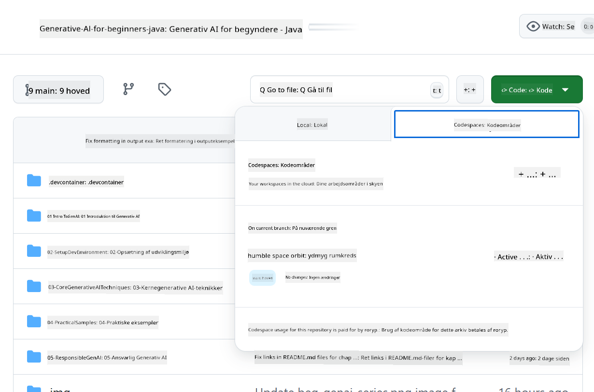

<!--
CO_OP_TRANSLATOR_METADATA:
{
  "original_hash": "e00bbea0f95c611aa3bec676d23e8b43",
  "translation_date": "2025-07-21T19:34:45+00:00",
  "source_file": "02-SetupDevEnvironment/getting-started-azure-openai.md",
  "language_code": "da"
}
-->
# Opsætning af udviklingsmiljø for Azure OpenAI

> **Hurtig start**: Denne guide er til opsætning af Azure OpenAI. For en øjeblikkelig start med gratis modeller, brug [GitHub Models med Codespaces](./README.md#quick-start-cloud).

Denne guide hjælper dig med at opsætte Azure AI Foundry-modeller til dine Java AI-applikationer i dette kursus.

## Indholdsfortegnelse

- [Hurtigt overblik over opsætning](../../../02-SetupDevEnvironment)
- [Trin 1: Opret Azure AI Foundry-ressourcer](../../../02-SetupDevEnvironment)
  - [Opret en hub og et projekt](../../../02-SetupDevEnvironment)
  - [Udrul GPT-4o-mini-modellen](../../../02-SetupDevEnvironment)
- [Trin 2: Opret din Codespace](../../../02-SetupDevEnvironment)
- [Trin 3: Konfigurer dit miljø](../../../02-SetupDevEnvironment)
- [Trin 4: Test din opsætning](../../../02-SetupDevEnvironment)
- [Hvad er det næste?](../../../02-SetupDevEnvironment)
- [Ressourcer](../../../02-SetupDevEnvironment)
- [Yderligere ressourcer](../../../02-SetupDevEnvironment)

## Hurtigt overblik over opsætning

1. Opret Azure AI Foundry-ressourcer (Hub, Projekt, Model)
2. Opret en Codespace med Java-udviklingscontainer
3. Konfigurer din .env-fil med Azure OpenAI-legitimationsoplysninger
4. Test din opsætning med eksempelprojektet

## Trin 1: Opret Azure AI Foundry-ressourcer

### Opret en hub og et projekt

1. Gå til [Azure AI Foundry Portal](https://ai.azure.com/) og log ind
2. Klik på **+ Opret** → **Ny hub** (eller naviger til **Administration** → **Alle hubs** → **+ Ny hub**)
3. Konfigurer din hub:
   - **Hub-navn**: f.eks. "MyAIHub"
   - **Abonnement**: Vælg dit Azure-abonnement
   - **Ressourcegruppe**: Opret ny eller vælg eksisterende
   - **Placering**: Vælg den nærmeste placering
   - **Lagerkonto**: Brug standard eller konfigurer tilpasset
   - **Key vault**: Brug standard eller konfigurer tilpasset
   - Klik på **Næste** → **Gennemse + opret** → **Opret**
4. Når hubben er oprettet, klik på **+ Nyt projekt** (eller **Opret projekt** fra hub-oversigten)
   - **Projekt-navn**: f.eks. "GenAIJava"
   - Klik på **Opret**

### Udrul GPT-4o-mini-modellen

1. I dit projekt, gå til **Modelkatalog** og søg efter **gpt-4o-mini**
   - *Alternativ: Gå til **Udrulninger** → **+ Opret udrulning***
2. Klik på **Udrul** på gpt-4o-mini-modelkortet
3. Konfigurer udrulningen:
   - **Udrulningsnavn**: "gpt-4o-mini"
   - **Modelversion**: Brug den nyeste
   - **Udrulningstype**: Standard
4. Klik på **Udrul**
5. Når udrulningen er færdig, gå til fanen **Udrulninger** og kopier følgende værdier:
   - **Udrulningsnavn** (f.eks. "gpt-4o-mini")
   - **Mål-URI** (f.eks. `https://your-hub-name.openai.azure.com/`) 
      > **Vigtigt**: Kopier kun basis-URL'en (f.eks. `https://myhub.openai.azure.com/`) og ikke den fulde endpoint-sti.
   - **Nøgle** (fra sektionen Nøgler og Endpoint)

> **Har du stadig problemer?** Besøg den officielle [Azure AI Foundry Dokumentation](https://learn.microsoft.com/azure/ai-foundry/how-to/create-projects?tabs=ai-foundry&pivots=hub-project)

## Trin 2: Opret din Codespace

1. Fork dette repository til din GitHub-konto
   > **Bemærk**: Hvis du vil redigere den grundlæggende konfiguration, kan du kigge på [Dev Container Configuration](../../../.devcontainer/devcontainer.json)
2. I dit forkede repository, klik på **Code** → **Codespaces**-fanen
3. Klik på **...** → **Ny med muligheder...**

4. Vælg **Dev container-konfiguration**: 
   - **Generative AI Java Development Environment**
5. Klik på **Opret codespace**

## Trin 3: Konfigurer dit miljø

Når din Codespace er klar, skal du opsætte dine Azure OpenAI-legitimationsoplysninger:

1. **Naviger til eksempelprojektet fra repository-roden:**
   ```bash
   cd 02-SetupDevEnvironment/src/basic-chat-azure
   ```

2. **Opret din .env-fil:**
   ```bash
   cp .env.example .env
   ```

3. **Rediger .env-filen med dine Azure OpenAI-legitimationsoplysninger:**
   ```bash
   # Your Azure OpenAI API key (from Azure AI Foundry portal)
   AZURE_AI_KEY=your-actual-api-key-here
   
   # Your Azure OpenAI endpoint URL (e.g., https://myhub.openai.azure.com/)
   AZURE_AI_ENDPOINT=https://your-hub-name.openai.azure.com/
   ```

   > **Sikkerhedsnotat**: 
   > - Undlad at committe din `.env`-fil til versionskontrol
   > - `.env`-filen er allerede inkluderet i `.gitignore`
   > - Hold dine API-nøgler sikre og roter dem regelmæssigt

## Trin 4: Test din opsætning

Kør eksempelapplikationen for at teste din Azure OpenAI-forbindelse:

```bash
mvn clean spring-boot:run
```

Du bør se et svar fra GPT-4o-mini-modellen!

> **VS Code-brugere**: Du kan også trykke på `F5` i VS Code for at køre applikationen. Startkonfigurationen er allerede opsat til automatisk at indlæse din `.env`-fil.

> **Fuldstændigt eksempel**: Se [End-to-End Azure OpenAI Eksempel](./src/basic-chat-azure/README.md) for detaljerede instruktioner og fejlfinding.

## Hvad er det næste?

**Opsætning fuldført!** Du har nu:
- Azure OpenAI med gpt-4o-mini udrullet
- Lokal .env-filkonfiguration
- Java-udviklingsmiljø klar

**Fortsæt til** [Kapitel 3: Core Generative AI Techniques](../03-CoreGenerativeAITechniques/README.md) for at begynde at bygge AI-applikationer!

## Ressourcer

- [Azure AI Foundry Dokumentation](https://learn.microsoft.com/azure/ai-services/)
- [Spring AI Azure OpenAI Dokumentation](https://docs.spring.io/spring-ai/reference/api/clients/azure-openai-chat.html)
- [Azure OpenAI Java SDK](https://learn.microsoft.com/java/api/overview/azure/ai-openai-readme)

## Yderligere ressourcer

- [Download VS Code](https://code.visualstudio.com/Download)
- [Få Docker Desktop](https://www.docker.com/products/docker-desktop)
- [Dev Container Configuration](../../../.devcontainer/devcontainer.json)

**Ansvarsfraskrivelse**:  
Dette dokument er blevet oversat ved hjælp af AI-oversættelsestjenesten [Co-op Translator](https://github.com/Azure/co-op-translator). Selvom vi bestræber os på nøjagtighed, skal du være opmærksom på, at automatiserede oversættelser kan indeholde fejl eller unøjagtigheder. Det originale dokument på dets oprindelige sprog bør betragtes som den autoritative kilde. For kritisk information anbefales professionel menneskelig oversættelse. Vi er ikke ansvarlige for eventuelle misforståelser eller fejltolkninger, der måtte opstå som følge af brugen af denne oversættelse.