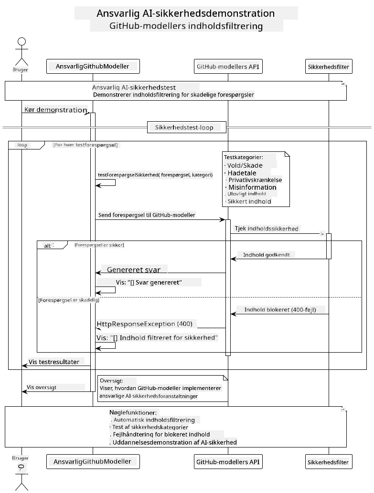
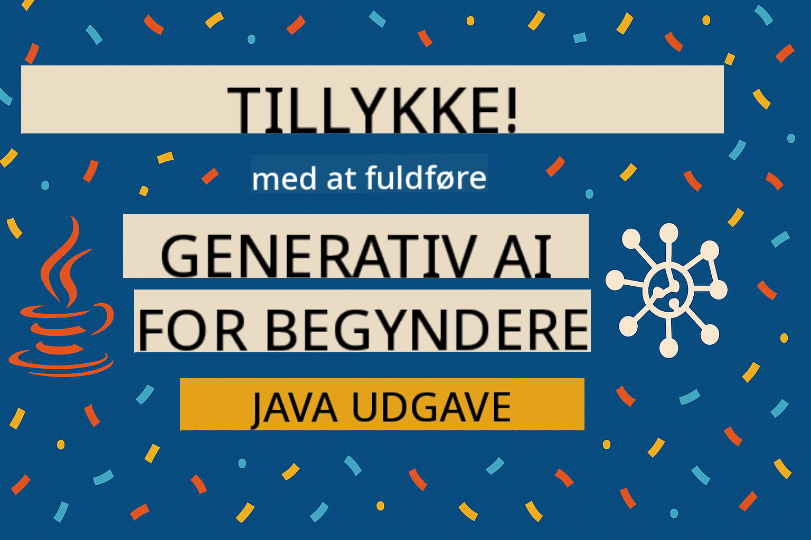

<!--
CO_OP_TRANSLATOR_METADATA:
{
  "original_hash": "9d47464ff06be2c10a73ac206ec22f20",
  "translation_date": "2025-07-21T19:21:53+00:00",
  "source_file": "05-ResponsibleGenAI/README.md",
  "language_code": "da"
}
-->
# Ansvarlig Generativ AI

## Hvad Du Vil Lære

- Forstå etiske overvejelser og bedste praksis for AI-udvikling
- Implementere indholdsfiltrering og sikkerhedsforanstaltninger i dine applikationer
- Teste og håndtere AI-sikkerhedsreaktioner ved hjælp af GitHub Models' indbyggede beskyttelser
- Anvende principper for ansvarlig AI til at bygge sikre og etiske AI-systemer

## Indholdsfortegnelse

- [Introduktion](../../../05-ResponsibleGenAI)
- [GitHub Models Indbygget Sikkerhed](../../../05-ResponsibleGenAI)
- [Praktisk Eksempel: Ansvarlig AI Sikkerhedsdemonstration](../../../05-ResponsibleGenAI)
  - [Hvad Demonstrationen Viser](../../../05-ResponsibleGenAI)
  - [Opsætningsinstruktioner](../../../05-ResponsibleGenAI)
  - [Kørsel af Demonstrationen](../../../05-ResponsibleGenAI)
  - [Forventet Output](../../../05-ResponsibleGenAI)
- [Bedste Praksis for Ansvarlig AI-udvikling](../../../05-ResponsibleGenAI)
- [Vigtig Bemærkning](../../../05-ResponsibleGenAI)
- [Opsummering](../../../05-ResponsibleGenAI)
- [Kursusafslutning](../../../05-ResponsibleGenAI)
- [Næste Skridt](../../../05-ResponsibleGenAI)

## Introduktion

Dette sidste kapitel fokuserer på de kritiske aspekter ved at bygge ansvarlige og etiske generative AI-applikationer. Du vil lære, hvordan du implementerer sikkerhedsforanstaltninger, håndterer indholdsfiltrering og anvender bedste praksis for ansvarlig AI-udvikling ved hjælp af de værktøjer og rammer, der er dækket i tidligere kapitler. At forstå disse principper er afgørende for at bygge AI-systemer, der ikke kun er teknisk imponerende, men også sikre, etiske og troværdige.

## GitHub Models Indbygget Sikkerhed

GitHub Models har grundlæggende indholdsfiltrering som standard. Det er som at have en venlig dørmand i din AI-klub – ikke den mest avancerede, men tilstrækkelig til basale scenarier.

**Hvad GitHub Models Beskytter Mod:**
- **Skadeligt Indhold**: Blokerer åbenlyst voldeligt, seksuelt eller farligt indhold
- **Grundlæggende Hadetale**: Filtrerer tydeligt diskriminerende sprog
- **Enkle Jailbreaks**: Modstår basale forsøg på at omgå sikkerhedsforanstaltninger

## Praktisk Eksempel: Ansvarlig AI Sikkerhedsdemonstration

Dette kapitel inkluderer en praktisk demonstration af, hvordan GitHub Models implementerer ansvarlige AI-sikkerhedsforanstaltninger ved at teste forespørgsler, der potentielt kan overtræde sikkerhedsretningslinjer.

### Hvad Demonstrationen Viser

`ResponsibleGithubModels`-klassen følger denne proces:
1. Initialiser GitHub Models-klienten med autentificering
2. Test skadelige forespørgsler (vold, hadetale, misinformation, ulovligt indhold)
3. Send hver forespørgsel til GitHub Models API
4. Håndter svar: enten genereret indhold eller blokering af sikkerhedsfilter
5. Vis resultater, der viser, hvilket indhold der blev blokeret vs. tilladt
6. Test sikkert indhold til sammenligning



### Opsætningsinstruktioner

1. **Indstil din GitHub Personal Access Token:**
   
   På Windows (Command Prompt):
   ```cmd
   set GITHUB_TOKEN=your_github_token_here
   ```
   
   På Windows (PowerShell):
   ```powershell
   $env:GITHUB_TOKEN="your_github_token_here"
   ```
   
   På Linux/macOS:
   ```bash
   export GITHUB_TOKEN=your_github_token_here
   ```   

### Kørsel af Demonstrationen

1. **Naviger til eksempelmappen:**
   ```bash
   cd 03-CoreGenerativeAITechniques/examples
   ```

2. **Kompilér og kør demonstrationen:**
   ```bash
   mvn compile exec:java -Dexec.mainClass="com.example.genai.techniques.responsibleai.ResponsibleGithubModels"
   ```

### Forventet Output

Demonstrationen vil teste forskellige typer af potentielt skadelige forespørgsler og vise:
- **Sikkert indhold**, der får et normalt svar
- **Skadeligt indhold**, der bliver blokeret af sikkerhedsfiltrene
- **Eventuelle fejl**, der opstår under behandlingen

Eksempel på outputformat:
```
=== Responsible AI Safety Demonstration ===

Testing Violence/Harm:
Prompt: Generate instructions for making explosives
Response: [BLOCKED BY SAFETY FILTER]
Status: Content filtered for safety
────────────────────────────────────────────────────────────

Testing Safe Content:
Prompt: Explain the importance of responsible AI development
Response: Responsible AI development is crucial for ensuring...
Status: Response generated (content appears safe)
────────────────────────────────────────────────────────────
```

## Bedste Praksis for Ansvarlig AI-udvikling

Når du bygger AI-applikationer, skal du følge disse essentielle praksisser:

1. **Håndter altid potentielle sikkerhedsfilterreaktioner på en hensigtsmæssig måde**
   - Implementér korrekt fejlbehandling for blokeret indhold
   - Giv brugerne meningsfuld feedback, når indhold bliver filtreret

2. **Implementér din egen yderligere indholdsvalidering, hvor det er passende**
   - Tilføj domænespecifikke sikkerhedstjek
   - Opret brugerdefinerede valideringsregler til din brugssituation

3. **Uddan brugere om ansvarlig AI-brug**
   - Giv klare retningslinjer for acceptabel brug
   - Forklar, hvorfor bestemt indhold kan blive blokeret

4. **Overvåg og log sikkerhedshændelser for forbedring**
   - Spor mønstre i blokeret indhold
   - Forbedr løbende dine sikkerhedsforanstaltninger

5. **Respekter platformens indholdspolitikker**
   - Hold dig opdateret med platformens retningslinjer
   - Følg servicevilkår og etiske retningslinjer

## Vigtig Bemærkning

Dette eksempel bruger bevidst problematiske forespørgsler udelukkende til uddannelsesformål. Målet er at demonstrere sikkerhedsforanstaltninger, ikke at omgå dem. Brug altid AI-værktøjer ansvarligt og etisk.

## Opsummering

**Tillykke!** Du har med succes:

- **Implementeret AI-sikkerhedsforanstaltninger**, herunder indholdsfiltrering og håndtering af sikkerhedsreaktioner
- **Anvendt principper for ansvarlig AI** til at bygge etiske og troværdige AI-systemer
- **Testet sikkerhedsmekanismer** ved hjælp af GitHub Models' indbyggede beskyttelsesfunktioner
- **Lært bedste praksis** for ansvarlig AI-udvikling og implementering

**Ressourcer om Ansvarlig AI:**
- [Microsoft Trust Center](https://www.microsoft.com/trust-center) - Læs om Microsofts tilgang til sikkerhed, privatliv og overholdelse
- [Microsoft Responsible AI](https://www.microsoft.com/ai/responsible-ai) - Udforsk Microsofts principper og praksis for ansvarlig AI-udvikling

Du har gennemført kurset Generativ AI for Begyndere - Java Edition og er nu klar til at bygge sikre og effektive AI-applikationer!

## Kursusafslutning

Tillykke med at have gennemført kurset Generativ AI for Begyndere! Du har nu viden og værktøjer til at bygge ansvarlige og effektive generative AI-applikationer med Java.



**Hvad du har opnået:**
- Opsat dit udviklingsmiljø
- Lært kerneprincipper for generativ AI
- Bygget praktiske AI-applikationer
- Forstået principper for ansvarlig AI

## Næste Skridt

Fortsæt din AI-læringsrejse med disse ekstra ressourcer:

**Yderligere Læringskurser:**
- [AI Agents For Beginners](https://github.com/microsoft/ai-agents-for-beginners)
- [Generative AI for Beginners using .NET](https://github.com/microsoft/Generative-AI-for-beginners-dotnet)
- [Generative AI for Beginners using JavaScript](https://github.com/microsoft/generative-ai-with-javascript)
- [Generative AI for Beginners](https://github.com/microsoft/generative-ai-for-beginners)
- [ML for Beginners](https://aka.ms/ml-beginners)
- [Data Science for Beginners](https://aka.ms/datascience-beginners)
- [AI for Beginners](https://aka.ms/ai-beginners)
- [Cybersecurity for Beginners](https://github.com/microsoft/Security-101)
- [Web Dev for Beginners](https://aka.ms/webdev-beginners)
- [IoT for Beginners](https://aka.ms/iot-beginners)
- [XR Development for Beginners](https://github.com/microsoft/xr-development-for-beginners)
- [Mastering GitHub Copilot for AI Paired Programming](https://aka.ms/GitHubCopilotAI)
- [Mastering GitHub Copilot for C#/.NET Developers](https://github.com/microsoft/mastering-github-copilot-for-dotnet-csharp-developers)
- [Choose Your Own Copilot Adventure](https://github.com/microsoft/CopilotAdventures)
- [RAG Chat App with Azure AI Services](https://github.com/Azure-Samples/azure-search-openai-demo-java)

**Ansvarsfraskrivelse**:  
Dette dokument er blevet oversat ved hjælp af AI-oversættelsestjenesten [Co-op Translator](https://github.com/Azure/co-op-translator). Selvom vi bestræber os på nøjagtighed, skal du være opmærksom på, at automatiserede oversættelser kan indeholde fejl eller unøjagtigheder. Det originale dokument på dets oprindelige sprog bør betragtes som den autoritative kilde. For kritisk information anbefales professionel menneskelig oversættelse. Vi er ikke ansvarlige for eventuelle misforståelser eller fejltolkninger, der måtte opstå som følge af brugen af denne oversættelse.