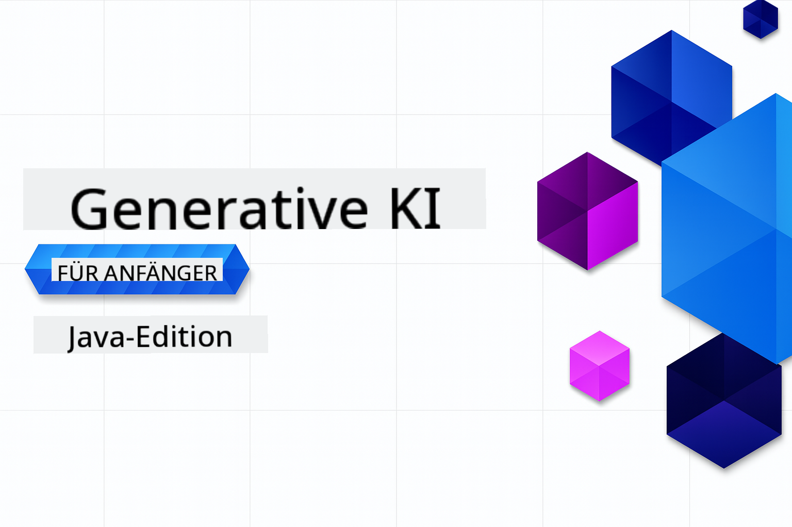

<!--
CO_OP_TRANSLATOR_METADATA:
{
  "original_hash": "a49b35508745c032a0033d914df7901b",
  "translation_date": "2025-07-25T08:43:44+00:00",
  "source_file": "README.md",
  "language_code": "de"
}
-->
# Generative KI für Anfänger - Java Edition

**Zeitaufwand**: Der gesamte Workshop kann online abgeschlossen werden, ohne lokale Einrichtung. Wenn Sie die Beispiele ausführen möchten, dauert die Einrichtung der Umgebung 2 Minuten, und das Erkunden der Beispiele erfordert je nach Tiefe der Erkundung 1-3 Stunden.

> **Schnellstart**

1. Forken Sie dieses Repository in Ihrem GitHub-Konto
2. Klicken Sie auf **Code** → **Codespaces**-Tab → **...** → **Neu mit Optionen...**
3. Verwenden Sie die Standardeinstellungen – dies wählt den für diesen Kurs erstellten Entwicklungscontainer aus
4. Klicken Sie auf **Codespace erstellen**
5. Warten Sie ~2 Minuten, bis die Umgebung bereit ist
6. Gehen Sie direkt zu [Erstellen Ihres GitHub Models Tokens](./02-SetupDevEnvironment/README.md#step-2-create-a-github-personal-access-token)

## Mehrsprachige Unterstützung

### Unterstützt durch GitHub Action (Automatisiert & Immer aktuell)

[Französisch](../fr/README.md) | [Spanisch](../es/README.md) | [Deutsch](./README.md) | [Russisch](../ru/README.md) | [Arabisch](../ar/README.md) | [Persisch (Farsi)](../fa/README.md) | [Urdu](../ur/README.md) | [Chinesisch (Vereinfacht)](../zh/README.md) | [Chinesisch (Traditionell, Macau)](../mo/README.md) | [Chinesisch (Traditionell, Hongkong)](../hk/README.md) | [Chinesisch (Traditionell, Taiwan)](../tw/README.md) | [Japanisch](../ja/README.md) | [Koreanisch](../ko/README.md) | [Hindi](../hi/README.md) | [Bengalisch](../bn/README.md) | [Marathi](../mr/README.md) | [Nepalesisch](../ne/README.md) | [Punjabi (Gurmukhi)](../pa/README.md) | [Portugiesisch (Portugal)](../pt/README.md) | [Portugiesisch (Brasilien)](../br/README.md) | [Italienisch](../it/README.md) | [Polnisch](../pl/README.md) | [Türkisch](../tr/README.md) | [Griechisch](../el/README.md) | [Thailändisch](../th/README.md) | [Schwedisch](../sv/README.md) | [Dänisch](../da/README.md) | [Norwegisch](../no/README.md) | [Finnisch](../fi/README.md) | [Niederländisch](../nl/README.md) | [Hebräisch](../he/README.md) | [Vietnamesisch](../vi/README.md) | [Indonesisch](../id/README.md) | [Malaiisch](../ms/README.md) | [Tagalog (Filipino)](../tl/README.md) | [Swahili](../sw/README.md) | [Ungarisch](../hu/README.md) | [Tschechisch](../cs/README.md) | [Slowakisch](../sk/README.md) | [Rumänisch](../ro/README.md) | [Bulgarisch](../bg/README.md) | [Serbisch (Kyrillisch)](../sr/README.md) | [Kroatisch](../hr/README.md) | [Slowenisch](../sl/README.md) | [Ukrainisch](../uk/README.md) | [Birmanisch (Myanmar)](../my/README.md)

## Kursstruktur & Lernpfad

### **Kapitel 1: Einführung in Generative KI**
- **Kernkonzepte**: Verständnis von großen Sprachmodellen, Tokens, Embeddings und KI-Fähigkeiten
- **Java KI-Ökosystem**: Überblick über Spring AI und OpenAI SDKs
- **Model Context Protocol**: Einführung in MCP und seine Rolle in der Kommunikation von KI-Agenten
- **Praktische Anwendungen**: Szenarien aus der realen Welt, einschließlich Chatbots und Inhaltserstellung
- **[→ Kapitel 1 starten](./01-IntroToGenAI/README.md)**

### **Kapitel 2: Einrichtung der Entwicklungsumgebung**
- **Multi-Provider-Konfiguration**: Einrichtung von GitHub Models, Azure OpenAI und OpenAI Java SDK-Integrationen
- **Spring Boot + Spring AI**: Best Practices für die Entwicklung von Unternehmens-KI-Anwendungen
- **GitHub Models**: Kostenloser Zugriff auf KI-Modelle für Prototyping und Lernen (keine Kreditkarte erforderlich)
- **Entwicklungswerkzeuge**: Docker-Container, VS Code und GitHub Codespaces-Konfiguration
- **[→ Kapitel 2 starten](./02-SetupDevEnvironment/README.md)**

### **Kapitel 3: Kerntechniken der Generativen KI**
- **Prompt Engineering**: Techniken für optimale Antworten von KI-Modellen
- **Embeddings & Vektoroperationen**: Implementierung von semantischer Suche und Ähnlichkeitsabgleich
- **Retrieval-Augmented Generation (RAG)**: Kombination von KI mit eigenen Datenquellen
- **Function Calling**: Erweiterung der KI-Fähigkeiten mit benutzerdefinierten Tools und Plugins
- **[→ Kapitel 3 starten](./03-CoreGenerativeAITechniques/README.md)**

### **Kapitel 4: Praktische Anwendungen & Projekte**
- **Pet Story Generator** (`petstory/`): Kreative Inhaltserstellung mit GitHub Models
- **Foundry Local Demo** (`foundrylocal/`): Lokale KI-Modellintegration mit OpenAI Java SDK
- **MCP Calculator Service** (`mcp/calculator/`): Grundlegende Implementierung des Model Context Protocol mit Spring AI
- **[→ Kapitel 4 starten](./04-PracticalSamples/README.md)**

### **Kapitel 5: Verantwortungsvolle KI-Entwicklung**
- **GitHub Models Sicherheit**: Testen von integrierten Inhaltsfiltern und Sicherheitsmechanismen
- **Responsible AI Demo**: Praktisches Beispiel, das zeigt, wie KI-Sicherheitsfilter in der Praxis funktionieren
- **Best Practices**: Wesentliche Richtlinien für die ethische Entwicklung und Bereitstellung von KI
- **[→ Kapitel 5 starten](./05-ResponsibleGenAI/README.md)**

## Zusätzliche Ressourcen 

- [KI-Agenten für Anfänger](https://github.com/microsoft/ai-agents-for-beginners)
- [Generative KI für Anfänger mit .NET](https://github.com/microsoft/Generative-AI-for-beginners-dotnet)
- [Generative KI für Anfänger mit JavaScript](https://github.com/microsoft/generative-ai-with-javascript)
- [Generative KI für Anfänger](https://github.com/microsoft/generative-ai-for-beginners)
- [ML für Anfänger](https://aka.ms/ml-beginners)
- [Datenwissenschaft für Anfänger](https://aka.ms/datascience-beginners)
- [KI für Anfänger](https://aka.ms/ai-beginners)
- [Cybersicherheit für Anfänger](https://github.com/microsoft/Security-101)
- [Webentwicklung für Anfänger](https://aka.ms/webdev-beginners)
- [IoT für Anfänger](https://aka.ms/iot-beginners)
- [XR-Entwicklung für Anfänger](https://github.com/microsoft/xr-development-for-beginners)
- [GitHub Copilot meistern für KI-gestütztes Programmieren](https://aka.ms/GitHubCopilotAI)
- [GitHub Copilot meistern für C#/.NET-Entwickler](https://github.com/microsoft/mastering-github-copilot-for-dotnet-csharp-developers)
- [Wählen Sie Ihr eigenes Copilot-Abenteuer](https://github.com/microsoft/CopilotAdventures)
- [RAG Chat App mit Azure AI Services](https://github.com/Azure-Samples/azure-search-openai-demo-java)

**Haftungsausschluss**:  
Dieses Dokument wurde mit dem KI-Übersetzungsdienst [Co-op Translator](https://github.com/Azure/co-op-translator) übersetzt. Obwohl wir uns um Genauigkeit bemühen, beachten Sie bitte, dass automatisierte Übersetzungen Fehler oder Ungenauigkeiten enthalten können. Das Originaldokument in seiner ursprünglichen Sprache sollte als maßgebliche Quelle betrachtet werden. Für kritische Informationen wird eine professionelle menschliche Übersetzung empfohlen. Wir übernehmen keine Haftung für Missverständnisse oder Fehlinterpretationen, die sich aus der Nutzung dieser Übersetzung ergeben.