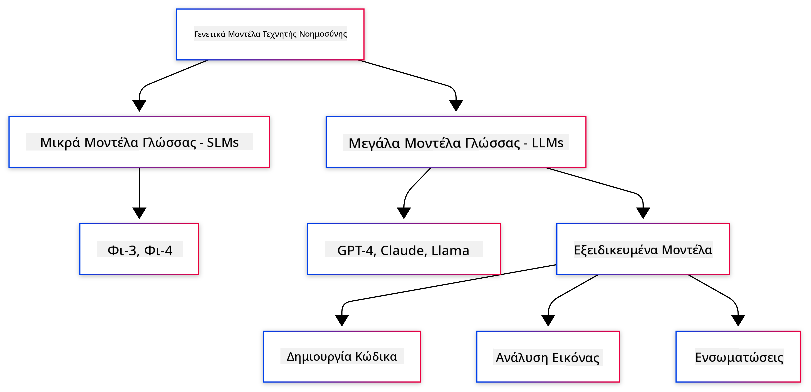
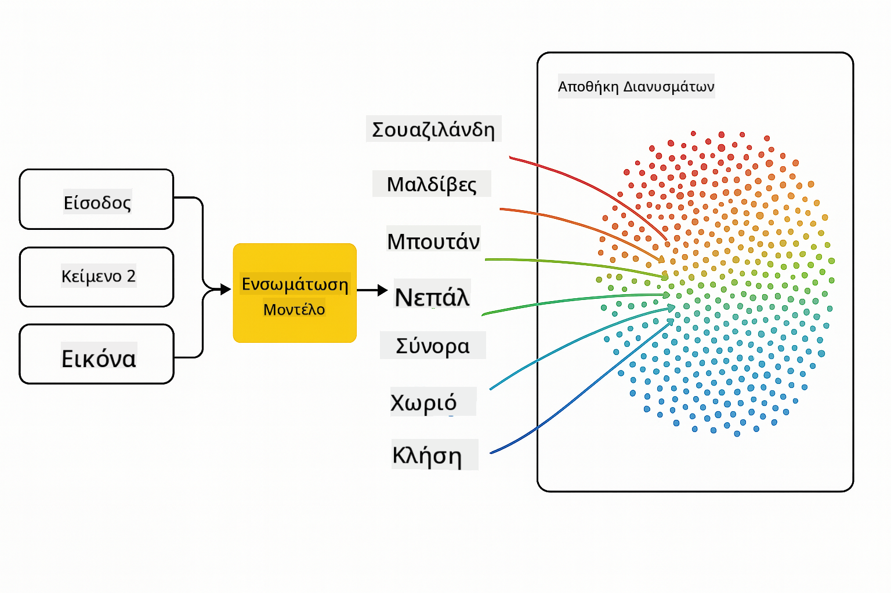
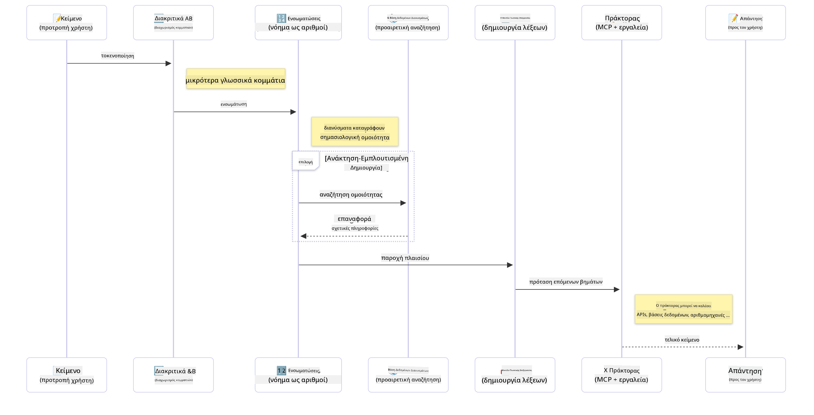

<!--
CO_OP_TRANSLATOR_METADATA:
{
  "original_hash": "75bfb080ca725e8a9aa9c80cae25fba1",
  "translation_date": "2025-07-29T09:17:22+00:00",
  "source_file": "01-IntroToGenAI/README.md",
  "language_code": "el"
}
-->
# Εισαγωγή στη Γενεσιουργό Τεχνητή Νοημοσύνη - Έκδοση Java

## Τι θα μάθετε

- **Βασικές αρχές της Γενεσιουργού Τεχνητής Νοημοσύνης**, συμπεριλαμβανομένων των LLMs, της μηχανικής προτροπών, των tokens, των embeddings και των βάσεων δεδομένων διανυσμάτων
- **Σύγκριση εργαλείων ανάπτυξης AI για Java**, όπως το Azure OpenAI SDK, το Spring AI και το OpenAI Java SDK
- **Ανακάλυψη του Πρωτοκόλλου Πλαισίου Μοντέλου (Model Context Protocol)** και του ρόλου του στην επικοινωνία πρακτόρων AI

## Πίνακας Περιεχομένων

- [Εισαγωγή](../../../01-IntroToGenAI)
- [Μια γρήγορη ανασκόπηση των εννοιών της Γενεσιουργού Τεχνητής Νοημοσύνης](../../../01-IntroToGenAI)
- [Ανασκόπηση μηχανικής προτροπών](../../../01-IntroToGenAI)
- [Tokens, embeddings και πράκτορες](../../../01-IntroToGenAI)
- [Εργαλεία και βιβλιοθήκες ανάπτυξης AI για Java](../../../01-IntroToGenAI)
  - [OpenAI Java SDK](../../../01-IntroToGenAI)
  - [Spring AI](../../../01-IntroToGenAI)
  - [Azure OpenAI Java SDK](../../../01-IntroToGenAI)
- [Σύνοψη](../../../01-IntroToGenAI)
- [Επόμενα Βήματα](../../../01-IntroToGenAI)

## Εισαγωγή

Καλώς ήρθατε στο πρώτο κεφάλαιο της σειράς "Γενεσιουργός Τεχνητή Νοημοσύνη για Αρχάριους - Έκδοση Java"! Αυτό το εισαγωγικό μάθημα σας παρουσιάζει τις βασικές έννοιες της γενεσιουργού τεχνητής νοημοσύνης και πώς να εργαστείτε με αυτές χρησιμοποιώντας Java. Θα μάθετε για τα βασικά δομικά στοιχεία των εφαρμογών AI, όπως τα Μεγάλα Γλωσσικά Μοντέλα (LLMs), τα tokens, τα embeddings και τους πράκτορες AI. Επίσης, θα εξερευνήσουμε τα κύρια εργαλεία Java που θα χρησιμοποιήσετε σε όλη τη διάρκεια αυτού του μαθήματος.

### Μια γρήγορη ανασκόπηση των εννοιών της Γενεσιουργού Τεχνητής Νοημοσύνης

Η Γενεσιουργός Τεχνητή Νοημοσύνη είναι ένας τύπος τεχνητής νοημοσύνης που δημιουργεί νέο περιεχόμενο, όπως κείμενο, εικόνες ή κώδικα, βασισμένο σε μοτίβα και σχέσεις που έχει μάθει από δεδομένα. Τα μοντέλα γενεσιουργού AI μπορούν να παράγουν απαντήσεις που μοιάζουν με ανθρώπινες, να κατανοούν το πλαίσιο και, μερικές φορές, να δημιουργούν περιεχόμενο που φαίνεται ανθρώπινο.

Καθώς αναπτύσσετε τις εφαρμογές AI σας με Java, θα συνεργάζεστε με **μοντέλα γενεσιουργού AI** για να δημιουργείτε περιεχόμενο. Ορισμένες δυνατότητες των μοντέλων γενεσιουργού AI περιλαμβάνουν:

- **Δημιουργία Κειμένου**: Δημιουργία κειμένου που μοιάζει με ανθρώπινο για chatbots, περιεχόμενο και ολοκλήρωση κειμένου.
- **Δημιουργία και Ανάλυση Εικόνων**: Παραγωγή ρεαλιστικών εικόνων, βελτίωση φωτογραφιών και ανίχνευση αντικειμένων.
- **Δημιουργία Κώδικα**: Γραφή αποσπασμάτων κώδικα ή σεναρίων.

Υπάρχουν συγκεκριμένοι τύποι μοντέλων που είναι βελτιστοποιημένοι για διαφορετικές εργασίες. Για παράδειγμα, τόσο τα **Μικρά Γλωσσικά Μοντέλα (SLMs)** όσο και τα **Μεγάλα Γλωσσικά Μοντέλα (LLMs)** μπορούν να χειριστούν τη δημιουργία κειμένου, με τα LLMs να προσφέρουν συνήθως καλύτερη απόδοση για πιο σύνθετες εργασίες. Για εργασίες που σχετίζονται με εικόνες, θα χρησιμοποιούσατε εξειδικευμένα μοντέλα όρασης ή πολυτροπικά μοντέλα.

Φυσικά, οι απαντήσεις από αυτά τα μοντέλα δεν είναι πάντα τέλειες. Ίσως έχετε ακούσει για τα μοντέλα που "παραληρούν" ή παράγουν λανθασμένες πληροφορίες με αυθεντικό τρόπο. Ωστόσο, μπορείτε να βοηθήσετε το μοντέλο να παράγει καλύτερες απαντήσεις παρέχοντάς του σαφείς οδηγίες και πλαίσιο. Εδώ έρχεται η **μηχανική προτροπών**.

#### Ανασκόπηση μηχανικής προτροπών

Η μηχανική προτροπών είναι η πρακτική σχεδιασμού αποτελεσματικών εισόδων για να καθοδηγήσετε τα μοντέλα AI προς τα επιθυμητά αποτελέσματα. Περιλαμβάνει:

- **Σαφήνεια**: Κάνοντας τις οδηγίες σαφείς και αδιαμφισβήτητες.
- **Πλαίσιο**: Παροχή των απαραίτητων πληροφοριών υποβάθρου.
- **Περιορισμοί**: Καθορισμός τυχόν περιορισμών ή μορφών.

Ορισμένες βέλτιστες πρακτικές για τη μηχανική προτροπών περιλαμβάνουν το σχεδιασμό προτροπών, σαφείς οδηγίες, ανάλυση εργασιών, εκμάθηση με ένα ή λίγα παραδείγματα και ρύθμιση προτροπών. Η δοκιμή διαφορετικών προτροπών είναι απαραίτητη για να βρείτε τι λειτουργεί καλύτερα για τη συγκεκριμένη περίπτωση χρήσης σας.

Κατά την ανάπτυξη εφαρμογών, θα συνεργάζεστε με διαφορετικούς τύπους προτροπών:
- **Προτροπές συστήματος**: Θέτουν τους βασικούς κανόνες και το πλαίσιο για τη συμπεριφορά του μοντέλου.
- **Προτροπές χρήστη**: Τα δεδομένα εισόδου από τους χρήστες της εφαρμογής σας.
- **Προτροπές βοηθού**: Οι απαντήσεις του μοντέλου βασισμένες στις προτροπές συστήματος και χρήστη.

> **Μάθετε περισσότερα**: Μάθετε περισσότερα για τη μηχανική προτροπών στο [κεφάλαιο Μηχανικής Προτροπών του μαθήματος GenAI για Αρχάριους](https://github.com/microsoft/generative-ai-for-beginners/tree/main/04-prompt-engineering-fundamentals)

#### Tokens, embeddings και πράκτορες

Όταν εργάζεστε με μοντέλα γενεσιουργού AI, θα συναντήσετε όρους όπως **tokens**, **embeddings**, **πράκτορες** και **Πρωτόκολλο Πλαισίου Μοντέλου (MCP)**. Ακολουθεί μια λεπτομερής επισκόπηση αυτών των εννοιών:

- **Tokens**: Τα tokens είναι η μικρότερη μονάδα κειμένου σε ένα μοντέλο. Μπορεί να είναι λέξεις, χαρακτήρες ή υπολέξεις. Τα tokens χρησιμοποιούνται για την αναπαράσταση δεδομένων κειμένου σε μορφή που μπορεί να κατανοήσει το μοντέλο. Για παράδειγμα, η πρόταση "The quick brown fox jumped over the lazy dog" μπορεί να διασπαστεί σε tokens όπως ["The", " quick", " brown", " fox", " jumped", " over", " the", " lazy", " dog"] ή ["The", " qu", "ick", " br", "own", " fox", " jump", "ed", " over", " the", " la", "zy", " dog"] ανάλογα με τη στρατηγική tokenization.

Η διαδικασία του tokenization είναι κρίσιμη, καθώς τα μοντέλα λειτουργούν με tokens αντί για ακατέργαστο κείμενο. Ο αριθμός των tokens σε μια προτροπή επηρεάζει το μήκος και την ποιότητα της απάντησης του μοντέλου, καθώς τα μοντέλα έχουν όρια tokens για το παράθυρο πλαισίου τους (π.χ., 128K tokens για το συνολικό πλαίσιο του GPT-4, συμπεριλαμβανομένων εισόδου και εξόδου).

  Στη Java, μπορείτε να χρησιμοποιήσετε βιβλιοθήκες όπως το OpenAI SDK για να χειριστείτε το tokenization αυτόματα όταν στέλνετε αιτήματα σε μοντέλα AI.

- **Embeddings**: Τα embeddings είναι διανυσματικές αναπαραστάσεις των tokens που αποτυπώνουν τη σημασιολογική τους έννοια. Είναι αριθμητικές αναπαραστάσεις (συνήθως πίνακες αριθμών κινητής υποδιαστολής) που επιτρέπουν στα μοντέλα να κατανοούν τις σχέσεις μεταξύ λέξεων και να παράγουν απαντήσεις που σχετίζονται με το πλαίσιο. Παρόμοιες λέξεις έχουν παρόμοια embeddings, επιτρέποντας στο μοντέλο να κατανοεί έννοιες όπως συνώνυμα και σημασιολογικές σχέσεις.

  Στη Java, μπορείτε να δημιουργήσετε embeddings χρησιμοποιώντας το OpenAI SDK ή άλλες βιβλιοθήκες που υποστηρίζουν τη δημιουργία embeddings. Αυτά τα embeddings είναι απαραίτητα για εργασίες όπως η σημασιολογική αναζήτηση, όπου θέλετε να βρείτε παρόμοιο περιεχόμενο με βάση τη σημασία και όχι την ακριβή αντιστοιχία κειμένου.

- **Βάσεις δεδομένων διανυσμάτων**: Οι βάσεις δεδομένων διανυσμάτων είναι εξειδικευμένα συστήματα αποθήκευσης που είναι βελτιστοποιημένα για embeddings. Επιτρέπουν αποτελεσματική αναζήτηση ομοιότητας και είναι κρίσιμες για μοτίβα RAG (Retrieval-Augmented Generation), όπου χρειάζεται να βρείτε σχετικές πληροφορίες από μεγάλα σύνολα δεδομένων με βάση τη σημασιολογική ομοιότητα και όχι την ακριβή αντιστοιχία.

> **Σημείωση**: Σε αυτό το μάθημα, δεν θα καλύψουμε τις βάσεις δεδομένων διανυσμάτων, αλλά αξίζει να αναφερθούν καθώς χρησιμοποιούνται συχνά σε εφαρμογές πραγματικού κόσμου.

- **Πράκτορες & MCP**: Συστατικά AI που αλληλεπιδρούν αυτόνομα με μοντέλα, εργαλεία και εξωτερικά συστήματα. Το Πρωτόκολλο Πλαισίου Μοντέλου (MCP) παρέχει έναν τυποποιημένο τρόπο για τους πράκτορες να έχουν ασφαλή πρόσβαση σε εξωτερικές πηγές δεδομένων και εργαλεία. Μάθετε περισσότερα στο μάθημά μας [MCP για Αρχάριους](https://github.com/microsoft/mcp-for-beginners).

Στις εφαρμογές AI με Java, θα χρησιμοποιείτε tokens για επεξεργασία κειμένου, embeddings για σημασιολογική αναζήτηση και RAG, βάσεις δεδομένων διανυσμάτων για ανάκτηση δεδομένων και πράκτορες με MCP για την κατασκευή έξυπνων συστημάτων που χρησιμοποιούν εργαλεία.

### Εργαλεία και βιβλιοθήκες ανάπτυξης AI για Java

Η Java προσφέρει εξαιρετικά εργαλεία για την ανάπτυξη AI. Υπάρχουν τρεις κύριες βιβλιοθήκες που θα εξερευνήσουμε σε όλη τη διάρκεια αυτού του μαθήματος - OpenAI Java SDK, Azure OpenAI SDK και Spring AI.

Ακολουθεί ένας γρήγορος πίνακας αναφοράς που δείχνει ποιο SDK χρησιμοποιείται στα παραδείγματα κάθε κεφαλαίου:

| Κεφάλαιο | Παράδειγμα | SDK |
|---------|------------|-----|
| 02-SetupDevEnvironment | github-models | OpenAI Java SDK |
| 02-SetupDevEnvironment | basic-chat-azure | Spring AI Azure OpenAI |
| 03-CoreGenerativeAITechniques | examples | Azure OpenAI SDK |
| 04-PracticalSamples | petstory | OpenAI Java SDK |
| 04-PracticalSamples | foundrylocal | OpenAI Java SDK |
| 04-PracticalSamples | calculator | Spring AI MCP SDK + LangChain4j |

**Σύνδεσμοι Τεκμηρίωσης SDK:**
- [Azure OpenAI Java SDK](https://github.com/Azure/azure-sdk-for-java/tree/azure-ai-openai_1.0.0-beta.16/sdk/openai/azure-ai-openai)
- [Spring AI](https://docs.spring.io/spring-ai/reference/)
- [OpenAI Java SDK](https://github.com/openai/openai-java)
- [LangChain4j](https://docs.langchain4j.dev/)

#### OpenAI Java SDK

Το OpenAI SDK είναι η επίσημη βιβλιοθήκη Java για το OpenAI API. Παρέχει μια απλή και συνεπή διεπαφή για την αλληλεπίδραση με τα μοντέλα του OpenAI, καθιστώντας εύκολη την ενσωμάτωση δυνατοτήτων AI στις εφαρμογές Java. Το παράδειγμα GitHub Models του Κεφαλαίου 2, η εφαρμογή Pet Story του Κεφαλαίου 4 και το παράδειγμα Foundry Local δείχνουν την προσέγγιση του OpenAI SDK.

#### Spring AI

Το Spring AI είναι ένα ολοκληρωμένο πλαίσιο που φέρνει δυνατότητες AI στις εφαρμογές Spring, παρέχοντας ένα συνεπές επίπεδο αφαίρεσης σε διαφορετικούς παρόχους AI. Ενσωματώνεται άψογα με το οικοσύστημα Spring, καθιστώντας το ιδανική επιλογή για εταιρικές εφαρμογές Java που χρειάζονται δυνατότητες AI.

Η δύναμη του Spring AI έγκειται στην άψογη ενσωμάτωσή του με το οικοσύστημα Spring, καθιστώντας εύκολη την κατασκευή εφαρμογών AI έτοιμων για παραγωγή με γνώριμα μοτίβα Spring, όπως η έγχυση εξαρτήσεων, η διαχείριση διαμόρφωσης και τα πλαίσια δοκιμών. Θα χρησιμοποιήσετε το Spring AI στα Κεφάλαια 2 και 4 για να δημιουργήσετε εφαρμογές που αξιοποιούν τόσο το OpenAI όσο και τις βιβλιοθήκες Spring AI του Πρωτοκόλλου Πλαισίου Μοντέλου (MCP).

##### Πρωτόκολλο Πλαισίου Μοντέλου (MCP)

Το [Πρωτόκολλο Πλαισίου Μοντέλου (MCP)](https://modelcontextprotocol.io/) είναι ένα αναδυόμενο πρότυπο που επιτρέπει στις εφαρμογές AI να αλληλεπιδρούν με ασφάλεια με εξωτερικές πηγές δεδομένων και εργαλεία. Το MCP παρέχει έναν τυποποιημένο τρόπο για τα μοντέλα AI να αποκτούν πρόσβαση σε πληροφορίες πλαισίου και να εκτελούν ενέργειες στις εφαρμογές σας.

Στο Κεφάλαιο 4, θα δημιουργήσετε μια απλή υπηρεσία αριθμομηχανής MCP που δείχνει τα βασικά του Πρωτοκόλλου Πλαισίου Μοντέλου με το Spring AI, δείχνοντας πώς να δημιουργήσετε βασικές ενσωματώσεις εργαλείων και αρχιτεκτονικές υπηρεσιών.

#### Azure OpenAI Java SDK

Η βιβλιοθήκη πελάτη Azure OpenAI για Java είναι μια προσαρμογή των REST APIs του OpenAI που παρέχει μια ιδιωματική διεπαφή και ενσωμάτωση με το υπόλοιπο οικοσύστημα Azure SDK. Στο Κεφάλαιο 3, θα δημιουργήσετε εφαρμογές χρησιμοποιώντας το Azure OpenAI SDK, συμπεριλαμβανομένων εφαρμογών συνομιλίας, κλήσεων λειτουργιών και μοτίβων RAG (Retrieval-Augmented Generation).

> Σημείωση: Το Azure OpenAI SDK υστερεί σε χαρακτηριστικά σε σχέση με το OpenAI Java SDK, οπότε για μελλοντικά έργα, σκεφτείτε να χρησιμοποιήσετε το OpenAI Java SDK.

## Σύνοψη

Αυτό ολοκληρώνει τα θεμέλια! Τώρα κατανοείτε:

- Τις βασικές έννοιες πίσω από τη γενεσιουργό AI - από τα LLMs και τη μηχανική προτροπών έως τα tokens, τα embeddings και τις βάσεις δεδομένων διανυσμάτων
- Τις επιλογές εργαλείων σας για ανάπτυξη AI με Java: Azure OpenAI SDK, Spring AI και OpenAI Java SDK
- Τι είναι το Πρωτόκολλο Πλαισίου Μοντέλου και πώς επιτρέπει στους πράκτορες AI να συνεργ

**Αποποίηση Ευθύνης**:  
Αυτό το έγγραφο έχει μεταφραστεί χρησιμοποιώντας την υπηρεσία αυτόματης μετάφρασης [Co-op Translator](https://github.com/Azure/co-op-translator). Παρόλο που καταβάλλουμε κάθε προσπάθεια για ακρίβεια, παρακαλούμε να έχετε υπόψη ότι οι αυτόματες μεταφράσεις ενδέχεται να περιέχουν σφάλματα ή ανακρίβειες. Το πρωτότυπο έγγραφο στη μητρική του γλώσσα θα πρέπει να θεωρείται η αυθεντική πηγή. Για κρίσιμες πληροφορίες, συνιστάται επαγγελματική ανθρώπινη μετάφραση. Δεν φέρουμε ευθύνη για τυχόν παρεξηγήσεις ή εσφαλμένες ερμηνείες που προκύπτουν από τη χρήση αυτής της μετάφρασης.