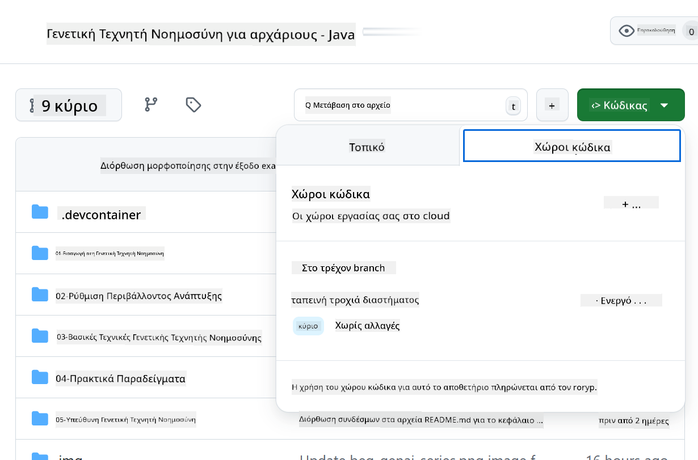

<!--
CO_OP_TRANSLATOR_METADATA:
{
  "original_hash": "bfdb4b4eadbee3a59ef742439f58326a",
  "translation_date": "2025-07-27T13:10:25+00:00",
  "source_file": "02-SetupDevEnvironment/getting-started-azure-openai.md",
  "language_code": "el"
}
-->
# Ρύθμιση του Περιβάλλοντος Ανάπτυξης για το Azure OpenAI

> **Γρήγορη Εκκίνηση**: Αυτός ο οδηγός αφορά τη ρύθμιση του Azure OpenAI. Για άμεση εκκίνηση με δωρεάν μοντέλα, χρησιμοποιήστε [GitHub Models with Codespaces](./README.md#quick-start-cloud).

Αυτός ο οδηγός θα σας βοηθήσει να ρυθμίσετε τα μοντέλα του Azure AI Foundry για τις εφαρμογές Java AI σε αυτό το μάθημα.

## Πίνακας Περιεχομένων

- [Γρήγορη Επισκόπηση Ρύθμισης](../../../02-SetupDevEnvironment)
- [Βήμα 1: Δημιουργία Πόρων Azure AI Foundry](../../../02-SetupDevEnvironment)
  - [Δημιουργία Hub και Project](../../../02-SetupDevEnvironment)
  - [Ανάπτυξη του Μοντέλου GPT-4o-mini](../../../02-SetupDevEnvironment)
- [Βήμα 2: Δημιουργία του Codespace](../../../02-SetupDevEnvironment)
- [Βήμα 3: Ρύθμιση του Περιβάλλοντός σας](../../../02-SetupDevEnvironment)
- [Βήμα 4: Δοκιμή της Ρύθμισης](../../../02-SetupDevEnvironment)
- [Τι Ακολουθεί;](../../../02-SetupDevEnvironment)
- [Πόροι](../../../02-SetupDevEnvironment)
- [Επιπλέον Πόροι](../../../02-SetupDevEnvironment)

## Γρήγορη Επισκόπηση Ρύθμισης

1. Δημιουργήστε πόρους Azure AI Foundry (Hub, Project, Model)
2. Δημιουργήστε ένα Codespace με container ανάπτυξης Java
3. Ρυθμίστε το αρχείο .env με τα διαπιστευτήρια του Azure OpenAI
4. Δοκιμάστε τη ρύθμιση με το παράδειγμα έργου

## Βήμα 1: Δημιουργία Πόρων Azure AI Foundry

### Δημιουργία Hub και Project

1. Μεταβείτε στο [Azure AI Foundry Portal](https://ai.azure.com/) και συνδεθείτε
2. Κάντε κλικ στο **+ Create** → **New hub** (ή πλοηγηθείτε στο **Management** → **All hubs** → **+ New hub**)
3. Ρυθμίστε το hub σας:
   - **Όνομα Hub**: π.χ., "MyAIHub"
   - **Συνδρομή**: Επιλέξτε τη συνδρομή Azure σας
   - **Ομάδα πόρων**: Δημιουργήστε νέα ή επιλέξτε υπάρχουσα
   - **Τοποθεσία**: Επιλέξτε την πλησιέστερη σε εσάς
   - **Λογαριασμός αποθήκευσης**: Χρησιμοποιήστε τον προεπιλεγμένο ή ρυθμίστε προσαρμοσμένο
   - **Key vault**: Χρησιμοποιήστε τον προεπιλεγμένο ή ρυθμίστε προσαρμοσμένο
   - Κάντε κλικ στο **Next** → **Review + create** → **Create**
4. Μόλις δημιουργηθεί, κάντε κλικ στο **+ New project** (ή **Create project** από την επισκόπηση του hub)
   - **Όνομα Project**: π.χ., "GenAIJava"
   - Κάντε κλικ στο **Create**

### Ανάπτυξη του Μοντέλου GPT-4o-mini

1. Στο project σας, μεταβείτε στο **Model catalog** και αναζητήστε το **gpt-4o-mini**
   - *Εναλλακτικά: Μεταβείτε στο **Deployments** → **+ Create deployment***
2. Κάντε κλικ στο **Deploy** στην κάρτα του μοντέλου gpt-4o-mini
3. Ρυθμίστε την ανάπτυξη:
   - **Όνομα Ανάπτυξης**: "gpt-4o-mini"
   - **Έκδοση Μοντέλου**: Χρησιμοποιήστε την τελευταία
   - **Τύπος Ανάπτυξης**: Standard
4. Κάντε κλικ στο **Deploy**
5. Μόλις αναπτυχθεί, μεταβείτε στην καρτέλα **Deployments** και αντιγράψτε τις παρακάτω τιμές:
   - **Όνομα Ανάπτυξης** (π.χ., "gpt-4o-mini")
   - **Target URI** (π.χ., `https://your-hub-name.openai.azure.com/`) 
      > **Σημαντικό**: Αντιγράψτε μόνο το βασικό URL (π.χ., `https://myhub.openai.azure.com/`) και όχι ολόκληρη τη διαδρομή του endpoint.
   - **Κλειδί** (από την ενότητα Keys and Endpoint)

> **Έχετε ακόμα προβλήματα;** Επισκεφθείτε την επίσημη [Τεκμηρίωση Azure AI Foundry](https://learn.microsoft.com/azure/ai-foundry/how-to/create-projects?tabs=ai-foundry&pivots=hub-project)

## Βήμα 2: Δημιουργία του Codespace

1. Κάντε fork αυτό το αποθετήριο στον λογαριασμό σας στο GitHub
   > **Σημείωση**: Αν θέλετε να επεξεργαστείτε τη βασική διαμόρφωση, δείτε τη [Διαμόρφωση Dev Container](../../../.devcontainer/devcontainer.json)
2. Στο αποθετήριο που κάνατε fork, κάντε κλικ στο **Code** → καρτέλα **Codespaces**
3. Κάντε κλικ στο **...** → **New with options...**

4. Επιλέξτε **Διαμόρφωση Dev container**: 
   - **Περιβάλλον Ανάπτυξης Generative AI Java**
5. Κάντε κλικ στο **Create codespace**

## Βήμα 3: Ρύθμιση του Περιβάλλοντός σας

Μόλις το Codespace σας είναι έτοιμο, ρυθμίστε τα διαπιστευτήρια του Azure OpenAI:

1. **Πλοηγηθείτε στο παράδειγμα έργου από τη ρίζα του αποθετηρίου:**
   ```bash
   cd 02-SetupDevEnvironment/examples/basic-chat-azure
   ```

2. **Δημιουργήστε το αρχείο .env:**
   ```bash
   cp .env.example .env
   ```

3. **Επεξεργαστείτε το αρχείο .env με τα διαπιστευτήρια του Azure OpenAI:**
   ```bash
   # Your Azure OpenAI API key (from Azure AI Foundry portal)
   AZURE_AI_KEY=your-actual-api-key-here
   
   # Your Azure OpenAI endpoint URL (e.g., https://myhub.openai.azure.com/)
   AZURE_AI_ENDPOINT=https://your-hub-name.openai.azure.com/
   ```

   > **Σημείωση Ασφαλείας**: 
   > - Μην δεσμεύετε ποτέ το αρχείο `.env` στον έλεγχο εκδόσεων
   > - Το αρχείο `.env` περιλαμβάνεται ήδη στο `.gitignore`
   > - Διατηρήστε τα API keys σας ασφαλή και ανανεώστε τα τακτικά

## Βήμα 4: Δοκιμή της Ρύθμισης

Εκτελέστε την εφαρμογή παραδείγματος για να δοκιμάσετε τη σύνδεση με το Azure OpenAI:

```bash
mvn clean spring-boot:run
```

Θα πρέπει να δείτε μια απάντηση από το μοντέλο GPT-4o-mini!

> **Χρήστες VS Code**: Μπορείτε επίσης να πατήσετε `F5` στο VS Code για να εκτελέσετε την εφαρμογή. Η διαμόρφωση εκκίνησης έχει ήδη ρυθμιστεί ώστε να φορτώνει αυτόματα το αρχείο `.env`.

> **Πλήρες Παράδειγμα**: Δείτε το [Παράδειγμα End-to-End Azure OpenAI](./examples/basic-chat-azure/README.md) για λεπτομερείς οδηγίες και αντιμετώπιση προβλημάτων.

## Τι Ακολουθεί;

**Η Ρύθμιση Ολοκληρώθηκε!** Τώρα έχετε:
- Azure OpenAI με gpt-4o-mini αναπτυγμένο
- Τοπική διαμόρφωση αρχείου .env
- Έτοιμο περιβάλλον ανάπτυξης Java

**Συνεχίστε στο** [Κεφάλαιο 3: Βασικές Τεχνικές Generative AI](../03-CoreGenerativeAITechniques/README.md) για να ξεκινήσετε την ανάπτυξη εφαρμογών AI!

## Πόροι

- [Τεκμηρίωση Azure AI Foundry](https://learn.microsoft.com/azure/ai-services/)
- [Τεκμηρίωση Spring AI Azure OpenAI](https://docs.spring.io/spring-ai/reference/api/clients/azure-openai-chat.html)
- [Azure OpenAI Java SDK](https://learn.microsoft.com/java/api/overview/azure/ai-openai-readme)

## Επιπλέον Πόροι

- [Κατεβάστε το VS Code](https://code.visualstudio.com/Download)
- [Αποκτήστε το Docker Desktop](https://www.docker.com/products/docker-desktop)
- [Διαμόρφωση Dev Container](../../../.devcontainer/devcontainer.json)

**Αποποίηση ευθύνης**:  
Αυτό το έγγραφο έχει μεταφραστεί χρησιμοποιώντας την υπηρεσία αυτόματης μετάφρασης [Co-op Translator](https://github.com/Azure/co-op-translator). Παρόλο που καταβάλλουμε προσπάθειες για ακρίβεια, παρακαλούμε να έχετε υπόψη ότι οι αυτοματοποιημένες μεταφράσεις ενδέχεται να περιέχουν σφάλματα ή ανακρίβειες. Το πρωτότυπο έγγραφο στη μητρική του γλώσσα θα πρέπει να θεωρείται η αυθεντική πηγή. Για κρίσιμες πληροφορίες, συνιστάται επαγγελματική ανθρώπινη μετάφραση. Δεν φέρουμε ευθύνη για τυχόν παρεξηγήσεις ή εσφαλμένες ερμηνείες που προκύπτουν από τη χρήση αυτής της μετάφρασης.