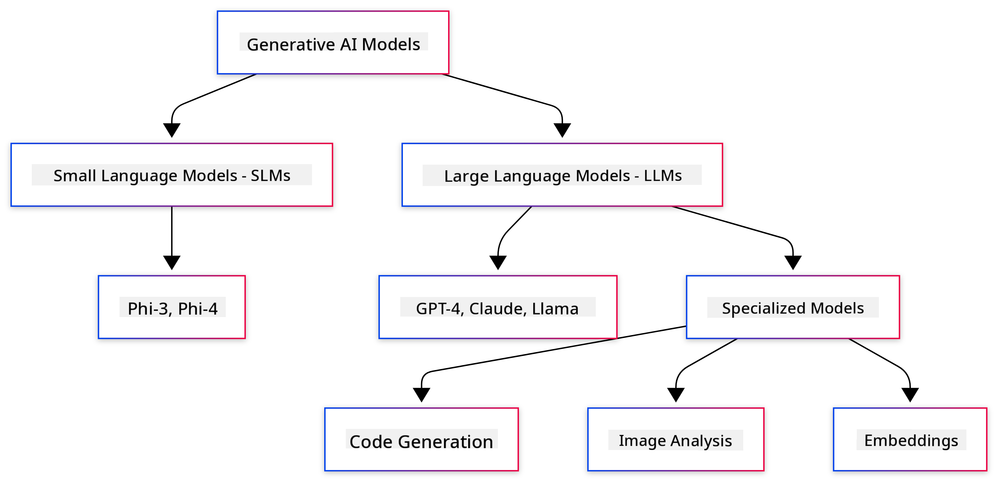
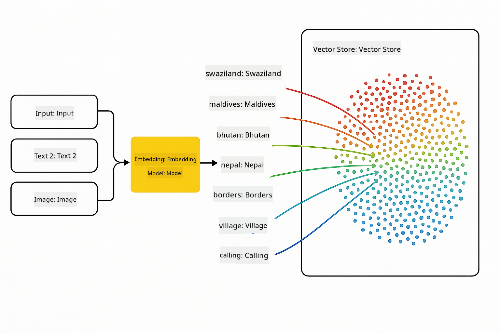
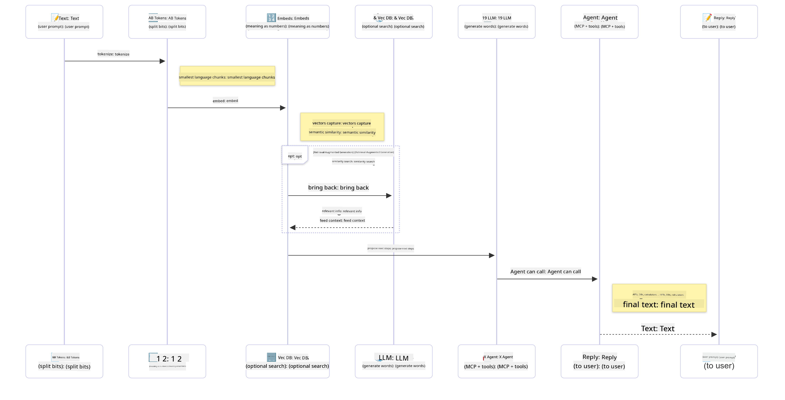

<!--
CO_OP_TRANSLATOR_METADATA:
{
  "original_hash": "006866db93a268a8769bb55f2e324291",
  "translation_date": "2025-07-28T10:12:51+00:00",
  "source_file": "01-IntroToGenAI/README.md",
  "language_code": "en"
}
-->
# Introduction to Generative AI - Java Edition

## What You'll Learn

- **The basics of Generative AI**, including LLMs, prompt engineering, tokens, embeddings, and vector databases
- **Comparison of Java AI development tools**, such as Azure OpenAI SDK, Spring AI, and OpenAI Java SDK
- **Understanding the Model Context Protocol** and its importance in AI agent communication

## Table of Contents

- [Introduction](../../../01-IntroToGenAI)
- [A quick refresh on Generative AI concepts](../../../01-IntroToGenAI)
- [Prompt engineering review](../../../01-IntroToGenAI)
- [Tokens, embeddings, and agents](../../../01-IntroToGenAI)
- [AI Development Tools and Libraries for Java](../../../01-IntroToGenAI)
  - [OpenAI Java SDK](../../../01-IntroToGenAI)
  - [Spring AI](../../../01-IntroToGenAI)
  - [Azure OpenAI Java SDK](../../../01-IntroToGenAI)
- [Summary](../../../01-IntroToGenAI)
- [Next Steps](../../../01-IntroToGenAI)

## Introduction

Welcome to the first chapter of Generative AI for Beginners - Java Edition! This introductory lesson will familiarize you with the foundational concepts of generative AI and how to work with them using Java. You'll explore the essential components of AI applications, such as Large Language Models (LLMs), tokens, embeddings, and AI agents. Additionally, we'll introduce the primary Java tools you'll use throughout this course.

### A quick refresh on Generative AI concepts

Generative AI refers to a type of artificial intelligence that can create new content—like text, images, or code—by learning patterns and relationships from data. These models can generate human-like responses, understand context, and even produce content that feels authentic.

When building Java AI applications, you'll use **generative AI models** to create content. Some of the capabilities of these models include:

- **Text Generation**: Producing human-like text for chatbots, content creation, or text completion.
- **Image Generation and Analysis**: Creating realistic images, enhancing photos, or identifying objects.
- **Code Generation**: Writing code snippets or scripts.

Different models are optimized for specific tasks. For instance, **Small Language Models (SLMs)** and **Large Language Models (LLMs)** are both used for text generation, but LLMs generally perform better on complex tasks. For image-related tasks, specialized vision models or multi-modal models are used.

Of course, these models aren't perfect and can sometimes "hallucinate" or generate incorrect information confidently. You can improve their responses by providing clear instructions and context, which is where **prompt engineering** comes into play.

#### Prompt engineering review

Prompt engineering involves crafting effective inputs to guide AI models toward the desired outputs. It focuses on:

- **Clarity**: Ensuring instructions are clear and unambiguous.
- **Context**: Providing relevant background information.
- **Constraints**: Defining any limitations or formats.

Best practices for prompt engineering include designing prompts carefully, giving clear instructions, breaking tasks into smaller steps, using one-shot or few-shot learning, and tuning prompts. Testing different prompts is key to finding the best approach for your specific use case.

When building applications, you'll work with different types of prompts:
- **System prompts**: Define the base rules and context for the model's behavior.
- **User prompts**: Represent input data from your application's users.
- **Assistant prompts**: Reflect the model's responses based on system and user prompts.

> **Learn more**: Check out the [Prompt Engineering chapter of the GenAI for Beginners course](https://github.com/microsoft/generative-ai-for-beginners/tree/main/04-prompt-engineering-fundamentals) for more details.

#### Tokens, embeddings, and agents

When working with generative AI models, you'll encounter terms like **tokens**, **embeddings**, **agents**, and **Model Context Protocol (MCP)**. Here's a closer look at these concepts:

- **Tokens**: Tokens are the smallest units of text that a model processes. They can be words, characters, or subwords. Tokens represent text data in a format the model can understand. For example, the sentence "The quick brown fox jumped over the lazy dog" might be tokenized as ["The", " quick", " brown", " fox", " jumped", " over", " the", " lazy", " dog"] or ["The", " qu", "ick", " br", "own", " fox", " jump", "ed", " over", " the", " la", "zy", " dog"], depending on the tokenization strategy.

Tokenization is the process of breaking text into these smaller units. Models operate on tokens rather than raw text, and the number of tokens in a prompt affects the model's response length and quality. Models have token limits for their context window (e.g., GPT-4o supports up to 128K tokens, including input and output).

  In Java, libraries like the OpenAI SDK can handle tokenization automatically when sending requests to AI models.

- **Embeddings**: Embeddings are vector representations of tokens that capture their semantic meaning. These numerical representations (usually arrays of floating-point numbers) help models understand relationships between words and generate contextually relevant responses. Words with similar meanings have similar embeddings, enabling the model to grasp concepts like synonyms and semantic relationships.

  In Java, you can generate embeddings using the OpenAI SDK or other libraries. Embeddings are crucial for tasks like semantic search, where you want to find similar content based on meaning rather than exact text matches.

- **Vector databases**: Vector databases are specialized storage systems optimized for embeddings. They enable efficient similarity searches and are essential for Retrieval-Augmented Generation (RAG) patterns, where you retrieve relevant information from large datasets based on semantic similarity.

> **Note**: While this course doesn't cover vector databases in detail, they are worth mentioning as they are commonly used in real-world applications.

- **Agents & MCP**: Agents are AI components that autonomously interact with models, tools, and external systems. The Model Context Protocol (MCP) provides a standardized way for agents to securely access external data sources and tools. Learn more in our [MCP for Beginners](https://github.com/microsoft/mcp-for-beginners) course.

In Java AI applications, you'll use tokens for text processing, embeddings for semantic search and RAG, vector databases for data retrieval, and agents with MCP to build intelligent systems that can use external tools.

### AI Development Tools and Libraries for Java

Java provides excellent tools for AI development. In this course, we'll explore three main libraries: OpenAI Java SDK, Azure OpenAI SDK, and Spring AI.

Here's a quick reference table showing which SDK is used in each chapter's examples:

| Chapter | Sample | SDK |
|---------|--------|-----|
| 02-SetupDevEnvironment | github-models | OpenAI Java SDK |
| 02-SetupDevEnvironment | basic-chat-azure | Spring AI Azure OpenAI |
| 03-CoreGenerativeAITechniques | examples | Azure OpenAI SDK |
| 04-PracticalSamples | petstory | OpenAI Java SDK |
| 04-PracticalSamples | foundrylocal | OpenAI Java SDK |
| 04-PracticalSamples | calculator | Spring AI MCP SDK + LangChain4j |

**SDK Documentation Links:**
- [Azure OpenAI Java SDK](https://github.com/Azure/azure-sdk-for-java/tree/azure-ai-openai_1.0.0-beta.16/sdk/openai/azure-ai-openai)
- [Spring AI](https://docs.spring.io/spring-ai/reference/)
- [OpenAI Java SDK](https://github.com/openai/openai-java)
- [LangChain4j](https://docs.langchain4j.dev/)

#### OpenAI Java SDK

The OpenAI SDK is the official Java library for the OpenAI API. It provides a simple and consistent interface for interacting with OpenAI's models, making it easy to integrate AI capabilities into Java applications. Chapter 2's GitHub Models example, Chapter 4's Pet Story application, and Foundry Local example demonstrate the OpenAI SDK approach.

#### Spring AI

Spring AI is a comprehensive framework that brings AI capabilities to Spring applications, providing a consistent abstraction layer across different AI providers. It integrates seamlessly with the Spring ecosystem, making it the ideal choice for enterprise Java applications that need AI capabilities.

Spring AI's strength lies in its seamless integration with the Spring ecosystem, making it easy to build production-ready AI applications with familiar Spring patterns like dependency injection, configuration management, and testing frameworks. You'll use Spring AI in Chapters 2 and 4 to build applications that leverage both OpenAI and the Model Context Protocol (MCP) Spring AI libraries.

##### Model Context Protocol (MCP)

The [Model Context Protocol (MCP)](https://modelcontextprotocol.io/) is an emerging standard that enables AI applications to interact securely with external data sources and tools. MCP provides a standardized way for AI models to access contextual information and execute actions in your applications.

In Chapter 4, you'll build a simple MCP calculator service that demonstrates the fundamentals of Model Context Protocol with Spring AI, showing how to create basic tool integrations and service architectures.

#### Azure OpenAI Java SDK

The Azure OpenAI client library for Java is an adaptation of OpenAI's REST APIs that provides an idiomatic interface and integration with the rest of the Azure SDK ecosystem. In Chapter 3, you'll build applications using the Azure OpenAI SDK, including chat applications, function calling, and RAG (Retrieval-Augmented Generation) patterns.

> Note: The Azure OpenAI SDK lags behind the OpenAI Java SDK in terms of features, so for future projects, consider using the OpenAI Java SDK.

## Summary

**Congratulations!** You have successfully:

- **Learned about Generative AI fundamentals**, including LLMs, prompt engineering, tokens, embeddings, and vector databases
- **Compared Java AI development tools**, such as Azure OpenAI SDK, Spring AI, and OpenAI Java SDK
- **Discovered the Model Context Protocol** and its role in AI agent communication

## Next Steps

[Chapter 2: Setting Up the Development Environment](../02-SetupDevEnvironment/README.md)

**Disclaimer**:  
This document has been translated using the AI translation service [Co-op Translator](https://github.com/Azure/co-op-translator). While we aim for accuracy, please note that automated translations may include errors or inaccuracies. The original document in its native language should be regarded as the authoritative source. For critical information, professional human translation is advised. We are not responsible for any misunderstandings or misinterpretations resulting from the use of this translation.