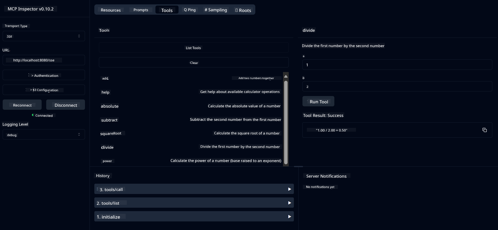

<!--
CO_OP_TRANSLATOR_METADATA:
{
  "original_hash": "7bf9a4a832911269a8bd0decb97ff36c",
  "translation_date": "2025-07-21T21:26:17+00:00",
  "source_file": "04-PracticalSamples/mcp/calculator/README.md",
  "language_code": "en"
}
-->
# Basic Calculator MCP Service

>**Note**: This chapter includes a [**Tutorial**](./TUTORIAL.md) that walks you through running the completed examples.

Welcome to your first hands-on experience with the **Model Context Protocol (MCP)**! In the previous chapters, you learned the basics of generative AI and set up your development environment. Now it's time to create something practical.

This calculator service demonstrates how AI models can securely interact with external tools using MCP. Instead of relying on the AI model's sometimes unreliable math skills, we'll show you how to build a reliable system where AI can call specialized services for accurate calculations.

## Table of Contents

- [What You'll Learn](../../../../../04-PracticalSamples/mcp/calculator)
- [Prerequisites](../../../../../04-PracticalSamples/mcp/calculator)
- [Key Concepts](../../../../../04-PracticalSamples/mcp/calculator)
- [Quick Start](../../../../../04-PracticalSamples/mcp/calculator)
- [Available Calculator Operations](../../../../../04-PracticalSamples/mcp/calculator)
- [Test Clients](../../../../../04-PracticalSamples/mcp/calculator)
  - [1. Direct MCP Client (SDKClient)](../../../../../04-PracticalSamples/mcp/calculator)
  - [2. AI-Powered Client (LangChain4jClient)](../../../../../04-PracticalSamples/mcp/calculator)
- [MCP Inspector (Web UI)](../../../../../04-PracticalSamples/mcp/calculator)
  - [Step-by-Step Instructions](../../../../../04-PracticalSamples/mcp/calculator)

## What You'll Learn

By working through this example, you'll gain an understanding of:
- How to create MCP-compatible services using Spring Boot
- The difference between direct protocol communication and AI-powered interaction
- How AI models decide when and how to use external tools
- Best practices for building AI applications with tool integrations

This is perfect for beginners who are learning MCP concepts and are ready to build their first AI tool integration!

## Prerequisites

- Java 21+
- Maven 3.6+
- **GitHub Token**: Required for the AI-powered client. If you haven't set this up yet, refer to [Chapter 2: Setting up your development environment](../../../02-SetupDevEnvironment/README.md) for instructions.

## Key Concepts

**Model Context Protocol (MCP)** is a standardized way for AI applications to securely connect to external tools. Think of it as a "bridge" that allows AI models to use external services like our calculator. Instead of the AI model attempting to perform calculations itself (which can be unreliable), it can call our calculator service to get accurate results. MCP ensures this communication happens safely and consistently.

**Server-Sent Events (SSE)** enables real-time communication between the server and clients. Unlike traditional HTTP requests where you send a request and wait for a response, SSE allows the server to continuously send updates to the client. This is ideal for AI applications where responses might be streamed or take time to process.

**AI Tools & Function Calling** allow AI models to automatically select and use external functions (like calculator operations) based on user requests. For example, if you ask "What's 15 + 27?", the AI model understands you want addition, automatically calls the `add` tool with the correct parameters (15, 27), and returns the result in natural language. The AI acts as an intelligent coordinator that knows when and how to use each tool.

## Quick Start

### 1. Navigate to the calculator application directory
```bash
cd Generative-AI-for-beginners-java/04-PracticalSamples/mcp/calculator
```

### 2. Build & Run
```bash
mvn clean install -DskipTests
java -jar target/calculator-server-0.0.1-SNAPSHOT.jar
```

### 2. Test with Clients
- **SDKClient**: Direct MCP protocol interaction
- **LangChain4jClient**: AI-powered natural language interaction (requires GitHub token)

## Available Calculator Operations

- `add(a, b)`, `subtract(a, b)`, `multiply(a, b)`, `divide(a, b)`
- `power(base, exponent)`, `squareRoot(number)`, `absolute(number)`
- `modulus(a, b)`, `help()`

## Test Clients

### 1. Direct MCP Client (SDKClient)
Tests raw MCP protocol communication. Run with:
```bash
mvn test-compile exec:java -Dexec.mainClass="com.microsoft.mcp.sample.client.SDKClient" -Dexec.classpathScope=test
```

### 2. AI-Powered Client (LangChain4jClient)
Demonstrates natural language interaction with GitHub Models. Requires GitHub token (see [Prerequisites](../../../../../04-PracticalSamples/mcp/calculator)).

**Run:**
```bash
mvn test-compile exec:java -Dexec.mainClass="com.microsoft.mcp.sample.client.LangChain4jClient" -Dexec.classpathScope=test
```

## MCP Inspector (Web UI)

MCP Inspector provides a visual web interface to test your MCP service without writing code. It's a great way for beginners to understand how MCP works!

### Step-by-Step Instructions:

1. **Start the calculator server** (if not already running):
   ```bash
   java -jar target/calculator-server-0.0.1-SNAPSHOT.jar
   ```

2. **Install and run MCP Inspector** in a new terminal:
   ```bash
   npx @modelcontextprotocol/inspector
   ```

3. **Open the web interface**:
   - Look for a message like "Inspector running at http://localhost:6274"
   - Open that URL in your web browser

4. **Connect to your calculator service**:
   - In the web interface, set the transport type to "SSE"
   - Set the URL to: `http://localhost:8080/sse`
   - Click the "Connect" button

5. **Explore available tools**:
   - Click "List Tools" to see all calculator operations
   - You'll see functions like `add`, `subtract`, `multiply`, etc.

6. **Test a calculator operation**:
   - Select a tool (e.g., "add")
   - Enter parameters (e.g., `a: 15`, `b: 27`)
   - Click "Run Tool"
   - See the result returned by your MCP service!

This visual approach helps you understand exactly how MCP communication works before building your own clients.



---
**Reference:** [MCP Server Boot Starter Docs](https://docs.spring.io/spring-ai/reference/api/mcp/mcp-server-boot-starter-docs.html)

**Disclaimer**:  
This document has been translated using the AI translation service [Co-op Translator](https://github.com/Azure/co-op-translator). While we aim for accuracy, please note that automated translations may include errors or inaccuracies. The original document in its native language should be regarded as the authoritative source. For critical information, professional human translation is advised. We are not responsible for any misunderstandings or misinterpretations resulting from the use of this translation.