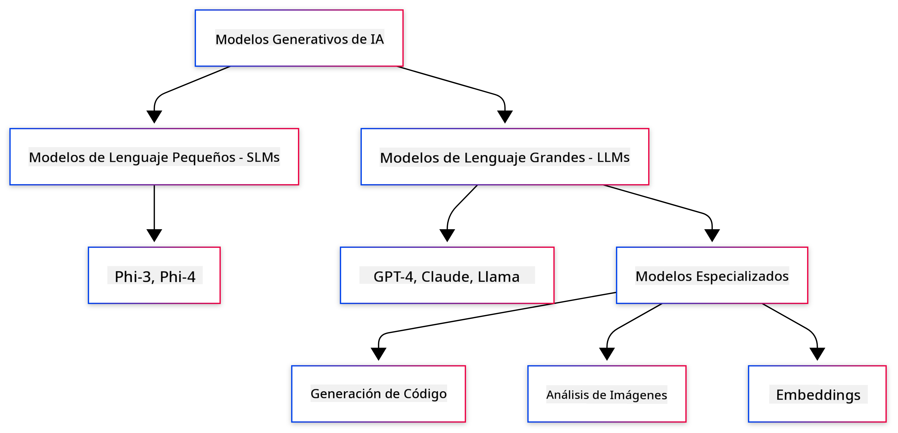
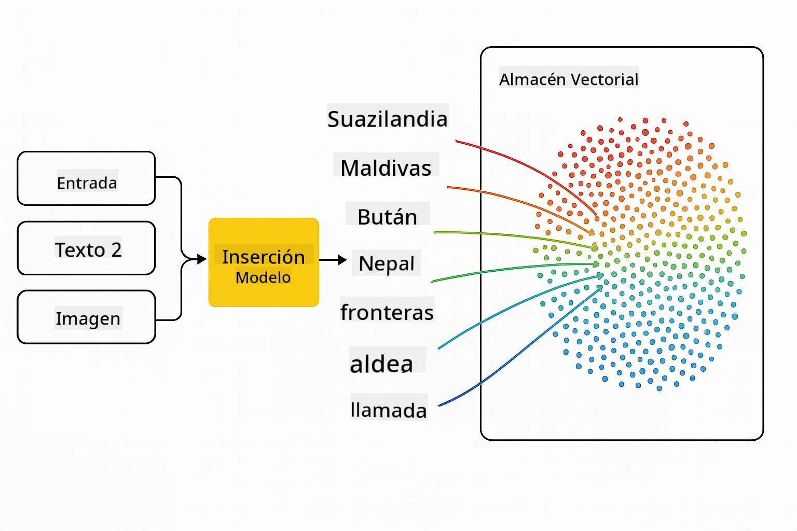
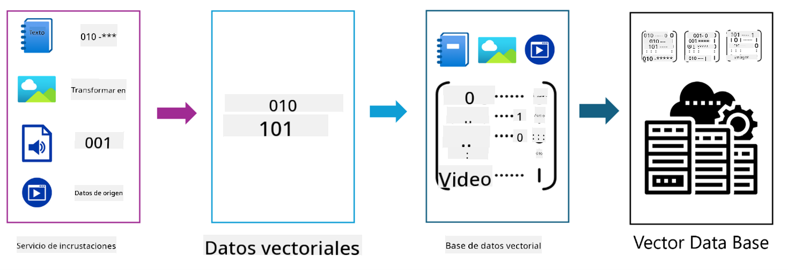
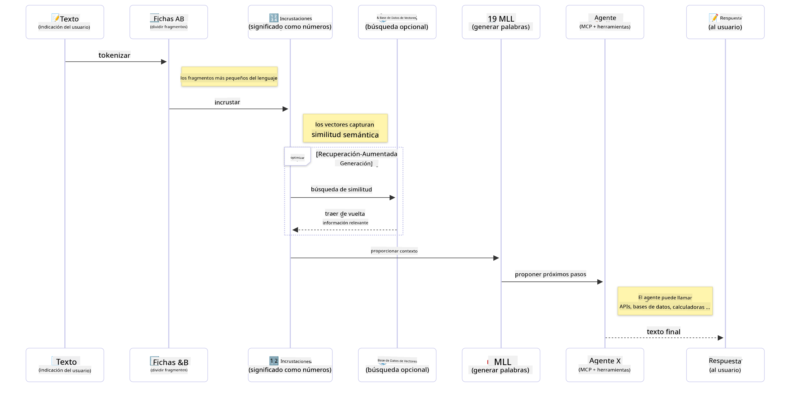

<!--
CO_OP_TRANSLATOR_METADATA:
{
  "original_hash": "75bfb080ca725e8a9aa9c80cae25fba1",
  "translation_date": "2025-07-29T07:59:30+00:00",
  "source_file": "01-IntroToGenAI/README.md",
  "language_code": "es"
}
-->
# Introducción a la IA Generativa - Edición Java

## Lo que aprenderás

- **Fundamentos de la IA generativa**, incluyendo LLMs, ingeniería de prompts, tokens, embeddings y bases de datos vectoriales.
- **Comparar herramientas de desarrollo de IA en Java**, como Azure OpenAI SDK, Spring AI y OpenAI Java SDK.
- **Descubrir el Protocolo de Contexto del Modelo** y su papel en la comunicación de agentes de IA.

## Tabla de Contenidos

- [Introducción](../../../01-IntroToGenAI)
- [Un repaso rápido a los conceptos de IA generativa](../../../01-IntroToGenAI)
- [Revisión de ingeniería de prompts](../../../01-IntroToGenAI)
- [Tokens, embeddings y agentes](../../../01-IntroToGenAI)
- [Herramientas y bibliotecas de desarrollo de IA para Java](../../../01-IntroToGenAI)
  - [OpenAI Java SDK](../../../01-IntroToGenAI)
  - [Spring AI](../../../01-IntroToGenAI)
  - [Azure OpenAI Java SDK](../../../01-IntroToGenAI)
- [Resumen](../../../01-IntroToGenAI)
- [Próximos pasos](../../../01-IntroToGenAI)

## Introducción

¡Bienvenido al primer capítulo de IA Generativa para Principiantes - Edición Java! Esta lección introductoria te presenta los conceptos básicos de la IA generativa y cómo trabajar con ellos utilizando Java. Aprenderás sobre los bloques fundamentales de las aplicaciones de IA, incluyendo Modelos de Lenguaje Extenso (LLMs), tokens, embeddings y agentes de IA. También exploraremos las principales herramientas de Java que utilizarás a lo largo de este curso.

### Un repaso rápido a los conceptos de IA generativa

La IA generativa es un tipo de inteligencia artificial que crea contenido nuevo, como texto, imágenes o código, basado en patrones y relaciones aprendidas de los datos. Los modelos de IA generativa pueden generar respuestas similares a las humanas, comprender el contexto e incluso crear contenido que parece humano.

Al desarrollar tus aplicaciones de IA en Java, trabajarás con **modelos de IA generativa** para crear contenido. Algunas capacidades de los modelos de IA generativa incluyen:

- **Generación de texto**: Crear texto similar al humano para chatbots, contenido y finalización de texto.
- **Generación y análisis de imágenes**: Producir imágenes realistas, mejorar fotos y detectar objetos.
- **Generación de código**: Escribir fragmentos de código o scripts.

Existen tipos específicos de modelos optimizados para diferentes tareas. Por ejemplo, tanto los **Modelos de Lenguaje Pequeño (SLMs)** como los **Modelos de Lenguaje Extenso (LLMs)** pueden manejar la generación de texto, siendo los LLMs generalmente más efectivos para tareas complejas. Para tareas relacionadas con imágenes, se utilizan modelos de visión especializados o modelos multimodales.

Por supuesto, las respuestas de estos modelos no siempre son perfectas. Probablemente hayas escuchado que los modelos "alucinan" o generan información incorrecta de manera autoritaria. Sin embargo, puedes ayudar a guiar al modelo para que genere mejores respuestas proporcionándole instrucciones claras y contexto. Aquí es donde entra en juego la **ingeniería de prompts**.

#### Revisión de ingeniería de prompts

La ingeniería de prompts es la práctica de diseñar entradas efectivas para guiar a los modelos de IA hacia los resultados deseados. Esto implica:

- **Claridad**: Hacer que las instrucciones sean claras y sin ambigüedades.
- **Contexto**: Proporcionar la información de fondo necesaria.
- **Restricciones**: Especificar cualquier limitación o formato.

Algunas de las mejores prácticas para la ingeniería de prompts incluyen el diseño de prompts, instrucciones claras, descomposición de tareas, aprendizaje de un solo ejemplo (one-shot) y de pocos ejemplos (few-shot), y ajuste de prompts. Probar diferentes prompts es esencial para encontrar lo que funciona mejor para tu caso de uso específico.

Al desarrollar aplicaciones, trabajarás con diferentes tipos de prompts:
- **Prompts del sistema**: Establecen las reglas base y el contexto para el comportamiento del modelo.
- **Prompts del usuario**: Los datos de entrada de los usuarios de tu aplicación.
- **Prompts del asistente**: Las respuestas del modelo basadas en los prompts del sistema y del usuario.

> **Aprende más**: Aprende más sobre ingeniería de prompts en el [capítulo de Ingeniería de Prompts del curso GenAI para Principiantes](https://github.com/microsoft/generative-ai-for-beginners/tree/main/04-prompt-engineering-fundamentals)

#### Tokens, embeddings y agentes

Al trabajar con modelos de IA generativa, encontrarás términos como **tokens**, **embeddings**, **agentes** y **Protocolo de Contexto del Modelo (MCP)**. Aquí tienes una descripción detallada de estos conceptos:

- **Tokens**: Los tokens son la unidad más pequeña de texto en un modelo. Pueden ser palabras, caracteres o subpalabras. Los tokens se utilizan para representar datos de texto en un formato que el modelo puede entender. Por ejemplo, la frase "El rápido zorro marrón saltó sobre el perro perezoso" podría tokenizarse como ["El", " rápido", " zorro", " marrón", " saltó", " sobre", " el", " perro", " perezoso"] o ["El", " rá", "pi", "do", " zo", "rro", " ma", "rrón", " sal", "tó", " so", "bre", " el", " pe", "rro", " pe", "re", "zo", "so"] dependiendo de la estrategia de tokenización.

La tokenización es el proceso de dividir el texto en estas unidades más pequeñas. Esto es crucial porque los modelos operan sobre tokens en lugar de texto sin procesar. El número de tokens en un prompt afecta la longitud y calidad de la respuesta del modelo, ya que los modelos tienen límites de tokens para su ventana de contexto (por ejemplo, 128K tokens para el contexto total de GPT-4o, incluyendo entrada y salida).

En Java, puedes usar bibliotecas como el OpenAI SDK para manejar la tokenización automáticamente al enviar solicitudes a los modelos de IA.

- **Embeddings**: Los embeddings son representaciones vectoriales de tokens que capturan el significado semántico. Son representaciones numéricas (típicamente matrices de números de punto flotante) que permiten a los modelos entender las relaciones entre palabras y generar respuestas contextualmente relevantes. Las palabras similares tienen embeddings similares, lo que permite al modelo entender conceptos como sinónimos y relaciones semánticas.

En Java, puedes generar embeddings utilizando el OpenAI SDK u otras bibliotecas que admitan la generación de embeddings. Estos embeddings son esenciales para tareas como la búsqueda semántica, donde deseas encontrar contenido similar basado en el significado en lugar de coincidencias exactas de texto.

- **Bases de datos vectoriales**: Las bases de datos vectoriales son sistemas de almacenamiento especializados optimizados para embeddings. Permiten búsquedas de similitud eficientes y son cruciales para patrones de Generación Aumentada por Recuperación (RAG), donde necesitas encontrar información relevante de grandes conjuntos de datos basados en similitud semántica en lugar de coincidencias exactas.

> **Nota**: En este curso, no cubriremos las bases de datos vectoriales, pero creemos que vale la pena mencionarlas ya que se usan comúnmente en aplicaciones del mundo real.

- **Agentes y MCP**: Componentes de IA que interactúan de forma autónoma con modelos, herramientas y sistemas externos. El Protocolo de Contexto del Modelo (MCP) proporciona una forma estandarizada para que los agentes accedan de manera segura a fuentes de datos externas y herramientas. Aprende más en nuestro curso [MCP para Principiantes](https://github.com/microsoft/mcp-for-beginners).

En las aplicaciones de IA en Java, usarás tokens para el procesamiento de texto, embeddings para la búsqueda semántica y RAG, bases de datos vectoriales para la recuperación de datos, y agentes con MCP para construir sistemas inteligentes que utilicen herramientas.

### Herramientas y bibliotecas de desarrollo de IA para Java

Java ofrece excelentes herramientas para el desarrollo de IA. Hay tres bibliotecas principales que exploraremos a lo largo de este curso: OpenAI Java SDK, Azure OpenAI SDK y Spring AI.

Aquí tienes una tabla de referencia rápida que muestra qué SDK se utiliza en los ejemplos de cada capítulo:

| Capítulo | Ejemplo | SDK |
|----------|---------|-----|
| 02-SetupDevEnvironment | github-models | OpenAI Java SDK |
| 02-SetupDevEnvironment | basic-chat-azure | Spring AI Azure OpenAI |
| 03-CoreGenerativeAITechniques | ejemplos | Azure OpenAI SDK |
| 04-PracticalSamples | petstory | OpenAI Java SDK |
| 04-PracticalSamples | foundrylocal | OpenAI Java SDK |
| 04-PracticalSamples | calculator | Spring AI MCP SDK + LangChain4j |

**Enlaces a la documentación de los SDK:**
- [Azure OpenAI Java SDK](https://github.com/Azure/azure-sdk-for-java/tree/azure-ai-openai_1.0.0-beta.16/sdk/openai/azure-ai-openai)
- [Spring AI](https://docs.spring.io/spring-ai/reference/)
- [OpenAI Java SDK](https://github.com/openai/openai-java)
- [LangChain4j](https://docs.langchain4j.dev/)

#### OpenAI Java SDK

El OpenAI SDK es la biblioteca oficial de Java para la API de OpenAI. Proporciona una interfaz simple y consistente para interactuar con los modelos de OpenAI, lo que facilita la integración de capacidades de IA en aplicaciones Java. El ejemplo de GitHub Models del Capítulo 2, la aplicación Pet Story del Capítulo 4 y el ejemplo Foundry Local demuestran el enfoque del OpenAI SDK.

#### Spring AI

Spring AI es un marco integral que lleva capacidades de IA a las aplicaciones Spring, proporcionando una capa de abstracción consistente entre diferentes proveedores de IA. Se integra perfectamente con el ecosistema Spring, lo que lo convierte en la opción ideal para aplicaciones empresariales Java que necesitan capacidades de IA.

La fortaleza de Spring AI radica en su integración fluida con el ecosistema Spring, lo que facilita la creación de aplicaciones de IA listas para producción con patrones familiares de Spring como inyección de dependencias, gestión de configuración y marcos de prueba. Utilizarás Spring AI en los Capítulos 2 y 4 para construir aplicaciones que aprovechen tanto OpenAI como las bibliotecas Spring AI del Protocolo de Contexto del Modelo (MCP).

##### Protocolo de Contexto del Modelo (MCP)

El [Protocolo de Contexto del Modelo (MCP)](https://modelcontextprotocol.io/) es un estándar emergente que permite a las aplicaciones de IA interactuar de manera segura con fuentes de datos externas y herramientas. MCP proporciona una forma estandarizada para que los modelos de IA accedan a información contextual y ejecuten acciones en tus aplicaciones.

En el Capítulo 4, construirás un servicio de calculadora MCP simple que demuestra los fundamentos del Protocolo de Contexto del Modelo con Spring AI, mostrando cómo crear integraciones básicas de herramientas y arquitecturas de servicio.

#### Azure OpenAI Java SDK

La biblioteca cliente de Azure OpenAI para Java es una adaptación de las APIs REST de OpenAI que proporciona una interfaz idiomática e integración con el resto del ecosistema de Azure SDK. En el Capítulo 3, construirás aplicaciones utilizando el Azure OpenAI SDK, incluyendo aplicaciones de chat, llamadas a funciones y patrones de Generación Aumentada por Recuperación (RAG).

> Nota: El Azure OpenAI SDK está rezagado en comparación con el OpenAI Java SDK en términos de características, por lo que para proyectos futuros, considera usar el OpenAI Java SDK.

## Resumen

¡Eso concluye las bases! Ahora entiendes:

- Los conceptos clave detrás de la IA generativa: desde LLMs e ingeniería de prompts hasta tokens, embeddings y bases de datos vectoriales.
- Tus opciones de herramientas para el desarrollo de IA en Java: Azure OpenAI SDK, Spring AI y OpenAI Java SDK.
- Qué es el Protocolo de Contexto del Modelo y cómo permite a los agentes de IA trabajar con herramientas externas.

## Próximos pasos

[Capítulo 2: Configuración del Entorno de Desarrollo](../02-SetupDevEnvironment/README.md)

**Descargo de responsabilidad**:  
Este documento ha sido traducido utilizando el servicio de traducción automática [Co-op Translator](https://github.com/Azure/co-op-translator). Si bien nos esforzamos por lograr precisión, tenga en cuenta que las traducciones automáticas pueden contener errores o imprecisiones. El documento original en su idioma nativo debe considerarse como la fuente autorizada. Para información crítica, se recomienda una traducción profesional realizada por humanos. No nos hacemos responsables de malentendidos o interpretaciones erróneas que puedan surgir del uso de esta traducción.