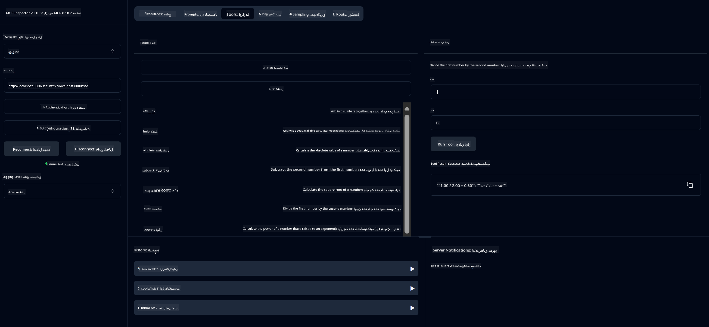

<!--
CO_OP_TRANSLATOR_METADATA:
{
  "original_hash": "5bd7a347d6ed1d706443f9129dd29dd9",
  "translation_date": "2025-07-25T08:51:36+00:00",
  "source_file": "04-PracticalSamples/mcp/calculator/README.md",
  "language_code": "fa"
}
-->
# سرویس ماشین حساب MCP

>**توجه**: این فصل شامل یک [**آموزش**](./TUTORIAL.md) است که شما را در استفاده از نمونه‌ها راهنمایی می‌کند.

به اولین تجربه عملی خود با **پروتکل زمینه مدل (MCP)** خوش آمدید! در فصل‌های قبلی، شما اصول هوش مصنوعی مولد را یاد گرفتید و محیط توسعه خود را تنظیم کردید. اکنون زمان آن رسیده است که چیزی کاربردی بسازید.

این سرویس ماشین حساب نشان می‌دهد که چگونه مدل‌های هوش مصنوعی می‌توانند به صورت امن با ابزارهای خارجی از طریق MCP تعامل داشته باشند. به جای تکیه بر توانایی‌های ریاضی گاهی غیرقابل اعتماد مدل هوش مصنوعی، ما نشان می‌دهیم که چگونه می‌توان سیستمی قوی ساخت که در آن هوش مصنوعی بتواند برای محاسبات دقیق، خدمات تخصصی را فراخوانی کند.

## فهرست مطالب

- [آنچه یاد خواهید گرفت](../../../../../04-PracticalSamples/mcp/calculator)
- [پیش‌نیازها](../../../../../04-PracticalSamples/mcp/calculator)
- [مفاهیم کلیدی](../../../../../04-PracticalSamples/mcp/calculator)
- [شروع سریع](../../../../../04-PracticalSamples/mcp/calculator)
- [عملیات موجود ماشین حساب](../../../../../04-PracticalSamples/mcp/calculator)
- [کلاینت‌های تست](../../../../../04-PracticalSamples/mcp/calculator)
  - [1. کلاینت مستقیم MCP (SDKClient)](../../../../../04-PracticalSamples/mcp/calculator)
  - [2. کلاینت مبتنی بر هوش مصنوعی (LangChain4jClient)](../../../../../04-PracticalSamples/mcp/calculator)
- [بازرس MCP (رابط وب)](../../../../../04-PracticalSamples/mcp/calculator)
  - [دستورالعمل‌های گام‌به‌گام](../../../../../04-PracticalSamples/mcp/calculator)

## آنچه یاد خواهید گرفت

با کار کردن روی این مثال، شما خواهید فهمید:
- چگونه خدمات سازگار با MCP را با استفاده از Spring Boot ایجاد کنید
- تفاوت بین ارتباط مستقیم پروتکل و تعامل مبتنی بر هوش مصنوعی
- نحوه تصمیم‌گیری مدل‌های هوش مصنوعی در مورد زمان و نحوه استفاده از ابزارهای خارجی
- بهترین روش‌ها برای ساخت برنامه‌های هوش مصنوعی مجهز به ابزار

این مثال برای مبتدیانی که مفاهیم MCP را یاد می‌گیرند و آماده ساخت اولین یکپارچه‌سازی ابزار هوش مصنوعی خود هستند، عالی است!

## پیش‌نیازها

- جاوا 21+
- Maven 3.6+
- **توکن GitHub**: برای کلاینت مبتنی بر هوش مصنوعی لازم است. اگر هنوز این را تنظیم نکرده‌اید، به [فصل 2: تنظیم محیط توسعه](../../../02-SetupDevEnvironment/README.md) مراجعه کنید.

## مفاهیم کلیدی

**پروتکل زمینه مدل (MCP)** یک روش استاندارد برای اتصال امن برنامه‌های هوش مصنوعی به ابزارهای خارجی است. آن را به عنوان یک "پل" تصور کنید که به مدل‌های هوش مصنوعی اجازه می‌دهد از خدمات خارجی مانند ماشین حساب ما استفاده کنند. به جای اینکه مدل هوش مصنوعی خودش تلاش کند ریاضی انجام دهد (که ممکن است غیرقابل اعتماد باشد)، می‌تواند سرویس ماشین حساب ما را فراخوانی کند تا نتایج دقیق دریافت کند. MCP تضمین می‌کند که این ارتباط به صورت امن و سازگار انجام شود.

**رویدادهای ارسال‌شده توسط سرور (SSE)** ارتباط بلادرنگ بین سرور و کلاینت‌ها را امکان‌پذیر می‌کند. برخلاف درخواست‌های HTTP سنتی که در آن شما درخواست می‌دهید و منتظر پاسخ می‌مانید، SSE به سرور اجازه می‌دهد به طور مداوم به کلاینت به‌روزرسانی‌ها ارسال کند. این برای برنامه‌های هوش مصنوعی که ممکن است پاسخ‌ها را به صورت جریان یا با تأخیر پردازش کنند، عالی است.

**ابزارهای هوش مصنوعی و فراخوانی توابع** به مدل‌های هوش مصنوعی اجازه می‌دهند به طور خودکار توابع خارجی (مانند عملیات ماشین حساب) را بر اساس درخواست‌های کاربر انتخاب و استفاده کنند. وقتی می‌پرسید "15 + 27 چقدر می‌شود؟"، مدل هوش مصنوعی می‌فهمد که شما جمع می‌خواهید، به طور خودکار ابزار `add` ما را با پارامترهای صحیح (15، 27) فراخوانی می‌کند و نتیجه را به زبان طبیعی برمی‌گرداند. هوش مصنوعی به عنوان یک هماهنگ‌کننده هوشمند عمل می‌کند که می‌داند چه زمانی و چگونه از هر ابزار استفاده کند.

## شروع سریع

### 1. به دایرکتوری برنامه ماشین حساب بروید
```bash
cd Generative-AI-for-beginners-java/04-PracticalSamples/mcp/calculator
```

### 2. ساخت و اجرا
```bash
mvn clean install -DskipTests
java -jar target/calculator-server-0.0.1-SNAPSHOT.jar
```

### 3. تست با کلاینت‌ها
- **SDKClient**: تعامل مستقیم پروتکل MCP
- **LangChain4jClient**: تعامل طبیعی مبتنی بر هوش مصنوعی (نیازمند توکن GitHub)

## عملیات موجود ماشین حساب

- `add(a, b)`, `subtract(a, b)`, `multiply(a, b)`, `divide(a, b)`
- `power(base, exponent)`, `squareRoot(number)`, `absolute(number)`
- `modulus(a, b)`, `help()`

## کلاینت‌های تست

### 1. کلاینت مستقیم MCP (SDKClient)
ارتباط خام پروتکل MCP را تست می‌کند. اجرا کنید:
```bash
mvn test-compile exec:java -Dexec.mainClass="com.microsoft.mcp.sample.client.SDKClient" -Dexec.classpathScope=test
```

### 2. کلاینت مبتنی بر هوش مصنوعی (LangChain4jClient)
تعامل طبیعی با مدل‌های GitHub را نشان می‌دهد. نیازمند توکن GitHub (به [پیش‌نیازها](../../../../../04-PracticalSamples/mcp/calculator) مراجعه کنید).

**اجرا کنید:**
```bash
mvn test-compile exec:java -Dexec.mainClass="com.microsoft.mcp.sample.client.LangChain4jClient" -Dexec.classpathScope=test
```

## بازرس MCP (رابط وب)

بازرس MCP یک رابط وب بصری برای تست سرویس MCP شما بدون نیاز به نوشتن کد فراهم می‌کند. برای مبتدیان عالی است تا بفهمند MCP چگونه کار می‌کند!

### دستورالعمل‌های گام‌به‌گام:

1. **سرور ماشین حساب را شروع کنید** (اگر هنوز اجرا نشده است):
   ```bash
   java -jar target/calculator-server-0.0.1-SNAPSHOT.jar
   ```

2. **بازرس MCP را نصب و اجرا کنید** در یک ترمینال جدید:
   ```bash
   npx @modelcontextprotocol/inspector
   ```

3. **رابط وب را باز کنید**:
   - به دنبال پیامی مانند "بازرس در حال اجرا در http://localhost:6274" باشید
   - آن URL را در مرورگر وب خود باز کنید

4. **به سرویس ماشین حساب خود متصل شوید**:
   - در رابط وب، نوع انتقال را به "SSE" تنظیم کنید
   - URL را به: `http://localhost:8080/sse` تنظیم کنید
   - روی دکمه "اتصال" کلیک کنید

5. **ابزارهای موجود را بررسی کنید**:
   - روی "لیست ابزارها" کلیک کنید تا تمام عملیات ماشین حساب را ببینید
   - توابعی مانند `add`, `subtract`, `multiply` و غیره را مشاهده خواهید کرد

6. **یک عملیات ماشین حساب را تست کنید**:
   - یک ابزار را انتخاب کنید (مثلاً "add")
   - پارامترها را وارد کنید (مثلاً `a: 15`, `b: 27`)
   - روی "اجرای ابزار" کلیک کنید
   - نتیجه‌ای که توسط سرویس MCP شما بازگردانده شده است را مشاهده کنید!

این روش بصری به شما کمک می‌کند دقیقاً بفهمید ارتباط MCP چگونه کار می‌کند قبل از اینکه کلاینت‌های خود را بسازید.



---
**مرجع:** [مستندات MCP Server Boot Starter](https://docs.spring.io/spring-ai/reference/api/mcp/mcp-server-boot-starter-docs.html)

**سلب مسئولیت**:  
این سند با استفاده از سرویس ترجمه هوش مصنوعی [Co-op Translator](https://github.com/Azure/co-op-translator) ترجمه شده است. در حالی که ما برای دقت تلاش می‌کنیم، لطفاً توجه داشته باشید که ترجمه‌های خودکار ممکن است شامل خطاها یا نادرستی‌هایی باشند. سند اصلی به زبان اصلی آن باید به عنوان منبع معتبر در نظر گرفته شود. برای اطلاعات حساس، ترجمه حرفه‌ای انسانی توصیه می‌شود. ما هیچ مسئولیتی در قبال سوءتفاهم‌ها یا تفسیرهای نادرست ناشی از استفاده از این ترجمه نداریم.