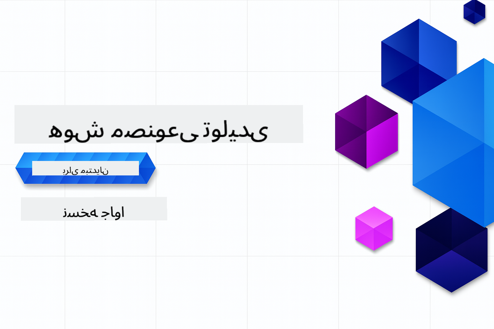

<!--
CO_OP_TRANSLATOR_METADATA:
{
  "original_hash": "0f080f1f2a635610b5f6eff5a58a9590",
  "translation_date": "2025-07-25T07:36:31+00:00",
  "source_file": "README.md",
  "language_code": "fa"
}
-->
# هوش مصنوعی مولد برای مبتدیان - نسخه جاوا

> **NOTE: شروع سریع**: کل دوره به صورت آنلاین قابل انجام است - نیازی به تنظیمات محلی نیست!
1. این مخزن را به حساب GitHub خود فورک کنید
2. روی **Code** → تب **Codespaces** → **...** → **New with options...** کلیک کنید
3. از تنظیمات پیش‌فرض استفاده کنید – این گزینه کانتینر توسعه‌ای که برای این دوره ایجاد شده است را انتخاب می‌کند
4. روی **Create codespace** کلیک کنید
5. حدود ۲ دقیقه صبر کنید تا محیط آماده شود
6. مستقیماً به [ایجاد توکن مدل‌های GitHub خود](./02-SetupDevEnvironment/README.md#step-2-create-a-github-personal-access-token) بروید

## پشتیبانی چندزبانه

### پشتیبانی شده از طریق GitHub Action (خودکار و همیشه به‌روز)

[فرانسوی](../fr/README.md) | [اسپانیایی](../es/README.md) | [آلمانی](../de/README.md) | [روسی](../ru/README.md) | [عربی](../ar/README.md) | [فارسی](./README.md) | [اردو](../ur/README.md) | [چینی (ساده‌شده)](../zh/README.md) | [چینی (سنتی، ماکائو)](../mo/README.md) | [چینی (سنتی، هنگ‌کنگ)](../hk/README.md) | [چینی (سنتی، تایوان)](../tw/README.md) | [ژاپنی](../ja/README.md) | [کره‌ای](../ko/README.md) | [هندی](../hi/README.md) | [بنگالی](../bn/README.md) | [مراتی](../mr/README.md) | [نپالی](../ne/README.md) | [پنجابی (گرمخی)](../pa/README.md) | [پرتغالی (پرتغال)](../pt/README.md) | [پرتغالی (برزیل)](../br/README.md) | [ایتالیایی](../it/README.md) | [لهستانی](../pl/README.md) | [ترکی](../tr/README.md) | [یونانی](../el/README.md) | [تایلندی](../th/README.md) | [سوئدی](../sv/README.md) | [دانمارکی](../da/README.md) | [نروژی](../no/README.md) | [فنلاندی](../fi/README.md) | [هلندی](../nl/README.md) | [عبری](../he/README.md) | [ویتنامی](../vi/README.md) | [اندونزیایی](../id/README.md) | [مالایی](../ms/README.md) | [تاگالوگ (فیلیپینی)](../tl/README.md) | [سواحیلی](../sw/README.md) | [مجاری](../hu/README.md) | [چکی](../cs/README.md) | [اسلواکی](../sk/README.md) | [رومانیایی](../ro/README.md) | [بلغاری](../bg/README.md) | [صربی (سیریلیک)](../sr/README.md) | [کرواتی](../hr/README.md) | [اسلوونیایی](../sl/README.md) | [اوکراینی](../uk/README.md) | [برمه‌ای (میانمار)](../my/README.md)

## ساختار دوره و مسیر یادگیری

**مدت زمان مورد نیاز**: تنظیم محیط ۲ دقیقه زمان می‌برد و نمونه‌ها بسته به عمق کاوش ۱ تا ۳ ساعت زمان نیاز دارند. کل کارگاه به صورت آنلاین و بدون نیاز به تنظیمات محلی قابل انجام است.

### **فصل ۱: مقدمه‌ای بر هوش مصنوعی مولد**
- **مفاهیم اصلی**: درک مدل‌های زبانی بزرگ، توکن‌ها، جاسازی‌ها و قابلیت‌های هوش مصنوعی
- **اکوسیستم هوش مصنوعی جاوا**: مروری بر Spring AI و OpenAI SDKs
- **پروتکل زمینه مدل**: معرفی MCP و نقش آن در ارتباط عامل‌های هوش مصنوعی
- **کاربردهای عملی**: سناریوهای واقعی شامل چت‌بات‌ها و تولید محتوا
- **[→ شروع فصل ۱](./01-IntroToGenAI/README.md)**

### **فصل ۲: تنظیم محیط توسعه**
- **پیکربندی چند ارائه‌دهنده**: تنظیم مدل‌های GitHub، Azure OpenAI و ادغام‌های OpenAI Java SDK
- **Spring Boot + Spring AI**: بهترین شیوه‌ها برای توسعه برنامه‌های هوش مصنوعی سازمانی
- **مدل‌های GitHub**: دسترسی رایگان به مدل‌های هوش مصنوعی برای نمونه‌سازی و یادگیری (بدون نیاز به کارت اعتباری)
- **ابزارهای توسعه**: پیکربندی کانتینرهای Docker، VS Code و GitHub Codespaces
- **[→ شروع فصل ۲](./02-SetupDevEnvironment/README.md)**

### **فصل ۳: تکنیک‌های اصلی هوش مصنوعی مولد**
- **مهندسی درخواست**: تکنیک‌هایی برای پاسخ‌های بهینه مدل هوش مصنوعی
- **جاسازی‌ها و عملیات برداری**: پیاده‌سازی جستجوی معنایی و تطبیق شباهت
- **تولید بازیابی-تقویت‌شده (RAG)**: ترکیب هوش مصنوعی با منابع داده خودتان
- **فراخوانی توابع**: گسترش قابلیت‌های هوش مصنوعی با ابزارها و افزونه‌های سفارشی
- **[→ شروع فصل ۳](./03-CoreGenerativeAITechniques/README.md)**

### **فصل ۴: کاربردها و پروژه‌های عملی**
- **تولید داستان حیوانات خانگی** (`petstory/`): تولید محتوای خلاقانه با مدل‌های GitHub
- **دموی محلی Foundry** (`foundrylocal/`): ادغام مدل هوش مصنوعی محلی با OpenAI Java SDK
- **سرویس ماشین‌حساب MCP** (`mcp/calculator/`): پیاده‌سازی اولیه پروتکل زمینه مدل با Spring AI
- **[→ شروع فصل ۴](./04-PracticalSamples/README.md)**

### **فصل ۵: توسعه مسئولانه هوش مصنوعی**
- **ایمنی مدل‌های GitHub**: آزمایش فیلترهای محتوای داخلی و مکانیسم‌های ایمنی
- **دموی هوش مصنوعی مسئولانه**: مثال عملی نشان‌دهنده نحوه عملکرد فیلترهای ایمنی هوش مصنوعی
- **بهترین شیوه‌ها**: دستورالعمل‌های ضروری برای توسعه و استقرار اخلاقی هوش مصنوعی
- **[→ شروع فصل ۵](./05-ResponsibleGenAI/README.md)**

## منابع اضافی

- [عامل‌های هوش مصنوعی برای مبتدیان](https://github.com/microsoft/ai-agents-for-beginners)
- [هوش مصنوعی مولد برای مبتدیان با استفاده از .NET](https://github.com/microsoft/Generative-AI-for-beginners-dotnet)
- [هوش مصنوعی مولد برای مبتدیان با استفاده از جاوااسکریپت](https://github.com/microsoft/generative-ai-with-javascript)
- [هوش مصنوعی مولد برای مبتدیان](https://github.com/microsoft/generative-ai-for-beginners)
- [یادگیری ماشین برای مبتدیان](https://aka.ms/ml-beginners)
- [علم داده برای مبتدیان](https://aka.ms/datascience-beginners)
- [هوش مصنوعی برای مبتدیان](https://aka.ms/ai-beginners)
- [امنیت سایبری برای مبتدیان](https://github.com/microsoft/Security-101)
- [توسعه وب برای مبتدیان](https://aka.ms/webdev-beginners)
- [اینترنت اشیا برای مبتدیان](https://aka.ms/iot-beginners)
- [توسعه XR برای مبتدیان](https://github.com/microsoft/xr-development-for-beginners)
- [تسلط بر GitHub Copilot برای برنامه‌نویسی جفتی هوش مصنوعی](https://aka.ms/GitHubCopilotAI)
- [تسلط بر GitHub Copilot برای توسعه‌دهندگان C#/.NET](https://github.com/microsoft/mastering-github-copilot-for-dotnet-csharp-developers)
- [ماجراجویی Copilot خود را انتخاب کنید](https://github.com/microsoft/CopilotAdventures)
- [برنامه چت RAG با خدمات Azure AI](https://github.com/Azure-Samples/azure-search-openai-demo-java)

**سلب مسئولیت**:  
این سند با استفاده از سرویس ترجمه هوش مصنوعی [Co-op Translator](https://github.com/Azure/co-op-translator) ترجمه شده است. در حالی که ما تلاش می‌کنیم دقت را حفظ کنیم، لطفاً توجه داشته باشید که ترجمه‌های خودکار ممکن است شامل خطاها یا نادرستی‌ها باشند. سند اصلی به زبان اصلی آن باید به عنوان منبع معتبر در نظر گرفته شود. برای اطلاعات حساس، توصیه می‌شود از ترجمه حرفه‌ای انسانی استفاده کنید. ما مسئولیتی در قبال سوء تفاهم‌ها یا تفسیرهای نادرست ناشی از استفاده از این ترجمه نداریم.