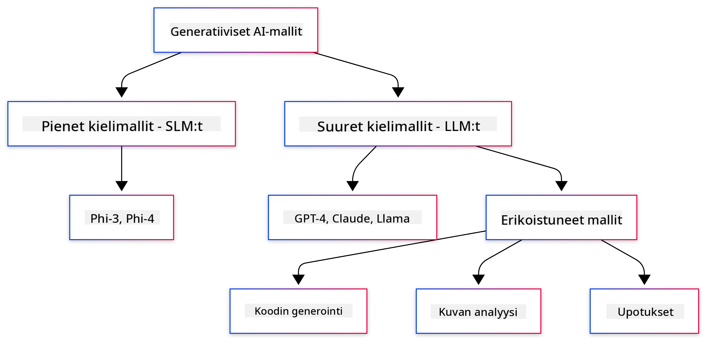
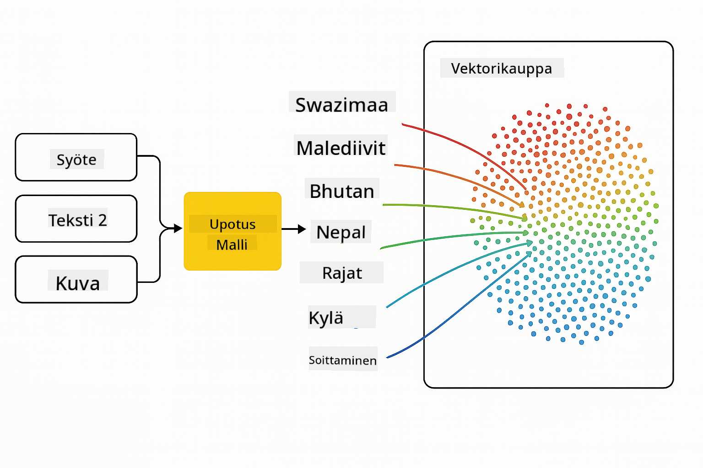
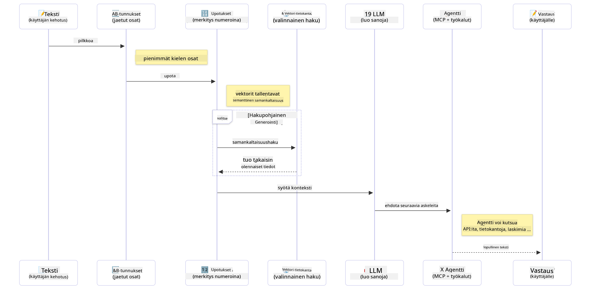

<!--
CO_OP_TRANSLATOR_METADATA:
{
  "original_hash": "6d8b4a0d774dc2a1e97c95859a6d6e4b",
  "translation_date": "2025-07-21T20:16:03+00:00",
  "source_file": "01-IntroToGenAI/README.md",
  "language_code": "fi"
}
-->
# Johdanto generatiiviseen tekoälyyn - Java-versio

## Mitä opit

- **Generatiivisen tekoälyn perusteet**, mukaan lukien LLM:t, kehotetekniikka, tokenit, upotukset ja vektoripohjaiset tietokannat
- **Vertailu Java-tekoälykehitystyökaluihin**, kuten Azure OpenAI SDK, Spring AI ja OpenAI Java SDK
- **Tutustuminen Model Context Protocoliin** ja sen rooliin tekoälyagenttien viestinnässä

## Sisällysluettelo

- [Johdanto](../../../01-IntroToGenAI)
- [Pikakertaus generatiivisen tekoälyn käsitteistä](../../../01-IntroToGenAI)
- [Kehotetekniikan tarkastelu](../../../01-IntroToGenAI)
- [Tokenit, upotukset ja agentit](../../../01-IntroToGenAI)
- [Java-tekoälykehityksen työkalut ja kirjastot](../../../01-IntroToGenAI)
  - [OpenAI Java SDK](../../../01-IntroToGenAI)
  - [Spring AI](../../../01-IntroToGenAI)
  - [Azure OpenAI Java SDK](../../../01-IntroToGenAI)
- [Yhteenveto](../../../01-IntroToGenAI)
- [Seuraavat askeleet](../../../01-IntroToGenAI)

## Johdanto

Tervetuloa Generatiivinen tekoäly aloittelijoille - Java-versio -kurssin ensimmäiseen lukuun! Tämä peruskurssi esittelee sinulle generatiivisen tekoälyn keskeiset käsitteet ja opettaa, kuinka voit työskennellä niiden parissa Javaa käyttäen. Opit tekoälysovellusten olennaiset rakennuspalikat, kuten suuret kielimallit (LLM:t), tokenit, upotukset ja tekoälyagentit. Lisäksi tutustumme Java-työkaluihin, joita käytät kurssin aikana.

### Pikakertaus generatiivisen tekoälyn käsitteistä

Generatiivinen tekoäly on tekoälyn tyyppi, joka luo uutta sisältöä, kuten tekstiä, kuvia tai koodia, perustuen datasta opittuihin kuvioihin ja suhteisiin. Generatiiviset tekoälymallit voivat tuottaa ihmismäisiä vastauksia, ymmärtää kontekstia ja joskus jopa luoda sisältöä, joka vaikuttaa ihmisen tekemältä.

Kun kehität Java-tekoälysovelluksia, työskentelet **generatiivisten tekoälymallien** kanssa sisällön luomiseksi. Generatiivisten tekoälymallien kykyjä ovat esimerkiksi:

- **Tekstintuotanto**: Ihmismäisen tekstin luominen chatbotteihin, sisältöön ja tekstin täydentämiseen.
- **Kuvien luominen ja analysointi**: Realististen kuvien tuottaminen, valokuvien parantaminen ja objektien tunnistaminen.
- **Koodin tuottaminen**: Koodinpätkien tai skriptien kirjoittaminen.

On olemassa erityyppisiä malleja, jotka on optimoitu eri tehtäviin. Esimerkiksi sekä **pienet kielimallit (SLM:t)** että **suuret kielimallit (LLM:t)** voivat käsitellä tekstintuotantoa, mutta LLM:t tarjoavat yleensä paremman suorituskyvyn monimutkaisissa tehtävissä. Kuvatehtäviin käytetään erikoistuneita visiomalleja tai multimodaalisia malleja.

Mallien vastaukset eivät tietenkään ole aina täydellisiä. Olet ehkä kuullut, että mallit voivat "hallusinoida" tai tuottaa virheellistä tietoa vakuuttavalla tavalla. Voit kuitenkin ohjata mallia tuottamaan parempia vastauksia antamalla sille selkeitä ohjeita ja kontekstia. Tässä **kehotetekniikka** astuu kuvaan.

#### Kehotetekniikan tarkastelu

Kehotetekniikka tarkoittaa tehokkaiden syötteiden suunnittelua, jotka ohjaavat tekoälymalleja kohti haluttuja tuloksia. Se sisältää:

- **Selkeys**: Ohjeiden tekeminen selkeiksi ja yksiselitteisiksi.
- **Konteksti**: Tarvittavan taustatiedon antaminen.
- **Rajoitukset**: Mahdollisten rajoitusten tai formaattien määrittäminen.

Parhaat käytännöt kehotetekniikassa sisältävät kehotteen suunnittelun, selkeät ohjeet, tehtävän pilkkomisen, yhden esimerkin ja muutaman esimerkin oppimisen sekä kehotteen hienosäädön. Eri kehotteiden testaaminen on olennaista, jotta löydät parhaiten toimivan ratkaisun omaan käyttötapaukseesi.

Sovelluksia kehittäessäsi työskentelet erilaisten kehotetyyppien kanssa:
- **Järjestelmäkehotteet**: Asettaa mallin käyttäytymisen perussäännöt ja kontekstin.
- **Käyttäjäkehotteet**: Sovelluskäyttäjien syöttämä data.
- **Avustajakehotteet**: Mallin vastaukset, jotka perustuvat järjestelmä- ja käyttäjäkehotteisiin.

> **Lisätietoa**: Lue lisää kehotetekniikasta [Generatiivinen tekoäly aloittelijoille -kurssin Kehotetekniikan perusteet -luvusta](https://github.com/microsoft/generative-ai-for-beginners/tree/main/04-prompt-engineering-fundamentals)

#### Tokenit, upotukset ja agentit

Kun työskentelet generatiivisten tekoälymallien kanssa, kohtaat termejä kuten **tokenit**, **upotukset**, **agentit** ja **Model Context Protocol (MCP)**. Tässä yksityiskohtainen katsaus näihin käsitteisiin:

- **Tokenit**: Tokenit ovat tekstin pienimpiä yksiköitä mallissa. Ne voivat olla sanoja, merkkejä tai osasanoja. Tokenit edustavat tekstidataa muodossa, jonka malli ymmärtää. Esimerkiksi lause "The quick brown fox jumped over the lazy dog" voidaan tokenisoida muotoon ["The", " quick", " brown", " fox", " jumped", " over", " the", " lazy", " dog"] tai ["The", " qu", "ick", " br", "own", " fox", " jump", "ed", " over", " the", " la", "zy", " dog"] riippuen tokenisointistrategiasta.

Tokenisointi on prosessi, jossa teksti jaetaan näihin pienempiin yksiköihin. Tämä on tärkeää, koska mallit toimivat tokeneilla eivätkä raakatiedolla. Kehotteen tokenien määrä vaikuttaa mallin vastausten pituuteen ja laatuun, sillä malleilla on token-rajoituksia kontekstinsa osalta (esim. 128K tokenia GPT-4o:n kokonaiskontekstissa, mukaan lukien syöte ja vastaus).

  Javassa voit käyttää kirjastoja, kuten OpenAI SDK:ta, tokenisoinnin automatisointiin, kun lähetät pyyntöjä tekoälymalleille.

- **Upotukset**: Upotukset ovat tokenien vektoriedustuksia, jotka sisältävät semanttista merkitystä. Ne ovat numeerisia esityksiä (tyypillisesti liukulukuja sisältäviä taulukoita), jotka mahdollistavat mallien ymmärtää sanojen välisiä suhteita ja tuottaa kontekstuaalisesti relevantteja vastauksia. Samankaltaisilla sanoilla on samankaltaiset upotukset, mikä mahdollistaa mallin ymmärtää synonyymejä ja semanttisia suhteita.

  Javassa voit luoda upotuksia OpenAI SDK:lla tai muilla kirjastoilla, jotka tukevat upotusten luomista. Nämä upotukset ovat olennaisia tehtävissä, kuten semanttinen haku, jossa haluat löytää samankaltaista sisältöä merkityksen perusteella eikä tarkkojen tekstivastaavuuksien.

- **Vektoripohjaiset tietokannat**: Vektoripohjaiset tietokannat ovat erikoistuneita tallennusjärjestelmiä, jotka on optimoitu upotuksille. Ne mahdollistavat tehokkaan samankaltaisuushaun ja ovat keskeisiä Retrieval-Augmented Generation (RAG) -malleissa, joissa haluat löytää relevanttia tietoa suurista tietoaineistoista semanttisen samankaltaisuuden perusteella eikä tarkkojen vastaavuuksien.

> **Huomio**: Tässä kurssissa emme käsittele vektoripohjaisia tietokantoja, mutta ne ovat mainitsemisen arvoisia, koska niitä käytetään yleisesti tosielämän sovelluksissa.

- **Agentit & MCP**: Tekoälykomponentit, jotka toimivat itsenäisesti mallien, työkalujen ja ulkoisten järjestelmien kanssa. Model Context Protocol (MCP) tarjoaa standardoidun tavan agenteille käyttää ulkoisia tietolähteitä ja työkaluja turvallisesti. Lue lisää [MCP aloittelijoille](https://github.com/microsoft/mcp-for-beginners) -kurssista.

Java-tekoälysovelluksissa käytät tokeneita tekstinkäsittelyyn, upotuksia semanttiseen hakuun ja RAG:iin, vektoripohjaisia tietokantoja tiedonhakuun sekä agentteja MCP:n kanssa älykkäiden, työkaluja käyttävien järjestelmien rakentamiseen.

### Java-tekoälykehityksen työkalut ja kirjastot

Java tarjoaa erinomaisia työkaluja tekoälykehitykseen. Kurssin aikana tutustumme kolmeen pääkirjastoon: OpenAI Java SDK, Azure OpenAI SDK ja Spring AI.

Tässä nopea viitetaulukko, joka näyttää, mitä SDK:ta käytetään kunkin luvun esimerkeissä:

| Luku | Esimerkki | SDK |
|------|-----------|-----|
| 02-SetupDevEnvironment | src/github-models/ | OpenAI Java SDK |
| 02-SetupDevEnvironment | src/basic-chat-azure/ | Spring AI Azure OpenAI |
| 03-CoreGenerativeAITechniques | examples/ | Azure OpenAI SDK |
| 04-PracticalSamples | petstory/ | OpenAI Java SDK |
| 04-PracticalSamples | foundrylocal/ | OpenAI Java SDK |
| 04-PracticalSamples | mcp/calculator/ | Spring AI MCP SDK + LangChain4j |

**SDK-dokumentaatiolinkit:**
- [Azure OpenAI Java SDK](https://github.com/Azure/azure-sdk-for-java/tree/azure-ai-openai_1.0.0-beta.16/sdk/openai/azure-ai-openai)
- [Spring AI](https://docs.spring.io/spring-ai/reference/)
- [OpenAI Java SDK](https://github.com/openai/openai-java)
- [LangChain4j](https://docs.langchain4j.dev/)

#### OpenAI Java SDK

OpenAI SDK on virallinen Java-kirjasto OpenAI:n API:lle. Se tarjoaa yksinkertaisen ja johdonmukaisen käyttöliittymän OpenAI:n mallien kanssa työskentelyyn, mikä tekee tekoälyominaisuuksien integroinnista Java-sovelluksiin helppoa. Luvun 2 GitHub Models -esimerkki, luvun 4 Pet Story -sovellus ja Foundry Local -esimerkki havainnollistavat OpenAI SDK:n lähestymistapaa.

#### Spring AI

Spring AI on kattava kehys, joka tuo tekoälyominaisuudet Spring-sovelluksiin tarjoten johdonmukaisen abstraktiokerroksen eri tekoälypalveluntarjoajien välillä. Se integroituu saumattomasti Spring-ekosysteemiin, mikä tekee siitä ihanteellisen valinnan yritysten Java-sovelluksille, jotka tarvitsevat tekoälyominaisuuksia.

Spring AI:n vahvuus on sen saumaton integrointi Spring-ekosysteemiin, mikä tekee tuotantovalmiiden tekoälysovellusten rakentamisesta helppoa tutuilla Spring-malleilla, kuten riippuvuuksien injektiolla, konfiguraation hallinnalla ja testauskehyksillä. Käytät Spring AI:ta luvuissa 2 ja 4 rakentaaksesi sovelluksia, jotka hyödyntävät sekä OpenAI:ta että Model Context Protocol (MCP) Spring AI -kirjastoja.

##### Model Context Protocol (MCP)

[Model Context Protocol (MCP)](https://modelcontextprotocol.io/) on nouseva standardi, joka mahdollistaa tekoälysovellusten turvallisen vuorovaikutuksen ulkoisten tietolähteiden ja työkalujen kanssa. MCP tarjoaa standardoidun tavan tekoälymalleille käyttää kontekstuaalista tietoa ja suorittaa toimintoja sovelluksissasi.

Luvussa 4 rakennat yksinkertaisen MCP-laskinpalvelun, joka havainnollistaa Model Context Protocolin perusteita Spring AI:n kanssa, näyttäen kuinka luoda perusintegraatioita ja palveluarkkitehtuureja.

#### Azure OpenAI Java SDK

Azure OpenAI -asiakaskirjasto Javaa varten on OpenAI:n REST API:en mukautus, joka tarjoaa idiomaattisen käyttöliittymän ja integraation Azure SDK -ekosysteemin kanssa. Luvussa 3 rakennat sovelluksia Azure OpenAI SDK:ta käyttäen, mukaan lukien chat-sovelluksia, funktiokutsuja ja RAG (Retrieval-Augmented Generation) -malleja.

> Huomio: Azure OpenAI SDK jää jälkeen OpenAI Java SDK:sta ominaisuuksien osalta, joten tulevissa projekteissa kannattaa harkita OpenAI Java SDK:n käyttöä.

## Yhteenveto

**Onnittelut!** Olet onnistuneesti:

- **Oppinut generatiivisen tekoälyn perusteet**, mukaan lukien LLM:t, kehotetekniikka, tokenit, upotukset ja vektoripohjaiset tietokannat
- **Vertailut Java-tekoälykehitystyökaluja**, kuten Azure OpenAI SDK, Spring AI ja OpenAI Java SDK
- **Tutustunut Model Context Protocoliin** ja sen rooliin tekoälyagenttien viestinnässä

## Seuraavat askeleet

[2. luku: Kehitysympäristön asettaminen](../02-SetupDevEnvironment/README.md)

**Vastuuvapauslauseke**:  
Tämä asiakirja on käännetty käyttämällä tekoälypohjaista käännöspalvelua [Co-op Translator](https://github.com/Azure/co-op-translator). Vaikka pyrimme tarkkuuteen, huomioithan, että automaattiset käännökset voivat sisältää virheitä tai epätarkkuuksia. Alkuperäistä asiakirjaa sen alkuperäisellä kielellä tulisi pitää ensisijaisena lähteenä. Kriittisen tiedon osalta suositellaan ammattimaista ihmiskäännöstä. Emme ole vastuussa väärinkäsityksistä tai virhetulkinnoista, jotka johtuvat tämän käännöksen käytöstä.