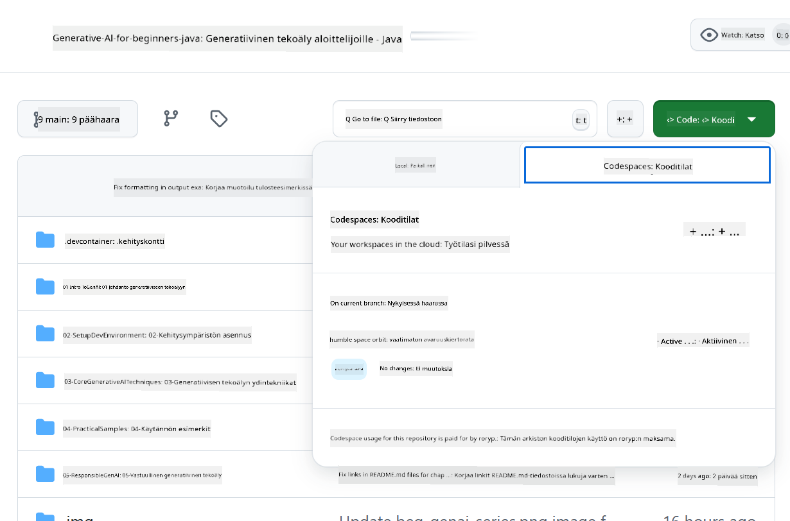

<!--
CO_OP_TRANSLATOR_METADATA:
{
  "original_hash": "e00bbea0f95c611aa3bec676d23e8b43",
  "translation_date": "2025-07-21T19:35:30+00:00",
  "source_file": "02-SetupDevEnvironment/getting-started-azure-openai.md",
  "language_code": "fi"
}
-->
# Azure OpenAI - Kehitysympäristön asennus

> **Pika-aloitus**: Tämä opas on tarkoitettu Azure OpenAI -asennukseen. Jos haluat aloittaa heti ilmaisilla malleilla, käytä [GitHub Models with Codespaces](./README.md#quick-start-cloud).

Tämä opas auttaa sinua asentamaan Azure AI Foundry -mallit Java-pohjaisia tekoälysovelluksia varten tässä kurssissa.

## Sisällysluettelo

- [Pika-asennuksen yleiskatsaus](../../../02-SetupDevEnvironment)
- [Vaihe 1: Luo Azure AI Foundry -resurssit](../../../02-SetupDevEnvironment)
  - [Luo Hub ja Projekti](../../../02-SetupDevEnvironment)
  - [Ota GPT-4o-mini-malli käyttöön](../../../02-SetupDevEnvironment)
- [Vaihe 2: Luo Codespace](../../../02-SetupDevEnvironment)
- [Vaihe 3: Määritä ympäristösi](../../../02-SetupDevEnvironment)
- [Vaihe 4: Testaa asennustasi](../../../02-SetupDevEnvironment)
- [Mitä seuraavaksi?](../../../02-SetupDevEnvironment)
- [Resurssit](../../../02-SetupDevEnvironment)
- [Lisäresurssit](../../../02-SetupDevEnvironment)

## Pika-asennuksen yleiskatsaus

1. Luo Azure AI Foundry -resurssit (Hub, Projekti, Malli)
2. Luo Codespace Java-kehityskontilla
3. Määritä .env-tiedosto Azure OpenAI -tunnuksilla
4. Testaa asennustasi esimerkkiprojektilla

## Vaihe 1: Luo Azure AI Foundry -resurssit

### Luo Hub ja Projekti

1. Siirry [Azure AI Foundry -portaaliin](https://ai.azure.com/) ja kirjaudu sisään
2. Klikkaa **+ Luo** → **Uusi hub** (tai siirry **Hallinta** → **Kaikki hubit** → **+ Uusi hub**)
3. Määritä hub:
   - **Hubin nimi**: esim. "MyAIHub"
   - **Tilaukset**: Valitse Azure-tilauksesi
   - **Resurssiryhmä**: Luo uusi tai valitse olemassa oleva
   - **Sijainti**: Valitse lähin sijainti
   - **Tallennustili**: Käytä oletusta tai määritä mukautettu
   - **Avainholvi**: Käytä oletusta tai määritä mukautettu
   - Klikkaa **Seuraava** → **Tarkista + luo** → **Luo**
4. Kun hub on luotu, klikkaa **+ Uusi projekti** (tai **Luo projekti** hubin yleiskatsauksesta)
   - **Projektin nimi**: esim. "GenAIJava"
   - Klikkaa **Luo**

### Ota GPT-4o-mini-malli käyttöön

1. Projektissasi siirry **Malliluetteloon** ja etsi **gpt-4o-mini**
   - *Vaihtoehto: Siirry **Käyttöönotot** → **+ Luo käyttöönotto***
2. Klikkaa **Ota käyttöön** gpt-4o-mini-mallikortilla
3. Määritä käyttöönotto:
   - **Käyttöönoton nimi**: "gpt-4o-mini"
   - **Malliversio**: Käytä uusinta
   - **Käyttöönoton tyyppi**: Standard
4. Klikkaa **Ota käyttöön**
5. Kun malli on otettu käyttöön, siirry **Käyttöönotot**-välilehteen ja kopioi seuraavat tiedot:
   - **Käyttöönoton nimi** (esim. "gpt-4o-mini")
   - **Kohde-URI** (esim. `https://your-hub-name.openai.azure.com/`) 
      > **Tärkeää**: Kopioi vain perus-URL (esim. `https://myhub.openai.azure.com/`) älä koko päätepisteen polkua.
   - **Avain** (Keys and Endpoint -osio)

> **Onko ongelmia?** Katso virallinen [Azure AI Foundry -dokumentaatio](https://learn.microsoft.com/azure/ai-foundry/how-to/create-projects?tabs=ai-foundry&pivots=hub-project)

## Vaihe 2: Luo Codespace

1. Haarauta tämä arkisto GitHub-tilillesi
   > **Huomio**: Jos haluat muokata perusasetuksia, tutustu [Dev Container Configuration](../../../.devcontainer/devcontainer.json)
2. Haarautetussa arkistossa klikkaa **Koodi** → **Codespaces**-välilehti
3. Klikkaa **...** → **Uusi vaihtoehdoilla...**

4. Valitse **Dev Container Configuration**: 
   - **Generative AI Java Development Environment**
5. Klikkaa **Luo Codespace**

## Vaihe 3: Määritä ympäristösi

Kun Codespace on valmis, määritä Azure OpenAI -tunnuksesi:

1. **Siirry esimerkkiprojektiin arkiston juuresta:**
   ```bash
   cd 02-SetupDevEnvironment/src/basic-chat-azure
   ```

2. **Luo .env-tiedosto:**
   ```bash
   cp .env.example .env
   ```

3. **Muokkaa .env-tiedostoa Azure OpenAI -tunnuksillasi:**
   ```bash
   # Your Azure OpenAI API key (from Azure AI Foundry portal)
   AZURE_AI_KEY=your-actual-api-key-here
   
   # Your Azure OpenAI endpoint URL (e.g., https://myhub.openai.azure.com/)
   AZURE_AI_ENDPOINT=https://your-hub-name.openai.azure.com/
   ```

   > **Tietoturvahuomio**: 
   > - Älä koskaan lisää `.env`-tiedostoa versionhallintaan
   > - `.env`-tiedosto on jo lisätty `.gitignore`-tiedostoon
   > - Pidä API-avaimesi turvassa ja vaihda ne säännöllisesti

## Vaihe 4: Testaa asennustasi

Suorita esimerkkisovellus testataksesi Azure OpenAI -yhteyttä:

```bash
mvn clean spring-boot:run
```

Näet vastauksen GPT-4o-mini-mallilta!

> **VS Code -käyttäjät**: Voit myös painaa `F5` VS Codessa sovelluksen suorittamiseksi. Käynnistyskonfiguraatio on jo asetettu lataamaan `.env`-tiedosto automaattisesti.

> **Täysi esimerkki**: Katso [End-to-End Azure OpenAI Example](./src/basic-chat-azure/README.md) saadaksesi yksityiskohtaiset ohjeet ja vianmäärityksen.

## Mitä seuraavaksi?

**Asennus valmis!** Sinulla on nyt:
- Azure OpenAI ja gpt-4o-mini otettu käyttöön
- Paikallinen .env-tiedosto määritetty
- Java-kehitysympäristö valmis

**Jatka** [Lukuun 3: Generatiivisen tekoälyn ydintekniikat](../03-CoreGenerativeAITechniques/README.md) aloittaaksesi tekoälysovellusten rakentamisen!

## Resurssit

- [Azure AI Foundry -dokumentaatio](https://learn.microsoft.com/azure/ai-services/)
- [Spring AI Azure OpenAI -dokumentaatio](https://docs.spring.io/spring-ai/reference/api/clients/azure-openai-chat.html)
- [Azure OpenAI Java SDK](https://learn.microsoft.com/java/api/overview/azure/ai-openai-readme)

## Lisäresurssit

- [Lataa VS Code](https://code.visualstudio.com/Download)
- [Hanki Docker Desktop](https://www.docker.com/products/docker-desktop)
- [Dev Container Configuration](../../../.devcontainer/devcontainer.json)

**Vastuuvapauslauseke**:  
Tämä asiakirja on käännetty käyttämällä tekoälypohjaista käännöspalvelua [Co-op Translator](https://github.com/Azure/co-op-translator). Vaikka pyrimme tarkkuuteen, huomioithan, että automaattiset käännökset voivat sisältää virheitä tai epätarkkuuksia. Alkuperäistä asiakirjaa sen alkuperäisellä kielellä tulisi pitää ensisijaisena lähteenä. Kriittisen tiedon osalta suositellaan ammattimaista ihmiskäännöstä. Emme ole vastuussa väärinkäsityksistä tai virhetulkinnoista, jotka johtuvat tämän käännöksen käytöstä.