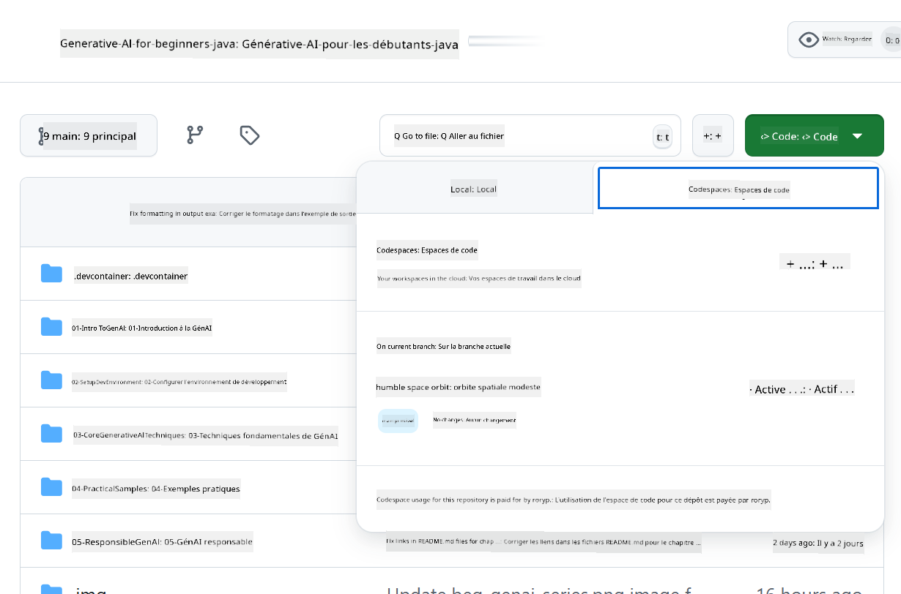

<!--
CO_OP_TRANSLATOR_METADATA:
{
  "original_hash": "bfdb4b4eadbee3a59ef742439f58326a",
  "translation_date": "2025-07-27T12:48:20+00:00",
  "source_file": "02-SetupDevEnvironment/getting-started-azure-openai.md",
  "language_code": "fr"
}
-->
# Configuration de l'environnement de développement pour Azure OpenAI

> **Démarrage rapide** : Ce guide est destiné à la configuration d'Azure OpenAI. Pour un démarrage immédiat avec des modèles gratuits, utilisez [GitHub Models avec Codespaces](./README.md#quick-start-cloud).

Ce guide vous aidera à configurer les modèles Azure AI Foundry pour vos applications Java AI dans ce cours.

## Table des matières

- [Aperçu de la configuration rapide](../../../02-SetupDevEnvironment)
- [Étape 1 : Créer des ressources Azure AI Foundry](../../../02-SetupDevEnvironment)
  - [Créer un hub et un projet](../../../02-SetupDevEnvironment)
  - [Déployer le modèle GPT-4o-mini](../../../02-SetupDevEnvironment)
- [Étape 2 : Créer votre Codespace](../../../02-SetupDevEnvironment)
- [Étape 3 : Configurer votre environnement](../../../02-SetupDevEnvironment)
- [Étape 4 : Tester votre configuration](../../../02-SetupDevEnvironment)
- [Et après ?](../../../02-SetupDevEnvironment)
- [Ressources](../../../02-SetupDevEnvironment)
- [Ressources supplémentaires](../../../02-SetupDevEnvironment)

## Aperçu de la configuration rapide

1. Créez des ressources Azure AI Foundry (Hub, Projet, Modèle)
2. Créez un Codespace avec un conteneur de développement Java
3. Configurez votre fichier .env avec les identifiants Azure OpenAI
4. Testez votre configuration avec le projet exemple

## Étape 1 : Créer des ressources Azure AI Foundry

### Créer un hub et un projet

1. Accédez au [Portail Azure AI Foundry](https://ai.azure.com/) et connectez-vous
2. Cliquez sur **+ Créer** → **Nouveau hub** (ou naviguez vers **Gestion** → **Tous les hubs** → **+ Nouveau hub**)
3. Configurez votre hub :
   - **Nom du hub** : par exemple, "MonHubAI"
   - **Abonnement** : Sélectionnez votre abonnement Azure
   - **Groupe de ressources** : Créez-en un nouveau ou sélectionnez-en un existant
   - **Emplacement** : Choisissez le plus proche de vous
   - **Compte de stockage** : Utilisez le compte par défaut ou configurez-en un personnalisé
   - **Key vault** : Utilisez le coffre par défaut ou configurez-en un personnalisé
   - Cliquez sur **Suivant** → **Vérifier + créer** → **Créer**
4. Une fois créé, cliquez sur **+ Nouveau projet** (ou **Créer un projet** depuis l'aperçu du hub)
   - **Nom du projet** : par exemple, "GenAIJava"
   - Cliquez sur **Créer**

### Déployer le modèle GPT-4o-mini

1. Dans votre projet, accédez au **Catalogue de modèles** et recherchez **gpt-4o-mini**
   - *Alternative : Accédez à **Déploiements** → **+ Créer un déploiement***
2. Cliquez sur **Déployer** sur la carte du modèle gpt-4o-mini
3. Configurez le déploiement :
   - **Nom du déploiement** : "gpt-4o-mini"
   - **Version du modèle** : Utilisez la dernière version
   - **Type de déploiement** : Standard
4. Cliquez sur **Déployer**
5. Une fois déployé, accédez à l'onglet **Déploiements** et copiez ces valeurs :
   - **Nom du déploiement** (par exemple, "gpt-4o-mini")
   - **URI cible** (par exemple, `https://your-hub-name.openai.azure.com/`) 
      > **Important** : Copiez uniquement l'URL de base (par exemple, `https://monhub.openai.azure.com/`) et non le chemin complet de l'endpoint.
   - **Clé** (depuis la section Clés et Endpoint)

> **Vous rencontrez des difficultés ?** Consultez la [Documentation officielle Azure AI Foundry](https://learn.microsoft.com/azure/ai-foundry/how-to/create-projects?tabs=ai-foundry&pivots=hub-project)

## Étape 2 : Créer votre Codespace

1. Forkez ce dépôt dans votre compte GitHub
   > **Remarque** : Si vous souhaitez modifier la configuration de base, consultez la [Configuration du conteneur de développement](../../../.devcontainer/devcontainer.json)
2. Dans votre dépôt forké, cliquez sur **Code** → Onglet **Codespaces**
3. Cliquez sur **...** → **Nouveau avec options...**

4. Sélectionnez **Configuration du conteneur de développement** : 
   - **Environnement de développement Java pour l'IA générative**
5. Cliquez sur **Créer un codespace**

## Étape 3 : Configurer votre environnement

Une fois votre Codespace prêt, configurez vos identifiants Azure OpenAI :

1. **Accédez au projet exemple depuis la racine du dépôt :**
   ```bash
   cd 02-SetupDevEnvironment/examples/basic-chat-azure
   ```

2. **Créez votre fichier .env :**
   ```bash
   cp .env.example .env
   ```

3. **Modifiez le fichier .env avec vos identifiants Azure OpenAI :**
   ```bash
   # Your Azure OpenAI API key (from Azure AI Foundry portal)
   AZURE_AI_KEY=your-actual-api-key-here
   
   # Your Azure OpenAI endpoint URL (e.g., https://myhub.openai.azure.com/)
   AZURE_AI_ENDPOINT=https://your-hub-name.openai.azure.com/
   ```

   > **Note de sécurité** : 
   > - Ne jamais inclure votre fichier `.env` dans le contrôle de version
   > - Le fichier `.env` est déjà inclus dans `.gitignore`
   > - Gardez vos clés API sécurisées et changez-les régulièrement

## Étape 4 : Tester votre configuration

Exécutez l'application exemple pour tester votre connexion Azure OpenAI :

```bash
mvn clean spring-boot:run
```

Vous devriez voir une réponse du modèle GPT-4o-mini !

> **Utilisateurs de VS Code** : Vous pouvez également appuyer sur `F5` dans VS Code pour exécuter l'application. La configuration de lancement est déjà configurée pour charger automatiquement votre fichier `.env`.

> **Exemple complet** : Consultez l'[Exemple Azure OpenAI de bout en bout](./examples/basic-chat-azure/README.md) pour des instructions détaillées et des solutions aux problèmes.

## Et après ?

**Configuration terminée !** Vous avez maintenant :
- Azure OpenAI avec gpt-4o-mini déployé
- Configuration locale du fichier .env
- Environnement de développement Java prêt

**Continuez vers** [Chapitre 3 : Techniques fondamentales de l'IA générative](../03-CoreGenerativeAITechniques/README.md) pour commencer à créer des applications d'IA !

## Ressources

- [Documentation Azure AI Foundry](https://learn.microsoft.com/azure/ai-services/)
- [Documentation Spring AI Azure OpenAI](https://docs.spring.io/spring-ai/reference/api/clients/azure-openai-chat.html)
- [SDK Java Azure OpenAI](https://learn.microsoft.com/java/api/overview/azure/ai-openai-readme)

## Ressources supplémentaires

- [Télécharger VS Code](https://code.visualstudio.com/Download)
- [Obtenir Docker Desktop](https://www.docker.com/products/docker-desktop)
- [Configuration du conteneur de développement](../../../.devcontainer/devcontainer.json)

**Avertissement** :  
Ce document a été traduit à l'aide du service de traduction automatique [Co-op Translator](https://github.com/Azure/co-op-translator). Bien que nous nous efforcions d'assurer l'exactitude, veuillez noter que les traductions automatisées peuvent contenir des erreurs ou des inexactitudes. Le document original dans sa langue d'origine doit être considéré comme la source faisant autorité. Pour des informations critiques, il est recommandé de recourir à une traduction professionnelle réalisée par un humain. Nous déclinons toute responsabilité en cas de malentendus ou d'interprétations erronées résultant de l'utilisation de cette traduction.