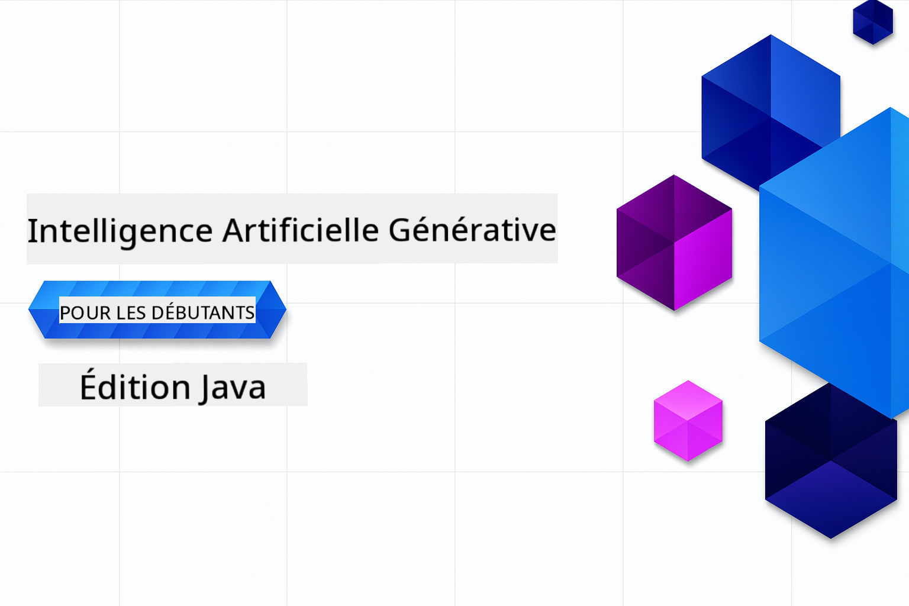

<!--
CO_OP_TRANSLATOR_METADATA:
{
  "original_hash": "d684972689e288a83779255116bb42c3",
  "translation_date": "2025-07-27T08:29:35+00:00",
  "source_file": "README.md",
  "language_code": "fr"
}
-->
# IA Générative pour Débutants - Édition Java

**Temps requis** : L'atelier complet peut être réalisé en ligne sans configuration locale. Si vous souhaitez exécuter les exemples, la configuration de l'environnement prend 2 minutes, et l'exploration des exemples nécessite entre 1 et 3 heures selon la profondeur d'exploration.

> **Démarrage rapide**

1. Forkez ce dépôt sur votre compte GitHub
2. Cliquez sur **Code** → onglet **Codespaces** → **...** → **New with options...**
3. Utilisez les paramètres par défaut – cela sélectionnera le conteneur de développement créé pour ce cours
4. Cliquez sur **Create codespace**
5. Attendez environ 2 minutes que l'environnement soit prêt
6. Passez directement à [Créer votre jeton GitHub Models](./02-SetupDevEnvironment/README.md#step-2-create-a-github-personal-access-token)

## Support multilingue

### Pris en charge via GitHub Action (Automatisé et toujours à jour)

[French](./README.md) | [Spanish](../es/README.md) | [German](../de/README.md) | [Russian](../ru/README.md) | [Arabic](../ar/README.md) | [Persian (Farsi)](../fa/README.md) | [Urdu](../ur/README.md) | [Chinese (Simplified)](../zh/README.md) | [Chinese (Traditional, Macau)](../mo/README.md) | [Chinese (Traditional, Hong Kong)](../hk/README.md) | [Chinese (Traditional, Taiwan)](../tw/README.md) | [Japanese](../ja/README.md) | [Korean](../ko/README.md) | [Hindi](../hi/README.md) | [Bengali](../bn/README.md) | [Marathi](../mr/README.md) | [Nepali](../ne/README.md) | [Punjabi (Gurmukhi)](../pa/README.md) | [Portuguese (Portugal)](../pt/README.md) | [Portuguese (Brazil)](../br/README.md) | [Italian](../it/README.md) | [Polish](../pl/README.md) | [Turkish](../tr/README.md) | [Greek](../el/README.md) | [Thai](../th/README.md) | [Swedish](../sv/README.md) | [Danish](../da/README.md) | [Norwegian](../no/README.md) | [Finnish](../fi/README.md) | [Dutch](../nl/README.md) | [Hebrew](../he/README.md) | [Vietnamese](../vi/README.md) | [Indonesian](../id/README.md) | [Malay](../ms/README.md) | [Tagalog (Filipino)](../tl/README.md) | [Swahili](../sw/README.md) | [Hungarian](../hu/README.md) | [Czech](../cs/README.md) | [Slovak](../sk/README.md) | [Romanian](../ro/README.md) | [Bulgarian](../bg/README.md) | [Serbian (Cyrillic)](../sr/README.md) | [Croatian](../hr/README.md) | [Slovenian](../sl/README.md) | [Ukrainian](../uk/README.md) | [Burmese (Myanmar)](../my/README.md)

## Structure du cours et parcours d'apprentissage

### **Chapitre 1 : Introduction à l'IA Générative**
- **Concepts clés** : Comprendre les modèles de langage étendus, les tokens, les embeddings et les capacités de l'IA
- **Écosystème Java pour l'IA** : Vue d'ensemble des SDK Spring AI et OpenAI
- **Protocole de contexte de modèle** : Introduction au MCP et son rôle dans la communication des agents IA
- **Applications pratiques** : Scénarios réels incluant les chatbots et la génération de contenu
- **[→ Commencer le chapitre 1](./01-IntroToGenAI/README.md)**

### **Chapitre 2 : Configuration de l'environnement de développement**
- **Configuration multi-fournisseurs** : Intégration des modèles GitHub, Azure OpenAI et OpenAI Java SDK
- **Spring Boot + Spring AI** : Bonnes pratiques pour le développement d'applications IA en entreprise
- **Modèles GitHub** : Accès gratuit aux modèles IA pour le prototypage et l'apprentissage (aucune carte de crédit requise)
- **Outils de développement** : Configuration des conteneurs Docker, VS Code et GitHub Codespaces
- **[→ Commencer le chapitre 2](./02-SetupDevEnvironment/README.md)**

### **Chapitre 3 : Techniques fondamentales de l'IA Générative**
- **Conception de prompts** : Techniques pour des réponses optimales des modèles IA
- **Embeddings et opérations vectorielles** : Implémenter la recherche sémantique et la correspondance de similarité
- **Génération augmentée par récupération (RAG)** : Combiner l'IA avec vos propres sources de données
- **Appels de fonctions** : Étendre les capacités de l'IA avec des outils et plugins personnalisés
- **[→ Commencer le chapitre 3](./03-CoreGenerativeAITechniques/README.md)**

### **Chapitre 4 : Applications pratiques et projets**
- **Générateur d'histoires pour animaux** (`petstory/`) : Génération de contenu créatif avec les modèles GitHub
- **Démo locale Foundry** (`foundrylocal/`) : Intégration locale de modèles IA avec OpenAI Java SDK
- **Service de calculateur MCP** (`mcp/calculator/`) : Implémentation basique du protocole de contexte de modèle avec Spring AI
- **[→ Commencer le chapitre 4](./04-PracticalSamples/README.md)**

### **Chapitre 5 : Développement responsable de l'IA**
- **Sécurité des modèles GitHub** : Tester les mécanismes intégrés de filtrage de contenu et de sécurité
- **Démo IA responsable** : Exemple pratique montrant le fonctionnement des filtres de sécurité de l'IA
- **Bonnes pratiques** : Lignes directrices essentielles pour un développement et un déploiement éthiques de l'IA
- **[→ Commencer le chapitre 5](./05-ResponsibleGenAI/README.md)**

## Ressources supplémentaires

- [Agents IA pour Débutants](https://github.com/microsoft/ai-agents-for-beginners)
- [IA Générative pour Débutants avec .NET](https://github.com/microsoft/Generative-AI-for-beginners-dotnet)
- [IA Générative pour Débutants avec JavaScript](https://github.com/microsoft/generative-ai-with-javascript)
- [IA Générative pour Débutants](https://github.com/microsoft/generative-ai-for-beginners)
- [ML pour Débutants](https://aka.ms/ml-beginners)
- [Science des données pour Débutants](https://aka.ms/datascience-beginners)
- [IA pour Débutants](https://aka.ms/ai-beginners)
- [Cybersécurité pour Débutants](https://github.com/microsoft/Security-101)
- [Développement Web pour Débutants](https://aka.ms/webdev-beginners)
- [IoT pour Débutants](https://aka.ms/iot-beginners)
- [Développement XR pour Débutants](https://github.com/microsoft/xr-development-for-beginners)
- [Maîtriser GitHub Copilot pour la Programmation Assistée par IA](https://aka.ms/GitHubCopilotAI)
- [Maîtriser GitHub Copilot pour les Développeurs C#/.NET](https://github.com/microsoft/mastering-github-copilot-for-dotnet-csharp-developers)
- [Choisissez votre propre aventure Copilot](https://github.com/microsoft/CopilotAdventures)
- [Application de chat RAG avec les services Azure AI](https://github.com/Azure-Samples/azure-search-openai-demo-java)

**Avertissement** :  
Ce document a été traduit à l'aide du service de traduction automatique [Co-op Translator](https://github.com/Azure/co-op-translator). Bien que nous nous efforcions d'assurer l'exactitude, veuillez noter que les traductions automatisées peuvent contenir des erreurs ou des inexactitudes. Le document original dans sa langue d'origine doit être considéré comme la source faisant autorité. Pour des informations critiques, il est recommandé de recourir à une traduction humaine professionnelle. Nous déclinons toute responsabilité en cas de malentendus ou d'interprétations erronées résultant de l'utilisation de cette traduction.