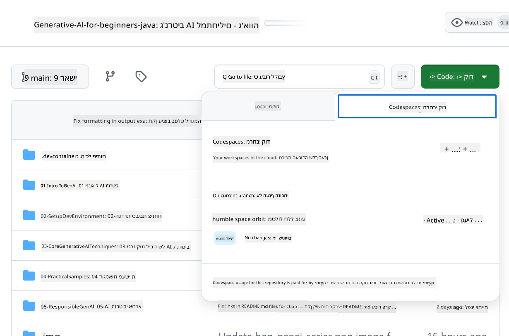

<!--
CO_OP_TRANSLATOR_METADATA:
{
  "original_hash": "bfdb4b4eadbee3a59ef742439f58326a",
  "translation_date": "2025-07-27T13:17:23+00:00",
  "source_file": "02-SetupDevEnvironment/getting-started-azure-openai.md",
  "language_code": "he"
}
-->
# הגדרת סביבת הפיתוח עבור Azure OpenAI

> **התחלה מהירה**: מדריך זה מיועד להגדרת Azure OpenAI. להתחלה מיידית עם מודלים חינמיים, השתמשו ב-[GitHub Models with Codespaces](./README.md#quick-start-cloud).

מדריך זה יסייע לכם להגדיר מודלים של Azure AI Foundry עבור אפליקציות Java AI בקורס זה.

## תוכן עניינים

- [סקירה כללית של ההגדרה המהירה](../../../02-SetupDevEnvironment)
- [שלב 1: יצירת משאבי Azure AI Foundry](../../../02-SetupDevEnvironment)
  - [יצירת Hub ופרויקט](../../../02-SetupDevEnvironment)
  - [פריסת מודל GPT-4o-mini](../../../02-SetupDevEnvironment)
- [שלב 2: יצירת Codespace](../../../02-SetupDevEnvironment)
- [שלב 3: הגדרת הסביבה](../../../02-SetupDevEnvironment)
- [שלב 4: בדיקת ההגדרה](../../../02-SetupDevEnvironment)
- [מה הלאה?](../../../02-SetupDevEnvironment)
- [משאבים](../../../02-SetupDevEnvironment)
- [משאבים נוספים](../../../02-SetupDevEnvironment)

## סקירה כללית של ההגדרה המהירה

1. יצירת משאבי Azure AI Foundry (Hub, פרויקט, מודל)
2. יצירת Codespace עם מכולת פיתוח Java
3. הגדרת קובץ .env עם אישורי Azure OpenAI
4. בדיקת ההגדרה עם פרויקט הדוגמה

## שלב 1: יצירת משאבי Azure AI Foundry

### יצירת Hub ופרויקט

1. היכנסו ל-[Azure AI Foundry Portal](https://ai.azure.com/) והתחברו
2. לחצו על **+ Create** → **New hub** (או נווטו ל-**Management** → **All hubs** → **+ New hub**)
3. הגדירו את ה-Hub:
   - **Hub name**: לדוגמה, "MyAIHub"
   - **Subscription**: בחרו את המנוי שלכם ב-Azure
   - **Resource group**: צרו חדש או בחרו קיים
   - **Location**: בחרו את המיקום הקרוב ביותר אליכם
   - **Storage account**: השתמשו בברירת המחדל או הגדירו מותאם אישית
   - **Key vault**: השתמשו בברירת המחדל או הגדירו מותאם אישית
   - לחצו על **Next** → **Review + create** → **Create**
4. לאחר יצירת ה-Hub, לחצו על **+ New project** (או **Create project** מתוך תצוגת ה-Hub)
   - **Project name**: לדוגמה, "GenAIJava"
   - לחצו על **Create**

### פריסת מודל GPT-4o-mini

1. בפרויקט שלכם, עברו ל-**Model catalog** וחפשו את **gpt-4o-mini**
   - *חלופה: עברו ל-**Deployments** → **+ Create deployment***
2. לחצו על **Deploy** בכרטיס המודל gpt-4o-mini
3. הגדירו את הפריסה:
   - **Deployment name**: "gpt-4o-mini"
   - **Model version**: השתמשו בגרסה העדכנית ביותר
   - **Deployment type**: Standard
4. לחצו על **Deploy**
5. לאחר הפריסה, עברו ללשונית **Deployments** והעתיקו את הערכים הבאים:
   - **Deployment name** (לדוגמה, "gpt-4o-mini")
   - **Target URI** (לדוגמה, `https://your-hub-name.openai.azure.com/`)  
      > **חשוב**: העתיקו רק את כתובת ה-URL הבסיסית (לדוגמה, `https://myhub.openai.azure.com/`) ולא את כל נתיב ה-endpoint.
   - **Key** (מקטע Keys and Endpoint)

> **עדיין יש בעיות?** בקרו בתיעוד הרשמי של [Azure AI Foundry](https://learn.microsoft.com/azure/ai-foundry/how-to/create-projects?tabs=ai-foundry&pivots=hub-project)

## שלב 2: יצירת Codespace

1. בצעו Fork למאגר זה לחשבון ה-GitHub שלכם  
   > **הערה**: אם ברצונכם לערוך את ההגדרות הבסיסיות, עיינו ב-[Dev Container Configuration](../../../.devcontainer/devcontainer.json)
2. במאגר ה-Fork שלכם, לחצו על **Code** → לשונית **Codespaces**
3. לחצו על **...** → **New with options...**  

4. בחרו **Dev container configuration**: 
   - **Generative AI Java Development Environment**
5. לחצו על **Create codespace**

## שלב 3: הגדרת הסביבה

לאחר שה-Codespace שלכם מוכן, הגדירו את אישורי Azure OpenAI:

1. **נווטו לפרויקט הדוגמה משורש המאגר:**
   ```bash
   cd 02-SetupDevEnvironment/examples/basic-chat-azure
   ```

2. **צרו את קובץ ה-.env שלכם:**
   ```bash
   cp .env.example .env
   ```

3. **ערכו את קובץ ה-.env עם אישורי Azure OpenAI שלכם:**
   ```bash
   # Your Azure OpenAI API key (from Azure AI Foundry portal)
   AZURE_AI_KEY=your-actual-api-key-here
   
   # Your Azure OpenAI endpoint URL (e.g., https://myhub.openai.azure.com/)
   AZURE_AI_ENDPOINT=https://your-hub-name.openai.azure.com/
   ```

   > **הערת אבטחה**: 
   > - לעולם אל תעלו את קובץ ה-`.env` למערכת ניהול גרסאות
   > - קובץ ה-`.env` כבר כלול ב-`.gitignore`
   > - שמרו על מפתחות ה-API שלכם מאובטחים והחליפו אותם באופן קבוע

## שלב 4: בדיקת ההגדרה

הריצו את אפליקציית הדוגמה כדי לבדוק את החיבור ל-Azure OpenAI:

```bash
mvn clean spring-boot:run
```

אתם אמורים לראות תגובה ממודל GPT-4o-mini!

> **משתמשי VS Code**: ניתן גם ללחוץ על `F5` ב-VS Code כדי להריץ את האפליקציה. תצורת ההפעלה כבר מוגדרת לטעון את קובץ ה-`.env` שלכם באופן אוטומטי.

> **דוגמה מלאה**: עיינו ב-[דוגמת Azure OpenAI מקצה לקצה](./examples/basic-chat-azure/README.md) להוראות מפורטות ופתרון בעיות.

## מה הלאה?

**ההגדרה הושלמה!** כעת יש לכם:
- Azure OpenAI עם gpt-4o-mini בפריסה
- קובץ .env מקומי מוגדר
- סביבת פיתוח Java מוכנה

**המשיכו ל** [פרק 3: טכניקות ליבה ב-AI גנרטיבי](../03-CoreGenerativeAITechniques/README.md) כדי להתחיל לבנות אפליקציות AI!

## משאבים

- [תיעוד Azure AI Foundry](https://learn.microsoft.com/azure/ai-services/)
- [תיעוד Spring AI Azure OpenAI](https://docs.spring.io/spring-ai/reference/api/clients/azure-openai-chat.html)
- [Azure OpenAI Java SDK](https://learn.microsoft.com/java/api/overview/azure/ai-openai-readme)

## משאבים נוספים

- [הורדת VS Code](https://code.visualstudio.com/Download)
- [קבלת Docker Desktop](https://www.docker.com/products/docker-desktop)
- [Dev Container Configuration](../../../.devcontainer/devcontainer.json)

**כתב ויתור**:  
מסמך זה תורגם באמצעות שירות תרגום מבוסס בינה מלאכותית [Co-op Translator](https://github.com/Azure/co-op-translator). למרות שאנו שואפים לדיוק, יש להיות מודעים לכך שתרגומים אוטומטיים עשויים להכיל שגיאות או אי-דיוקים. המסמך המקורי בשפתו המקורית צריך להיחשב כמקור הסמכותי. למידע קריטי, מומלץ להשתמש בתרגום מקצועי על ידי בני אדם. איננו נושאים באחריות לאי-הבנות או לפרשנויות שגויות הנובעות משימוש בתרגום זה.