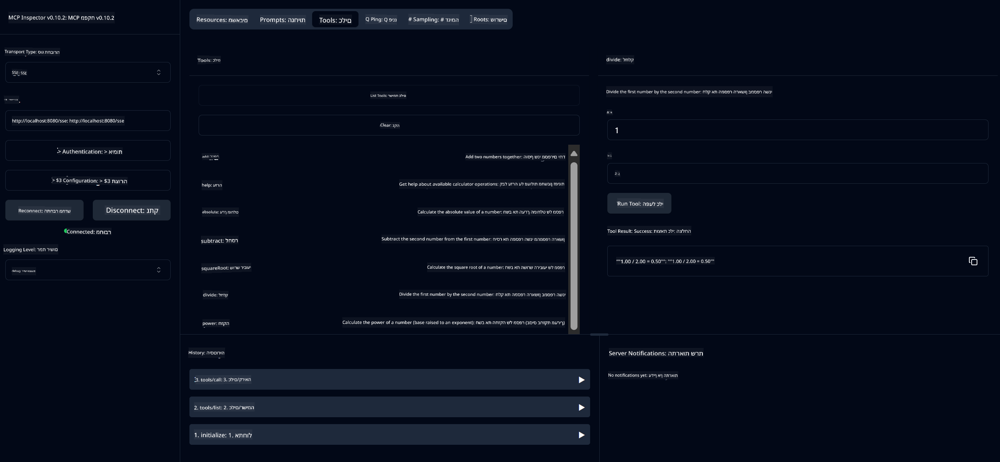

<!--
CO_OP_TRANSLATOR_METADATA:
{
  "original_hash": "7bf9a4a832911269a8bd0decb97ff36c",
  "translation_date": "2025-07-21T19:59:22+00:00",
  "source_file": "04-PracticalSamples/mcp/calculator/README.md",
  "language_code": "he"
}
-->
# שירות מחשבון בסיסי MCP

>**הערה**: פרק זה כולל [**מדריך**](./TUTORIAL.md) שמנחה אותך כיצד להפעיל את הדוגמאות המוכנות.

ברוכים הבאים להתנסות המעשית הראשונה שלכם עם **Model Context Protocol (MCP)**! בפרקים הקודמים למדתם על יסודות בינה מלאכותית גנרטיבית והגדרתם את סביבת הפיתוח שלכם. עכשיו הגיע הזמן לבנות משהו פרקטי.

שירות המחשבון הזה מדגים כיצד מודלים של בינה מלאכותית יכולים לתקשר בצורה מאובטחת עם כלים חיצוניים באמצעות MCP. במקום להסתמך על יכולות החישוב הלא תמיד מדויקות של מודל הבינה המלאכותית, נראה כיצד לבנות מערכת חזקה שבה הבינה המלאכותית יכולה לקרוא לשירותים מתמחים לביצוע חישובים מדויקים.

## תוכן עניינים

- [מה תלמדו](../../../../../04-PracticalSamples/mcp/calculator)
- [דרישות מוקדמות](../../../../../04-PracticalSamples/mcp/calculator)
- [מושגים מרכזיים](../../../../../04-PracticalSamples/mcp/calculator)
- [התחלה מהירה](../../../../../04-PracticalSamples/mcp/calculator)
- [פעולות מחשבון זמינות](../../../../../04-PracticalSamples/mcp/calculator)
- [לקוחות בדיקה](../../../../../04-PracticalSamples/mcp/calculator)
  - [1. לקוח MCP ישיר (SDKClient)](../../../../../04-PracticalSamples/mcp/calculator)
  - [2. לקוח מבוסס בינה מלאכותית (LangChain4jClient)](../../../../../04-PracticalSamples/mcp/calculator)
- [מפקח MCP (ממשק אינטרנט)](../../../../../04-PracticalSamples/mcp/calculator)
  - [הוראות שלב-אחר-שלב](../../../../../04-PracticalSamples/mcp/calculator)

## מה תלמדו

על ידי עבודה עם הדוגמה הזו, תבינו:
- כיצד ליצור שירותים תואמי MCP באמצעות Spring Boot
- ההבדל בין תקשורת פרוטוקול ישירה לאינטראקציה מבוססת בינה מלאכותית
- כיצד מודלים של בינה מלאכותית מחליטים מתי וכיצד להשתמש בכלים חיצוניים
- שיטות עבודה מומלצות לבניית יישומי בינה מלאכותית המשלבים כלים

מושלם למתחילים הלומדים את מושגי MCP ומוכנים לבנות את האינטגרציה הראשונה שלהם עם כלי בינה מלאכותית!

## דרישות מוקדמות

- Java 21+
- Maven 3.6+
- **אסימון GitHub**: נדרש עבור הלקוח מבוסס הבינה המלאכותית. אם עדיין לא הגדרתם זאת, ראו [פרק 2: הגדרת סביבת הפיתוח שלכם](../../../02-SetupDevEnvironment/README.md) להוראות.

## מושגים מרכזיים

**Model Context Protocol (MCP)** הוא דרך סטנדרטית עבור יישומי בינה מלאכותית להתחבר בצורה מאובטחת לכלים חיצוניים. חשבו על זה כ"גשר" שמאפשר למודלים של בינה מלאכותית להשתמש בשירותים חיצוניים כמו המחשבון שלנו. במקום שהמודל ינסה לבצע חישובים בעצמו (מה שעלול להיות לא מדויק), הוא יכול לקרוא לשירות המחשבון שלנו כדי לקבל תוצאות מדויקות. MCP מבטיח שהתקשורת הזו תתבצע בצורה בטוחה ועקבית.

**Server-Sent Events (SSE)** מאפשרים תקשורת בזמן אמת בין השרת ללקוחות. בניגוד לבקשות HTTP מסורתיות שבהן מבקשים וממתינים לתגובה, SSE מאפשר לשרת לשלוח עדכונים רציפים ללקוח. זה מושלם עבור יישומי בינה מלאכותית שבהם התגובות עשויות להיות מוזרמות או לקחת זמן לעיבוד.

**כלי בינה מלאכותית וקריאה לפונקציות** מאפשרים למודלים של בינה מלאכותית לבחור ולהשתמש באופן אוטומטי בפונקציות חיצוניות (כמו פעולות מחשבון) על בסיס בקשות המשתמש. כשאתם שואלים "מה זה 15 + 27?", מודל הבינה המלאכותית מבין שאתם רוצים חיבור, קורא אוטומטית לכלי `add` עם הפרמטרים הנכונים (15, 27), ומחזיר את התוצאה בשפה טבעית. הבינה המלאכותית פועלת כמתאמת חכמה שיודעת מתי וכיצד להשתמש בכל כלי.

## התחלה מהירה

### 1. נווטו לתיקיית יישום המחשבון
```bash
cd Generative-AI-for-beginners-java/04-PracticalSamples/mcp/calculator
```

### 2. בנייה והפעלה
```bash
mvn clean install -DskipTests
java -jar target/calculator-server-0.0.1-SNAPSHOT.jar
```

### 3. בדיקה עם לקוחות
- **SDKClient**: אינטראקציה ישירה עם פרוטוקול MCP
- **LangChain4jClient**: אינטראקציה בשפה טבעית מבוססת בינה מלאכותית (דורש אסימון GitHub)

## פעולות מחשבון זמינות

- `add(a, b)`, `subtract(a, b)`, `multiply(a, b)`, `divide(a, b)`
- `power(base, exponent)`, `squareRoot(number)`, `absolute(number)`
- `modulus(a, b)`, `help()`

## לקוחות בדיקה

### 1. לקוח MCP ישיר (SDKClient)
בודק תקשורת פרוטוקול MCP גולמית. הפעלה:
```bash
mvn test-compile exec:java -Dexec.mainClass="com.microsoft.mcp.sample.client.SDKClient" -Dexec.classpathScope=test
```

### 2. לקוח מבוסס בינה מלאכותית (LangChain4jClient)
מדגים אינטראקציה בשפה טבעית עם מודלים של GitHub. דורש אסימון GitHub (ראו [דרישות מוקדמות](../../../../../04-PracticalSamples/mcp/calculator)).

**הפעלה:**
```bash
mvn test-compile exec:java -Dexec.mainClass="com.microsoft.mcp.sample.client.LangChain4jClient" -Dexec.classpathScope=test
```

## מפקח MCP (ממשק אינטרנט)

מפקח MCP מספק ממשק אינטרנט חזותי לבדיקת שירות ה-MCP שלכם ללא צורך בכתיבת קוד. מושלם למתחילים שרוצים להבין כיצד MCP עובד!

### הוראות שלב-אחר-שלב:

1. **הפעילו את שרת המחשבון** (אם הוא לא פועל כבר):
   ```bash
   java -jar target/calculator-server-0.0.1-SNAPSHOT.jar
   ```

2. **התקינו והפעילו את מפקח MCP** בחלון טרמינל חדש:
   ```bash
   npx @modelcontextprotocol/inspector
   ```

3. **פתחו את הממשק האינטרנטי**:
   - חפשו הודעה כמו "Inspector running at http://localhost:6274"
   - פתחו את הכתובת הזו בדפדפן שלכם

4. **התחברו לשירות המחשבון שלכם**:
   - בממשק האינטרנטי, הגדירו את סוג התעבורה ל-"SSE"
   - הגדירו את ה-URL ל: `http://localhost:8080/sse`
   - לחצו על כפתור "Connect"

5. **חקירת כלים זמינים**:
   - לחצו על "List Tools" כדי לראות את כל פעולות המחשבון
   - תראו פונקציות כמו `add`, `subtract`, `multiply` ועוד.

6. **בדיקת פעולה של מחשבון**:
   - בחרו כלי (לדוגמה, "add")
   - הזינו פרמטרים (לדוגמה, `a: 15`, `b: 27`)
   - לחצו על "Run Tool"
   - ראו את התוצאה שהוחזרה על ידי שירות ה-MCP שלכם!

הגישה החזותית הזו עוזרת לכם להבין בדיוק כיצד תקשורת MCP פועלת לפני שתבנו לקוחות משלכם.



---
**עיון נוסף:** [תיעוד MCP Server Boot Starter](https://docs.spring.io/spring-ai/reference/api/mcp/mcp-server-boot-starter-docs.html)

**כתב ויתור**:  
מסמך זה תורגם באמצעות שירות תרגום מבוסס בינה מלאכותית [Co-op Translator](https://github.com/Azure/co-op-translator). למרות שאנו שואפים לדיוק, יש להיות מודעים לכך שתרגומים אוטומטיים עשויים להכיל שגיאות או אי-דיוקים. המסמך המקורי בשפתו המקורית צריך להיחשב כמקור הסמכותי. למידע קריטי, מומלץ להשתמש בתרגום מקצועי על ידי בני אדם. איננו נושאים באחריות לאי-הבנות או לפרשנויות שגויות הנובעות משימוש בתרגום זה.