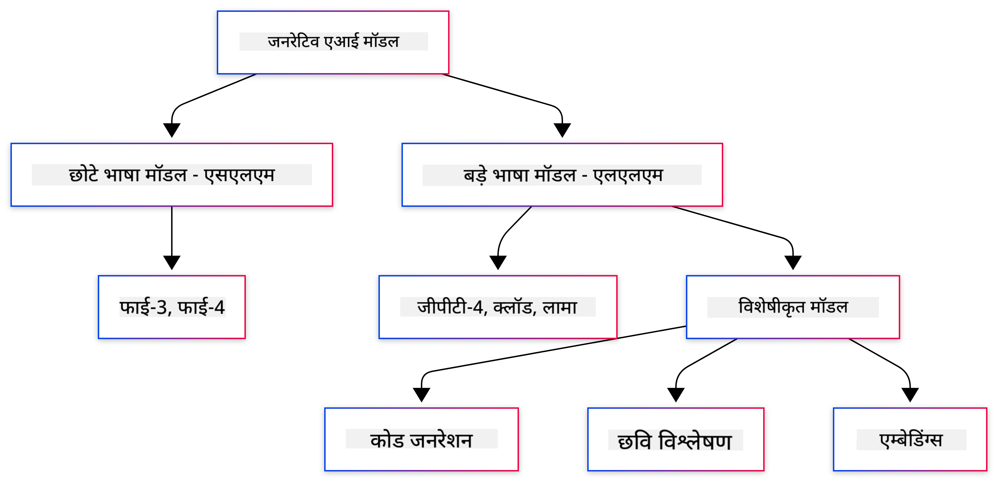
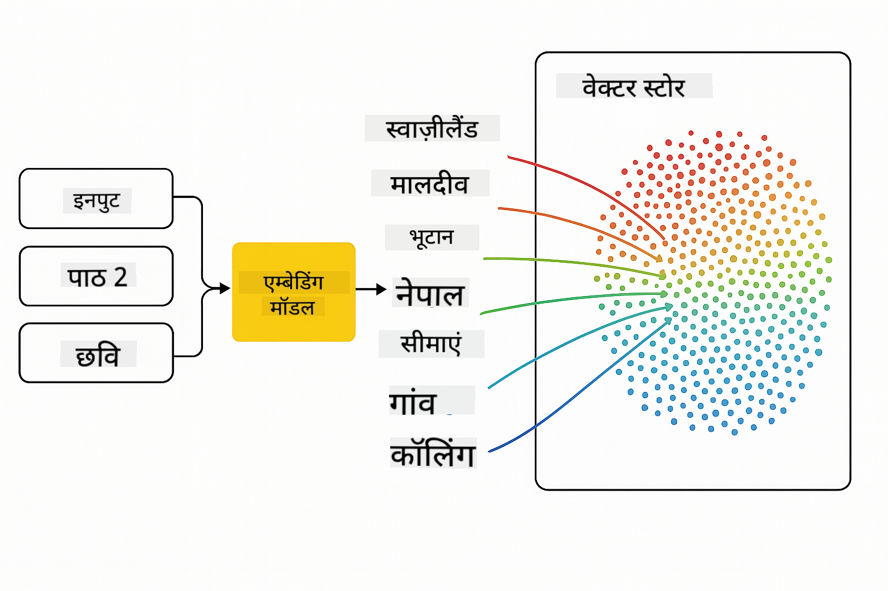
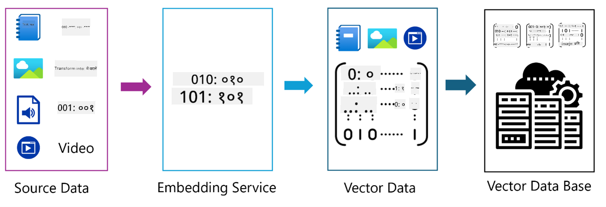
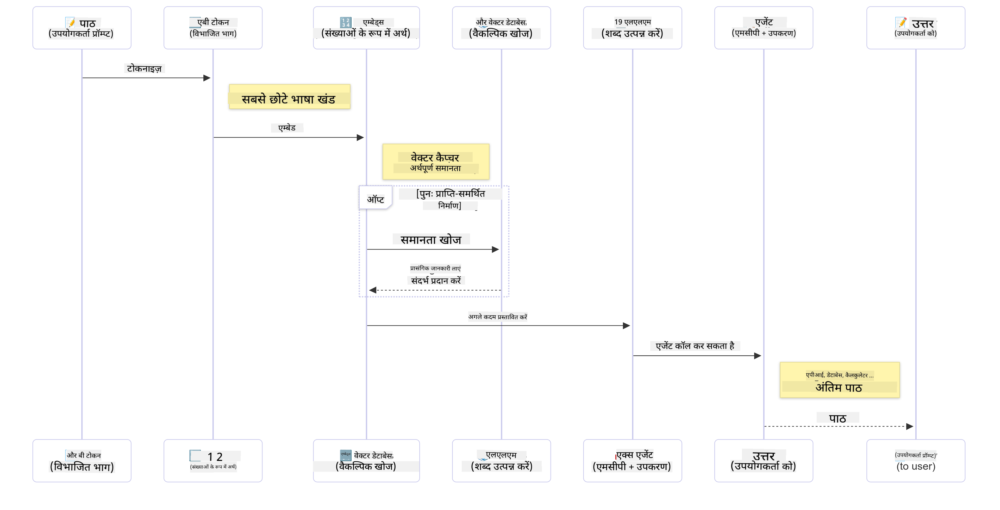

<!--
CO_OP_TRANSLATOR_METADATA:
{
  "original_hash": "6d8b4a0d774dc2a1e97c95859a6d6e4b",
  "translation_date": "2025-07-21T17:04:06+00:00",
  "source_file": "01-IntroToGenAI/README.md",
  "language_code": "hi"
}
-->
# जेनरेटिव एआई का परिचय - जावा संस्करण

## आप क्या सीखेंगे

- **जेनरेटिव एआई की मूल बातें**, जिसमें LLMs, प्रॉम्प्ट इंजीनियरिंग, टोकन, एम्बेडिंग और वेक्टर डेटाबेस शामिल हैं  
- **जावा एआई डेवलपमेंट टूल्स की तुलना**, जैसे Azure OpenAI SDK, Spring AI, और OpenAI Java SDK  
- **मॉडल कॉन्टेक्स्ट प्रोटोकॉल** और एआई एजेंट संचार में इसकी भूमिका को समझना  

## सामग्री की तालिका

- [परिचय](../../../01-IntroToGenAI)  
- [जेनरेटिव एआई अवधारणाओं पर एक त्वरित पुनरावलोकन](../../../01-IntroToGenAI)  
- [प्रॉम्प्ट इंजीनियरिंग की समीक्षा](../../../01-IntroToGenAI)  
- [टोकन, एम्बेडिंग, और एजेंट](../../../01-IntroToGenAI)  
- [जावा के लिए एआई डेवलपमेंट टूल्स और लाइब्रेरी](../../../01-IntroToGenAI)  
  - [OpenAI Java SDK](../../../01-IntroToGenAI)  
  - [Spring AI](../../../01-IntroToGenAI)  
  - [Azure OpenAI Java SDK](../../../01-IntroToGenAI)  
- [सारांश](../../../01-IntroToGenAI)  
- [अगले कदम](../../../01-IntroToGenAI)  

## परिचय

जेनरेटिव एआई फॉर बिगिनर्स - जावा संस्करण के पहले अध्याय में आपका स्वागत है! यह बुनियादी पाठ आपको जेनरेटिव एआई के मुख्य अवधारणाओं और जावा का उपयोग करके उनके साथ काम करने के तरीके से परिचित कराता है। आप एआई एप्लिकेशन के आवश्यक निर्माण खंडों के बारे में जानेंगे, जिसमें बड़े भाषा मॉडल (LLMs), टोकन, एम्बेडिंग और एआई एजेंट शामिल हैं। हम इस पाठ्यक्रम में उपयोग किए जाने वाले प्रमुख जावा टूलिंग का भी अन्वेषण करेंगे।

### जेनरेटिव एआई अवधारणाओं पर एक त्वरित पुनरावलोकन

जेनरेटिव एआई कृत्रिम बुद्धिमत्ता का एक प्रकार है जो डेटा से सीखे गए पैटर्न और संबंधों के आधार पर नया कंटेंट, जैसे टेक्स्ट, इमेज या कोड, बनाता है। जेनरेटिव एआई मॉडल मानव जैसे उत्तर उत्पन्न कर सकते हैं, संदर्भ को समझ सकते हैं, और कभी-कभी ऐसा कंटेंट बना सकते हैं जो मानव जैसा प्रतीत होता है।

जब आप अपने जावा एआई एप्लिकेशन विकसित करेंगे, तो आप **जेनरेटिव एआई मॉडल्स** का उपयोग करके कंटेंट बनाएंगे। जेनरेटिव एआई मॉडल्स की कुछ क्षमताएं निम्नलिखित हैं:

- **टेक्स्ट जनरेशन**: चैटबॉट्स, कंटेंट और टेक्स्ट कंप्लीशन के लिए मानव जैसे टेक्स्ट तैयार करना।  
- **इमेज जनरेशन और एनालिसिस**: वास्तविक इमेज बनाना, फोटो को बेहतर बनाना, और ऑब्जेक्ट्स का पता लगाना।  
- **कोड जनरेशन**: कोड स्निपेट्स या स्क्रिप्ट्स लिखना।  

कुछ विशेष प्रकार के मॉडल विभिन्न कार्यों के लिए अनुकूलित होते हैं। उदाहरण के लिए, **छोटे भाषा मॉडल (SLMs)** और **बड़े भाषा मॉडल (LLMs)** दोनों टेक्स्ट जनरेशन को संभाल सकते हैं, लेकिन LLMs आमतौर पर जटिल कार्यों के लिए बेहतर प्रदर्शन प्रदान करते हैं। इमेज से संबंधित कार्यों के लिए, आप विशेष विज़न मॉडल या मल्टी-मोडल मॉडल का उपयोग करेंगे।

हालांकि, इन मॉडलों के उत्तर हमेशा सही नहीं होते। आपने शायद सुना होगा कि मॉडल "हैलुसिनेट" करते हैं या गलत जानकारी को आत्मविश्वासपूर्ण तरीके से प्रस्तुत करते हैं। लेकिन आप मॉडल को स्पष्ट निर्देश और संदर्भ प्रदान करके बेहतर उत्तर उत्पन्न करने में मदद कर सकते हैं। यही वह जगह है जहां **प्रॉम्प्ट इंजीनियरिंग** काम आती है।

#### प्रॉम्प्ट इंजीनियरिंग की समीक्षा

प्रॉम्प्ट इंजीनियरिंग एआई मॉडल्स को वांछित आउटपुट की ओर मार्गदर्शन करने के लिए प्रभावी इनपुट डिज़ाइन करने का अभ्यास है। इसमें शामिल हैं:

- **स्पष्टता**: निर्देशों को स्पष्ट और अस्पष्ट बनाना।  
- **संदर्भ**: आवश्यक पृष्ठभूमि जानकारी प्रदान करना।  
- **सीमाएं**: किसी भी प्रतिबंध या प्रारूप निर्दिष्ट करना।  

प्रॉम्प्ट इंजीनियरिंग के कुछ सर्वोत्तम अभ्यासों में प्रॉम्प्ट डिज़ाइन, स्पष्ट निर्देश, कार्य का विभाजन, वन-शॉट और फ्यू-शॉट लर्निंग, और प्रॉम्प्ट ट्यूनिंग शामिल हैं। आपके विशेष उपयोग के मामले के लिए क्या सबसे अच्छा काम करता है, यह जानने के लिए विभिन्न प्रॉम्प्ट्स का परीक्षण करना आवश्यक है।

एप्लिकेशन विकसित करते समय, आप विभिन्न प्रकार के प्रॉम्प्ट्स के साथ काम करेंगे:
- **सिस्टम प्रॉम्प्ट्स**: मॉडल के व्यवहार के लिए आधारभूत नियम और संदर्भ सेट करें।  
- **यूजर प्रॉम्प्ट्स**: आपके एप्लिकेशन उपयोगकर्ताओं से इनपुट डेटा।  
- **असिस्टेंट प्रॉम्प्ट्स**: सिस्टम और यूजर प्रॉम्प्ट्स के आधार पर मॉडल के उत्तर।  

> **अधिक जानें**: [जेनएआई फॉर बिगिनर्स कोर्स के प्रॉम्प्ट इंजीनियरिंग अध्याय](https://github.com/microsoft/generative-ai-for-beginners/tree/main/04-prompt-engineering-fundamentals) में प्रॉम्प्ट इंजीनियरिंग के बारे में अधिक जानें।

#### टोकन, एम्बेडिंग, और एजेंट

जेनरेटिव एआई मॉडल्स के साथ काम करते समय, आप **टोकन**, **एम्बेडिंग**, **एजेंट**, और **मॉडल कॉन्टेक्स्ट प्रोटोकॉल (MCP)** जैसे शब्दों का सामना करेंगे। यहां इन अवधारणाओं का विस्तृत अवलोकन है:

- **टोकन**: टोकन टेक्स्ट का सबसे छोटा इकाई है। ये शब्द, अक्षर, या उपशब्द हो सकते हैं। टोकन टेक्स्ट डेटा को उस प्रारूप में प्रस्तुत करने के लिए उपयोग किए जाते हैं जिसे मॉडल समझ सकता है। उदाहरण के लिए, वाक्य "The quick brown fox jumped over the lazy dog" को ["The", " quick", " brown", " fox", " jumped", " over", " the", " lazy", " dog"] या ["The", " qu", "ick", " br", "own", " fox", " jump", "ed", " over", " the", " la", "zy", " dog"] के रूप में टोकनाइज़ किया जा सकता है, टोकनाइज़ेशन रणनीति पर निर्भर करते हुए।

टोकनाइज़ेशन टेक्स्ट को इन छोटे इकाइयों में तोड़ने की प्रक्रिया है। यह महत्वपूर्ण है क्योंकि मॉडल कच्चे टेक्स्ट के बजाय टोकन पर काम करते हैं। प्रॉम्प्ट में टोकन की संख्या मॉडल के उत्तर की लंबाई और गुणवत्ता को प्रभावित करती है, क्योंकि मॉडल्स के संदर्भ विंडो के लिए टोकन सीमा होती है (जैसे GPT-4o के लिए कुल संदर्भ में 128K टोकन, जिसमें इनपुट और आउटपुट दोनों शामिल हैं)।

  जावा में, आप OpenAI SDK जैसी लाइब्रेरी का उपयोग करके टोकनाइज़ेशन को स्वचालित रूप से संभाल सकते हैं जब एआई मॉडल्स को अनुरोध भेजते हैं।

- **एम्बेडिंग**: एम्बेडिंग टोकन के वेक्टर प्रतिनिधित्व हैं जो अर्थ को पकड़ते हैं। ये संख्यात्मक प्रतिनिधित्व (आमतौर पर फ्लोटिंग-पॉइंट नंबरों की ऐरे) होते हैं जो मॉडल्स को शब्दों के बीच संबंधों को समझने और संदर्भ के अनुसार प्रासंगिक उत्तर उत्पन्न करने की अनुमति देते हैं। समान शब्दों के समान एम्बेडिंग होते हैं, जिससे मॉडल को पर्यायवाची और अर्थपूर्ण संबंधों को समझने में मदद मिलती है।

  जावा में, आप OpenAI SDK या अन्य लाइब्रेरी का उपयोग करके एम्बेडिंग उत्पन्न कर सकते हैं जो एम्बेडिंग जनरेशन का समर्थन करती हैं। ये एम्बेडिंग सेमांटिक सर्च जैसे कार्यों के लिए आवश्यक हैं, जहां आप अर्थ के आधार पर समान कंटेंट ढूंढना चाहते हैं न कि सटीक टेक्स्ट मैच के आधार पर।

- **वेक्टर डेटाबेस**: वेक्टर डेटाबेस एम्बेडिंग के लिए अनुकूलित विशेष स्टोरेज सिस्टम हैं। ये कुशल समानता खोज को सक्षम करते हैं और रिट्रीवल-ऑगमेंटेड जनरेशन (RAG) पैटर्न के लिए महत्वपूर्ण हैं, जहां आपको बड़े डेटासेट से प्रासंगिक जानकारी सेमांटिक समानता के आधार पर ढूंढनी होती है न कि सटीक मैच के आधार पर।

> **नोट**: इस पाठ्यक्रम में, हम वेक्टर डेटाबेस को कवर नहीं करेंगे, लेकिन वे वास्तविक दुनिया के एप्लिकेशन में आमतौर पर उपयोग किए जाते हैं, इसलिए उनका उल्लेख करना उचित है।

- **एजेंट और MCP**: एआई घटक जो स्वायत्त रूप से मॉडल्स, टूल्स और बाहरी सिस्टम्स के साथ इंटरैक्ट करते हैं। मॉडल कॉन्टेक्स्ट प्रोटोकॉल (MCP) एजेंट्स को बाहरी डेटा स्रोतों और टूल्स तक सुरक्षित पहुंच प्रदान करने का एक मानकीकृत तरीका प्रदान करता है। हमारे [MCP फॉर बिगिनर्स](https://github.com/microsoft/mcp-for-beginners) पाठ्यक्रम में अधिक जानें।

जावा एआई एप्लिकेशन में, आप टेक्स्ट प्रोसेसिंग के लिए टोकन, सेमांटिक सर्च और RAG के लिए एम्बेडिंग, डेटा रिट्रीवल के लिए वेक्टर डेटाबेस, और टूल-उपयोग करने वाले सिस्टम्स बनाने के लिए MCP के साथ एजेंट्स का उपयोग करेंगे।

### जावा के लिए एआई डेवलपमेंट टूल्स और लाइब्रेरी

जावा एआई डेवलपमेंट के लिए उत्कृष्ट टूलिंग प्रदान करता है। इस पाठ्यक्रम में हम तीन मुख्य लाइब्रेरी का अन्वेषण करेंगे - OpenAI Java SDK, Azure OpenAI SDK, और Spring AI।

यहां एक त्वरित संदर्भ तालिका है जो दिखाती है कि प्रत्येक अध्याय के उदाहरण में कौन सा SDK उपयोग किया गया है:

| अध्याय | नमूना | SDK |  
|---------|--------|-----|  
| 02-SetupDevEnvironment | src/github-models/ | OpenAI Java SDK |  
| 02-SetupDevEnvironment | src/basic-chat-azure/ | Spring AI Azure OpenAI |  
| 03-CoreGenerativeAITechniques | examples/ | Azure OpenAI SDK |  
| 04-PracticalSamples | petstory/ | OpenAI Java SDK |  
| 04-PracticalSamples | foundrylocal/ | OpenAI Java SDK |  
| 04-PracticalSamples | mcp/calculator/ | Spring AI MCP SDK + LangChain4j |  

**SDK दस्तावेज़ लिंक:**  
- [Azure OpenAI Java SDK](https://github.com/Azure/azure-sdk-for-java/tree/azure-ai-openai_1.0.0-beta.16/sdk/openai/azure-ai-openai)  
- [Spring AI](https://docs.spring.io/spring-ai/reference/)  
- [OpenAI Java SDK](https://github.com/openai/openai-java)  
- [LangChain4j](https://docs.langchain4j.dev/)  

#### OpenAI Java SDK

OpenAI SDK OpenAI API के लिए आधिकारिक जावा लाइब्रेरी है। यह OpenAI के मॉडल्स के साथ इंटरैक्ट करने के लिए एक सरल और सुसंगत इंटरफ़ेस प्रदान करता है, जिससे जावा एप्लिकेशन में एआई क्षमताओं को एकीकृत करना आसान हो जाता है। अध्याय 2 के GitHub Models उदाहरण, अध्याय 4 के Pet Story एप्लिकेशन और Foundry Local उदाहरण OpenAI SDK दृष्टिकोण को प्रदर्शित करते हैं।

#### Spring AI

Spring AI एक व्यापक फ्रेमवर्क है जो Spring एप्लिकेशन में एआई क्षमताओं को लाता है, विभिन्न एआई प्रदाताओं के लिए एक सुसंगत एब्स्ट्रैक्शन लेयर प्रदान करता है। यह Spring इकोसिस्टम के साथ सहजता से एकीकृत होता है, जिससे उन एंटरप्राइज़ जावा एप्लिकेशन के लिए आदर्श विकल्प बनता है जिन्हें एआई क्षमताओं की आवश्यकता होती है।

Spring AI की ताकत इसके Spring इकोसिस्टम के साथ सहज एकीकरण में निहित है, जिससे परिचित Spring पैटर्न जैसे डिपेंडेंसी इंजेक्शन, कॉन्फ़िगरेशन प्रबंधन, और परीक्षण फ्रेमवर्क के साथ प्रोडक्शन-रेडी एआई एप्लिकेशन बनाना आसान हो जाता है। आप अध्याय 2 और 4 में OpenAI और मॉडल कॉन्टेक्स्ट प्रोटोकॉल (MCP) Spring AI लाइब्रेरी का लाभ उठाने वाले एप्लिकेशन बनाएंगे।

##### मॉडल कॉन्टेक्स्ट प्रोटोकॉल (MCP)

[मॉडल कॉन्टेक्स्ट प्रोटोकॉल (MCP)](https://modelcontextprotocol.io/) एक उभरता हुआ मानक है जो एआई एप्लिकेशन को बाहरी डेटा स्रोतों और टूल्स के साथ सुरक्षित रूप से इंटरैक्ट करने में सक्षम बनाता है। MCP एआई मॉडल्स को संदर्भ जानकारी तक पहुंचने और आपके एप्लिकेशन में क्रियाएं निष्पादित करने का एक मानकीकृत तरीका प्रदान करता है।

अध्याय 4 में, आप एक सरल MCP कैलकुलेटर सेवा बनाएंगे जो Spring AI के साथ मॉडल कॉन्टेक्स्ट प्रोटोकॉल के मूल सिद्धांतों को प्रदर्शित करती है, यह दिखाते हुए कि कैसे बुनियादी टूल इंटीग्रेशन और सेवा आर्किटेक्चर बनाए जाते हैं।

#### Azure OpenAI Java SDK

Azure OpenAI क्लाइंट लाइब्रेरी जावा के लिए OpenAI के REST APIs का एक अनुकूलन है जो एक सहज इंटरफ़ेस और Azure SDK इकोसिस्टम के साथ एकीकरण प्रदान करता है। अध्याय 3 में, आप Azure OpenAI SDK का उपयोग करके एप्लिकेशन बनाएंगे, जिसमें चैट एप्लिकेशन, फंक्शन कॉलिंग, और RAG (रिट्रीवल-ऑगमेंटेड जनरेशन) पैटर्न शामिल हैं।

> नोट: Azure OpenAI SDK फीचर्स के मामले में OpenAI Java SDK से पीछे है, इसलिए भविष्य की परियोजनाओं के लिए OpenAI Java SDK का उपयोग करने पर विचार करें।

## सारांश

**बधाई हो!** आपने सफलतापूर्वक:  
- **जेनरेटिव एआई की मूल बातें सीखी**, जिसमें LLMs, प्रॉम्प्ट इंजीनियरिंग, टोकन, एम्बेडिंग, और वेक्टर डेटाबेस शामिल हैं।  
- **जावा एआई डेवलपमेंट टूल्स की तुलना की**, जैसे Azure OpenAI SDK, Spring AI, और OpenAI Java SDK।  
- **मॉडल कॉन्टेक्स्ट प्रोटोकॉल की खोज की** और एआई एजेंट संचार में इसकी भूमिका को समझा।  

## अगले कदम

[अध्याय 2: डेवलपमेंट एनवायरनमेंट सेट करना](../02-SetupDevEnvironment/README.md)  

**अस्वीकरण**:  
यह दस्तावेज़ AI अनुवाद सेवा [Co-op Translator](https://github.com/Azure/co-op-translator) का उपयोग करके अनुवादित किया गया है। जबकि हम सटीकता सुनिश्चित करने का प्रयास करते हैं, कृपया ध्यान दें कि स्वचालित अनुवाद में त्रुटियां या अशुद्धियां हो सकती हैं। मूल भाषा में उपलब्ध मूल दस्तावेज़ को प्रामाणिक स्रोत माना जाना चाहिए। महत्वपूर्ण जानकारी के लिए, पेशेवर मानव अनुवाद की सिफारिश की जाती है। इस अनुवाद के उपयोग से उत्पन्न किसी भी गलतफहमी या गलत व्याख्या के लिए हम जिम्मेदार नहीं हैं।