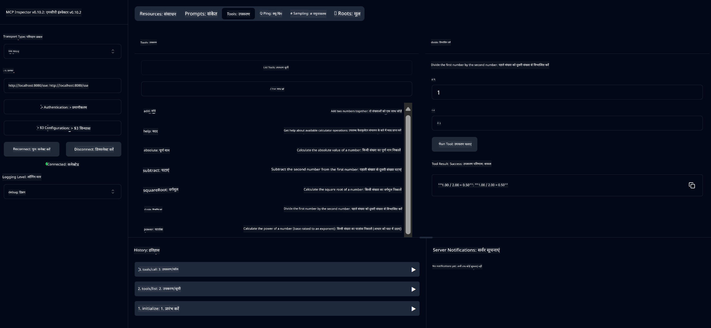

<!--
CO_OP_TRANSLATOR_METADATA:
{
  "original_hash": "7bf9a4a832911269a8bd0decb97ff36c",
  "translation_date": "2025-07-21T16:46:18+00:00",
  "source_file": "04-PracticalSamples/mcp/calculator/README.md",
  "language_code": "hi"
}
-->
# बेसिक कैलकुलेटर MCP सर्विस

>**Note**: इस अध्याय में एक [**ट्यूटोरियल**](./TUTORIAL.md) शामिल है जो आपको तैयार नमूनों को चलाने के लिए मार्गदर्शन करता है।

**मॉडल कॉन्टेक्स्ट प्रोटोकॉल (MCP)** के साथ आपका पहला व्यावहारिक अनुभव में स्वागत है! पिछले अध्यायों में, आपने जनरेटिव AI की मूल बातें सीखी और अपना डेवलपमेंट एनवायरनमेंट सेटअप किया। अब समय है कुछ व्यावहारिक बनाने का।

यह कैलकुलेटर सर्विस दिखाती है कि कैसे AI मॉडल MCP का उपयोग करके बाहरी टूल्स के साथ सुरक्षित रूप से इंटरैक्ट कर सकते हैं। AI मॉडल की कभी-कभी अस्थिर गणितीय क्षमताओं पर निर्भर रहने के बजाय, हम आपको दिखाएंगे कि कैसे एक मजबूत सिस्टम बनाया जाए जहां AI सटीक गणना के लिए विशेष सेवाओं को कॉल कर सके।

## सामग्री की सूची

- [आप क्या सीखेंगे](../../../../../04-PracticalSamples/mcp/calculator)
- [पूर्व आवश्यकताएँ](../../../../../04-PracticalSamples/mcp/calculator)
- [मुख्य अवधारणाएँ](../../../../../04-PracticalSamples/mcp/calculator)
- [त्वरित शुरुआत](../../../../../04-PracticalSamples/mcp/calculator)
- [उपलब्ध कैलकुलेटर ऑपरेशन्स](../../../../../04-PracticalSamples/mcp/calculator)
- [टेस्ट क्लाइंट्स](../../../../../04-PracticalSamples/mcp/calculator)
  - [1. डायरेक्ट MCP क्लाइंट (SDKClient)](../../../../../04-PracticalSamples/mcp/calculator)
  - [2. AI-पावर्ड क्लाइंट (LangChain4jClient)](../../../../../04-PracticalSamples/mcp/calculator)
- [MCP इंस्पेक्टर (वेब UI)](../../../../../04-PracticalSamples/mcp/calculator)
  - [स्टेप-बाय-स्टेप निर्देश](../../../../../04-PracticalSamples/mcp/calculator)

## आप क्या सीखेंगे

इस उदाहरण पर काम करके, आप समझेंगे:
- Spring Boot का उपयोग करके MCP-संगत सेवाएँ कैसे बनाएं
- डायरेक्ट प्रोटोकॉल कम्युनिकेशन और AI-पावर्ड इंटरैक्शन के बीच का अंतर
- AI मॉडल कैसे तय करते हैं कि कब और कैसे बाहरी टूल्स का उपयोग करना है
- टूल-सक्षम AI एप्लिकेशन बनाने के लिए सर्वोत्तम प्रथाएँ

MCP अवधारणाओं को सीखने वाले शुरुआती लोगों के लिए बिल्कुल सही, जो अपना पहला AI टूल इंटीग्रेशन बनाने के लिए तैयार हैं!

## पूर्व आवश्यकताएँ

- Java 21+
- Maven 3.6+
- **GitHub Token**: AI-पावर्ड क्लाइंट के लिए आवश्यक। यदि आपने इसे अभी तक सेटअप नहीं किया है, तो [अध्याय 2: अपना डेवलपमेंट एनवायरनमेंट सेटअप करना](../../../02-SetupDevEnvironment/README.md) देखें।

## मुख्य अवधारणाएँ

**मॉडल कॉन्टेक्स्ट प्रोटोकॉल (MCP)** AI एप्लिकेशन को बाहरी टूल्स से सुरक्षित रूप से कनेक्ट करने का एक मानकीकृत तरीका है। इसे एक "पुल" के रूप में सोचें जो AI मॉडल को हमारे कैलकुलेटर जैसे बाहरी सेवाओं का उपयोग करने की अनुमति देता है। AI मॉडल खुद गणना करने की कोशिश करने के बजाय (जो कभी-कभी अस्थिर हो सकता है), यह हमारे कैलकुलेटर सर्विस को कॉल करता है ताकि सटीक परिणाम प्राप्त हो सके। MCP सुनिश्चित करता है कि यह कम्युनिकेशन सुरक्षित और सुसंगत तरीके से हो।

**सर्वर-सेंट इवेंट्स (SSE)** सर्वर और क्लाइंट्स के बीच रीयल-टाइम कम्युनिकेशन को सक्षम बनाता है। पारंपरिक HTTP अनुरोधों के विपरीत, जहां आप पूछते हैं और प्रतिक्रिया की प्रतीक्षा करते हैं, SSE सर्वर को क्लाइंट को लगातार अपडेट भेजने की अनुमति देता है। यह AI एप्लिकेशन के लिए आदर्श है जहां प्रतिक्रियाएँ स्ट्रीम की जा सकती हैं या प्रक्रिया में समय लग सकता है।

**AI टूल्स और फंक्शन कॉलिंग** AI मॉडल को स्वचालित रूप से बाहरी फंक्शन्स (जैसे कैलकुलेटर ऑपरेशन्स) का चयन और उपयोग करने की अनुमति देता है। जब आप पूछते हैं "15 + 27 क्या है?", AI मॉडल समझता है कि आप जोड़ चाहते हैं, स्वचालित रूप से हमारे `add` टूल को सही पैरामीटर्स (15, 27) के साथ कॉल करता है, और प्राकृतिक भाषा में परिणाम लौटाता है। AI एक बुद्धिमान समन्वयक के रूप में कार्य करता है जो जानता है कि कब और कैसे प्रत्येक टूल का उपयोग करना है।

## त्वरित शुरुआत

### 1. कैलकुलेटर एप्लिकेशन डायरेक्टरी पर जाएं
```bash
cd Generative-AI-for-beginners-java/04-PracticalSamples/mcp/calculator
```

### 2. बिल्ड और रन करें
```bash
mvn clean install -DskipTests
java -jar target/calculator-server-0.0.1-SNAPSHOT.jar
```

### 2. क्लाइंट्स के साथ टेस्ट करें
- **SDKClient**: डायरेक्ट MCP प्रोटोकॉल इंटरैक्शन
- **LangChain4jClient**: AI-पावर्ड प्राकृतिक भाषा इंटरैक्शन (GitHub टोकन की आवश्यकता)

## उपलब्ध कैलकुलेटर ऑपरेशन्स

- `add(a, b)`, `subtract(a, b)`, `multiply(a, b)`, `divide(a, b)`
- `power(base, exponent)`, `squareRoot(number)`, `absolute(number)`
- `modulus(a, b)`, `help()`

## टेस्ट क्लाइंट्स

### 1. डायरेक्ट MCP क्लाइंट (SDKClient)
कच्चे MCP प्रोटोकॉल कम्युनिकेशन का परीक्षण करता है। रन करें:
```bash
mvn test-compile exec:java -Dexec.mainClass="com.microsoft.mcp.sample.client.SDKClient" -Dexec.classpathScope=test
```

### 2. AI-पावर्ड क्लाइंट (LangChain4jClient)
GitHub मॉडल्स के साथ प्राकृतिक भाषा इंटरैक्शन को प्रदर्शित करता है। GitHub टोकन की आवश्यकता (देखें [पूर्व आवश्यकताएँ](../../../../../04-PracticalSamples/mcp/calculator))।

**रन करें:**
```bash
mvn test-compile exec:java -Dexec.mainClass="com.microsoft.mcp.sample.client.LangChain4jClient" -Dexec.classpathScope=test
```

## MCP इंस्पेक्टर (वेब UI)

MCP इंस्पेक्टर एक विजुअल वेब इंटरफेस प्रदान करता है जो आपको कोड लिखे बिना अपनी MCP सर्विस का परीक्षण करने देता है। MCP कैसे काम करता है इसे समझने के लिए शुरुआती लोगों के लिए बिल्कुल सही!

### स्टेप-बाय-स्टेप निर्देश:

1. **कैलकुलेटर सर्वर शुरू करें** (यदि पहले से चालू नहीं है):
   ```bash
   java -jar target/calculator-server-0.0.1-SNAPSHOT.jar
   ```

2. **MCP इंस्पेक्टर इंस्टॉल और रन करें** एक नए टर्मिनल में:
   ```bash
   npx @modelcontextprotocol/inspector
   ```

3. **वेब इंटरफेस खोलें**:
   - एक संदेश देखें जैसे "Inspector running at http://localhost:6274"
   - अपने वेब ब्राउज़र में उस URL को खोलें

4. **अपनी कैलकुलेटर सर्विस से कनेक्ट करें**:
   - वेब इंटरफेस में, ट्रांसपोर्ट टाइप को "SSE" पर सेट करें
   - URL सेट करें: `http://localhost:8080/sse`
   - "Connect" बटन पर क्लिक करें

5. **उपलब्ध टूल्स एक्सप्लोर करें**:
   - "List Tools" पर क्लिक करें ताकि सभी कैलकुलेटर ऑपरेशन्स दिखें
   - आपको `add`, `subtract`, `multiply`, आदि जैसे फंक्शन्स दिखेंगे

6. **कैलकुलेटर ऑपरेशन का परीक्षण करें**:
   - एक टूल चुनें (जैसे "add")
   - पैरामीटर्स दर्ज करें (जैसे, `a: 15`, `b: 27`)
   - "Run Tool" पर क्लिक करें
   - MCP सर्विस द्वारा लौटाए गए परिणाम को देखें!

यह विजुअल दृष्टिकोण आपको MCP कम्युनिकेशन को समझने में मदद करता है, इससे पहले कि आप अपने खुद के क्लाइंट्स बनाएं।



---
**संदर्भ:** [MCP सर्वर बूट स्टार्टर डॉक्यूमेंट्स](https://docs.spring.io/spring-ai/reference/api/mcp/mcp-server-boot-starter-docs.html)

**अस्वीकरण**:  
यह दस्तावेज़ AI अनुवाद सेवा [Co-op Translator](https://github.com/Azure/co-op-translator) का उपयोग करके अनुवादित किया गया है। जबकि हम सटीकता सुनिश्चित करने का प्रयास करते हैं, कृपया ध्यान दें कि स्वचालित अनुवाद में त्रुटियां या अशुद्धियां हो सकती हैं। मूल भाषा में उपलब्ध मूल दस्तावेज़ को आधिकारिक स्रोत माना जाना चाहिए। महत्वपूर्ण जानकारी के लिए, पेशेवर मानव अनुवाद की सिफारिश की जाती है। इस अनुवाद के उपयोग से उत्पन्न किसी भी गलतफहमी या गलत व्याख्या के लिए हम उत्तरदायी नहीं हैं।