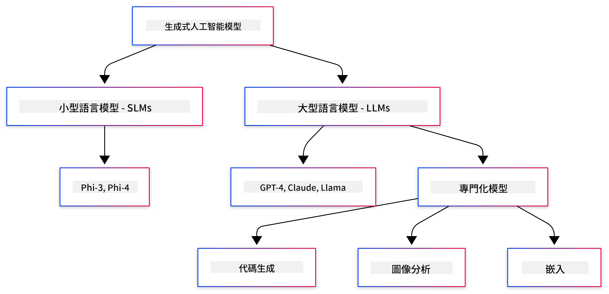
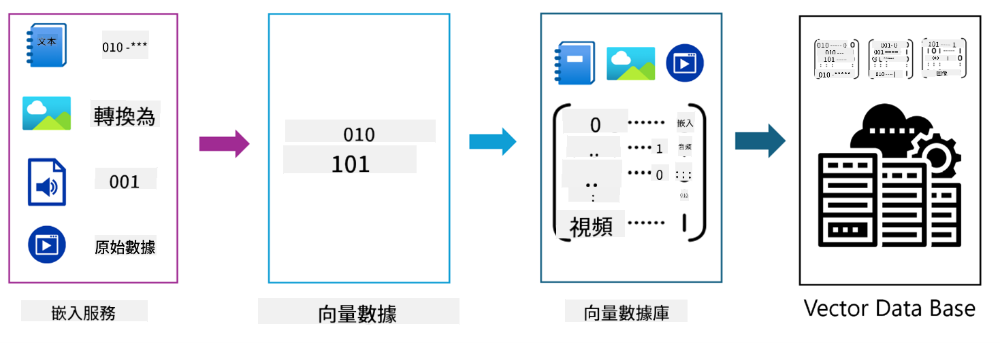
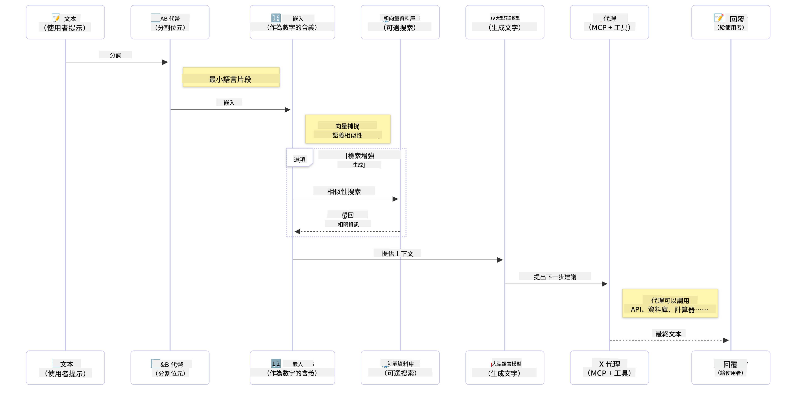

<!--
CO_OP_TRANSLATOR_METADATA:
{
  "original_hash": "6d8b4a0d774dc2a1e97c95859a6d6e4b",
  "translation_date": "2025-07-21T16:58:53+00:00",
  "source_file": "01-IntroToGenAI/README.md",
  "language_code": "hk"
}
-->
# 生成式人工智能入門 - Java 版

## 你將學到的內容

- **生成式人工智能基礎知識**，包括大型語言模型（LLMs）、提示工程、tokens、嵌入和向量數據庫
- **比較 Java AI 開發工具**，包括 Azure OpenAI SDK、Spring AI 和 OpenAI Java SDK
- **探索模型上下文協議（MCP）**及其在 AI 代理通信中的作用

## 目錄

- [簡介](../../../01-IntroToGenAI)
- [生成式人工智能概念快速回顧](../../../01-IntroToGenAI)
- [提示工程回顧](../../../01-IntroToGenAI)
- [Tokens、嵌入和代理](../../../01-IntroToGenAI)
- [Java 的 AI 開發工具和庫](../../../01-IntroToGenAI)
  - [OpenAI Java SDK](../../../01-IntroToGenAI)
  - [Spring AI](../../../01-IntroToGenAI)
  - [Azure OpenAI Java SDK](../../../01-IntroToGenAI)
- [總結](../../../01-IntroToGenAI)
- [下一步](../../../01-IntroToGenAI)

## 簡介

歡迎來到《生成式人工智能入門 - Java 版》的第一章！這一基礎課程將向你介紹生成式人工智能的核心概念，以及如何使用 Java 與這些概念進行互動。你將學習 AI 應用的基本構建塊，包括大型語言模型（LLMs）、tokens、嵌入和 AI 代理。我們還將探索你在整個課程中使用的主要 Java 工具。

### 生成式人工智能概念快速回顧

生成式人工智能是一種能夠根據從數據中學到的模式和關係創建新內容（如文本、圖像或代碼）的人工智能。生成式人工智能模型可以生成類似人類的回應、理解上下文，有時甚至創造看起來像人類創作的內容。

在開發 Java AI 應用時，你將使用**生成式人工智能模型**來創建內容。生成式人工智能模型的一些能力包括：

- **文本生成**：為聊天機器人、內容創作和文本補全生成類似人類的文本。
- **圖像生成和分析**：生成逼真的圖像、增強照片以及檢測物體。
- **代碼生成**：編寫代碼片段或腳本。

有些模型針對不同任務進行了優化。例如，**小型語言模型（SLMs）**和**大型語言模型（LLMs）**都可以處理文本生成，但 LLMs 通常在處理複雜任務時表現更佳。對於圖像相關任務，你可以使用專門的視覺模型或多模態模型。

當然，這些模型的回應並非總是完美的。你可能聽說過模型會“幻覺”或以權威的方式生成錯誤信息。但你可以通過提供清晰的指令和上下文來幫助模型生成更好的回應。這就是**提示工程**的作用。

#### 提示工程回顧

提示工程是設計有效輸入以引導 AI 模型生成期望輸出的實踐。它包括：

- **清晰性**：使指令清晰且不含歧義。
- **上下文**：提供必要的背景信息。
- **約束**：指定任何限制或格式。

提示工程的一些最佳實踐包括提示設計、清晰指令、任務分解、單次學習和少次學習，以及提示調整。測試不同的提示對於找到最適合特定使用案例的方式至關重要。

在開發應用時，你將使用不同類型的提示：
- **系統提示**：設置模型行為的基本規則和上下文
- **用戶提示**：來自應用用戶的輸入數據
- **助手提示**：基於系統和用戶提示的模型回應

> **了解更多**：在 [生成式人工智能入門課程的提示工程章節](https://github.com/microsoft/generative-ai-for-beginners/tree/main/04-prompt-engineering-fundamentals) 中了解更多提示工程知識

#### Tokens、嵌入和代理

在使用生成式人工智能模型時，你會遇到一些術語，例如 **tokens**、**嵌入**、**代理** 和 **模型上下文協議（MCP）**。以下是這些概念的詳細概述：

- **Tokens**：Tokens 是模型中的最小文本單位。它們可以是單詞、字符或子詞。Tokens 用於以模型能理解的格式表示文本數據。例如，句子 "The quick brown fox jumped over the lazy dog" 可能被分解為 ["The", " quick", " brown", " fox", " jumped", " over", " the", " lazy", " dog"] 或 ["The", " qu", "ick", " br", "own", " fox", " jump", "ed", " over", " the", " la", "zy", " dog"]，具體取決於分詞策略。

分詞是將文本分解為這些小單位的過程。這非常重要，因為模型是基於 tokens 而非原始文本進行操作的。提示中的 tokens 數量會影響模型的回應長度和質量，因為模型的上下文窗口有 tokens 限制（例如 GPT-4o 的總上下文限制為 128K tokens，包括輸入和輸出）。

  在 Java 中，你可以使用 OpenAI SDK 等庫在向 AI 模型發送請求時自動處理分詞。

- **嵌入**：嵌入是捕捉語義意義的 tokens 的向量表示。它們是數字表示（通常是浮點數數組），使模型能夠理解單詞之間的關係並生成上下文相關的回應。相似的單詞具有相似的嵌入，這使模型能夠理解同義詞和語義關係。

  在 Java 中，你可以使用 OpenAI SDK 或支持嵌入生成的其他庫生成嵌入。這些嵌入對於語義搜索等任務至關重要，因為你希望根據意義而非精確文本匹配找到相似內容。

- **向量數據庫**：向量數據庫是針對嵌入進行優化的專門存儲系統。它們支持高效的相似性搜索，對於需要基於語義相似性而非精確匹配從大型數據集中查找相關信息的檢索增強生成（RAG）模式至關重要。

> **注意**：本課程不會涵蓋向量數據庫，但它們在實際應用中非常常見，因此值得一提。

- **代理與 MCP**：AI 組件能夠自主與模型、工具和外部系統交互。模型上下文協議（MCP）提供了一種標準化方式，使代理能夠安全地訪問外部數據源和工具。更多內容請參閱我們的 [MCP 入門課程](https://github.com/microsoft/mcp-for-beginners)。

在 Java AI 應用中，你將使用 tokens 進行文本處理，嵌入進行語義搜索和 RAG，向量數據庫進行數據檢索，以及使用 MCP 的代理構建智能工具使用系統。

### Java 的 AI 開發工具和庫

Java 提供了出色的 AI 開發工具。整個課程中，我們將探索三個主要庫——OpenAI Java SDK、Azure OpenAI SDK 和 Spring AI。

以下是每章示例中使用的 SDK 的快速參考表：

| 章節 | 示例 | SDK |
|---------|--------|-----|
| 02-SetupDevEnvironment | src/github-models/ | OpenAI Java SDK |
| 02-SetupDevEnvironment | src/basic-chat-azure/ | Spring AI Azure OpenAI |
| 03-CoreGenerativeAITechniques | examples/ | Azure OpenAI SDK |
| 04-PracticalSamples | petstory/ | OpenAI Java SDK |
| 04-PracticalSamples | foundrylocal/ | OpenAI Java SDK |
| 04-PracticalSamples | mcp/calculator/ | Spring AI MCP SDK + LangChain4j |

**SDK 文檔鏈接：**
- [Azure OpenAI Java SDK](https://github.com/Azure/azure-sdk-for-java/tree/azure-ai-openai_1.0.0-beta.16/sdk/openai/azure-ai-openai)
- [Spring AI](https://docs.spring.io/spring-ai/reference/)
- [OpenAI Java SDK](https://github.com/openai/openai-java)
- [LangChain4j](https://docs.langchain4j.dev/)

#### OpenAI Java SDK

OpenAI SDK 是 OpenAI API 的官方 Java 庫。它提供了一個簡單且一致的接口，用於與 OpenAI 的模型交互，使得將 AI 功能集成到 Java 應用中變得容易。第二章的 GitHub Models 示例、第四章的 Pet Story 應用和 Foundry Local 示例展示了 OpenAI SDK 的使用方法。

#### Spring AI

Spring AI 是一個全面的框架，為 Spring 應用帶來 AI 功能，提供跨不同 AI 提供商的一致抽象層。它與 Spring 生態系統無縫集成，是需要 AI 功能的企業 Java 應用的理想選擇。

Spring AI 的優勢在於它與 Spring 生態系統的無縫集成，使得使用熟悉的 Spring 模式（如依賴注入、配置管理和測試框架）構建生產就緒的 AI 應用變得容易。在第二章和第四章中，你將使用 Spring AI 構建利用 OpenAI 和模型上下文協議（MCP）Spring AI 庫的應用。

##### 模型上下文協議（MCP）

[模型上下文協議（MCP）](https://modelcontextprotocol.io/) 是一個新興標準，使 AI 應用能夠安全地與外部數據源和工具交互。MCP 提供了一種標準化方式，使 AI 模型能夠訪問上下文信息並在你的應用中執行操作。

在第四章中，你將構建一個簡單的 MCP 計算器服務，展示使用 Spring AI 的模型上下文協議基礎知識，展示如何創建基本工具集成和服務架構。

#### Azure OpenAI Java SDK

Azure OpenAI Java 客戶端庫是 OpenAI 的 REST API 的改編版，提供了一個符合 Java 習慣的接口，並與 Azure SDK 生態系統的其他部分集成。在第三章中，你將使用 Azure OpenAI SDK 構建應用，包括聊天應用、函數調用和 RAG（檢索增強生成）模式。

> 注意：Azure OpenAI SDK 在功能方面落後於 OpenAI Java SDK，因此未來項目建議使用 OpenAI Java SDK。

## 總結

**恭喜！** 你已成功：

- **學習了生成式人工智能基礎知識**，包括 LLMs、提示工程、tokens、嵌入和向量數據庫
- **比較了 Java AI 開發工具**，包括 Azure OpenAI SDK、Spring AI 和 OpenAI Java SDK
- **探索了模型上下文協議（MCP）**及其在 AI 代理通信中的作用

## 下一步

[第二章：設置開發環境](../02-SetupDevEnvironment/README.md)

**免責聲明**：  
本文件已使用人工智能翻譯服務 [Co-op Translator](https://github.com/Azure/co-op-translator) 進行翻譯。儘管我們致力於提供準確的翻譯，請注意自動翻譯可能包含錯誤或不準確之處。原始語言的文件應被視為權威來源。對於重要信息，建議使用專業人工翻譯。我們對因使用此翻譯而引起的任何誤解或錯誤解釋概不負責。