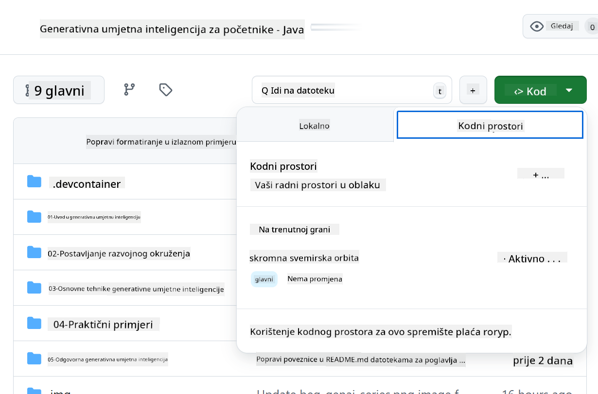

<!--
CO_OP_TRANSLATOR_METADATA:
{
  "original_hash": "e00bbea0f95c611aa3bec676d23e8b43",
  "translation_date": "2025-07-21T21:05:59+00:00",
  "source_file": "02-SetupDevEnvironment/getting-started-azure-openai.md",
  "language_code": "hr"
}
-->
# Postavljanje Razvojnog Okruženja za Azure OpenAI

> **Brzi početak**: Ovaj vodič je za postavljanje Azure OpenAI. Za trenutni početak s besplatnim modelima, koristite [GitHub Models with Codespaces](./README.md#quick-start-cloud).

Ovaj vodič pomoći će vam da postavite Azure AI Foundry modele za vaše Java AI aplikacije u ovom tečaju.

## Sadržaj

- [Pregled Brzog Postavljanja](../../../02-SetupDevEnvironment)
- [Korak 1: Kreirajte Azure AI Foundry Resurse](../../../02-SetupDevEnvironment)
  - [Kreirajte Hub i Projekt](../../../02-SetupDevEnvironment)
  - [Implementirajte GPT-4o-mini Model](../../../02-SetupDevEnvironment)
- [Korak 2: Kreirajte Svoj Codespace](../../../02-SetupDevEnvironment)
- [Korak 3: Konfigurirajte Svoje Okruženje](../../../02-SetupDevEnvironment)
- [Korak 4: Testirajte Svoje Postavljanje](../../../02-SetupDevEnvironment)
- [Što Dalje?](../../../02-SetupDevEnvironment)
- [Resursi](../../../02-SetupDevEnvironment)
- [Dodatni Resursi](../../../02-SetupDevEnvironment)

## Pregled Brzog Postavljanja

1. Kreirajte Azure AI Foundry resurse (Hub, Projekt, Model)
2. Kreirajte Codespace s Java razvojnim kontejnerom
3. Konfigurirajte svoju .env datoteku s Azure OpenAI vjerodajnicama
4. Testirajte svoje postavljanje s primjerom projekta

## Korak 1: Kreirajte Azure AI Foundry Resurse

### Kreirajte Hub i Projekt

1. Idite na [Azure AI Foundry Portal](https://ai.azure.com/) i prijavite se
2. Kliknite **+ Create** → **New hub** (ili idite na **Management** → **All hubs** → **+ New hub**)
3. Konfigurirajte svoj hub:
   - **Naziv huba**: npr. "MyAIHub"
   - **Pretplata**: Odaberite svoju Azure pretplatu
   - **Grupa resursa**: Kreirajte novu ili odaberite postojeću
   - **Lokacija**: Odaberite najbližu lokaciju
   - **Račun za pohranu**: Koristite zadani ili konfigurirajte prilagođeni
   - **Key vault**: Koristite zadani ili konfigurirajte prilagođeni
   - Kliknite **Next** → **Review + create** → **Create**
4. Nakon kreiranja, kliknite **+ New project** (ili **Create project** iz pregleda huba)
   - **Naziv projekta**: npr. "GenAIJava"
   - Kliknite **Create**

### Implementirajte GPT-4o-mini Model

1. U svom projektu, idite na **Model catalog** i potražite **gpt-4o-mini**
   - *Alternativa: Idite na **Deployments** → **+ Create deployment***
2. Kliknite **Deploy** na kartici modela gpt-4o-mini
3. Konfigurirajte implementaciju:
   - **Naziv implementacije**: "gpt-4o-mini"
   - **Verzija modela**: Koristite najnoviju
   - **Tip implementacije**: Standard
4. Kliknite **Deploy**
5. Nakon implementacije, idite na karticu **Deployments** i kopirajte sljedeće vrijednosti:
   - **Naziv implementacije** (npr. "gpt-4o-mini")
   - **Ciljani URI** (npr. `https://your-hub-name.openai.azure.com/`) 
      > **Važno**: Kopirajte samo osnovni URL (npr. `https://myhub.openai.azure.com/`) bez pune putanje krajnje točke.
   - **Ključ** (iz odjeljka Keys and Endpoint)

> **Još uvijek imate problema?** Posjetite službenu [Azure AI Foundry Dokumentaciju](https://learn.microsoft.com/azure/ai-foundry/how-to/create-projects?tabs=ai-foundry&pivots=hub-project)

## Korak 2: Kreirajte Svoj Codespace

1. Forkajte ovaj repozitorij na svoj GitHub račun
   > **Napomena**: Ako želite urediti osnovnu konfiguraciju, pogledajte [Dev Container Configuration](../../../.devcontainer/devcontainer.json)
2. U svom forkiranom repozitoriju, kliknite **Code** → kartica **Codespaces**
3. Kliknite **...** → **New with options...**

4. Odaberite **Dev container configuration**: 
   - **Generative AI Java Development Environment**
5. Kliknite **Create codespace**

## Korak 3: Konfigurirajte Svoje Okruženje

Kada je vaš Codespace spreman, postavite svoje Azure OpenAI vjerodajnice:

1. **Idite na primjer projekta iz korijena repozitorija:**
   ```bash
   cd 02-SetupDevEnvironment/src/basic-chat-azure
   ```

2. **Kreirajte svoju .env datoteku:**
   ```bash
   cp .env.example .env
   ```

3. **Uredite .env datoteku sa svojim Azure OpenAI vjerodajnicama:**
   ```bash
   # Your Azure OpenAI API key (from Azure AI Foundry portal)
   AZURE_AI_KEY=your-actual-api-key-here
   
   # Your Azure OpenAI endpoint URL (e.g., https://myhub.openai.azure.com/)
   AZURE_AI_ENDPOINT=https://your-hub-name.openai.azure.com/
   ```

   > **Sigurnosna Napomena**: 
   > - Nikada ne predajte svoju `.env` datoteku u verzioniranje koda
   > - `.env` datoteka je već uključena u `.gitignore`
   > - Čuvajte svoje API ključeve sigurnima i redovito ih rotirajte

## Korak 4: Testirajte Svoje Postavljanje

Pokrenite primjer aplikacije kako biste testirali svoju Azure OpenAI vezu:

```bash
mvn clean spring-boot:run
```

Trebali biste vidjeti odgovor od GPT-4o-mini modela!

> **Korisnici VS Code-a**: Također možete pritisnuti `F5` u VS Code-u za pokretanje aplikacije. Konfiguracija pokretanja već je postavljena za automatsko učitavanje vaše `.env` datoteke.

> **Cijeli primjer**: Pogledajte [End-to-End Azure OpenAI Example](./src/basic-chat-azure/README.md) za detaljne upute i rješavanje problema.

## Što Dalje?

**Postavljanje je završeno!** Sada imate:
- Azure OpenAI s gpt-4o-mini implementiranim
- Lokalnu konfiguraciju `.env` datoteke
- Spremno Java razvojno okruženje

**Nastavite na** [Poglavlje 3: Osnovne Tehnike Generativne AI](../03-CoreGenerativeAITechniques/README.md) kako biste započeli s izradom AI aplikacija!

## Resursi

- [Azure AI Foundry Dokumentacija](https://learn.microsoft.com/azure/ai-services/)
- [Spring AI Azure OpenAI Dokumentacija](https://docs.spring.io/spring-ai/reference/api/clients/azure-openai-chat.html)
- [Azure OpenAI Java SDK](https://learn.microsoft.com/java/api/overview/azure/ai-openai-readme)

## Dodatni Resursi

- [Preuzmite VS Code](https://code.visualstudio.com/Download)
- [Nabavite Docker Desktop](https://www.docker.com/products/docker-desktop)
- [Dev Container Configuration](../../../.devcontainer/devcontainer.json)

**Odricanje od odgovornosti**:  
Ovaj dokument je preveden pomoću AI usluge za prevođenje [Co-op Translator](https://github.com/Azure/co-op-translator). Iako nastojimo osigurati točnost, imajte na umu da automatski prijevodi mogu sadržavati pogreške ili netočnosti. Izvorni dokument na izvornom jeziku treba smatrati mjerodavnim izvorom. Za ključne informacije preporučuje se profesionalni prijevod od strane čovjeka. Ne preuzimamo odgovornost za nesporazume ili pogrešna tumačenja koja mogu proizaći iz korištenja ovog prijevoda.