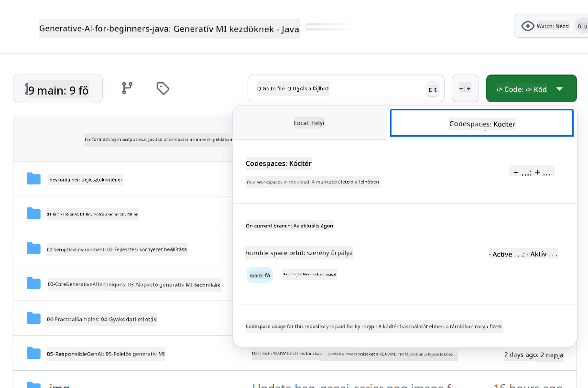

<!--
CO_OP_TRANSLATOR_METADATA:
{
  "original_hash": "bfdb4b4eadbee3a59ef742439f58326a",
  "translation_date": "2025-07-27T13:22:50+00:00",
  "source_file": "02-SetupDevEnvironment/getting-started-azure-openai.md",
  "language_code": "hu"
}
-->
# Az Azure OpenAI fejlesztési környezet beállítása

> **Gyors kezdés**: Ez az útmutató az Azure OpenAI beállításához készült. Ha azonnal szeretnéd elkezdeni ingyenes modellekkel, használd a [GitHub Models with Codespaces](./README.md#quick-start-cloud) lehetőséget.

Ez az útmutató segít beállítani az Azure AI Foundry modelleket a Java AI alkalmazásokhoz ebben a kurzusban.

## Tartalomjegyzék

- [Gyors beállítási áttekintés](../../../02-SetupDevEnvironment)
- [1. lépés: Azure AI Foundry erőforrások létrehozása](../../../02-SetupDevEnvironment)
  - [Hub és projekt létrehozása](../../../02-SetupDevEnvironment)
  - [GPT-4o-mini modell telepítése](../../../02-SetupDevEnvironment)
- [2. lépés: Codespace létrehozása](../../../02-SetupDevEnvironment)
- [3. lépés: Környezet konfigurálása](../../../02-SetupDevEnvironment)
- [4. lépés: Beállítás tesztelése](../../../02-SetupDevEnvironment)
- [Mi következik?](../../../02-SetupDevEnvironment)
- [Források](../../../02-SetupDevEnvironment)
- [További források](../../../02-SetupDevEnvironment)

## Gyors beállítási áttekintés

1. Hozd létre az Azure AI Foundry erőforrásokat (Hub, Projekt, Modell)
2. Hozz létre egy Codespace-t Java fejlesztési konténerrel
3. Konfiguráld a `.env` fájlt az Azure OpenAI hitelesítő adataival
4. Teszteld a beállítást az példaprojekttel

## 1. lépés: Azure AI Foundry erőforrások létrehozása

### Hub és projekt létrehozása

1. Lépj be az [Azure AI Foundry Portálra](https://ai.azure.com/) és jelentkezz be
2. Kattints a **+ Create** → **New hub** gombra (vagy navigálj a **Management** → **All hubs** → **+ New hub** menüpontra)
3. Konfiguráld a hubot:
   - **Hub neve**: pl. "MyAIHub"
   - **Előfizetés**: Válaszd ki az Azure előfizetésedet
   - **Erőforráscsoport**: Hozz létre újat vagy válassz meglévőt
   - **Helyszín**: Válaszd ki a hozzád legközelebbit
   - **Tárolófiók**: Használd az alapértelmezettet vagy konfigurálj egyedi beállítást
   - **Kulcstár**: Használd az alapértelmezettet vagy konfigurálj egyedi beállítást
   - Kattints a **Next** → **Review + create** → **Create** gombra
4. Miután létrehoztad, kattints a **+ New project** gombra (vagy a **Create project** lehetőségre a hub áttekintő oldalán)
   - **Projekt neve**: pl. "GenAIJava"
   - Kattints a **Create** gombra

### GPT-4o-mini modell telepítése

1. A projektedben menj a **Model catalog** menüpontra, és keresd meg a **gpt-4o-mini** modellt
   - *Alternatíva: Menj a **Deployments** → **+ Create deployment** menüpontra*
2. Kattints a **Deploy** gombra a gpt-4o-mini modell kártyáján
3. Konfiguráld a telepítést:
   - **Telepítés neve**: "gpt-4o-mini"
   - **Modell verziója**: Használd a legújabbat
   - **Telepítés típusa**: Standard
4. Kattints a **Deploy** gombra
5. Miután telepítetted, menj a **Deployments** fülre, és másold ki az alábbi értékeket:
   - **Telepítés neve** (pl. "gpt-4o-mini")
   - **Cél URI** (pl. `https://your-hub-name.openai.azure.com/`) 
      > **Fontos**: Csak az alap URL-t másold ki (pl. `https://myhub.openai.azure.com/`), ne a teljes végpont útvonalát.
   - **Kulcs** (a Keys and Endpoint szekcióból)

> **Még mindig problémád van?** Látogasd meg az [Azure AI Foundry Dokumentációt](https://learn.microsoft.com/azure/ai-foundry/how-to/create-projects?tabs=ai-foundry&pivots=hub-project)

## 2. lépés: Codespace létrehozása

1. Forkold ezt a repót a GitHub fiókodba
   > **Megjegyzés**: Ha szeretnéd szerkeszteni az alap konfigurációt, nézd meg a [Dev Container Configuration](../../../.devcontainer/devcontainer.json) fájlt
2. A forkolt repódban kattints a **Code** → **Codespaces** fülre
3. Kattints a **...** → **New with options...** gombra

4. Válaszd ki a **Dev container configuration** lehetőséget: 
   - **Generative AI Java Development Environment**
5. Kattints a **Create codespace** gombra

## 3. lépés: Környezet konfigurálása

Miután a Codespace készen áll, állítsd be az Azure OpenAI hitelesítő adataidat:

1. **Navigálj az példaprojekthez a repó gyökérkönyvtárából:**
   ```bash
   cd 02-SetupDevEnvironment/examples/basic-chat-azure
   ```

2. **Hozd létre a `.env` fájlt:**
   ```bash
   cp .env.example .env
   ```

3. **Szerkeszd a `.env` fájlt az Azure OpenAI hitelesítő adataiddal:**
   ```bash
   # Your Azure OpenAI API key (from Azure AI Foundry portal)
   AZURE_AI_KEY=your-actual-api-key-here
   
   # Your Azure OpenAI endpoint URL (e.g., https://myhub.openai.azure.com/)
   AZURE_AI_ENDPOINT=https://your-hub-name.openai.azure.com/
   ```

   > **Biztonsági megjegyzés**: 
   > - Soha ne commitold a `.env` fájlt verziókezelésbe
   > - A `.env` fájl már szerepel a `.gitignore` fájlban
   > - Tartsd biztonságban az API kulcsaidat, és rendszeresen cseréld őket

## 4. lépés: Beállítás tesztelése

Futtasd az példaprogramot, hogy teszteld az Azure OpenAI kapcsolatot:

```bash
mvn clean spring-boot:run
```

Látnod kell egy választ a GPT-4o-mini modelltől!

> **VS Code felhasználók**: Nyomd meg az `F5` gombot a VS Code-ban az alkalmazás futtatásához. A launch konfiguráció már be van állítva, hogy automatikusan betöltse a `.env` fájlt.

> **Teljes példa**: Nézd meg az [End-to-End Azure OpenAI Example](./examples/basic-chat-azure/README.md) útmutatót részletes instrukciókért és hibakeresésért.

## Mi következik?

**Beállítás kész!** Most már rendelkezel:
- Azure OpenAI-val, amelyen a gpt-4o-mini modell telepítve van
- Helyi `.env` fájl konfigurációval
- Java fejlesztési környezettel

**Folytasd a** [3. fejezet: Generatív AI alaptechnikák](../03-CoreGenerativeAITechniques/README.md) című részt, hogy elkezdj AI alkalmazásokat építeni!

## Források

- [Azure AI Foundry Dokumentáció](https://learn.microsoft.com/azure/ai-services/)
- [Spring AI Azure OpenAI Dokumentáció](https://docs.spring.io/spring-ai/reference/api/clients/azure-openai-chat.html)
- [Azure OpenAI Java SDK](https://learn.microsoft.com/java/api/overview/azure/ai-openai-readme)

## További források

- [VS Code letöltése](https://code.visualstudio.com/Download)
- [Docker Desktop beszerzése](https://www.docker.com/products/docker-desktop)
- [Dev Container Configuration](../../../.devcontainer/devcontainer.json)

**Felelősségkizárás**:  
Ez a dokumentum az [Co-op Translator](https://github.com/Azure/co-op-translator) AI fordítási szolgáltatás segítségével készült. Bár törekszünk a pontosságra, kérjük, vegye figyelembe, hogy az automatikus fordítások hibákat vagy pontatlanságokat tartalmazhatnak. Az eredeti dokumentum az eredeti nyelvén tekintendő hiteles forrásnak. Kritikus információk esetén javasolt professzionális, emberi fordítást igénybe venni. Nem vállalunk felelősséget a fordítás használatából eredő félreértésekért vagy téves értelmezésekért.