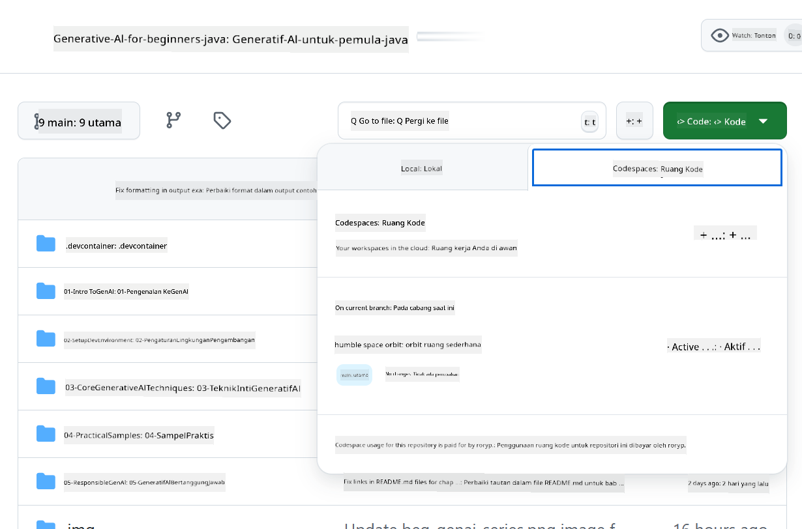

<!--
CO_OP_TRANSLATOR_METADATA:
{
  "original_hash": "e00bbea0f95c611aa3bec676d23e8b43",
  "translation_date": "2025-07-21T19:36:59+00:00",
  "source_file": "02-SetupDevEnvironment/getting-started-azure-openai.md",
  "language_code": "id"
}
-->
# Menyiapkan Lingkungan Pengembangan untuk Azure OpenAI

> **Quick Start**: Panduan ini untuk pengaturan Azure OpenAI. Untuk memulai dengan model gratis, gunakan [GitHub Models dengan Codespaces](./README.md#quick-start-cloud).

Panduan ini akan membantu Anda menyiapkan model Azure AI Foundry untuk aplikasi Java AI dalam kursus ini.

## Daftar Isi

- [Ikhtisar Pengaturan Cepat](../../../02-SetupDevEnvironment)
- [Langkah 1: Buat Sumber Daya Azure AI Foundry](../../../02-SetupDevEnvironment)
  - [Buat Hub dan Proyek](../../../02-SetupDevEnvironment)
  - [Deploy Model GPT-4o-mini](../../../02-SetupDevEnvironment)
- [Langkah 2: Buat Codespace Anda](../../../02-SetupDevEnvironment)
- [Langkah 3: Konfigurasi Lingkungan Anda](../../../02-SetupDevEnvironment)
- [Langkah 4: Uji Pengaturan Anda](../../../02-SetupDevEnvironment)
- [Apa Selanjutnya?](../../../02-SetupDevEnvironment)
- [Sumber Daya](../../../02-SetupDevEnvironment)
- [Sumber Daya Tambahan](../../../02-SetupDevEnvironment)

## Ikhtisar Pengaturan Cepat

1. Buat sumber daya Azure AI Foundry (Hub, Proyek, Model)
2. Buat Codespace dengan kontainer pengembangan Java
3. Konfigurasi file .env Anda dengan kredensial Azure OpenAI
4. Uji pengaturan Anda dengan proyek contoh

## Langkah 1: Buat Sumber Daya Azure AI Foundry

### Buat Hub dan Proyek

1. Buka [Portal Azure AI Foundry](https://ai.azure.com/) dan masuk
2. Klik **+ Create** → **New hub** (atau navigasikan ke **Management** → **All hubs** → **+ New hub**)
3. Konfigurasi hub Anda:
   - **Hub name**: misalnya, "MyAIHub"
   - **Subscription**: Pilih langganan Azure Anda
   - **Resource group**: Buat baru atau pilih yang sudah ada
   - **Location**: Pilih lokasi terdekat
   - **Storage account**: Gunakan default atau konfigurasi khusus
   - **Key vault**: Gunakan default atau konfigurasi khusus
   - Klik **Next** → **Review + create** → **Create**
4. Setelah dibuat, klik **+ New project** (atau **Create project** dari tampilan hub)
   - **Project name**: misalnya, "GenAIJava"
   - Klik **Create**

### Deploy Model GPT-4o-mini

1. Di proyek Anda, buka **Model catalog** dan cari **gpt-4o-mini**
   - *Alternatif: Buka **Deployments** → **+ Create deployment***
2. Klik **Deploy** pada kartu model gpt-4o-mini
3. Konfigurasi deployment:
   - **Deployment name**: "gpt-4o-mini"
   - **Model version**: Gunakan versi terbaru
   - **Deployment type**: Standard
4. Klik **Deploy**
5. Setelah berhasil dideploy, buka tab **Deployments** dan salin nilai berikut:
   - **Deployment name** (misalnya, "gpt-4o-mini")
   - **Target URI** (misalnya, `https://your-hub-name.openai.azure.com/`) 
      > **Penting**: Salin hanya URL dasar (misalnya, `https://myhub.openai.azure.com/`) bukan path endpoint lengkap.
   - **Key** (dari bagian Keys and Endpoint)

> **Masih mengalami kesulitan?** Kunjungi [Dokumentasi Resmi Azure AI Foundry](https://learn.microsoft.com/azure/ai-foundry/how-to/create-projects?tabs=ai-foundry&pivots=hub-project)

## Langkah 2: Buat Codespace Anda

1. Fork repositori ini ke akun GitHub Anda
   > **Catatan**: Jika Anda ingin mengedit konfigurasi dasar, lihat [Dev Container Configuration](../../../.devcontainer/devcontainer.json)
2. Di repositori yang telah Anda fork, klik **Code** → tab **Codespaces**
3. Klik **...** → **New with options...**

4. Pilih **Dev container configuration**: 
   - **Generative AI Java Development Environment**
5. Klik **Create codespace**

## Langkah 3: Konfigurasi Lingkungan Anda

Setelah Codespace Anda siap, atur kredensial Azure OpenAI Anda:

1. **Navigasikan ke proyek contoh dari root repositori:**
   ```bash
   cd 02-SetupDevEnvironment/src/basic-chat-azure
   ```

2. **Buat file .env Anda:**
   ```bash
   cp .env.example .env
   ```

3. **Edit file .env dengan kredensial Azure OpenAI Anda:**
   ```bash
   # Your Azure OpenAI API key (from Azure AI Foundry portal)
   AZURE_AI_KEY=your-actual-api-key-here
   
   # Your Azure OpenAI endpoint URL (e.g., https://myhub.openai.azure.com/)
   AZURE_AI_ENDPOINT=https://your-hub-name.openai.azure.com/
   ```

   > **Catatan Keamanan**: 
   > - Jangan pernah mengkomit file `.env` Anda ke kontrol versi
   > - File `.env` sudah termasuk dalam `.gitignore`
   > - Jaga keamanan API key Anda dan rotasi secara berkala

## Langkah 4: Uji Pengaturan Anda

Jalankan aplikasi contoh untuk menguji koneksi Azure OpenAI Anda:

```bash
mvn clean spring-boot:run
```

Anda seharusnya melihat respons dari model GPT-4o-mini!

> **Pengguna VS Code**: Anda juga dapat menekan `F5` di VS Code untuk menjalankan aplikasi. Konfigurasi peluncuran sudah diatur untuk memuat file `.env` Anda secara otomatis.

> **Contoh Lengkap**: Lihat [Contoh Azure OpenAI End-to-End](./src/basic-chat-azure/README.md) untuk instruksi dan pemecahan masalah yang lebih rinci.

## Apa Selanjutnya?

**Pengaturan Selesai!** Anda sekarang memiliki:
- Azure OpenAI dengan gpt-4o-mini yang telah dideploy
- Konfigurasi file .env lokal
- Lingkungan pengembangan Java yang siap

**Lanjutkan ke** [Bab 3: Teknik Inti Generative AI](../03-CoreGenerativeAITechniques/README.md) untuk mulai membangun aplikasi AI!

## Sumber Daya

- [Dokumentasi Azure AI Foundry](https://learn.microsoft.com/azure/ai-services/)
- [Dokumentasi Spring AI Azure OpenAI](https://docs.spring.io/spring-ai/reference/api/clients/azure-openai-chat.html)
- [Azure OpenAI Java SDK](https://learn.microsoft.com/java/api/overview/azure/ai-openai-readme)

## Sumber Daya Tambahan

- [Unduh VS Code](https://code.visualstudio.com/Download)
- [Dapatkan Docker Desktop](https://www.docker.com/products/docker-desktop)
- [Dev Container Configuration](../../../.devcontainer/devcontainer.json)

**Penafian**:  
Dokumen ini telah diterjemahkan menggunakan layanan penerjemahan AI [Co-op Translator](https://github.com/Azure/co-op-translator). Meskipun kami berusaha untuk memberikan hasil yang akurat, harap diperhatikan bahwa terjemahan otomatis mungkin mengandung kesalahan atau ketidakakuratan. Dokumen asli dalam bahasa aslinya harus dianggap sebagai sumber yang otoritatif. Untuk informasi yang bersifat kritis, disarankan menggunakan jasa penerjemahan profesional oleh manusia. Kami tidak bertanggung jawab atas kesalahpahaman atau penafsiran yang timbul dari penggunaan terjemahan ini.