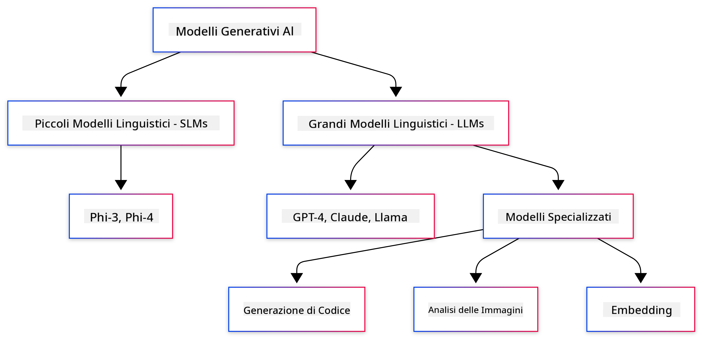
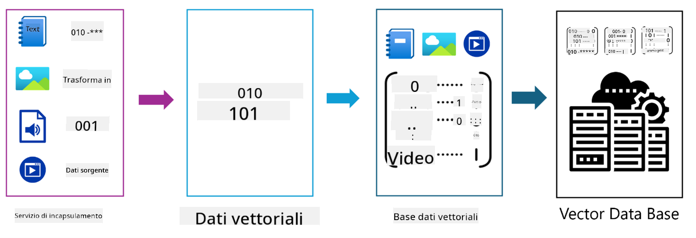
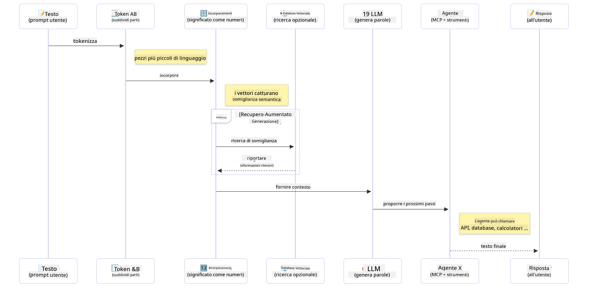

<!--
CO_OP_TRANSLATOR_METADATA:
{
  "original_hash": "75bfb080ca725e8a9aa9c80cae25fba1",
  "translation_date": "2025-07-29T09:05:11+00:00",
  "source_file": "01-IntroToGenAI/README.md",
  "language_code": "it"
}
-->
# Introduzione all'AI Generativa - Edizione Java

## Cosa Imparerai

- **Fondamenti dell'AI Generativa**, inclusi LLM, ingegneria dei prompt, token, embedding e database vettoriali
- **Confronto tra strumenti di sviluppo AI per Java**, come Azure OpenAI SDK, Spring AI e OpenAI Java SDK
- **Scoperta del Model Context Protocol** e del suo ruolo nella comunicazione degli agenti AI

## Indice

- [Introduzione](../../../01-IntroToGenAI)
- [Un rapido ripasso sui concetti di AI Generativa](../../../01-IntroToGenAI)
- [Revisione dell'ingegneria dei prompt](../../../01-IntroToGenAI)
- [Token, embedding e agenti](../../../01-IntroToGenAI)
- [Strumenti e librerie di sviluppo AI per Java](../../../01-IntroToGenAI)
  - [OpenAI Java SDK](../../../01-IntroToGenAI)
  - [Spring AI](../../../01-IntroToGenAI)
  - [Azure OpenAI Java SDK](../../../01-IntroToGenAI)
- [Riepilogo](../../../01-IntroToGenAI)
- [Prossimi Passi](../../../01-IntroToGenAI)

## Introduzione

Benvenuto al primo capitolo di AI Generativa per Principianti - Edizione Java! Questa lezione introduttiva ti guiderà attraverso i concetti fondamentali dell'AI generativa e su come utilizzarli con Java. Imparerai i componenti essenziali delle applicazioni AI, inclusi i Large Language Models (LLM), i token, gli embedding e gli agenti AI. Esploreremo anche gli strumenti principali per Java che utilizzerai durante questo corso.

### Un rapido ripasso sui concetti di AI Generativa

L'AI generativa è un tipo di intelligenza artificiale che crea nuovi contenuti, come testo, immagini o codice, basandosi su schemi e relazioni appresi dai dati. I modelli di AI generativa possono generare risposte simili a quelle umane, comprendere il contesto e, a volte, creare contenuti che sembrano prodotti da esseri umani.

Sviluppando applicazioni AI in Java, lavorerai con **modelli di AI generativa** per creare contenuti. Alcune capacità dei modelli di AI generativa includono:

- **Generazione di Testo**: Creazione di testi simili a quelli umani per chatbot, contenuti e completamento di testi.
- **Generazione e Analisi di Immagini**: Produzione di immagini realistiche, miglioramento di foto e rilevamento di oggetti.
- **Generazione di Codice**: Scrittura di frammenti di codice o script.

Esistono modelli specifici ottimizzati per diversi compiti. Ad esempio, sia i **Small Language Models (SLM)** che i **Large Language Models (LLM)** possono gestire la generazione di testo, con gli LLM che generalmente offrono prestazioni migliori per compiti complessi. Per attività legate alle immagini, utilizzeresti modelli di visione specializzati o modelli multimodali.

Ovviamente, le risposte di questi modelli non sono sempre perfette. Probabilmente hai sentito parlare di modelli che "allucinano" o generano informazioni errate in modo autorevole. Tuttavia, puoi guidare il modello a generare risposte migliori fornendo istruzioni e contesti chiari. Ed è qui che entra in gioco l'**ingegneria dei prompt**.

#### Revisione dell'ingegneria dei prompt

L'ingegneria dei prompt è la pratica di progettare input efficaci per guidare i modelli AI verso output desiderati. Include:

- **Chiarezza**: Rendere le istruzioni chiare e non ambigue.
- **Contesto**: Fornire le informazioni di base necessarie.
- **Vincoli**: Specificare eventuali limitazioni o formati.

Alcune delle migliori pratiche per l'ingegneria dei prompt includono la progettazione dei prompt, istruzioni chiare, suddivisione dei compiti, apprendimento one-shot e few-shot, e il tuning dei prompt. Testare diversi prompt è essenziale per trovare ciò che funziona meglio per il tuo caso d'uso specifico.

Quando sviluppi applicazioni, lavorerai con diversi tipi di prompt:
- **Prompt di sistema**: Impostano le regole di base e il contesto per il comportamento del modello.
- **Prompt dell'utente**: I dati di input forniti dagli utenti della tua applicazione.
- **Prompt dell'assistente**: Le risposte del modello basate sui prompt di sistema e dell'utente.

> **Per saperne di più**: Scopri di più sull'ingegneria dei prompt nel [capitolo sull'Ingegneria dei Prompt del corso GenAI per Principianti](https://github.com/microsoft/generative-ai-for-beginners/tree/main/04-prompt-engineering-fundamentals)

#### Token, embedding e agenti

Lavorando con modelli di AI generativa, incontrerai termini come **token**, **embedding**, **agenti** e **Model Context Protocol (MCP)**. Ecco una panoramica dettagliata di questi concetti:

- **Token**: I token sono le unità più piccole di testo in un modello. Possono essere parole, caratteri o sottoparole. I token rappresentano i dati testuali in un formato comprensibile per il modello. Ad esempio, la frase "The quick brown fox jumped over the lazy dog" potrebbe essere tokenizzata come ["The", " quick", " brown", " fox", " jumped", " over", " the", " lazy", " dog"] o ["The", " qu", "ick", " br", "own", " fox", " jump", "ed", " over", " the", " la", "zy", " dog"] a seconda della strategia di tokenizzazione.

La tokenizzazione è il processo di suddivisione del testo in queste unità più piccole. Questo è cruciale perché i modelli operano sui token piuttosto che sul testo grezzo. Il numero di token in un prompt influisce sulla lunghezza e qualità della risposta del modello, poiché i modelli hanno limiti di token per la loro finestra di contesto (ad esempio, 128K token per il contesto totale di GPT-4o, inclusi input e output).

  In Java, puoi utilizzare librerie come l'OpenAI SDK per gestire automaticamente la tokenizzazione quando invii richieste ai modelli AI.

- **Embedding**: Gli embedding sono rappresentazioni vettoriali dei token che catturano il significato semantico. Sono rappresentazioni numeriche (tipicamente array di numeri in virgola mobile) che permettono ai modelli di comprendere le relazioni tra le parole e generare risposte contestualmente rilevanti. Parole simili hanno embedding simili, consentendo al modello di comprendere concetti come sinonimi e relazioni semantiche.

  In Java, puoi generare embedding utilizzando l'OpenAI SDK o altre librerie che supportano la generazione di embedding. Questi embedding sono essenziali per attività come la ricerca semantica, dove vuoi trovare contenuti simili basandoti sul significato piuttosto che su corrispondenze testuali esatte.

- **Database vettoriali**: I database vettoriali sono sistemi di archiviazione specializzati ottimizzati per gli embedding. Consentono ricerche di similarità efficienti e sono cruciali per i pattern di Generazione Aumentata dal Recupero (RAG), dove è necessario trovare informazioni rilevanti da grandi dataset basandosi sulla similarità semantica piuttosto che su corrispondenze esatte.

> **Nota**: In questo corso, non tratteremo i database vettoriali, ma riteniamo che valga la pena menzionarli poiché sono comunemente utilizzati nelle applicazioni reali.

- **Agenti & MCP**: Componenti AI che interagiscono autonomamente con modelli, strumenti e sistemi esterni. Il Model Context Protocol (MCP) fornisce un modo standardizzato per gli agenti di accedere in modo sicuro a fonti di dati esterne e strumenti. Scopri di più nel nostro corso [MCP per Principianti](https://github.com/microsoft/mcp-for-beginners).

Nelle applicazioni AI in Java, utilizzerai i token per l'elaborazione del testo, gli embedding per la ricerca semantica e il RAG, i database vettoriali per il recupero dei dati e gli agenti con MCP per costruire sistemi intelligenti che utilizzano strumenti.

### Strumenti e librerie di sviluppo AI per Java

Java offre eccellenti strumenti per lo sviluppo AI. Esploreremo tre principali librerie durante questo corso: OpenAI Java SDK, Azure OpenAI SDK e Spring AI.

Ecco una tabella di riferimento rapido che mostra quale SDK viene utilizzato negli esempi di ciascun capitolo:

| Capitolo | Esempio | SDK |
|----------|---------|-----|
| 02-SetupDevEnvironment | github-models | OpenAI Java SDK |
| 02-SetupDevEnvironment | basic-chat-azure | Spring AI Azure OpenAI |
| 03-CoreGenerativeAITechniques | esempi | Azure OpenAI SDK |
| 04-PracticalSamples | petstory | OpenAI Java SDK |
| 04-PracticalSamples | foundrylocal | OpenAI Java SDK |
| 04-PracticalSamples | calculator | Spring AI MCP SDK + LangChain4j |

**Link alla documentazione degli SDK:**
- [Azure OpenAI Java SDK](https://github.com/Azure/azure-sdk-for-java/tree/azure-ai-openai_1.0.0-beta.16/sdk/openai/azure-ai-openai)
- [Spring AI](https://docs.spring.io/spring-ai/reference/)
- [OpenAI Java SDK](https://github.com/openai/openai-java)
- [LangChain4j](https://docs.langchain4j.dev/)

#### OpenAI Java SDK

L'OpenAI SDK è la libreria Java ufficiale per l'API di OpenAI. Fornisce un'interfaccia semplice e coerente per interagire con i modelli di OpenAI, rendendo facile integrare le capacità AI nelle applicazioni Java. L'esempio GitHub Models del Capitolo 2, l'applicazione Pet Story e l'esempio Foundry Local del Capitolo 4 dimostrano l'approccio con l'OpenAI SDK.

#### Spring AI

Spring AI è un framework completo che porta le capacità AI nelle applicazioni Spring, fornendo un livello di astrazione coerente tra diversi fornitori di AI. Si integra perfettamente con l'ecosistema Spring, rendendolo la scelta ideale per applicazioni Java aziendali che necessitano di funzionalità AI.

La forza di Spring AI risiede nella sua integrazione senza soluzione di continuità con l'ecosistema Spring, rendendo facile costruire applicazioni AI pronte per la produzione con i modelli familiari di Spring come l'iniezione di dipendenze, la gestione della configurazione e i framework di test. Utilizzerai Spring AI nei Capitoli 2 e 4 per costruire applicazioni che sfruttano sia OpenAI che le librerie Spring AI del Model Context Protocol (MCP).

##### Model Context Protocol (MCP)

Il [Model Context Protocol (MCP)](https://modelcontextprotocol.io/) è uno standard emergente che consente alle applicazioni AI di interagire in modo sicuro con fonti di dati esterne e strumenti. MCP fornisce un modo standardizzato per i modelli AI di accedere alle informazioni contestuali ed eseguire azioni nelle tue applicazioni.

Nel Capitolo 4, costruirai un semplice servizio calcolatrice MCP che dimostra i fondamenti del Model Context Protocol con Spring AI, mostrando come creare integrazioni di strumenti di base e architetture di servizio.

#### Azure OpenAI Java SDK

La libreria client Azure OpenAI per Java è un adattamento delle API REST di OpenAI che fornisce un'interfaccia idiomatica e un'integrazione con il resto dell'ecosistema Azure SDK. Nel Capitolo 3, costruirai applicazioni utilizzando l'Azure OpenAI SDK, inclusi chatbot, chiamate di funzioni e pattern di Generazione Aumentata dal Recupero (RAG).

> Nota: L'Azure OpenAI SDK è meno avanzato rispetto all'OpenAI Java SDK in termini di funzionalità, quindi per progetti futuri, considera l'utilizzo dell'OpenAI Java SDK.

## Riepilogo

Ecco cosa hai appreso:

- I concetti fondamentali dell'AI generativa - dagli LLM e l'ingegneria dei prompt ai token, embedding e database vettoriali
- Le opzioni di strumenti per lo sviluppo AI in Java: Azure OpenAI SDK, Spring AI e OpenAI Java SDK
- Cos'è il Model Context Protocol e come consente agli agenti AI di lavorare con strumenti esterni

## Prossimi Passi

[Capitolo 2: Configurazione dell'Ambiente di Sviluppo](../02-SetupDevEnvironment/README.md)

**Disclaimer**:  
Questo documento è stato tradotto utilizzando il servizio di traduzione automatica [Co-op Translator](https://github.com/Azure/co-op-translator). Sebbene ci impegniamo per garantire l'accuratezza, si prega di notare che le traduzioni automatiche possono contenere errori o imprecisioni. Il documento originale nella sua lingua nativa dovrebbe essere considerato la fonte autorevole. Per informazioni critiche, si consiglia una traduzione professionale eseguita da un traduttore umano. Non siamo responsabili per eventuali fraintendimenti o interpretazioni errate derivanti dall'uso di questa traduzione.