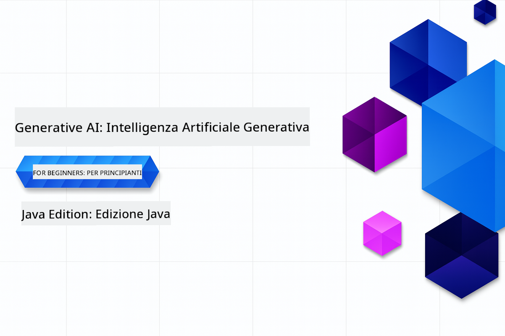

<!--
CO_OP_TRANSLATOR_METADATA:
{
  "original_hash": "b4c05c53b67571aee42e9532404f2fb8",
  "translation_date": "2025-07-28T10:42:51+00:00",
  "source_file": "README.md",
  "language_code": "it"
}
-->
# Generative AI per Principianti - Edizione Java

**Impegno di Tempo**: L'intero workshop può essere completato online senza configurazione locale. L'impostazione dell'ambiente richiede 2 minuti, mentre l'esplorazione degli esempi richiede da 1 a 3 ore a seconda della profondità di esplorazione.

> **Avvio Rapido**

1. Fai un fork di questo repository sul tuo account GitHub
2. Clicca su **Code** → scheda **Codespaces** → **...** → **New with options...**
3. Usa le impostazioni predefinite – questo selezionerà il container di sviluppo creato per questo corso
4. Clicca su **Create codespace**
5. Aspetta circa 2 minuti affinché l'ambiente sia pronto
6. Vai direttamente a [Il primo esempio](./02-SetupDevEnvironment/README.md#step-2-create-a-github-personal-access-token)

## Supporto Multilingue

### Supportato tramite GitHub Action (Automatizzato e Sempre Aggiornato)

[Francese](../fr/README.md) | [Spagnolo](../es/README.md) | [Tedesco](../de/README.md) | [Russo](../ru/README.md) | [Arabo](../ar/README.md) | [Persiano (Farsi)](../fa/README.md) | [Urdu](../ur/README.md) | [Cinese (Semplificato)](../zh/README.md) | [Cinese (Tradizionale, Macao)](../mo/README.md) | [Cinese (Tradizionale, Hong Kong)](../hk/README.md) | [Cinese (Tradizionale, Taiwan)](../tw/README.md) | [Giapponese](../ja/README.md) | [Coreano](../ko/README.md) | [Hindi](../hi/README.md) | [Bengalese](../bn/README.md) | [Marathi](../mr/README.md) | [Nepalese](../ne/README.md) | [Punjabi (Gurmukhi)](../pa/README.md) | [Portoghese (Portogallo)](../pt/README.md) | [Portoghese (Brasile)](../br/README.md) | [Italiano](./README.md) | [Polacco](../pl/README.md) | [Turco](../tr/README.md) | [Greco](../el/README.md) | [Tailandese](../th/README.md) | [Svedese](../sv/README.md) | [Danese](../da/README.md) | [Norvegese](../no/README.md) | [Finlandese](../fi/README.md) | [Olandese](../nl/README.md) | [Ebraico](../he/README.md) | [Vietnamita](../vi/README.md) | [Indonesiano](../id/README.md) | [Malese](../ms/README.md) | [Tagalog (Filippino)](../tl/README.md) | [Swahili](../sw/README.md) | [Ungherese](../hu/README.md) | [Ceco](../cs/README.md) | [Slovacco](../sk/README.md) | [Rumeno](../ro/README.md) | [Bulgaro](../bg/README.md) | [Serbo (Cirillico)](../sr/README.md) | [Croato](../hr/README.md) | [Sloveno](../sl/README.md) | [Ucraino](../uk/README.md) | [Birmano (Myanmar)](../my/README.md)

## Struttura del Corso e Percorso di Apprendimento

### **Capitolo 1: Introduzione alla Generative AI**
- **Concetti Fondamentali**: Comprendere i Large Language Models, i token, gli embeddings e le capacità dell'AI
- **Ecosistema AI in Java**: Panoramica su Spring AI e OpenAI SDKs
- **Model Context Protocol**: Introduzione al MCP e al suo ruolo nella comunicazione degli agenti AI
- **Applicazioni Pratiche**: Scenari reali, inclusi chatbot e generazione di contenuti
- **[→ Inizia il Capitolo 1](./01-IntroToGenAI/README.md)**

### **Capitolo 2: Configurazione dell'Ambiente di Sviluppo**
- **Configurazione Multi-Provider**: Configura GitHub Models, Azure OpenAI e le integrazioni con OpenAI Java SDK
- **Spring Boot + Spring AI**: Best practice per lo sviluppo di applicazioni AI aziendali
- **GitHub Models**: Accesso gratuito ai modelli AI per prototipazione e apprendimento (senza necessità di carta di credito)
- **Strumenti di Sviluppo**: Configurazione di Docker containers, VS Code e GitHub Codespaces
- **[→ Inizia il Capitolo 2](./02-SetupDevEnvironment/README.md)**

### **Capitolo 3: Tecniche Fondamentali di Generative AI**
- **Prompt Engineering**: Tecniche per ottenere risposte ottimali dai modelli AI
- **Embeddings e Operazioni sui Vettori**: Implementazione di ricerca semantica e confronto di similarità
- **Retrieval-Augmented Generation (RAG)**: Combina l'AI con le tue fonti di dati
- **Function Calling**: Estendi le capacità dell'AI con strumenti e plugin personalizzati
- **[→ Inizia il Capitolo 3](./03-CoreGenerativeAITechniques/README.md)**

### **Capitolo 4: Applicazioni Pratiche e Progetti**
- **Generatore di Storie per Animali Domestici** (`petstory/`): Generazione creativa di contenuti con GitHub Models
- **Demo Locale Foundry** (`foundrylocal/`): Integrazione di modelli AI locali con OpenAI Java SDK
- **Servizio MCP Calculator** (`calculator/`): Implementazione base del Model Context Protocol con Spring AI
- **[→ Inizia il Capitolo 4](./04-PracticalSamples/README.md)**

### **Capitolo 5: Sviluppo Responsabile dell'AI**
- **Sicurezza dei GitHub Models**: Testa i meccanismi di filtraggio dei contenuti e di sicurezza integrati
- **Demo AI Responsabile**: Esempio pratico che mostra come funzionano i filtri di sicurezza dell'AI
- **Best Practice**: Linee guida essenziali per uno sviluppo e un'implementazione etica dell'AI
- **[→ Inizia il Capitolo 5](./05-ResponsibleGenAI/README.md)**

## Risorse Aggiuntive

- [AI Agents For Beginners](https://github.com/microsoft/ai-agents-for-beginners)
- [Generative AI for Beginners using .NET](https://github.com/microsoft/Generative-AI-for-beginners-dotnet)
- [Generative AI for Beginners using JavaScript](https://github.com/microsoft/generative-ai-with-javascript)
- [Generative AI for Beginners](https://github.com/microsoft/generative-ai-for-beginners)
- [ML for Beginners](https://aka.ms/ml-beginners)
- [Data Science for Beginners](https://aka.ms/datascience-beginners)
- [AI for Beginners](https://aka.ms/ai-beginners)
- [Cybersecurity for Beginners](https://github.com/microsoft/Security-101)
- [Web Dev for Beginners](https://aka.ms/webdev-beginners)
- [IoT for Beginners](https://aka.ms/iot-beginners)
- [XR Development for Beginners](https://github.com/microsoft/xr-development-for-beginners)
- [Mastering GitHub Copilot for AI Paired Programming](https://aka.ms/GitHubCopilotAI)
- [Mastering GitHub Copilot for C#/.NET Developers](https://github.com/microsoft/mastering-github-copilot-for-dotnet-csharp-developers)
- [Choose Your Own Copilot Adventure](https://github.com/microsoft/CopilotAdventures)
- [RAG Chat App with Azure AI Services](https://github.com/Azure-Samples/azure-search-openai-demo-java)

**Disclaimer**:  
Questo documento è stato tradotto utilizzando il servizio di traduzione automatica [Co-op Translator](https://github.com/Azure/co-op-translator). Sebbene ci impegniamo per garantire l'accuratezza, si prega di notare che le traduzioni automatiche possono contenere errori o imprecisioni. Il documento originale nella sua lingua nativa dovrebbe essere considerato la fonte autorevole. Per informazioni critiche, si raccomanda una traduzione professionale effettuata da un traduttore umano. Non siamo responsabili per eventuali incomprensioni o interpretazioni errate derivanti dall'uso di questa traduzione.