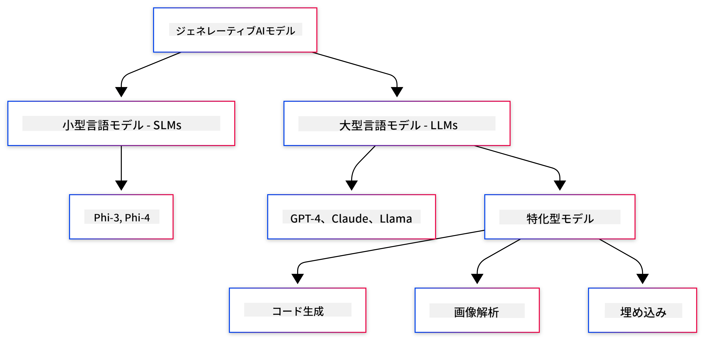
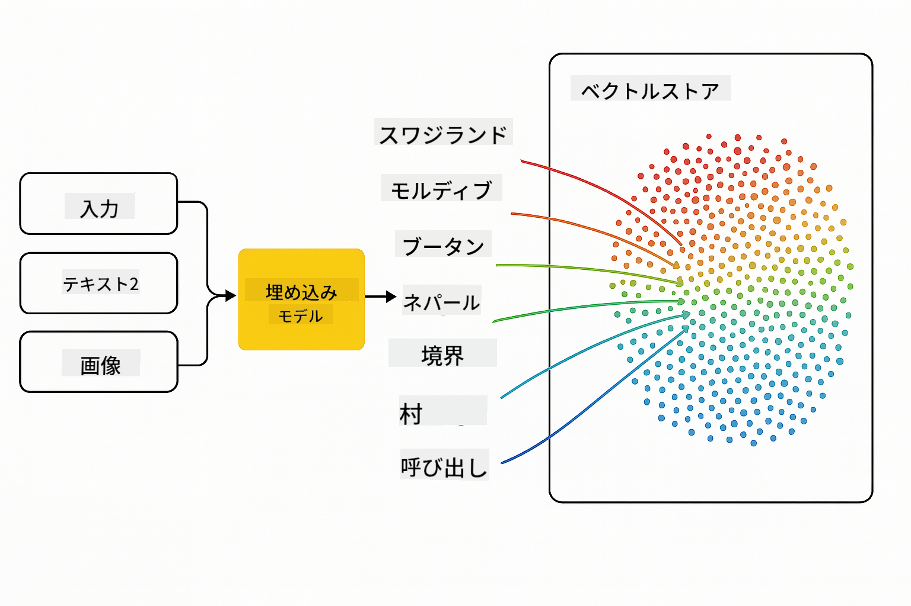
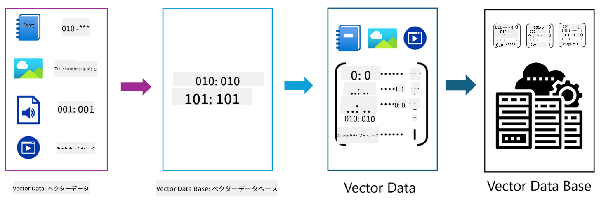

<!--
CO_OP_TRANSLATOR_METADATA:
{
  "original_hash": "006866db93a268a8769bb55f2e324291",
  "translation_date": "2025-07-28T10:29:42+00:00",
  "source_file": "01-IntroToGenAI/README.md",
  "language_code": "ja"
}
-->
# ジェネレーティブAI入門 - Java版

## 学習内容

- **ジェネレーティブAIの基本**：LLM、プロンプトエンジニアリング、トークン、埋め込み、ベクターデータベース
- **Java向けAI開発ツールの比較**：Azure OpenAI SDK、Spring AI、OpenAI Java SDK
- **モデルコンテキストプロトコル**とAIエージェントの通信における役割の発見

## 目次

- [イントロダクション](../../../01-IntroToGenAI)
- [ジェネレーティブAIの概念の簡単な復習](../../../01-IntroToGenAI)
- [プロンプトエンジニアリングのレビュー](../../../01-IntroToGenAI)
- [トークン、埋め込み、エージェント](../../../01-IntroToGenAI)
- [Java向けAI開発ツールとライブラリ](../../../01-IntroToGenAI)
  - [OpenAI Java SDK](../../../01-IntroToGenAI)
  - [Spring AI](../../../01-IntroToGenAI)
  - [Azure OpenAI Java SDK](../../../01-IntroToGenAI)
- [まとめ](../../../01-IntroToGenAI)
- [次のステップ](../../../01-IntroToGenAI)

## イントロダクション

ジェネレーティブAI入門 - Java版の第1章へようこそ！この基礎的なレッスンでは、ジェネレーティブAIのコア概念と、それをJavaで活用する方法を紹介します。AIアプリケーションの基本構成要素である、大規模言語モデル（LLM）、トークン、埋め込み、AIエージェントについて学びます。また、このコースで使用する主要なJavaツールについても探ります。

### ジェネレーティブAIの概念の簡単な復習

ジェネレーティブAIは、データから学んだパターンや関係に基づいて、テキスト、画像、コードなどの新しいコンテンツを生成する人工知能の一種です。ジェネレーティブAIモデルは、人間のような応答を生成し、文脈を理解し、時には人間らしいコンテンツを作成することもあります。

JavaでAIアプリケーションを開発する際には、**ジェネレーティブAIモデル**を使用してコンテンツを生成します。ジェネレーティブAIモデルの主な機能には以下があります：

- **テキスト生成**：チャットボット、コンテンツ、テキスト補完のための人間らしいテキスト作成
- **画像生成と分析**：リアルな画像の生成、写真の改善、物体検出
- **コード生成**：コードスニペットやスクリプトの作成

異なるタスクに最適化された特定のモデルがあります。例えば、**小規模言語モデル（SLM）**と**大規模言語モデル（LLM）**の両方がテキスト生成を処理できますが、LLMは通常、複雑なタスクに対してより良いパフォーマンスを提供します。画像関連のタスクには、専門のビジョンモデルやマルチモーダルモデルを使用します。

もちろん、これらのモデルの応答が常に完璧であるわけではありません。モデルが「幻覚」を起こしたり、誤った情報を権威ある形で生成したりすることがあると聞いたことがあるかもしれません。しかし、明確な指示と文脈を提供することで、モデルがより良い応答を生成するように導くことができます。これが**プロンプトエンジニアリング**の役割です。

#### プロンプトエンジニアリングのレビュー

プロンプトエンジニアリングは、AIモデルを望ましい出力に導く効果的な入力を設計する実践です。これには以下が含まれます：

- **明確さ**：指示を明確で曖昧さのないものにする
- **文脈**：必要な背景情報を提供する
- **制約**：制限やフォーマットを指定する

プロンプトエンジニアリングのベストプラクティスには、プロンプト設計、明確な指示、タスクの分解、ワンショット学習と少数ショット学習、プロンプトチューニングが含まれます。特定のユースケースに最適なプロンプトを見つけるために、異なるプロンプトをテストすることが重要です。

アプリケーションを開発する際には、以下の異なるプロンプトタイプを使用します：
- **システムプロンプト**：モデルの動作の基本ルールと文脈を設定
- **ユーザープロンプト**：アプリケーションユーザーからの入力データ
- **アシスタントプロンプト**：システムプロンプトとユーザープロンプトに基づくモデルの応答

> **詳細を学ぶ**：[ジェネレーティブAI入門コースのプロンプトエンジニアリング章](https://github.com/microsoft/generative-ai-for-beginners/tree/main/04-prompt-engineering-fundamentals)でプロンプトエンジニアリングについてさらに学びましょう

#### トークン、埋め込み、エージェント

ジェネレーティブAIモデルを使用する際には、**トークン**、**埋め込み**、**エージェント**、**モデルコンテキストプロトコル（MCP）**といった用語に出会います。これらの概念について詳しく説明します：

- **トークン**：トークンはモデル内でテキストの最小単位です。単語、文字、またはサブワードで構成されることがあります。トークンは、モデルが理解できる形式でテキストデータを表現するために使用されます。例えば、「The quick brown fox jumped over the lazy dog」という文は、トークン化戦略によって["The", " quick", " brown", " fox", " jumped", " over", " the", " lazy", " dog"]や["The", " qu", "ick", " br", "own", " fox", " jump", "ed", " over", " the", " la", "zy", " dog"]のようにトークン化されることがあります。

トークン化は、テキストをこれらの小さな単位に分解するプロセスです。これは重要であり、モデルは生のテキストではなくトークンで動作します。プロンプト内のトークン数は、モデルの応答の長さと品質に影響を与えます。モデルにはコンテキストウィンドウのトークン制限があります（例：GPT-4の総コンテキストは128Kトークン、入力と出力を含む）。

  Javaでは、OpenAI SDKなどのライブラリを使用して、AIモデルへのリクエストを送信する際にトークン化を自動的に処理できます。

- **埋め込み**：埋め込みは、トークンの意味を捉えたベクトル表現です。数値表現（通常は浮動小数点数の配列）であり、モデルが単語間の関係を理解し、文脈的に関連性のある応答を生成できるようにします。類似した単語は類似した埋め込みを持ち、モデルが同義語や意味的な関係を理解することを可能にします。

  Javaでは、OpenAI SDKや埋め込み生成をサポートする他のライブラリを使用して埋め込みを生成できます。これらの埋め込みは、意味検索のようなタスクに不可欠であり、意味ではなく正確なテキスト一致に基づいて類似したコンテンツを見つけることができます。

- **ベクターデータベース**：ベクターデータベースは埋め込みに最適化された特殊なストレージシステムです。効率的な類似性検索を可能にし、意味的な類似性に基づいて大規模なデータセットから関連情報を見つける必要があるRAG（Retrieval-Augmented Generation）パターンにおいて重要です。

> **注意**：このコースではベクターデータベースを扱いませんが、実際のアプリケーションでよく使用されるため、言及する価値があります。

- **エージェントとMCP**：モデル、ツール、外部システムと自律的にやり取りするAIコンポーネント。モデルコンテキストプロトコル（MCP）は、エージェントが外部データソースやツールに安全にアクセスするための標準化された方法を提供します。[MCP入門コース](https://github.com/microsoft/mcp-for-beginners)で詳細を学びましょう。

JavaのAIアプリケーションでは、トークンをテキスト処理に使用し、埋め込みを意味検索やRAGに使用し、ベクターデータベースをデータ検索に使用し、MCPを使用したエージェントで知的なツール利用システムを構築します。

### Java向けAI開発ツールとライブラリ

JavaはAI開発に優れたツールを提供します。このコースでは、OpenAI Java SDK、Azure OpenAI SDK、Spring AIの3つの主要なライブラリを探ります。

以下は、各章の例で使用されるSDKを示す参考表です：

| 章 | サンプル | SDK |
|---------|--------|-----|
| 02-SetupDevEnvironment | github-models | OpenAI Java SDK |
| 02-SetupDevEnvironment | basic-chat-azure | Spring AI Azure OpenAI |
| 03-CoreGenerativeAITechniques | examples | Azure OpenAI SDK |
| 04-PracticalSamples | petstory | OpenAI Java SDK |
| 04-PracticalSamples | foundrylocal | OpenAI Java SDK |
| 04-PracticalSamples | calculator | Spring AI MCP SDK + LangChain4j |

**SDKドキュメントリンク：**
- [Azure OpenAI Java SDK](https://github.com/Azure/azure-sdk-for-java/tree/azure-ai-openai_1.0.0-beta.16/sdk/openai/azure-ai-openai)
- [Spring AI](https://docs.spring.io/spring-ai/reference/)
- [OpenAI Java SDK](https://github.com/openai/openai-java)
- [LangChain4j](https://docs.langchain4j.dev/)

#### OpenAI Java SDK

OpenAI SDKは、OpenAI APIの公式Javaライブラリです。OpenAIのモデルとやり取りするためのシンプルで一貫性のあるインターフェースを提供し、JavaアプリケーションにAI機能を簡単に統合できます。第2章のGitHub Models例、第4章のPet StoryアプリケーションとFoundry Local例では、OpenAI SDKのアプローチを示します。

#### Spring AI

Spring AIは、SpringアプリケーションにAI機能をもたらす包括的なフレームワークであり、異なるAIプロバイダー間で一貫した抽象化レイヤーを提供します。Springエコシステムとシームレスに統合され、AI機能を必要とするエンタープライズJavaアプリケーションに最適です。

Spring AIの強みは、Springエコシステムとのシームレスな統合にあり、依存性注入、構成管理、テストフレームワークなどの馴染みのあるSpringパターンを使用して、実用的なAIアプリケーションを簡単に構築できます。第2章と第4章では、OpenAIとモデルコンテキストプロトコル（MCP）Spring AIライブラリの両方を活用するアプリケーションを構築します。

##### モデルコンテキストプロトコル（MCP）

[モデルコンテキストプロトコル（MCP）](https://modelcontextprotocol.io/)は、AIアプリケーションが外部データソースやツールと安全にやり取りすることを可能にする新しい標準です。MCPは、AIモデルがコンテキスト情報にアクセスし、アプリケーション内でアクションを実行するための標準化された方法を提供します。

第4章では、Spring AIを使用してモデルコンテキストプロトコルの基本を示すシンプルなMCP電卓サービスを構築し、基本的なツール統合とサービスアーキテクチャの作成方法を紹介します。

#### Azure OpenAI Java SDK

Azure OpenAI Javaクライアントライブラリは、OpenAIのREST APIを適応させたもので、Azure SDKエコシステムとの統合を提供します。第3章では、Azure OpenAI SDKを使用してチャットアプリケーション、関数呼び出し、RAG（Retrieval-Augmented Generation）パターンを含むアプリケーションを構築します。

> 注意：Azure OpenAI SDKはOpenAI Java SDKに比べて機能が遅れているため、将来のプロジェクトではOpenAI Java SDKの使用を検討してください。

## まとめ

**おめでとうございます！** 以下を学びました：

- **ジェネレーティブAIの基本**：LLM、プロンプトエンジニアリング、トークン、埋め込み、ベクターデータベース
- **Java向けAI開発ツールの比較**：Azure OpenAI SDK、Spring AI、OpenAI Java SDK
- **モデルコンテキストプロトコル**とAIエージェントの通信における役割

## 次のステップ

[第2章：開発環境のセットアップ](../02-SetupDevEnvironment/README.md)

**免責事項**:  
この文書は、AI翻訳サービス [Co-op Translator](https://github.com/Azure/co-op-translator) を使用して翻訳されています。正確性を追求しておりますが、自動翻訳には誤りや不正確な部分が含まれる可能性があることをご承知ください。元の言語で記載された文書が正式な情報源とみなされるべきです。重要な情報については、専門の人間による翻訳を推奨します。この翻訳の使用に起因する誤解や誤解釈について、当社は責任を負いません。