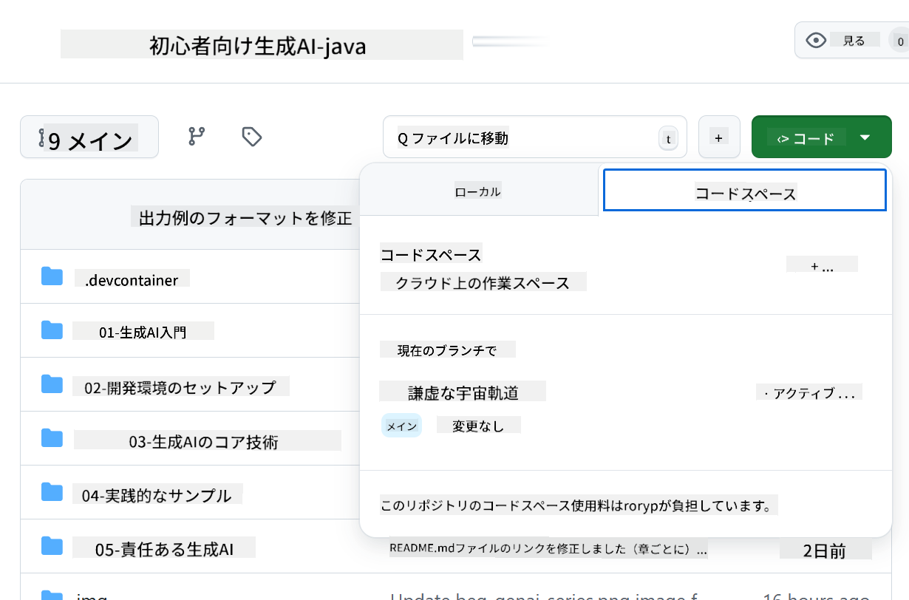

<!--
CO_OP_TRANSLATOR_METADATA:
{
  "original_hash": "e00bbea0f95c611aa3bec676d23e8b43",
  "translation_date": "2025-07-21T16:22:44+00:00",
  "source_file": "02-SetupDevEnvironment/getting-started-azure-openai.md",
  "language_code": "ja"
}
-->
# Azure OpenAI 開発環境のセットアップ

> **クイックスタート**: このガイドは Azure OpenAI のセットアップ用です。無料モデルで即開始したい場合は [GitHub Models with Codespaces](./README.md#quick-start-cloud) を使用してください。

このガイドでは、このコースで Java AI アプリを開発するための Azure AI Foundry モデルのセットアップ方法を説明します。

## 目次

- [クイックセットアップ概要](../../../02-SetupDevEnvironment)
- [ステップ 1: Azure AI Foundry リソースを作成する](../../../02-SetupDevEnvironment)
  - [ハブとプロジェクトを作成する](../../../02-SetupDevEnvironment)
  - [GPT-4o-mini モデルをデプロイする](../../../02-SetupDevEnvironment)
- [ステップ 2: Codespace を作成する](../../../02-SetupDevEnvironment)
- [ステップ 3: 環境を構成する](../../../02-SetupDevEnvironment)
- [ステップ 4: セットアップをテストする](../../../02-SetupDevEnvironment)
- [次に進むべきこと](../../../02-SetupDevEnvironment)
- [リソース](../../../02-SetupDevEnvironment)
- [追加リソース](../../../02-SetupDevEnvironment)

## クイックセットアップ概要

1. Azure AI Foundry リソースを作成する (ハブ、プロジェクト、モデル)
2. Java 開発コンテナを使用して Codespace を作成する
3. Azure OpenAI の資格情報を含む .env ファイルを構成する
4. サンプルプロジェクトでセットアップをテストする

## ステップ 1: Azure AI Foundry リソースを作成する

### ハブとプロジェクトを作成する

1. [Azure AI Foundry Portal](https://ai.azure.com/) にアクセスしてサインインします
2. **+ Create** → **New hub** をクリック (または **Management** → **All hubs** → **+ New hub** に移動)
3. ハブを構成します:
   - **Hub name**: 例: "MyAIHub"
   - **Subscription**: Azure サブスクリプションを選択
   - **Resource group**: 新規作成または既存のものを選択
   - **Location**: 最寄りの場所を選択
   - **Storage account**: デフォルトを使用するかカスタム設定
   - **Key vault**: デフォルトを使用するかカスタム設定
   - **Next** → **Review + create** → **Create** をクリック
4. 作成後、**+ New project** をクリック (またはハブ概要から **Create project** を選択)
   - **Project name**: 例: "GenAIJava"
   - **Create** をクリック

### GPT-4o-mini モデルをデプロイする

1. プロジェクト内で **Model catalog** に移動し、**gpt-4o-mini** を検索
   - *代替手段: **Deployments** → **+ Create deployment** に移動*
2. gpt-4o-mini モデルカードで **Deploy** をクリック
3. デプロイメントを構成します:
   - **Deployment name**: "gpt-4o-mini"
   - **Model version**: 最新版を使用
   - **Deployment type**: Standard
4. **Deploy** をクリック
5. デプロイ後、**Deployments** タブに移動し、以下の値をコピーします:
   - **Deployment name** (例: "gpt-4o-mini")
   - **Target URI** (例: `https://your-hub-name.openai.azure.com/`)  
      > **重要**: フルエンドポイントパスではなく、ベース URL のみをコピーしてください (例: `https://myhub.openai.azure.com/`)。
   - **Key** (Keys and Endpoint セクションから)

> **まだ問題がありますか？** 公式の [Azure AI Foundry Documentation](https://learn.microsoft.com/azure/ai-foundry/how-to/create-projects?tabs=ai-foundry&pivots=hub-project) を参照してください。

## ステップ 2: Codespace を作成する

1. このリポジトリを GitHub アカウントにフォークします
   > **注意**: 基本設定を編集したい場合は [Dev Container Configuration](../../../.devcontainer/devcontainer.json) を確認してください
2. フォークしたリポジトリで **Code** → **Codespaces** タブをクリック
3. **...** → **New with options...** をクリック

4. **Dev container configuration** を選択:
   - **Generative AI Java Development Environment**
5. **Create codespace** をクリック

## ステップ 3: 環境を構成する

Codespace が準備できたら、Azure OpenAI の資格情報を設定します:

1. **リポジトリのルートからサンプルプロジェクトに移動します:**
   ```bash
   cd 02-SetupDevEnvironment/src/basic-chat-azure
   ```

2. **.env ファイルを作成します:**
   ```bash
   cp .env.example .env
   ```

3. **.env ファイルを編集して Azure OpenAI の資格情報を入力します:**
   ```bash
   # Your Azure OpenAI API key (from Azure AI Foundry portal)
   AZURE_AI_KEY=your-actual-api-key-here
   
   # Your Azure OpenAI endpoint URL (e.g., https://myhub.openai.azure.com/)
   AZURE_AI_ENDPOINT=https://your-hub-name.openai.azure.com/
   ```

   > **セキュリティ注意**: 
   > - `.env` ファイルをバージョン管理にコミットしないでください
   > - `.env` ファイルはすでに `.gitignore` に含まれています
   > - API キーを安全に保管し、定期的にローテーションしてください

## ステップ 4: セットアップをテストする

サンプルアプリケーションを実行して Azure OpenAI 接続をテストします:

```bash
mvn clean spring-boot:run
```

GPT-4o-mini モデルからの応答が表示されるはずです！

> **VS Code ユーザー**: VS Code で `F5` を押してアプリケーションを実行することもできます。起動構成は `.env` ファイルを自動的に読み込むように設定されています。

> **完全な例**: 詳細な手順とトラブルシューティングについては [End-to-End Azure OpenAI Example](./src/basic-chat-azure/README.md) を参照してください。

## 次に進むべきこと

**セットアップ完了！** 以下が準備できました:
- gpt-4o-mini をデプロイした Azure OpenAI
- ローカルの .env ファイル構成
- Java 開発環境

**次に進む** [Chapter 3: Core Generative AI Techniques](../03-CoreGenerativeAITechniques/README.md) で AI アプリケーションの構築を開始してください！

## リソース

- [Azure AI Foundry Documentation](https://learn.microsoft.com/azure/ai-services/)
- [Spring AI Azure OpenAI Documentation](https://docs.spring.io/spring-ai/reference/api/clients/azure-openai-chat.html)
- [Azure OpenAI Java SDK](https://learn.microsoft.com/java/api/overview/azure/ai-openai-readme)

## 追加リソース

- [VS Code をダウンロード](https://code.visualstudio.com/Download)
- [Docker Desktop を入手](https://www.docker.com/products/docker-desktop)
- [Dev Container Configuration](../../../.devcontainer/devcontainer.json)

**免責事項**:  
この文書は、AI翻訳サービス [Co-op Translator](https://github.com/Azure/co-op-translator) を使用して翻訳されています。正確性を追求しておりますが、自動翻訳には誤りや不正確な部分が含まれる可能性があります。元の言語で記載された文書を正式な情報源としてお考えください。重要な情報については、専門の人間による翻訳を推奨します。この翻訳の使用に起因する誤解や誤解について、当社は責任を負いません。