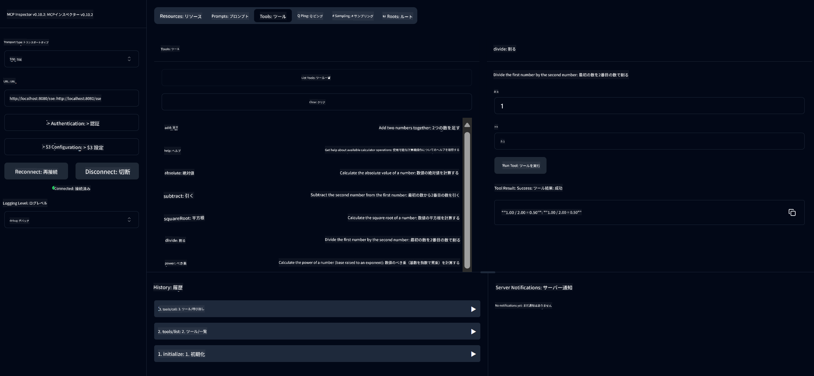

<!--
CO_OP_TRANSLATOR_METADATA:
{
  "original_hash": "5bd7a347d6ed1d706443f9129dd29dd9",
  "translation_date": "2025-07-25T09:04:37+00:00",
  "source_file": "04-PracticalSamples/mcp/calculator/README.md",
  "language_code": "ja"
}
-->
# 基本計算機MCPサービス

>**Note**: この章には、サンプルを通じて学べる[**チュートリアル**](./TUTORIAL.md)が含まれています。

**Model Context Protocol (MCP)** を使った初めての実践へようこそ！前の章では、生成AIの基礎を学び、開発環境をセットアップしました。ここからは、実際に役立つものを作っていきましょう。

この計算機サービスは、MCPを使用してAIモデルが外部ツールと安全にやり取りする方法を示します。AIモデルの計算能力が時に信頼できない場合があるため、ここではAIが正確な計算を行うために専門のサービスを呼び出す堅牢なシステムを構築する方法を紹介します。

## 目次

- [学べること](../../../../../04-PracticalSamples/mcp/calculator)
- [前提条件](../../../../../04-PracticalSamples/mcp/calculator)
- [重要な概念](../../../../../04-PracticalSamples/mcp/calculator)
- [クイックスタート](../../../../../04-PracticalSamples/mcp/calculator)
- [利用可能な計算機操作](../../../../../04-PracticalSamples/mcp/calculator)
- [テストクライアント](../../../../../04-PracticalSamples/mcp/calculator)
  - [1. 直接MCPクライアント (SDKClient)](../../../../../04-PracticalSamples/mcp/calculator)
  - [2. AI駆動クライアント (LangChain4jClient)](../../../../../04-PracticalSamples/mcp/calculator)
- [MCPインスペクター (Web UI)](../../../../../04-PracticalSamples/mcp/calculator)
  - [手順](../../../../../04-PracticalSamples/mcp/calculator)

## 学べること

この例を通じて以下を理解できます：
- Spring Bootを使用してMCP互換サービスを作成する方法
- 直接的なプロトコル通信とAI駆動のやり取りの違い
- AIモデルが外部ツールを使用するタイミングと方法を決定する仕組み
- ツール対応のAIアプリケーションを構築するためのベストプラクティス

MCPの概念を学び、最初のAIツール統合を構築したい初心者に最適です！

## 前提条件

- Java 21以上
- Maven 3.6以上
- **GitHubトークン**: AI駆動クライアントに必要です。まだ設定していない場合は、[第2章: 開発環境のセットアップ](../../../02-SetupDevEnvironment/README.md)を参照してください。

## 重要な概念

**Model Context Protocol (MCP)** は、AIアプリケーションが外部ツールと安全に接続するための標準化された方法です。これは、AIモデルが計算機のような外部サービスを利用できるようにする「橋渡し」のようなものです。AIモデルが自分で計算を試みる（時に不正確な）代わりに、計算機サービスを呼び出して正確な結果を得ることができます。MCPは、この通信を安全かつ一貫して行えるようにします。

**Server-Sent Events (SSE)** は、サーバーとクライアント間のリアルタイム通信を可能にします。従来のHTTPリクエストでは、リクエストを送信して応答を待つ必要がありますが、SSEではサーバーがクライアントに継続的に更新を送信できます。これは、応答がストリーミングされたり、処理に時間がかかるAIアプリケーションに最適です。

**AIツールと関数呼び出し** は、AIモデルがユーザーのリクエストに基づいて外部関数（計算機操作など）を自動的に選択して使用できるようにします。例えば、「15 + 27は？」と尋ねると、AIモデルは加算を求めていることを理解し、`add`ツールを適切なパラメータ（15, 27）で自動的に呼び出し、自然言語で結果を返します。AIは、各ツールをいつどのように使用するかを知っているインテリジェントなコーディネーターとして機能します。

## クイックスタート

### 1. 計算機アプリケーションディレクトリに移動
```bash
cd Generative-AI-for-beginners-java/04-PracticalSamples/mcp/calculator
```

### 2. ビルド＆実行
```bash
mvn clean install -DskipTests
java -jar target/calculator-server-0.0.1-SNAPSHOT.jar
```

### 3. クライアントでテスト
- **SDKClient**: MCPプロトコルを直接操作
- **LangChain4jClient**: AI駆動の自然言語インタラクション（GitHubトークンが必要）

## 利用可能な計算機操作

- `add(a, b)`, `subtract(a, b)`, `multiply(a, b)`, `divide(a, b)`
- `power(base, exponent)`, `squareRoot(number)`, `absolute(number)`
- `modulus(a, b)`, `help()`

## テストクライアント

### 1. 直接MCPクライアント (SDKClient)
MCPプロトコル通信を直接テストします。以下で実行：
```bash
mvn test-compile exec:java -Dexec.mainClass="com.microsoft.mcp.sample.client.SDKClient" -Dexec.classpathScope=test
```

### 2. AI駆動クライアント (LangChain4jClient)
GitHubモデルを使用した自然言語インタラクションをデモします。GitHubトークンが必要です（[前提条件](../../../../../04-PracticalSamples/mcp/calculator)を参照）。

**実行:**
```bash
mvn test-compile exec:java -Dexec.mainClass="com.microsoft.mcp.sample.client.LangChain4jClient" -Dexec.classpathScope=test
```

## MCPインスペクター (Web UI)

MCPインスペクターは、コードを書かずにMCPサービスをテストできるビジュアルなWebインターフェースを提供します。MCPの仕組みを理解するのに最適です！

### 手順:

1. **計算機サーバーを起動**（まだ起動していない場合）：
   ```bash
   java -jar target/calculator-server-0.0.1-SNAPSHOT.jar
   ```

2. **MCPインスペクターをインストールして実行** 新しいターミナルで：
   ```bash
   npx @modelcontextprotocol/inspector
   ```

3. **Webインターフェースを開く**：
   - "Inspector running at http://localhost:6274" のようなメッセージを探します
   - そのURLをブラウザで開きます

4. **計算機サービスに接続**：
   - Webインターフェースで、トランスポートタイプを「SSE」に設定
   - URLを `http://localhost:8080/sse` に設定
   - 「Connect」ボタンをクリック

5. **利用可能なツールを探索**：
   - 「List Tools」をクリックして、すべての計算機操作を確認
   - `add`、`subtract`、`multiply` などの関数が表示されます

6. **計算機操作をテスト**：
   - ツールを選択（例: "add"）
   - パラメータを入力（例: `a: 15`, `b: 27`）
   - 「Run Tool」をクリック
   - MCPサービスから返された結果を確認！

このビジュアルなアプローチにより、MCP通信の仕組みを理解した上で、自分のクライアントを構築する準備が整います。



---
**参考:** [MCP Server Boot Starter Docs](https://docs.spring.io/spring-ai/reference/api/mcp/mcp-server-boot-starter-docs.html)

**免責事項**:  
この文書は、AI翻訳サービス [Co-op Translator](https://github.com/Azure/co-op-translator) を使用して翻訳されています。正確性を追求しておりますが、自動翻訳には誤りや不正確な部分が含まれる可能性があることをご承知ください。元の言語で記載された文書が正式な情報源とみなされるべきです。重要な情報については、専門の人間による翻訳を推奨します。この翻訳の使用に起因する誤解や誤解釈について、当社は責任を負いません。