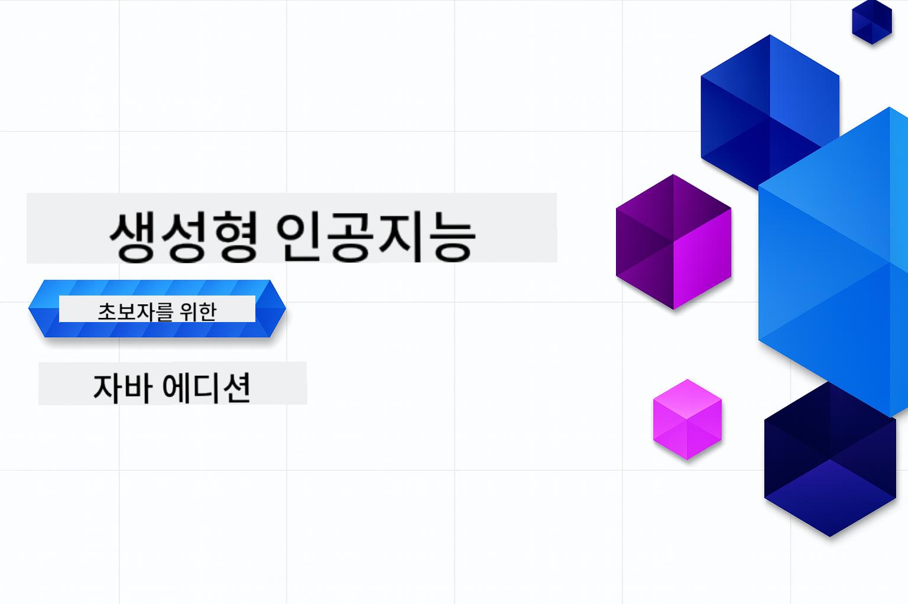

<!--
CO_OP_TRANSLATOR_METADATA:
{
  "original_hash": "7216baee4139fab32d7bfa0777d75551",
  "translation_date": "2025-07-27T18:50:34+00:00",
  "source_file": "README.md",
  "language_code": "ko"
}
-->
# 초보자를 위한 생성형 AI - Java 에디션

**소요 시간**: 이 워크숍은 로컬 설정 없이 온라인으로 완료할 수 있습니다. 환경 설정은 2분이 소요되며, 샘플 탐색은 탐구 깊이에 따라 1~3시간이 걸립니다.

> **빠른 시작**

1. 이 저장소를 본인의 GitHub 계정으로 포크하세요.
2. **Code** → **Codespaces** 탭 → **...** → **New with options...**를 클릭하세요.
3. 기본값을 사용하세요 – 이 과정에 맞게 생성된 개발 컨테이너가 선택됩니다.
4. **Create codespace**를 클릭하세요.
5. 환경이 준비될 때까지 약 2분 정도 기다리세요.
6. 바로 [GitHub Models 토큰 생성하기](./02-SetupDevEnvironment/README.md#step-2-create-a-github-personal-access-token)로 이동하세요.

## 다국어 지원

### GitHub Action을 통한 지원 (자동화 및 항상 최신 상태 유지)

[French](../fr/README.md) | [Spanish](../es/README.md) | [German](../de/README.md) | [Russian](../ru/README.md) | [Arabic](../ar/README.md) | [Persian (Farsi)](../fa/README.md) | [Urdu](../ur/README.md) | [Chinese (Simplified)](../zh/README.md) | [Chinese (Traditional, Macau)](../mo/README.md) | [Chinese (Traditional, Hong Kong)](../hk/README.md) | [Chinese (Traditional, Taiwan)](../tw/README.md) | [Japanese](../ja/README.md) | [Korean](./README.md) | [Hindi](../hi/README.md) | [Bengali](../bn/README.md) | [Marathi](../mr/README.md) | [Nepali](../ne/README.md) | [Punjabi (Gurmukhi)](../pa/README.md) | [Portuguese (Portugal)](../pt/README.md) | [Portuguese (Brazil)](../br/README.md) | [Italian](../it/README.md) | [Polish](../pl/README.md) | [Turkish](../tr/README.md) | [Greek](../el/README.md) | [Thai](../th/README.md) | [Swedish](../sv/README.md) | [Danish](../da/README.md) | [Norwegian](../no/README.md) | [Finnish](../fi/README.md) | [Dutch](../nl/README.md) | [Hebrew](../he/README.md) | [Vietnamese](../vi/README.md) | [Indonesian](../id/README.md) | [Malay](../ms/README.md) | [Tagalog (Filipino)](../tl/README.md) | [Swahili](../sw/README.md) | [Hungarian](../hu/README.md) | [Czech](../cs/README.md) | [Slovak](../sk/README.md) | [Romanian](../ro/README.md) | [Bulgarian](../bg/README.md) | [Serbian (Cyrillic)](../sr/README.md) | [Croatian](../hr/README.md) | [Slovenian](../sl/README.md) | [Ukrainian](../uk/README.md) | [Burmese (Myanmar)](../my/README.md)

## 과정 구성 및 학습 경로

### **1장: 생성형 AI 소개**
- **핵심 개념**: 대규모 언어 모델, 토큰, 임베딩, AI 기능 이해
- **Java AI 생태계**: Spring AI 및 OpenAI SDK 개요
- **모델 컨텍스트 프로토콜**: MCP와 AI 에이전트 간의 통신 역할 소개
- **실용적인 응용**: 챗봇 및 콘텐츠 생성과 같은 실제 시나리오
- **[→ 1장 시작하기](./01-IntroToGenAI/README.md)**

### **2장: 개발 환경 설정**
- **다중 제공자 구성**: GitHub Models, Azure OpenAI, OpenAI Java SDK 통합 설정
- **Spring Boot + Spring AI**: 엔터프라이즈 AI 애플리케이션 개발을 위한 모범 사례
- **GitHub Models**: 프로토타이핑 및 학습을 위한 무료 AI 모델 액세스 (신용카드 불필요)
- **개발 도구**: Docker 컨테이너, VS Code, GitHub Codespaces 구성
- **[→ 2장 시작하기](./02-SetupDevEnvironment/README.md)**

### **3장: 생성형 AI 핵심 기술**
- **프롬프트 엔지니어링**: 최적의 AI 모델 응답을 위한 기술
- **임베딩 및 벡터 연산**: 의미론적 검색 및 유사성 매칭 구현
- **검색 증강 생성 (RAG)**: AI와 자체 데이터 소스 결합
- **함수 호출**: 사용자 정의 도구 및 플러그인으로 AI 기능 확장
- **[→ 3장 시작하기](./03-CoreGenerativeAITechniques/README.md)**

### **4장: 실용적인 응용 및 프로젝트**
- **펫 스토리 생성기** (`petstory/`): GitHub Models를 활용한 창의적 콘텐츠 생성
- **Foundry 로컬 데모** (`foundrylocal/`): OpenAI Java SDK를 사용한 로컬 AI 모델 통합
- **MCP 계산기 서비스** (`mcp/calculator/`): Spring AI를 활용한 기본 모델 컨텍스트 프로토콜 구현
- **[→ 4장 시작하기](./04-PracticalSamples/README.md)**

### **5장: 책임 있는 AI 개발**
- **GitHub Models 안전성**: 내장된 콘텐츠 필터링 및 안전 메커니즘 테스트
- **책임 있는 AI 데모**: AI 안전 필터가 실제로 작동하는 방식에 대한 실습 예제
- **모범 사례**: 윤리적인 AI 개발 및 배포를 위한 필수 지침
- **[→ 5장 시작하기](./05-ResponsibleGenAI/README.md)**

## 추가 자료

- [초보자를 위한 AI 에이전트](https://github.com/microsoft/ai-agents-for-beginners)
- [초보자를 위한 생성형 AI (.NET 사용)](https://github.com/microsoft/Generative-AI-for-beginners-dotnet)
- [초보자를 위한 생성형 AI (JavaScript 사용)](https://github.com/microsoft/generative-ai-with-javascript)
- [초보자를 위한 생성형 AI](https://github.com/microsoft/generative-ai-for-beginners)
- [초보자를 위한 머신러닝](https://aka.ms/ml-beginners)
- [초보자를 위한 데이터 과학](https://aka.ms/datascience-beginners)
- [초보자를 위한 AI](https://aka.ms/ai-beginners)
- [초보자를 위한 사이버 보안](https://github.com/microsoft/Security-101)
- [초보자를 위한 웹 개발](https://aka.ms/webdev-beginners)
- [초보자를 위한 IoT](https://aka.ms/iot-beginners)
- [초보자를 위한 XR 개발](https://github.com/microsoft/xr-development-for-beginners)
- [AI 페어 프로그래밍을 위한 GitHub Copilot 마스터하기](https://aka.ms/GitHubCopilotAI)
- [C#/.NET 개발자를 위한 GitHub Copilot 마스터하기](https://github.com/microsoft/mastering-github-copilot-for-dotnet-csharp-developers)
- [GitHub Copilot 모험 선택하기](https://github.com/microsoft/CopilotAdventures)
- [Azure AI 서비스를 활용한 RAG 챗 앱](https://github.com/Azure-Samples/azure-search-openai-demo-java)

**면책 조항**:  
이 문서는 AI 번역 서비스 [Co-op Translator](https://github.com/Azure/co-op-translator)를 사용하여 번역되었습니다. 정확성을 위해 최선을 다하고 있으나, 자동 번역에는 오류나 부정확성이 포함될 수 있습니다. 원본 문서의 원어 버전이 권위 있는 출처로 간주되어야 합니다. 중요한 정보에 대해서는 전문적인 인간 번역을 권장합니다. 이 번역 사용으로 인해 발생하는 오해나 잘못된 해석에 대해 책임을 지지 않습니다.