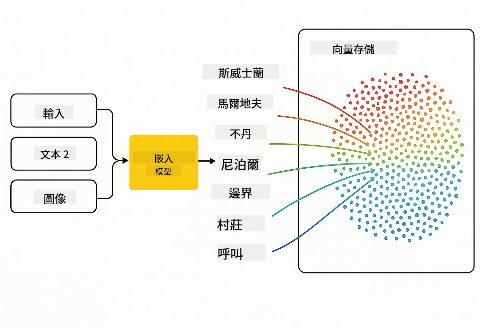
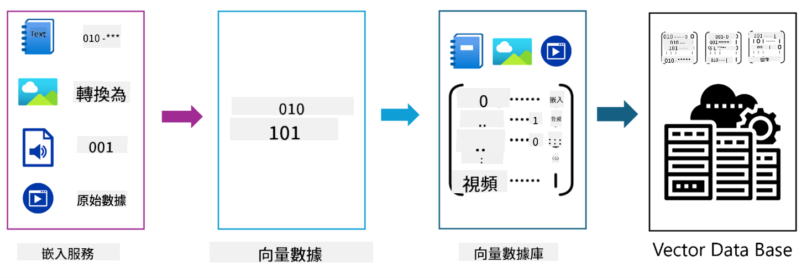
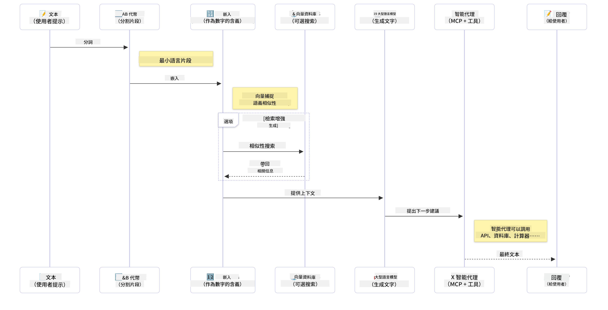

<!--
CO_OP_TRANSLATOR_METADATA:
{
  "original_hash": "006866db93a268a8769bb55f2e324291",
  "translation_date": "2025-07-28T10:25:37+00:00",
  "source_file": "01-IntroToGenAI/README.md",
  "language_code": "mo"
}
-->
# 生成式人工智慧入門 - Java 版

## 你將學到什麼

- **生成式人工智慧的基本概念**，包括大型語言模型 (LLMs)、提示工程、tokens、嵌入和向量資料庫
- **比較 Java 的 AI 開發工具**，包括 Azure OpenAI SDK、Spring AI 和 OpenAI Java SDK
- **了解模型上下文協議 (Model Context Protocol)** 及其在 AI 代理溝通中的角色

## 目錄

- [簡介](../../../01-IntroToGenAI)
- [生成式人工智慧概念快速回顧](../../../01-IntroToGenAI)
- [提示工程回顧](../../../01-IntroToGenAI)
- [Tokens、嵌入和代理](../../../01-IntroToGenAI)
- [Java 的 AI 開發工具與函式庫](../../../01-IntroToGenAI)
  - [OpenAI Java SDK](../../../01-IntroToGenAI)
  - [Spring AI](../../../01-IntroToGenAI)
  - [Azure OpenAI Java SDK](../../../01-IntroToGenAI)
- [總結](../../../01-IntroToGenAI)
- [下一步](../../../01-IntroToGenAI)

## 簡介

歡迎來到《生成式人工智慧入門 - Java 版》的第一章！這是一堂基礎課程，將帶你了解生成式人工智慧的核心概念，以及如何使用 Java 與這些概念互動。你將學習 AI 應用程式的基本構建模組，包括大型語言模型 (LLMs)、tokens、嵌入和 AI 代理。我們還會探索本課程中將使用的主要 Java 工具。

### 生成式人工智慧概念快速回顧

生成式人工智慧是一種能夠創造新內容（如文字、圖像或程式碼）的人工智慧，這些內容是基於從資料中學習到的模式和關係生成的。生成式人工智慧模型能夠生成類似人類的回應、理解上下文，有時甚至能創造出看似人類創作的內容。

在開發 Java AI 應用程式時，你將使用 **生成式人工智慧模型** 來創造內容。這些模型的部分功能包括：

- **文字生成**：為聊天機器人、內容創作和文字補全生成類似人類的文字。
- **圖像生成與分析**：生成逼真的圖像、增強照片以及檢測物體。
- **程式碼生成**：撰寫程式碼片段或腳本。

針對不同的任務，有特定類型的模型進行優化。例如，**小型語言模型 (SLMs)** 和 **大型語言模型 (LLMs)** 都可以處理文字生成，但 LLMs 通常在處理複雜任務時表現更佳。針對圖像相關任務，你可以使用專門的視覺模型或多模態模型。

當然，這些模型的回應並非總是完美的。你可能聽說過模型會「幻覺化」，即以權威的方式生成錯誤資訊。但你可以透過提供清晰的指示和上下文來幫助模型生成更好的回應，這就是 **提示工程** 的作用。

#### 提示工程回顧

提示工程是設計有效輸入以引導 AI 模型生成期望輸出的實踐。它包括：

- **清晰性**：使指示清楚且不含歧義。
- **上下文**：提供必要的背景資訊。
- **限制條件**：指定任何限制或格式。

提示工程的一些最佳實踐包括提示設計、清晰指示、任務分解、單次學習和少次學習，以及提示調整。測試不同的提示對於找到最適合你特定使用案例的方法至關重要。

在開發應用程式時，你將使用不同類型的提示：
- **系統提示**：設定模型行為的基本規則和上下文
- **使用者提示**：來自應用程式使用者的輸入資料
- **助手提示**：基於系統和使用者提示生成的模型回應

> **了解更多**：在 [生成式人工智慧入門課程的提示工程章節](https://github.com/microsoft/generative-ai-for-beginners/tree/main/04-prompt-engineering-fundamentals) 中了解更多提示工程內容

#### Tokens、嵌入和代理

在使用生成式人工智慧模型時，你會遇到一些術語，例如 **tokens**、**嵌入**、**代理** 和 **模型上下文協議 (MCP)**。以下是這些概念的詳細介紹：

- **Tokens**：Tokens 是模型中最小的文字單位，可以是單詞、字元或子詞。Tokens 用於將文字資料表示為模型可以理解的格式。例如，句子 "The quick brown fox jumped over the lazy dog" 可能被分解為 ["The", " quick", " brown", " fox", " jumped", " over", " the", " lazy", " dog"] 或 ["The", " qu", "ick", " br", "own", " fox", " jump", "ed", " over", " the", " la", "zy", " dog"]，具體取決於分詞策略。

  分詞是將文字分解為這些較小單位的過程。這很重要，因為模型是基於 tokens 而非原始文字運作的。提示中的 tokens 數量會影響模型的回應長度和品質，因為模型的上下文窗口有 tokens 限制（例如，GPT-4o 的總上下文限制為 128K tokens，包括輸入和輸出）。

  在 Java 中，你可以使用像 OpenAI SDK 這樣的函式庫，在向 AI 模型發送請求時自動處理分詞。

- **嵌入**：嵌入是捕捉語義意義的 tokens 向量表示。它們是數值表示（通常是浮點數陣列），使模型能夠理解單詞之間的關係並生成語義相關的回應。相似的單詞具有相似的嵌入，這使模型能夠理解同義詞和語義關係。

  在 Java 中，你可以使用 OpenAI SDK 或其他支援嵌入生成的函式庫來生成嵌入。這些嵌入對於語義搜尋等任務至關重要，因為你希望根據意義而非精確文字匹配來找到相似內容。

- **向量資料庫**：向量資料庫是針對嵌入進行優化的專門存儲系統。它們支持高效的相似性搜尋，對於基於檢索增強生成 (RAG) 模式的應用至關重要，這些模式需要根據語義相似性而非精確匹配從大型資料集中找到相關資訊。

> **注意**：本課程不會涵蓋向量資料庫，但它們在實際應用中非常常見，因此值得一提。

- **代理與 MCP**：AI 元件能夠自主與模型、工具和外部系統互動。模型上下文協議 (MCP) 提供了一種標準化方式，讓代理能夠安全地訪問外部資料來源和工具。更多內容請參考我們的 [MCP 入門課程](https://github.com/microsoft/mcp-for-beginners)。

在 Java AI 應用程式中，你將使用 tokens 進行文字處理，使用嵌入進行語義搜尋和 RAG，使用向量資料庫進行資料檢索，並使用代理與 MCP 構建智能工具使用系統。

### Java 的 AI 開發工具與函式庫

Java 提供了出色的 AI 開發工具。我們將在本課程中探索三個主要函式庫——OpenAI Java SDK、Azure OpenAI SDK 和 Spring AI。

以下是每章示例中使用的 SDK 的快速參考表：

| 章節 | 範例 | SDK |
|---------|--------|-----|
| 02-SetupDevEnvironment | github-models | OpenAI Java SDK |
| 02-SetupDevEnvironment | basic-chat-azure | Spring AI Azure OpenAI |
| 03-CoreGenerativeAITechniques | examples | Azure OpenAI SDK |
| 04-PracticalSamples | petstory | OpenAI Java SDK |
| 04-PracticalSamples | foundrylocal | OpenAI Java SDK |
| 04-PracticalSamples | calculator | Spring AI MCP SDK + LangChain4j |

**SDK 文件連結：**
- [Azure OpenAI Java SDK](https://github.com/Azure/azure-sdk-for-java/tree/azure-ai-openai_1.0.0-beta.16/sdk/openai/azure-ai-openai)
- [Spring AI](https://docs.spring.io/spring-ai/reference/)
- [OpenAI Java SDK](https://github.com/openai/openai-java)
- [LangChain4j](https://docs.langchain4j.dev/)

#### OpenAI Java SDK

OpenAI SDK 是 OpenAI API 的官方 Java 函式庫。它提供了一個簡單且一致的介面，用於與 OpenAI 的模型互動，使得將 AI 功能整合到 Java 應用程式中變得輕而易舉。第 2 章的 GitHub Models 範例、第 4 章的 Pet Story 應用程式和 Foundry Local 範例展示了 OpenAI SDK 的使用方法。

#### Spring AI

Spring AI 是一個全面的框架，將 AI 功能引入 Spring 應用程式，提供跨不同 AI 提供者的一致抽象層。它與 Spring 生態系統無縫整合，是需要 AI 功能的企業 Java 應用程式的理想選擇。

Spring AI 的優勢在於與 Spring 生態系統的無縫整合，使得使用熟悉的 Spring 模式（如依賴注入、配置管理和測試框架）構建生產就緒的 AI 應用程式變得簡單。在第 2 章和第 4 章中，你將使用 Spring AI 構建應用程式，這些應用程式利用了 OpenAI 和模型上下文協議 (MCP) Spring AI 函式庫。

##### 模型上下文協議 (MCP)

[模型上下文協議 (MCP)](https://modelcontextprotocol.io/) 是一個新興標準，使 AI 應用程式能夠安全地與外部資料來源和工具互動。MCP 提供了一種標準化方式，讓 AI 模型能夠訪問上下文資訊並在應用程式中執行操作。

在第 4 章中，你將構建一個簡單的 MCP 計算器服務，展示如何使用 Spring AI 實現模型上下文協議的基本功能，並展示如何創建基本的工具整合和服務架構。

#### Azure OpenAI Java SDK

Azure OpenAI Java 客戶端函式庫是 OpenAI REST API 的一個改編版本，提供了一個符合語言習慣的介面，並與 Azure SDK 生態系統的其他部分整合。在第 3 章中，你將使用 Azure OpenAI SDK 構建應用程式，包括聊天應用程式、函式調用和 RAG（檢索增強生成）模式。

> 注意：Azure OpenAI SDK 在功能上落後於 OpenAI Java SDK，因此在未來的專案中，建議考慮使用 OpenAI Java SDK。

## 總結

**恭喜你！** 你已成功：

- **學習了生成式人工智慧的基本概念**，包括 LLMs、提示工程、tokens、嵌入和向量資料庫
- **比較了 Java 的 AI 開發工具**，包括 Azure OpenAI SDK、Spring AI 和 OpenAI Java SDK
- **了解了模型上下文協議** 及其在 AI 代理溝通中的角色

## 下一步

[第 2 章：設置開發環境](../02-SetupDevEnvironment/README.md)

**免責聲明**：  
本文件已使用 AI 翻譯服務 [Co-op Translator](https://github.com/Azure/co-op-translator) 進行翻譯。雖然我們致力於提供準確的翻譯，但請注意，自動翻譯可能包含錯誤或不準確之處。原始文件的母語版本應被視為權威來源。對於重要信息，建議尋求專業人工翻譯。我們對因使用此翻譯而引起的任何誤解或誤釋不承擔責任。