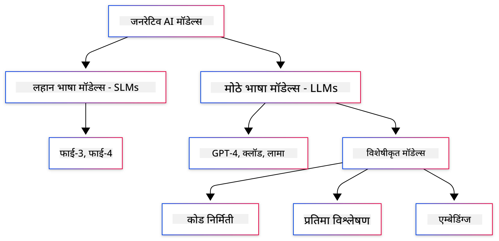
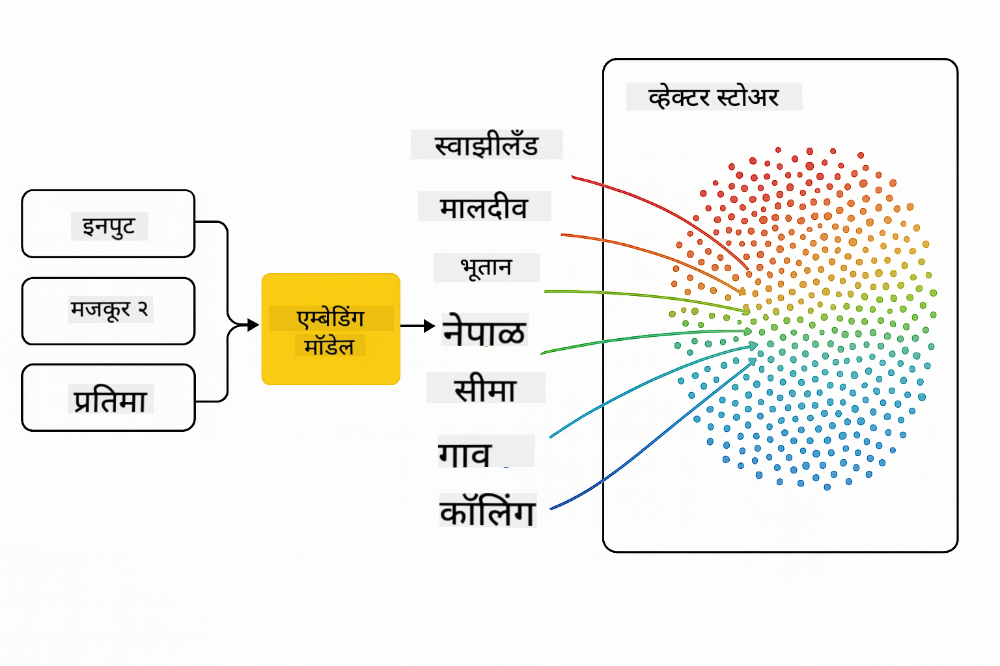
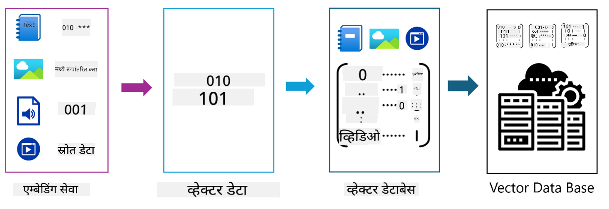
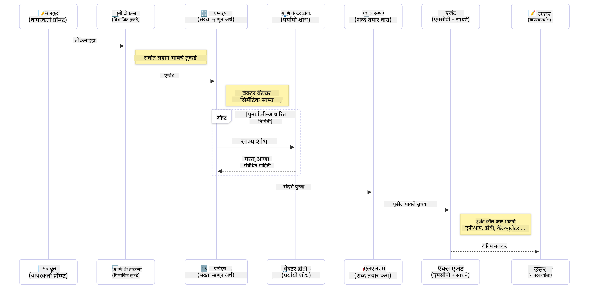

<!--
CO_OP_TRANSLATOR_METADATA:
{
  "original_hash": "6d8b4a0d774dc2a1e97c95859a6d6e4b",
  "translation_date": "2025-07-21T18:40:46+00:00",
  "source_file": "01-IntroToGenAI/README.md",
  "language_code": "mr"
}
-->
# जनरेटिव AI - जावा संस्करणाची ओळख

## तुम्ही काय शिकाल

- **जनरेटिव AI मूलतत्त्वे**, ज्यामध्ये LLMs, प्रॉम्प्ट इंजिनिअरिंग, टोकन्स, एम्बेडिंग्ज, आणि व्हेक्टर डेटाबेस यांचा समावेश आहे  
- **जावा AI विकास साधनांची तुलना**, ज्यामध्ये Azure OpenAI SDK, Spring AI, आणि OpenAI Java SDK यांचा समावेश आहे  
- **मॉडेल कॉन्टेक्स्ट प्रोटोकॉल** आणि AI एजंट कम्युनिकेशनमधील त्याची भूमिका  

## विषयसूची

- [परिचय](../../../01-IntroToGenAI)  
- [जनरेटिव AI संकल्पनांचा जलद आढावा](../../../01-IntroToGenAI)  
- [प्रॉम्प्ट इंजिनिअरिंग पुनरावलोकन](../../../01-IntroToGenAI)  
- [टोकन्स, एम्बेडिंग्ज, आणि एजंट्स](../../../01-IntroToGenAI)  
- [जावा साठी AI विकास साधने आणि लायब्ररी](../../../01-IntroToGenAI)  
  - [OpenAI Java SDK](../../../01-IntroToGenAI)  
  - [Spring AI](../../../01-IntroToGenAI)  
  - [Azure OpenAI Java SDK](../../../01-IntroToGenAI)  
- [सारांश](../../../01-IntroToGenAI)  
- [पुढील पायऱ्या](../../../01-IntroToGenAI)  

## परिचय

जनरेटिव AI फॉर बिगिनर्स - जावा संस्करणाच्या पहिल्या अध्यायात तुमचं स्वागत आहे! हा मूलभूत धडा तुम्हाला जनरेटिव AI च्या मुख्य संकल्पनांशी परिचित करून देतो आणि जावा वापरून त्यांच्यासोबत कसे काम करायचे हे शिकवतो. तुम्ही AI अनुप्रयोगांच्या महत्त्वाच्या घटकांबद्दल शिकाल, ज्यामध्ये लार्ज लँग्वेज मॉडेल्स (LLMs), टोकन्स, एम्बेडिंग्ज, आणि AI एजंट्स यांचा समावेश आहे. याशिवाय, या कोर्समध्ये तुम्ही वापरणाऱ्या मुख्य जावा साधनांचा देखील अभ्यास करू.

### जनरेटिव AI संकल्पनांचा जलद आढावा

जनरेटिव AI ही कृत्रिम बुद्धिमत्तेची एक प्रकार आहे जी डेटामधून शिकलेल्या पॅटर्न्स आणि नातेसंबंधांवर आधारित नवीन सामग्री तयार करते, जसे की मजकूर, प्रतिमा, किंवा कोड. जनरेटिव AI मॉडेल्स मानवीसारखी उत्तरे तयार करू शकतात, संदर्भ समजू शकतात, आणि कधी कधी मानवीसारखी वाटणारी सामग्री तयार करू शकतात.

तुमच्या जावा AI अनुप्रयोगांचा विकास करताना, तुम्ही **जनरेटिव AI मॉडेल्स** वापरून सामग्री तयार कराल. जनरेटिव AI मॉडेल्सच्या काही क्षमता खालीलप्रमाणे आहेत:

- **मजकूर निर्मिती**: चॅटबॉट्स, सामग्री, आणि मजकूर पूर्ण करण्यासाठी मानवीसारखा मजकूर तयार करणे.  
- **प्रतिमा निर्मिती आणि विश्लेषण**: वास्तववादी प्रतिमा तयार करणे, फोटो सुधारणा करणे, आणि वस्तू ओळखणे.  
- **कोड निर्मिती**: कोडचे तुकडे किंवा स्क्रिप्ट लिहिणे.  

विशिष्ट कार्यांसाठी वेगवेगळ्या प्रकारचे मॉडेल्स अनुकूलित केलेले असतात. उदाहरणार्थ, **स्मॉल लँग्वेज मॉडेल्स (SLMs)** आणि **लार्ज लँग्वेज मॉडेल्स (LLMs)** दोन्ही मजकूर निर्मिती हाताळू शकतात, परंतु LLMs सहसा जटिल कार्यांसाठी चांगली कामगिरी करतात. प्रतिमेशी संबंधित कार्यांसाठी, तुम्ही विशेष व्हिजन मॉडेल्स किंवा मल्टी-मोडल मॉडेल्स वापराल.

तथापि, या मॉडेल्सची उत्तरे नेहमीच परिपूर्ण नसतात. तुम्ही कदाचित ऐकले असेल की मॉडेल्स "हॅल्युसिनेट" करतात किंवा अधिकारवाणीने चुकीची माहिती तयार करतात. परंतु तुम्ही मॉडेलला स्पष्ट सूचना आणि संदर्भ देऊन चांगली उत्तरे तयार करण्यात मदत करू शकता. यालाच **प्रॉम्प्ट इंजिनिअरिंग** म्हणतात.

#### प्रॉम्प्ट इंजिनिअरिंग पुनरावलोकन

प्रॉम्प्ट इंजिनिअरिंग म्हणजे AI मॉडेल्सना इच्छित परिणामाकडे मार्गदर्शन करण्यासाठी प्रभावी इनपुट डिझाइन करण्याची पद्धत आहे. यामध्ये खालील गोष्टींचा समावेश होतो:

- **स्पष्टता**: सूचना स्पष्ट आणि अचूक बनवणे.  
- **संदर्भ**: आवश्यक पार्श्वभूमी माहिती प्रदान करणे.  
- **मर्यादा**: कोणत्याही मर्यादा किंवा स्वरूप निर्दिष्ट करणे.  

प्रॉम्प्ट इंजिनिअरिंगसाठी काही सर्वोत्तम पद्धतींमध्ये प्रॉम्प्ट डिझाइन, स्पष्ट सूचना, कार्याचे विभाजन, वन-शॉट आणि फ्यू-शॉट लर्निंग, आणि प्रॉम्प्ट ट्यूनिंग यांचा समावेश आहे. तुमच्या विशिष्ट उपयोग प्रकरणासाठी काय चांगले कार्य करते हे शोधण्यासाठी विविध प्रॉम्प्ट्सची चाचणी घेणे आवश्यक आहे.

अनुप्रयोग विकसित करताना, तुम्ही वेगवेगळ्या प्रकारच्या प्रॉम्प्ट्ससह काम कराल:
- **सिस्टम प्रॉम्प्ट्स**: मॉडेलच्या वर्तनासाठी मूलभूत नियम आणि संदर्भ सेट करतात.  
- **युजर प्रॉम्प्ट्स**: तुमच्या अनुप्रयोग वापरकर्त्यांकडून आलेली इनपुट डेटा.  
- **असिस्टंट प्रॉम्प्ट्स**: सिस्टम आणि युजर प्रॉम्प्ट्सच्या आधारे मॉडेलची उत्तरे.  

> **अधिक जाणून घ्या**: [जनरेटिव AI फॉर बिगिनर्स कोर्सच्या प्रॉम्प्ट इंजिनिअरिंग अध्यायात](https://github.com/microsoft/generative-ai-for-beginners/tree/main/04-prompt-engineering-fundamentals) प्रॉम्प्ट इंजिनिअरिंगबद्दल अधिक जाणून घ्या.  

#### टोकन्स, एम्बेडिंग्ज, आणि एजंट्स

जनरेटिव AI मॉडेल्ससह काम करताना, तुम्हाला **टोकन्स**, **एम्बेडिंग्ज**, **एजंट्स**, आणि **मॉडेल कॉन्टेक्स्ट प्रोटोकॉल (MCP)** यांसारख्या संज्ञा भेटतील. या संकल्पनांचा सविस्तर आढावा खालीलप्रमाणे आहे:

- **टोकन्स**: टोकन्स म्हणजे मॉडेलमधील मजकूराचा सर्वात लहान घटक आहे. हे शब्द, अक्षरे, किंवा उपशब्द असू शकतात. टोकन्स मजकूर डेटा अशा स्वरूपात दर्शवतात की मॉडेलला समजेल. उदाहरणार्थ, वाक्य "The quick brown fox jumped over the lazy dog" याला ["The", " quick", " brown", " fox", " jumped", " over", " the", " lazy", " dog"] किंवा ["The", " qu", "ick", " br", "own", " fox", " jump", "ed", " over", " the", " la", "zy", " dog"] असे टोकनाइझ केले जाऊ शकते, टोकनाइझेशन धोरणावर अवलंबून.  

टोकनाइझेशन म्हणजे मजकूराचे या लहान घटकांमध्ये विभाजन करण्याची प्रक्रिया आहे. हे महत्त्वाचे आहे कारण मॉडेल्स कच्च्या मजकूराऐवजी टोकन्सवर कार्य करतात. प्रॉम्प्टमधील टोकन्सची संख्या मॉडेलच्या उत्तराच्या लांबीवर आणि गुणवत्तेवर परिणाम करते, कारण मॉडेल्सच्या संदर्भ विंडोसाठी टोकन मर्यादा असते (उदा., GPT-4o साठी 128K टोकन्स).  

  जावामध्ये, तुम्ही OpenAI SDK सारख्या लायब्ररींचा वापर करून टोकनाइझेशन स्वयंचलितपणे हाताळू शकता.  

- **एम्बेडिंग्ज**: एम्बेडिंग्ज म्हणजे टोकन्सचे व्हेक्टर प्रतिनिधित्व आहे जे अर्थपूर्णता कॅप्चर करतात. हे संख्यात्मक प्रतिनिधित्व (सामान्यतः फ्लोटिंग-पॉइंट नंबरच्या अॅरेज) असते जे मॉडेल्सना शब्दांमधील नातेसंबंध समजून घेण्यास आणि संदर्भानुसार संबंधित उत्तरे तयार करण्यास सक्षम करतात. समान शब्दांचे समान एम्बेडिंग्ज असतात, ज्यामुळे मॉडेलला समानार्थी शब्द आणि अर्थपूर्ण नातेसंबंध समजण्यास मदत होते.  

  जावामध्ये, तुम्ही OpenAI SDK किंवा एम्बेडिंग्ज निर्मितीला समर्थन देणाऱ्या इतर लायब्ररींचा वापर करून एम्बेडिंग्ज तयार करू शकता. हे एम्बेडिंग्ज सिमॅंटिक सर्चसारख्या कार्यांसाठी महत्त्वाचे आहेत, जिथे तुम्हाला अचूक मजकूर जुळण्याऐवजी अर्थावर आधारित समान सामग्री शोधायची असते.  

- **व्हेक्टर डेटाबेस**: व्हेक्टर डेटाबेस म्हणजे एम्बेडिंग्जसाठी अनुकूलित विशेष स्टोरेज सिस्टम्स आहेत. ते कार्यक्षम समानता शोध सक्षम करतात आणि मोठ्या डेटासेटमधून सिमॅंटिक समानतेच्या आधारे संबंधित माहिती शोधण्यासाठी Retrieval-Augmented Generation (RAG) पॅटर्नसाठी महत्त्वाचे आहेत.  

> **टीप**: या कोर्समध्ये आपण व्हेक्टर डेटाबेस कव्हर करणार नाही, परंतु ते वास्तविक-जगातील अनुप्रयोगांमध्ये सामान्यतः वापरले जात असल्यामुळे त्यांचा उल्लेख करणे योग्य आहे.  

- **एजंट्स आणि MCP**: मॉडेल्स, साधने, आणि बाह्य प्रणालींसोबत स्वायत्तपणे संवाद साधणारे AI घटक. मॉडेल कॉन्टेक्स्ट प्रोटोकॉल (MCP) एजंट्सना बाह्य डेटा स्रोत आणि साधनांमध्ये सुरक्षितपणे प्रवेश करण्यासाठी एक प्रमाणित मार्ग प्रदान करतो. [MCP फॉर बिगिनर्स](https://github.com/microsoft/mcp-for-beginners) कोर्समध्ये अधिक जाणून घ्या.  

जावा AI अनुप्रयोगांमध्ये, तुम्ही मजकूर प्रक्रिया करण्यासाठी टोकन्स, सिमॅंटिक सर्च आणि RAG साठी एम्बेडिंग्ज, डेटा पुनर्प्राप्तीसाठी व्हेक्टर डेटाबेस, आणि बुद्धिमान, साधन-वापरणाऱ्या प्रणाली तयार करण्यासाठी MCP सह एजंट्स वापराल.  

### जावा साठी AI विकास साधने आणि लायब्ररी

जावा AI विकासासाठी उत्कृष्ट साधने प्रदान करते. या कोर्समध्ये आपण तीन मुख्य लायब्ररींचा अभ्यास करू - OpenAI Java SDK, Azure OpenAI SDK, आणि Spring AI.

येथील प्रत्येक अध्यायाच्या उदाहरणांमध्ये कोणता SDK वापरला जातो याचे जलद संदर्भ टेबल:

| अध्याय | नमुना | SDK |  
|---------|--------|-----|  
| 02-SetupDevEnvironment | src/github-models/ | OpenAI Java SDK |  
| 02-SetupDevEnvironment | src/basic-chat-azure/ | Spring AI Azure OpenAI |  
| 03-CoreGenerativeAITechniques | examples/ | Azure OpenAI SDK |  
| 04-PracticalSamples | petstory/ | OpenAI Java SDK |  
| 04-PracticalSamples | foundrylocal/ | OpenAI Java SDK |  
| 04-PracticalSamples | mcp/calculator/ | Spring AI MCP SDK + LangChain4j |  

**SDK दस्तऐवज दुवे:**  
- [Azure OpenAI Java SDK](https://github.com/Azure/azure-sdk-for-java/tree/azure-ai-openai_1.0.0-beta.16/sdk/openai/azure-ai-openai)  
- [Spring AI](https://docs.spring.io/spring-ai/reference/)  
- [OpenAI Java SDK](https://github.com/openai/openai-java)  
- [LangChain4j](https://docs.langchain4j.dev/)  

#### OpenAI Java SDK

OpenAI SDK ही OpenAI API साठी अधिकृत जावा लायब्ररी आहे. ती OpenAI च्या मॉडेल्ससोबत संवाद साधण्यासाठी एक साधी आणि सुसंगत इंटरफेस प्रदान करते, ज्यामुळे जावा अनुप्रयोगांमध्ये AI क्षमता समाकलित करणे सोपे होते. अध्याय 2 मधील GitHub मॉडेल्सचे उदाहरण, अध्याय 4 मधील Pet Story अनुप्रयोग, आणि Foundry Local उदाहरण OpenAI SDK दृष्टिकोन प्रदर्शित करतात.  

#### Spring AI

Spring AI ही एक व्यापक फ्रेमवर्क आहे जी Spring अनुप्रयोगांमध्ये AI क्षमता आणते, विविध AI प्रदात्यांमध्ये सुसंगत एब्स्ट्रॅक्शन लेयर प्रदान करते. ती Spring इकोसिस्टमसोबत सहजपणे समाकलित होते, ज्यामुळे AI क्षमता असलेले एंटरप्राइझ जावा अनुप्रयोग तयार करण्यासाठी ती आदर्श निवड ठरते.  

Spring AI ची ताकद तिच्या Spring इकोसिस्टमसोबतच्या अखंड समाकलनात आहे, ज्यामुळे ओळखीच्या Spring पॅटर्न्ससह उत्पादन-तयार AI अनुप्रयोग तयार करणे सोपे होते, जसे की डिपेंडन्सी इंजेक्शन, कॉन्फिगरेशन व्यवस्थापन, आणि चाचणी फ्रेमवर्क. तुम्ही अध्याय 2 आणि 4 मध्ये OpenAI आणि मॉडेल कॉन्टेक्स्ट प्रोटोकॉल (MCP) Spring AI लायब्ररींचा लाभ घेणारे अनुप्रयोग तयार करण्यासाठी Spring AI वापराल.  

##### मॉडेल कॉन्टेक्स्ट प्रोटोकॉल (MCP)

[मॉडेल कॉन्टेक्स्ट प्रोटोकॉल (MCP)](https://modelcontextprotocol.io/) ही एक उदयोन्मुख मानक आहे जी AI अनुप्रयोगांना बाह्य डेटा स्रोत आणि साधनांशी सुरक्षितपणे संवाद साधण्यास सक्षम करते. MCP AI मॉडेल्सना संदर्भात्मक माहितीमध्ये प्रवेश करण्यासाठी आणि तुमच्या अनुप्रयोगांमध्ये क्रिया अंमलात आणण्यासाठी एक प्रमाणित मार्ग प्रदान करते.  

अध्याय 4 मध्ये, तुम्ही Spring AI सह मॉडेल कॉन्टेक्स्ट प्रोटोकॉलचे मूलतत्त्वे प्रदर्शित करणारी एक साधी MCP कॅल्क्युलेटर सेवा तयार कराल, ज्यामध्ये मूलभूत साधन समाकलन आणि सेवा आर्किटेक्चर तयार करण्याचे प्रदर्शन केले जाईल.  

#### Azure OpenAI Java SDK

Azure OpenAI क्लायंट लायब्ररी जावा साठी OpenAI च्या REST APIs चे एक रूपांतर आहे, जे एक परिचित इंटरफेस आणि उर्वरित Azure SDK इकोसिस्टमसोबत समाकलन प्रदान करते. अध्याय 3 मध्ये, तुम्ही Azure OpenAI SDK वापरून अनुप्रयोग तयार कराल, ज्यामध्ये चॅट अनुप्रयोग, फंक्शन कॉलिंग, आणि RAG (Retrieval-Augmented Generation) पॅटर्न्सचा समावेश आहे.  

> टीप: Azure OpenAI SDK वैशिष्ट्यांच्या बाबतीत OpenAI Java SDK च्या मागे आहे, त्यामुळे भविष्यातील प्रकल्पांसाठी OpenAI Java SDK वापरण्याचा विचार करा.  

## सारांश

**अभिनंदन!** तुम्ही यशस्वीरित्या:  
- **जनरेटिव AI मूलतत्त्वे शिकली**, ज्यामध्ये LLMs, प्रॉम्प्ट इंजिनिअरिंग, टोकन्स, एम्बेडिंग्ज, आणि व्हेक्टर डेटाबेस यांचा समावेश आहे.  
- **जावा AI विकास साधनांची तुलना केली**, ज्यामध्ये Azure OpenAI SDK, Spring AI, आणि OpenAI Java SDK यांचा समावेश आहे.  
- **मॉडेल कॉन्टेक्स्ट प्रोटोकॉल शोधला** आणि AI एजंट कम्युनिकेशनमधील त्याची भूमिका समजली.  

## पुढील पायऱ्या

[अध्याय 2: विकास वातावरण सेट करणे](../02-SetupDevEnvironment/README.md)  

**अस्वीकृती**:  
हा दस्तऐवज AI भाषांतर सेवा [Co-op Translator](https://github.com/Azure/co-op-translator) वापरून भाषांतरित करण्यात आला आहे. आम्ही अचूकतेसाठी प्रयत्नशील असलो तरी कृपया लक्षात ठेवा की स्वयंचलित भाषांतरांमध्ये त्रुटी किंवा अचूकतेचा अभाव असू शकतो. मूळ भाषेतील दस्तऐवज हा अधिकृत स्रोत मानला जावा. महत्त्वाच्या माहितीसाठी, व्यावसायिक मानवी भाषांतराची शिफारस केली जाते. या भाषांतराचा वापर करून उद्भवलेल्या कोणत्याही गैरसमज किंवा चुकीच्या अर्थासाठी आम्ही जबाबदार राहणार नाही.