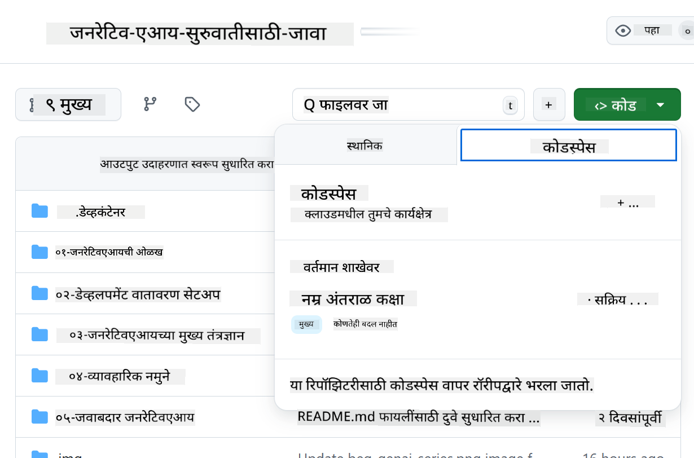

<!--
CO_OP_TRANSLATOR_METADATA:
{
  "original_hash": "bfdb4b4eadbee3a59ef742439f58326a",
  "translation_date": "2025-07-27T13:02:10+00:00",
  "source_file": "02-SetupDevEnvironment/getting-started-azure-openai.md",
  "language_code": "mr"
}
-->
# Azure OpenAI साठी विकास वातावरण सेट करणे

> **जलद प्रारंभ**: हा मार्गदर्शक Azure OpenAI सेटअपसाठी आहे. विनामूल्य मॉडेल्ससह त्वरित प्रारंभासाठी, [GitHub Models with Codespaces](./README.md#quick-start-cloud) वापरा.

हा मार्गदर्शक तुम्हाला या कोर्समधील तुमच्या Java AI अॅप्ससाठी Azure AI Foundry मॉडेल्स सेट करण्यात मदत करेल.

## विषय सूची

- [जलद सेटअप विहंगावलोकन](../../../02-SetupDevEnvironment)
- [पायरी 1: Azure AI Foundry संसाधने तयार करा](../../../02-SetupDevEnvironment)
  - [हब आणि प्रकल्प तयार करा](../../../02-SetupDevEnvironment)
  - [GPT-4o-mini मॉडेल तैनात करा](../../../02-SetupDevEnvironment)
- [पायरी 2: तुमचा Codespace तयार करा](../../../02-SetupDevEnvironment)
- [पायरी 3: तुमचे वातावरण कॉन्फिगर करा](../../../02-SetupDevEnvironment)
- [पायरी 4: तुमचा सेटअप चाचणी करा](../../../02-SetupDevEnvironment)
- [पुढे काय?](../../../02-SetupDevEnvironment)
- [संसाधने](../../../02-SetupDevEnvironment)
- [अतिरिक्त संसाधने](../../../02-SetupDevEnvironment)

## जलद सेटअप विहंगावलोकन

1. Azure AI Foundry संसाधने तयार करा (हब, प्रकल्प, मॉडेल)
2. Java विकास कंटेनरसह Codespace तयार करा
3. Azure OpenAI क्रेडेन्शियल्ससह तुमची .env फाइल कॉन्फिगर करा
4. उदाहरण प्रकल्पासह तुमचा सेटअप चाचणी करा

## पायरी 1: Azure AI Foundry संसाधने तयार करा

### हब आणि प्रकल्प तयार करा

1. [Azure AI Foundry Portal](https://ai.azure.com/) वर जा आणि साइन इन करा
2. **+ Create** → **New hub** वर क्लिक करा (किंवा **Management** → **All hubs** → **+ New hub** वर जा)
3. तुमचा हब कॉन्फिगर करा:
   - **Hub name**: उदा., "MyAIHub"
   - **Subscription**: तुमची Azure सदस्यता निवडा
   - **Resource group**: नवीन तयार करा किंवा विद्यमान निवडा
   - **Location**: तुमच्याजवळचे स्थान निवडा
   - **Storage account**: डिफॉल्ट वापरा किंवा कस्टम कॉन्फिगर करा
   - **Key vault**: डिफॉल्ट वापरा किंवा कस्टम कॉन्फिगर करा
   - **Next** → **Review + create** → **Create** वर क्लिक करा
4. तयार झाल्यावर, **+ New project** वर क्लिक करा (किंवा हब विहंगावलोकनातून **Create project** निवडा)
   - **Project name**: उदा., "GenAIJava"
   - **Create** वर क्लिक करा

### GPT-4o-mini मॉडेल तैनात करा

1. तुमच्या प्रकल्पात, **Model catalog** मध्ये जा आणि **gpt-4o-mini** शोधा
   - *पर्याय: **Deployments** → **+ Create deployment** वर जा*
2. gpt-4o-mini मॉडेल कार्डवर **Deploy** वर क्लिक करा
3. तैनाती कॉन्फिगर करा:
   - **Deployment name**: "gpt-4o-mini"
   - **Model version**: नवीनतम वापरा
   - **Deployment type**: Standard
4. **Deploy** वर क्लिक करा
5. तैनात झाल्यावर, **Deployments** टॅबमध्ये जा आणि खालील मूल्ये कॉपी करा:
   - **Deployment name** (उदा., "gpt-4o-mini")
   - **Target URI** (उदा., `https://your-hub-name.openai.azure.com/`)  
      > **महत्त्वाचे**: फक्त बेस URL कॉपी करा (उदा., `https://myhub.openai.azure.com/`) पूर्ण एंडपॉइंट पथ नाही.
   - **Key** (Keys and Endpoint विभागातून)

> **अजूनही अडचण आहे?** अधिकृत [Azure AI Foundry Documentation](https://learn.microsoft.com/azure/ai-foundry/how-to/create-projects?tabs=ai-foundry&pivots=hub-project) ला भेट द्या

## पायरी 2: तुमचा Codespace तयार करा

1. हे रेपॉजिटरी तुमच्या GitHub खात्यावर Fork करा
   > **टीप**: जर तुम्हाला बेसिक कॉन्फिग संपादित करायचे असेल तर [Dev Container Configuration](../../../.devcontainer/devcontainer.json) पहा
2. तुमच्या Fork केलेल्या रेपॉजिटरीमध्ये, **Code** → **Codespaces** टॅबवर क्लिक करा
3. **...** → **New with options...** वर क्लिक करा  

4. **Dev container configuration** निवडा: 
   - **Generative AI Java Development Environment**
5. **Create codespace** वर क्लिक करा

## पायरी 3: तुमचे वातावरण कॉन्फिगर करा

तुमचा Codespace तयार झाल्यावर, तुमचे Azure OpenAI क्रेडेन्शियल्स सेट करा:

1. **रेपॉजिटरी रूटमधून उदाहरण प्रकल्पावर जा:**
   ```bash
   cd 02-SetupDevEnvironment/examples/basic-chat-azure
   ```

2. **तुमची .env फाइल तयार करा:**
   ```bash
   cp .env.example .env
   ```

3. **तुमच्या Azure OpenAI क्रेडेन्शियल्ससह .env फाइल संपादित करा:**
   ```bash
   # Your Azure OpenAI API key (from Azure AI Foundry portal)
   AZURE_AI_KEY=your-actual-api-key-here
   
   # Your Azure OpenAI endpoint URL (e.g., https://myhub.openai.azure.com/)
   AZURE_AI_ENDPOINT=https://your-hub-name.openai.azure.com/
   ```

   > **सुरक्षा टीप**: 
   > - तुमची `.env` फाइल कधीही व्हर्जन कंट्रोलमध्ये कमिट करू नका
   > - `.env` फाइल आधीच `.gitignore` मध्ये समाविष्ट आहे
   > - तुमचे API कीज सुरक्षित ठेवा आणि नियमितपणे रोटेट करा

## पायरी 4: तुमचा सेटअप चाचणी करा

Azure OpenAI कनेक्शन चाचणीसाठी उदाहरण अॅप्लिकेशन चालवा:

```bash
mvn clean spring-boot:run
```

तुम्हाला GPT-4o-mini मॉडेलकडून प्रतिसाद दिसायला हवा!

> **VS Code वापरकर्ते**: तुम्ही `F5` दाबून अॅप्लिकेशन चालवू शकता. लॉन्च कॉन्फिगरेशन आधीच तुमची `.env` फाइल आपोआप लोड करण्यासाठी सेट केलेले आहे.

> **पूर्ण उदाहरण**: सविस्तर सूचना आणि समस्या निवारणासाठी [End-to-End Azure OpenAI Example](./examples/basic-chat-azure/README.md) पहा.

## पुढे काय?

**सेटअप पूर्ण!** आता तुमच्याकडे आहे:
- gpt-4o-mini सह Azure OpenAI तैनात
- स्थानिक .env फाइल कॉन्फिगरेशन
- Java विकास वातावरण तयार

**पुढे जा** [Chapter 3: Core Generative AI Techniques](../03-CoreGenerativeAITechniques/README.md) वर, AI अॅप्लिकेशन्स तयार करण्यास सुरुवात करण्यासाठी!

## संसाधने

- [Azure AI Foundry Documentation](https://learn.microsoft.com/azure/ai-services/)
- [Spring AI Azure OpenAI Documentation](https://docs.spring.io/spring-ai/reference/api/clients/azure-openai-chat.html)
- [Azure OpenAI Java SDK](https://learn.microsoft.com/java/api/overview/azure/ai-openai-readme)

## अतिरिक्त संसाधने

- [VS Code डाउनलोड करा](https://code.visualstudio.com/Download)
- [Docker Desktop मिळवा](https://www.docker.com/products/docker-desktop)
- [Dev Container Configuration](../../../.devcontainer/devcontainer.json)

**अस्वीकरण**:  
हा दस्तऐवज AI भाषांतर सेवा [Co-op Translator](https://github.com/Azure/co-op-translator) वापरून भाषांतरित करण्यात आला आहे. आम्ही अचूकतेसाठी प्रयत्नशील असलो तरी कृपया लक्षात ठेवा की स्वयंचलित भाषांतरांमध्ये त्रुटी किंवा अचूकतेचा अभाव असू शकतो. मूळ भाषेतील दस्तऐवज हा अधिकृत स्रोत मानला जावा. महत्त्वाच्या माहितीसाठी व्यावसायिक मानवी भाषांतराची शिफारस केली जाते. या भाषांतराचा वापर करून उद्भवलेल्या कोणत्याही गैरसमज किंवा चुकीच्या अर्थासाठी आम्ही जबाबदार राहणार नाही.