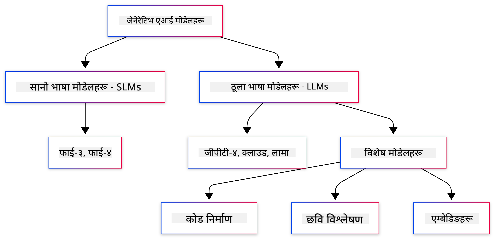
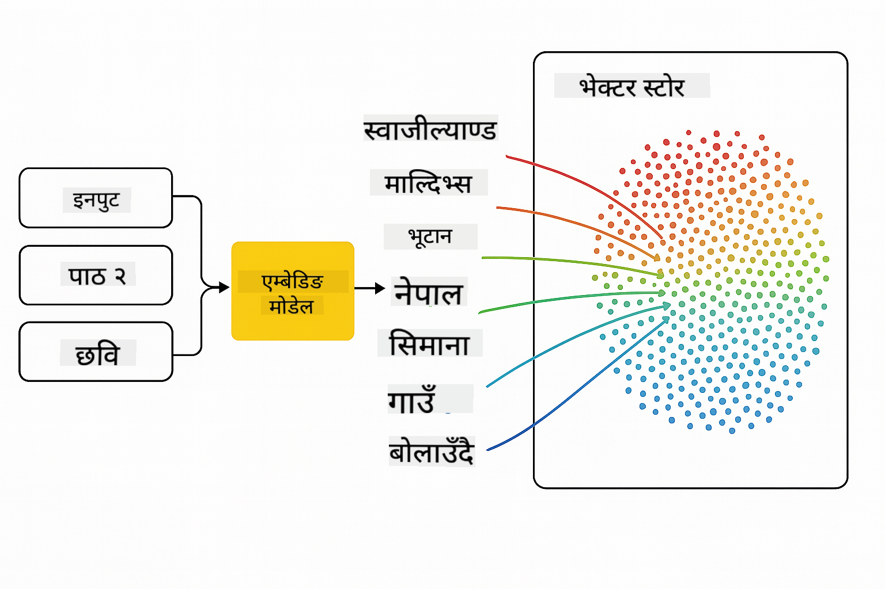
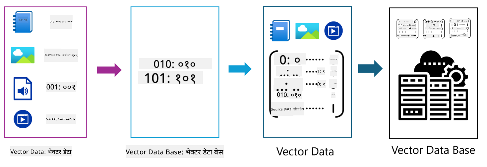
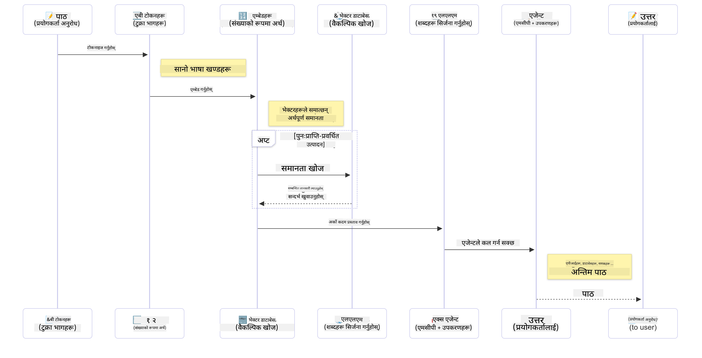

<!--
CO_OP_TRANSLATOR_METADATA:
{
  "original_hash": "006866db93a268a8769bb55f2e324291",
  "translation_date": "2025-07-28T10:37:40+00:00",
  "source_file": "01-IntroToGenAI/README.md",
  "language_code": "ne"
}
-->
# जेनरेटिभ एआई - जाभा संस्करणको परिचय

## तपाईंले के सिक्नुहुनेछ

- **जेनरेटिभ एआईका आधारभूत कुरा** जस्तै LLMs, प्रम्प्ट इन्जिनियरिङ, टोकन्स, एम्बेडिङ्स, र भेक्टर डाटाबेस
- **जाभाका लागि एआई विकास उपकरणहरूको तुलना** जस्तै Azure OpenAI SDK, Spring AI, र OpenAI Java SDK
- **मोडेल कन्टेक्स्ट प्रोटोकलको खोजी** र एआई एजेन्टहरूको संचारमा यसको भूमिका

## विषय सूची

- [परिचय](../../../01-IntroToGenAI)
- [जेनरेटिभ एआई अवधारणाहरूको छोटो पुनरावलोकन](../../../01-IntroToGenAI)
- [प्रम्प्ट इन्जिनियरिङको समीक्षा](../../../01-IntroToGenAI)
- [टोकन्स, एम्बेडिङ्स, र एजेन्टहरू](../../../01-IntroToGenAI)
- [जाभाका लागि एआई विकास उपकरणहरू र पुस्तकालयहरू](../../../01-IntroToGenAI)
  - [OpenAI Java SDK](../../../01-IntroToGenAI)
  - [Spring AI](../../../01-IntroToGenAI)
  - [Azure OpenAI Java SDK](../../../01-IntroToGenAI)
- [सारांश](../../../01-IntroToGenAI)
- [अर्को चरण](../../../01-IntroToGenAI)

## परिचय

जेनरेटिभ एआई फर बिगिनर्स - जाभा संस्करणको पहिलो अध्यायमा स्वागत छ! यो आधारभूत पाठले तपाईंलाई जेनरेटिभ एआईका मुख्य अवधारणाहरू र जाभाको प्रयोग गरेर तिनसँग कसरी काम गर्ने भनेर परिचित गराउँछ। तपाईंले एआई एप्लिकेसनका आवश्यक निर्माण खण्डहरू जस्तै ठूलो भाषा मोडेल (LLMs), टोकन्स, एम्बेडिङ्स, र एआई एजेन्टहरूको बारेमा सिक्नुहुनेछ। साथै, यस पाठक्रमभरि तपाईंले प्रयोग गर्ने मुख्य जाभा उपकरणहरूको अन्वेषण गर्नेछौं।

### जेनरेटिभ एआई अवधारणाहरूको छोटो पुनरावलोकन

जेनरेटिभ एआई कृत्रिम बुद्धिमत्ताको एक प्रकार हो जसले पाठ, छविहरू, वा कोड जस्ता नयाँ सामग्री सिर्जना गर्दछ, जुन डाटाबाट सिकेका ढाँचाहरू र सम्बन्धहरूमा आधारित हुन्छ। जेनरेटिभ एआई मोडेलहरूले मानव-जस्तै प्रतिक्रिया दिन सक्छन्, सन्दर्भ बुझ्न सक्छन्, र कहिलेकाहीँ मानव-जस्तै सामग्री पनि सिर्जना गर्न सक्छन्।

जब तपाईं आफ्नो जाभा एआई एप्लिकेसनहरू विकास गर्नुहुन्छ, तपाईंले **जेनरेटिभ एआई मोडेलहरू** प्रयोग गरेर सामग्री सिर्जना गर्नुहुनेछ। जेनरेटिभ एआई मोडेलहरूको केही क्षमताहरूमा समावेश छन्:

- **पाठ सिर्जना**: च्याटबोट, सामग्री, र पाठ पूरा गर्नका लागि मानव-जस्तै पाठ तयार गर्नु।
- **छवि सिर्जना र विश्लेषण**: यथार्थपरक छविहरू उत्पादन गर्नु, फोटोहरू सुधार गर्नु, र वस्तुहरू पत्ता लगाउनु।
- **कोड सिर्जना**: कोड स्निपेटहरू वा स्क्रिप्टहरू लेख्नु।

विभिन्न कार्यहरूको लागि अनुकूलित मोडेलहरू छन्। उदाहरणका लागि, **साना भाषा मोडेलहरू (SLMs)** र **ठूला भाषा मोडेलहरू (LLMs)** दुवैले पाठ सिर्जना गर्न सक्छन्, तर LLMs ले जटिल कार्यहरूको लागि प्रायः राम्रो प्रदर्शन प्रदान गर्छन्। छवि-सम्बन्धित कार्यहरूको लागि, तपाईंले विशेष दृष्टि मोडेलहरू वा बहु-मोडल मोडेलहरू प्रयोग गर्नुहुनेछ।

अवश्य पनि, यी मोडेलहरूको प्रतिक्रियाहरू सधैं पूर्ण हुँदैनन्। तपाईंले मोडेलहरूले "भ्रम" सिर्जना गरेको वा गलत जानकारी अधिकारपूर्वक प्रस्तुत गरेको सुन्नुभएको हुन सक्छ। तर तपाईंले मोडेललाई स्पष्ट निर्देशन र सन्दर्भ प्रदान गरेर राम्रो प्रतिक्रिया दिन मार्गदर्शन गर्न सक्नुहुन्छ। यही ठाउँमा **प्रम्प्ट इन्जिनियरिङ** महत्त्वपूर्ण हुन्छ।

#### प्रम्प्ट इन्जिनियरिङको समीक्षा

प्रम्प्ट इन्जिनियरिङ भनेको एआई मोडेलहरूलाई इच्छित परिणामतर्फ मार्गदर्शन गर्न प्रभावकारी इनपुटहरू डिजाइन गर्ने अभ्यास हो। यसमा समावेश छ:

- **स्पष्टता**: निर्देशनहरू स्पष्ट र अस्पष्ट नभएको बनाउनु।
- **सन्दर्भ**: आवश्यक पृष्ठभूमि जानकारी प्रदान गर्नु।
- **सीमाहरू**: कुनै पनि सीमाहरू वा ढाँचाहरू निर्दिष्ट गर्नु।

प्रम्प्ट इन्जिनियरिङका केही उत्कृष्ट अभ्यासहरूमा प्रम्प्ट डिजाइन, स्पष्ट निर्देशन, कार्यको विखण्डन, एक-शट र थोरै-शट सिकाइ, र प्रम्प्ट ट्युनिङ समावेश छन्। तपाईंको विशेष प्रयोग केसका लागि के काम गर्छ भनेर पत्ता लगाउन विभिन्न प्रम्प्टहरूको परीक्षण गर्नु महत्त्वपूर्ण छ।

एप्लिकेसनहरू विकास गर्दा, तपाईंले विभिन्न प्रकारका प्रम्प्टहरूसँग काम गर्नुहुनेछ:
- **सिस्टम प्रम्प्टहरू**: मोडेलको व्यवहारका आधारभूत नियम र सन्दर्भ सेट गर्नु।
- **प्रयोगकर्ता प्रम्प्टहरू**: तपाईंको एप्लिकेसन प्रयोगकर्ताहरूबाट आएको इनपुट डाटा।
- **सहायक प्रम्प्टहरू**: प्रणाली र प्रयोगकर्ता प्रम्प्टहरूमा आधारित मोडेलको प्रतिक्रिया।

> **थप जान्नुहोस्**: [जेनएआई फर बिगिनर्स पाठक्रमको प्रम्प्ट इन्जिनियरिङ अध्याय](https://github.com/microsoft/generative-ai-for-beginners/tree/main/04-prompt-engineering-fundamentals) मा प्रम्प्ट इन्जिनियरिङको बारेमा थप जान्नुहोस्।

#### टोकन्स, एम्बेडिङ्स, र एजेन्टहरू

जेनरेटिभ एआई मोडेलहरूसँग काम गर्दा, तपाईंले **टोकन्स**, **एम्बेडिङ्स**, **एजेन्टहरू**, र **मोडेल कन्टेक्स्ट प्रोटोकल (MCP)** जस्ता शब्दहरू सुन्नुहुनेछ। यी अवधारणाहरूको विस्तृत विवरण यहाँ छ:

- **टोकन्स**: टोकन्स भनेको मोडेलमा पाठको सबैभन्दा सानो एकाइ हो। यो शब्द, अक्षर, वा उपशब्द हुन सक्छ। टोकन्स पाठ डाटालाई मोडेलले बुझ्न सक्ने ढाँचामा प्रतिनिधित्व गर्न प्रयोग गरिन्छ। उदाहरणका लागि, "The quick brown fox jumped over the lazy dog" वाक्यलाई टोकनाइज गर्दा ["The", " quick", " brown", " fox", " jumped", " over", " the", " lazy", " dog"] वा ["The", " qu", "ick", " br", "own", " fox", " jump", "ed", " over", " the", " la", "zy", " dog"] जस्ता टोकन्समा विभाजन गर्न सकिन्छ, टोकनाइजेसन रणनीतिमा निर्भर गर्दै।

टोकनाइजेसन भनेको पाठलाई यी साना एकाइहरूमा विभाजन गर्ने प्रक्रिया हो। यो महत्त्वपूर्ण छ किनभने मोडेलहरूले कच्चा पाठमा होइन, टोकन्समा काम गर्छन्। प्रम्प्टमा टोकन्सको सङ्ख्याले मोडेलको प्रतिक्रिया लम्बाइ र गुणस्तरलाई असर गर्छ, किनभने मोडेलहरूको सन्दर्भ विन्डोका लागि टोकन सीमा हुन्छ (जस्तै, GPT-4o को कुल सन्दर्भका लागि 128K टोकन्स, जसमा इनपुट र आउटपुट दुवै समावेश छन्)।

  जाभामा, तपाईंले OpenAI SDK जस्ता पुस्तकालयहरूको प्रयोग गरेर टोकनाइजेसनलाई स्वचालित रूपमा ह्यान्डल गर्न सक्नुहुन्छ जब एआई मोडेलहरूलाई अनुरोध पठाइन्छ।

- **एम्बेडिङ्स**: एम्बेडिङ्स भनेको टोकन्सको भेक्टर प्रतिनिधित्व हो जसले अर्थपूर्ण सम्बन्धलाई समेट्छ। यी संख्यात्मक प्रतिनिधित्वहरू (सामान्यतया फ्लोटिङ-पोइन्ट सङ्ख्याहरूको एरे) हुन् जसले मोडेललाई शब्दहरू बीचको सम्बन्ध बुझ्न र सन्दर्भअनुकूल प्रतिक्रिया उत्पन्न गर्न अनुमति दिन्छ। समान शब्दहरूको समान एम्बेडिङ्स हुन्छन्, जसले मोडेललाई पर्यायवाची शब्दहरू र अर्थपूर्ण सम्बन्धहरू बुझ्न सक्षम बनाउँछ।

  जाभामा, तपाईंले OpenAI SDK वा एम्बेडिङ्स उत्पन्न गर्न समर्थन गर्ने अन्य पुस्तकालयहरूको प्रयोग गरेर एम्बेडिङ्स उत्पन्न गर्न सक्नुहुन्छ। यी एम्बेडिङ्स अर्थपूर्ण खोजजस्ता कार्यहरूको लागि महत्त्वपूर्ण छन्, जहाँ तपाईंले ठ्याक्कै पाठ मिलानको सट्टा अर्थमा आधारित समान सामग्री फेला पार्न चाहनुहुन्छ।

- **भेक्टर डाटाबेसहरू**: भेक्टर डाटाबेसहरू एम्बेडिङ्सका लागि अनुकूलित विशेष भण्डारण प्रणालीहरू हुन्। यीले समानता खोजलाई कुशल बनाउँछन् र ठूलो डाटासेटबाट अर्थपूर्ण समानतामा आधारित जानकारी फेला पार्न आवश्यक पर्ने Retrieval-Augmented Generation (RAG) ढाँचाहरूका लागि महत्त्वपूर्ण छन्।

> **Note**: यस पाठक्रममा, हामी भेक्टर डाटाबेसहरू समेट्ने छैनौं, तर तिनीहरू वास्तविक-विश्व एप्लिकेसनहरूमा सामान्यतया प्रयोग गरिने भएकाले उल्लेख गर्न लायक छन्।

- **एजेन्टहरू र MCP**: एआईका तत्त्वहरू जसले मोडेलहरू, उपकरणहरू, र बाह्य प्रणालीहरूसँग स्वायत्त रूपमा अन्तरक्रिया गर्छन्। मोडेल कन्टेक्स्ट प्रोटोकल (MCP) ले एजेन्टहरूलाई बाह्य डाटा स्रोतहरू र उपकरणहरूमा सुरक्षित पहुँच प्रदान गर्न मानकीकृत तरिका प्रदान गर्दछ। हाम्रो [MCP फर बिगिनर्स](https://github.com/microsoft/mcp-for-beginners) पाठक्रममा थप जान्नुहोस्।

जाभा एआई एप्लिकेसनहरूमा, तपाईंले पाठ प्रशोधनका लागि टोकन्स, अर्थपूर्ण खोज र RAG का लागि एम्बेडिङ्स, डाटा पुनःप्राप्तिका लागि भेक्टर डाटाबेसहरू, र उपकरण-प्रयोग गर्ने बौद्धिक प्रणालीहरू निर्माण गर्न MCP सहितका एजेन्टहरूको प्रयोग गर्नुहुनेछ।

### जाभाका लागि एआई विकास उपकरणहरू र पुस्तकालयहरू

जाभाले एआई विकासका लागि उत्कृष्ट उपकरणहरू प्रदान गर्दछ। यस पाठक्रमभरि हामीले अन्वेषण गर्ने तीन मुख्य पुस्तकालयहरू छन् - OpenAI Java SDK, Azure OpenAI SDK, र Spring AI।

यहाँ प्रत्येक अध्यायका उदाहरणहरूमा कुन SDK प्रयोग गरिएको छ भन्ने छिटो सन्दर्भ तालिका छ:

| अध्याय | नमूना | SDK |
|---------|--------|-----|
| 02-SetupDevEnvironment | github-models | OpenAI Java SDK |
| 02-SetupDevEnvironment | basic-chat-azure | Spring AI Azure OpenAI |
| 03-CoreGenerativeAITechniques | examples | Azure OpenAI SDK |
| 04-PracticalSamples | petstory | OpenAI Java SDK |
| 04-PracticalSamples | foundrylocal | OpenAI Java SDK |
| 04-PracticalSamples | calculator | Spring AI MCP SDK + LangChain4j |

**SDK कागजात लिङ्कहरू:**
- [Azure OpenAI Java SDK](https://github.com/Azure/azure-sdk-for-java/tree/azure-ai-openai_1.0.0-beta.16/sdk/openai/azure-ai-openai)
- [Spring AI](https://docs.spring.io/spring-ai/reference/)
- [OpenAI Java SDK](https://github.com/openai/openai-java)
- [LangChain4j](https://docs.langchain4j.dev/)

#### OpenAI Java SDK

OpenAI SDK OpenAI API का लागि आधिकारिक जाभा पुस्तकालय हो। यसले OpenAI का मोडेलहरूसँग अन्तरक्रिया गर्नको लागि सरल र स्थिर इन्टरफेस प्रदान गर्दछ, जसले जाभा एप्लिकेसनहरूमा एआई क्षमताहरू एकीकृत गर्न सजिलो बनाउँछ। अध्याय 2 को GitHub Models उदाहरण, अध्याय 4 को Pet Story एप्लिकेसन र Foundry Local उदाहरणले OpenAI SDK दृष्टिकोण प्रदर्शन गर्दछ।

#### Spring AI

Spring AI एक व्यापक फ्रेमवर्क हो जसले Spring एप्लिकेसनहरूमा एआई क्षमताहरू ल्याउँछ, विभिन्न एआई प्रदायकहरूमा स्थिर परत प्रदान गर्दछ। यो Spring इकोसिस्टमसँग सहज रूपमा एकीकृत हुन्छ, जसले एआई क्षमताहरू आवश्यक पर्ने उद्यम जाभा एप्लिकेसनहरूको लागि यो आदर्श विकल्प बनाउँछ।

Spring AI को बल यसको Spring इकोसिस्टमसँगको सहज एकीकरणमा छ, जसले निर्भरता इन्जेक्सन, कन्फिगरेसन व्यवस्थापन, र परीक्षण फ्रेमवर्कहरू जस्ता परिचित Spring ढाँचाहरूको साथ उत्पादन-तयार एआई एप्लिकेसनहरू निर्माण गर्न सजिलो बनाउँछ। तपाईंले अध्याय 2 र 4 मा Spring AI प्रयोग गरेर OpenAI र मोडेल कन्टेक्स्ट प्रोटोकल (MCP) Spring AI पुस्तकालयहरूको लाभ उठाउने एप्लिकेसनहरू निर्माण गर्नुहुनेछ।

##### मोडेल कन्टेक्स्ट प्रोटोकल (MCP)

[मोडेल कन्टेक्स्ट प्रोटोकल (MCP)](https://modelcontextprotocol.io/) एक उदीयमान मानक हो जसले एआई एप्लिकेसनहरूलाई बाह्य डाटा स्रोतहरू र उपकरणहरूसँग सुरक्षित रूपमा अन्तरक्रिया गर्न सक्षम बनाउँछ। MCP ले एआई मोडेलहरूलाई सन्दर्भ जानकारी पहुँच गर्न र तपाईंको एप्लिकेसनहरूमा कार्यहरू कार्यान्वयन गर्न मानकीकृत तरिका प्रदान गर्दछ।

अध्याय 4 मा, तपाईंले Spring AI को साथ मोडेल कन्टेक्स्ट प्रोटोकलको आधारभूत कुरा प्रदर्शन गर्ने सरल MCP क्याल्कुलेटर सेवा निर्माण गर्नुहुनेछ, जसले आधारभूत उपकरण एकीकरण र सेवा आर्किटेक्चरहरू कसरी सिर्जना गर्ने देखाउँछ।

#### Azure OpenAI Java SDK

Azure OpenAI क्लाइन्ट पुस्तकालय जाभाका लागि OpenAI का REST API हरूको अनुकूलन हो जसले Azure SDK इकोसिस्टमसँग एकीकृत हुने परिचित इन्टरफेस प्रदान गर्दछ। अध्याय 3 मा, तपाईंले Azure OpenAI SDK प्रयोग गरेर एप्लिकेसनहरू निर्माण गर्नुहुनेछ, जसमा च्याट एप्लिकेसनहरू, फङ्क्सन कलिङ, र RAG (Retrieval-Augmented Generation) ढाँचाहरू समावेश छन्।

> Note: Azure OpenAI SDK OpenAI Java SDK को तुलनामा सुविधाहरूमा पछि छ, त्यसैले भविष्यका परियोजनाहरूका लागि OpenAI Java SDK प्रयोग गर्ने विचार गर्नुहोस्।

## सारांश

**बधाई छ!** तपाईंले सफलतापूर्वक:

- **जेनरेटिभ एआईका आधारभूत कुरा सिक्नुभयो** जस्तै LLMs, प्रम्प्ट इन्जिनियरिङ, टोकन्स, एम्बेडिङ्स, र भेक्टर डाटाबेस
- **जाभाका लागि एआई विकास उपकरणहरूको तुलना गर्नुभयो** जस्तै Azure OpenAI SDK, Spring AI, र OpenAI Java SDK
- **मोडेल कन्टेक्स्ट प्रोटोकलको खोजी गर्नुभयो** र एआई एजेन्टहरूको संचारमा यसको भूमिका बुझ्नुभयो

## अर्को चरण

[अध्याय 2: विकास वातावरण सेटअप गर्नुहोस्](../02-SetupDevEnvironment/README.md)

**अस्वीकरण**:  
यो दस्तावेज़ AI अनुवाद सेवा [Co-op Translator](https://github.com/Azure/co-op-translator) प्रयोग गरेर अनुवाद गरिएको छ। हामी शुद्धताको लागि प्रयास गर्छौं, तर कृपया ध्यान दिनुहोस् कि स्वचालित अनुवादहरूमा त्रुटिहरू वा अशुद्धताहरू हुन सक्छ। यसको मूल भाषा मा रहेको मूल दस्तावेज़लाई आधिकारिक स्रोत मानिनुपर्छ। महत्वपूर्ण जानकारीको लागि, व्यावसायिक मानव अनुवाद सिफारिस गरिन्छ। यस अनुवादको प्रयोगबाट उत्पन्न हुने कुनै पनि गलतफहमी वा गलत व्याख्याको लागि हामी जिम्मेवार हुने छैनौं।