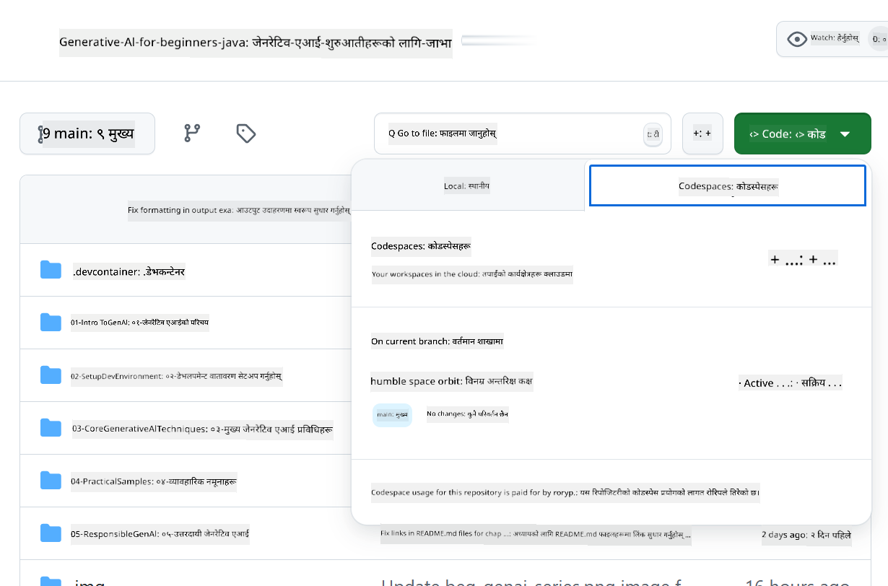

<!--
CO_OP_TRANSLATOR_METADATA:
{
  "original_hash": "e00bbea0f95c611aa3bec676d23e8b43",
  "translation_date": "2025-07-21T18:02:12+00:00",
  "source_file": "02-SetupDevEnvironment/getting-started-azure-openai.md",
  "language_code": "ne"
}
-->
# Azure OpenAI को लागि विकास वातावरण सेटअप गर्नुहोस्

> **छिटो सुरु गर्नुहोस्**: यो गाइड Azure OpenAI सेटअपको लागि हो। निःशुल्क मोडेलहरूसँग तुरुन्तै सुरु गर्न, [GitHub Models with Codespaces](./README.md#quick-start-cloud) प्रयोग गर्नुहोस्।

यो गाइडले तपाईंलाई यस कोर्सका लागि तपाईंको Java AI एप्समा Azure AI Foundry मोडेलहरू सेटअप गर्न मद्दत गर्नेछ।

## सामग्री सूची

- [छिटो सेटअपको झलक](../../../02-SetupDevEnvironment)
- [चरण १: Azure AI Foundry स्रोतहरू सिर्जना गर्नुहोस्](../../../02-SetupDevEnvironment)
  - [हब र प्रोजेक्ट सिर्जना गर्नुहोस्](../../../02-SetupDevEnvironment)
  - [GPT-4o-mini मोडेल डिप्लोय गर्नुहोस्](../../../02-SetupDevEnvironment)
- [चरण २: तपाईंको Codespace सिर्जना गर्नुहोस्](../../../02-SetupDevEnvironment)
- [चरण ३: तपाईंको वातावरण कन्फिगर गर्नुहोस्](../../../02-SetupDevEnvironment)
- [चरण ४: तपाईंको सेटअप परीक्षण गर्नुहोस्](../../../02-SetupDevEnvironment)
- [अर्को के गर्ने?](../../../02-SetupDevEnvironment)
- [स्रोतहरू](../../../02-SetupDevEnvironment)
- [थप स्रोतहरू](../../../02-SetupDevEnvironment)

## छिटो सेटअपको झलक

1. Azure AI Foundry स्रोतहरू सिर्जना गर्नुहोस् (हब, प्रोजेक्ट, मोडेल)
2. Java विकास कन्टेनरसहित Codespace सिर्जना गर्नुहोस्
3. Azure OpenAI प्रमाणपत्रहरूसहित तपाईंको `.env` फाइल कन्फिगर गर्नुहोस्
4. उदाहरण प्रोजेक्टको साथ तपाईंको सेटअप परीक्षण गर्नुहोस्

## चरण १: Azure AI Foundry स्रोतहरू सिर्जना गर्नुहोस्

### हब र प्रोजेक्ट सिर्जना गर्नुहोस्

1. [Azure AI Foundry Portal](https://ai.azure.com/) मा जानुहोस् र साइन इन गर्नुहोस्।
2. **+ Create** → **New hub** मा क्लिक गर्नुहोस् (वा **Management** → **All hubs** → **+ New hub** मा जानुहोस्)।
3. तपाईंको हब कन्फिगर गर्नुहोस्:
   - **हब नाम**: जस्तै, "MyAIHub"
   - **सदस्यता**: तपाईंको Azure सदस्यता चयन गर्नुहोस्
   - **स्रोत समूह**: नयाँ सिर्जना गर्नुहोस् वा पहिलेको चयन गर्नुहोस्
   - **स्थान**: तपाईंको नजिकको स्थान चयन गर्नुहोस्
   - **स्टोरेज खाता**: डिफल्ट प्रयोग गर्नुहोस् वा अनुकूलन गर्नुहोस्
   - **की भल्ट**: डिफल्ट प्रयोग गर्नुहोस् वा अनुकूलन गर्नुहोस्
   - **Next** → **Review + create** → **Create** मा क्लिक गर्नुहोस्।
4. एकपटक सिर्जना भएपछि, **+ New project** मा क्लिक गर्नुहोस् (वा हब ओभरभ्यूबाट **Create project** मा क्लिक गर्नुहोस्)।
   - **प्रोजेक्ट नाम**: जस्तै, "GenAIJava"
   - **Create** मा क्लिक गर्नुहोस्।

### GPT-4o-mini मोडेल डिप्लोय गर्नुहोस्

1. तपाईंको प्रोजेक्टमा, **Model catalog** मा जानुहोस् र **gpt-4o-mini** खोज्नुहोस्।
   - *वैकल्पिक: **Deployments** → **+ Create deployment** मा जानुहोस्।*
2. gpt-4o-mini मोडेल कार्डमा **Deploy** मा क्लिक गर्नुहोस्।
3. डिप्लोयमेन्ट कन्फिगर गर्नुहोस्:
   - **डिप्लोयमेन्ट नाम**: "gpt-4o-mini"
   - **मोडेल संस्करण**: पछिल्लो संस्करण प्रयोग गर्नुहोस्
   - **डिप्लोयमेन्ट प्रकार**: Standard
4. **Deploy** मा क्लिक गर्नुहोस्।
5. एकपटक डिप्लोय भएपछि, **Deployments** ट्याबमा जानुहोस् र यी मानहरू प्रतिलिपि गर्नुहोस्:
   - **डिप्लोयमेन्ट नाम** (जस्तै, "gpt-4o-mini")
   - **Target URI** (जस्तै, `https://your-hub-name.openai.azure.com/`) 
      > **महत्त्वपूर्ण**: केवल आधार URL प्रतिलिपि गर्नुहोस् (जस्तै, `https://myhub.openai.azure.com/`) पूर्ण अन्तबिन्दु पथ होइन।
   - **की** (Keys and Endpoint सेक्सनबाट)

> **अझै समस्या छ?** आधिकारिक [Azure AI Foundry Documentation](https://learn.microsoft.com/azure/ai-foundry/how-to/create-projects?tabs=ai-foundry&pivots=hub-project) हेर्नुहोस्।

## चरण २: तपाईंको Codespace सिर्जना गर्नुहोस्

1. यो रिपोजिटरी तपाईंको GitHub खातामा फोर्क गर्नुहोस्।
   > **नोट**: यदि तपाईं आधारभूत कन्फिग सम्पादन गर्न चाहनुहुन्छ भने [Dev Container Configuration](../../../.devcontainer/devcontainer.json) हेर्नुहोस्।
2. तपाईंको फोर्क गरिएको रिपोजिटरीमा, **Code** → **Codespaces** ट्याबमा क्लिक गर्नुहोस्।
3. **...** → **New with options...** मा क्लिक गर्नुहोस्।

4. **Dev container configuration** चयन गर्नुहोस्: 
   - **Generative AI Java Development Environment**
5. **Create codespace** मा क्लिक गर्नुहोस्।

## चरण ३: तपाईंको वातावरण कन्फिगर गर्नुहोस्

तपाईंको Codespace तयार भएपछि, तपाईंको Azure OpenAI प्रमाणपत्रहरू सेटअप गर्नुहोस्:

1. **रिपोजिटरी रुटबाट उदाहरण प्रोजेक्टमा जानुहोस्:**
   ```bash
   cd 02-SetupDevEnvironment/src/basic-chat-azure
   ```

2. **तपाईंको .env फाइल सिर्जना गर्नुहोस्:**
   ```bash
   cp .env.example .env
   ```

3. **तपाईंको .env फाइललाई Azure OpenAI प्रमाणपत्रहरूसँग सम्पादन गर्नुहोस्:**
   ```bash
   # Your Azure OpenAI API key (from Azure AI Foundry portal)
   AZURE_AI_KEY=your-actual-api-key-here
   
   # Your Azure OpenAI endpoint URL (e.g., https://myhub.openai.azure.com/)
   AZURE_AI_ENDPOINT=https://your-hub-name.openai.azure.com/
   ```

   > **सुरक्षा नोट**: 
   > - कहिल्यै तपाईंको `.env` फाइललाई संस्करण नियन्त्रणमा कमिट नगर्नुहोस्।
   > - `.env` फाइल पहिले नै `.gitignore` मा समावेश गरिएको छ।
   > - तपाईंको API कीहरू सुरक्षित राख्नुहोस् र नियमित रूपमा परिवर्तन गर्नुहोस्।

## चरण ४: तपाईंको सेटअप परीक्षण गर्नुहोस्

उदाहरण एप्लिकेसन चलाएर तपाईंको Azure OpenAI कनेक्शन परीक्षण गर्नुहोस्:

```bash
mvn clean spring-boot:run
```

तपाईंले GPT-4o-mini मोडेलबाट प्रतिक्रिया देख्नुहुनेछ!

> **VS Code प्रयोगकर्ताहरू**: तपाईंले एप्लिकेसन चलाउन `F5` थिच्न सक्नुहुन्छ। लन्च कन्फिगरेसनले तपाईंको `.env` फाइललाई स्वचालित रूपमा लोड गर्न सेटअप गरिएको छ।

> **पूर्ण उदाहरण**: विस्तृत निर्देशन र समस्या समाधानको लागि [End-to-End Azure OpenAI Example](./src/basic-chat-azure/README.md) हेर्नुहोस्।

## अर्को के गर्ने?

**सेटअप पूरा भयो!** तपाईंले अब:
- gpt-4o-mini सहित Azure OpenAI डिप्लोय गर्नुभयो।
- स्थानीय `.env` फाइल कन्फिगर गर्नुभयो।
- Java विकास वातावरण तयार छ।

**अगाडि बढ्नुहोस्** [Chapter 3: Core Generative AI Techniques](../03-CoreGenerativeAITechniques/README.md) मा, AI एप्लिकेसनहरू निर्माण गर्न सुरु गर्न!

## स्रोतहरू

- [Azure AI Foundry Documentation](https://learn.microsoft.com/azure/ai-services/)
- [Spring AI Azure OpenAI Documentation](https://docs.spring.io/spring-ai/reference/api/clients/azure-openai-chat.html)
- [Azure OpenAI Java SDK](https://learn.microsoft.com/java/api/overview/azure/ai-openai-readme)

## थप स्रोतहरू

- [VS Code डाउनलोड गर्नुहोस्](https://code.visualstudio.com/Download)
- [Docker Desktop प्राप्त गर्नुहोस्](https://www.docker.com/products/docker-desktop)
- [Dev Container Configuration](../../../.devcontainer/devcontainer.json)

**अस्वीकरण**:  
यो दस्तावेज़ AI अनुवाद सेवा [Co-op Translator](https://github.com/Azure/co-op-translator) प्रयोग गरेर अनुवाद गरिएको छ। हामी शुद्धताको लागि प्रयास गर्छौं, तर कृपया ध्यान दिनुहोस् कि स्वचालित अनुवादमा त्रुटिहरू वा अशुद्धताहरू हुन सक्छ। यसको मूल भाषा मा रहेको मूल दस्तावेज़लाई आधिकारिक स्रोत मानिनुपर्छ। महत्वपूर्ण जानकारीको लागि, व्यावसायिक मानव अनुवाद सिफारिस गरिन्छ। यस अनुवादको प्रयोगबाट उत्पन्न हुने कुनै पनि गलतफहमी वा गलत व्याख्याको लागि हामी जिम्मेवार हुने छैनौं।