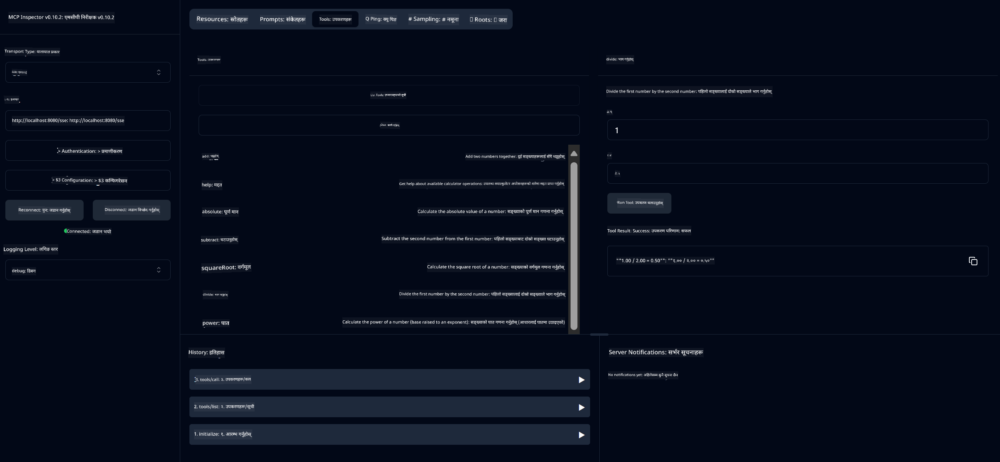

<!--
CO_OP_TRANSLATOR_METADATA:
{
  "original_hash": "5bd7a347d6ed1d706443f9129dd29dd9",
  "translation_date": "2025-07-25T09:16:08+00:00",
  "source_file": "04-PracticalSamples/mcp/calculator/README.md",
  "language_code": "ne"
}
-->
# बेसिक क्याल्कुलेटर MCP सेवा

>**Note**: यो अध्यायमा [**Tutorial**](./TUTORIAL.md) समावेश छ, जसले तपाईंलाई नमूनाहरू मार्फत मार्गदर्शन गर्दछ।

**Model Context Protocol (MCP)** सँग तपाईंको पहिलो व्यावहारिक अनुभवमा स्वागत छ! अघिल्ला अध्यायहरूमा, तपाईंले जेनेरेटिभ एआईका आधारभूत कुराहरू सिक्नुभयो र आफ्नो विकास वातावरण सेट गर्नुभयो। अब केही व्यावहारिक निर्माण गर्ने समय हो।

यो क्याल्कुलेटर सेवाले देखाउँछ कि कसरी एआई मोडेलहरूले MCP प्रयोग गरेर बाह्य उपकरणहरूसँग सुरक्षित रूपमा अन्तरक्रिया गर्न सक्छ। कहिलेकाहीँ एआई मोडेलको गणितीय क्षमताहरू अविश्वसनीय हुन सक्छन्, त्यसैले हामी तपाईंलाई देखाउनेछौं कि कसरी एक बलियो प्रणाली निर्माण गर्ने, जहाँ एआईले सही गणनाको लागि विशेष सेवाहरूलाई कल गर्न सक्छ।

## सामग्री सूची

- [तपाईंले के सिक्नुहुनेछ](../../../../../04-PracticalSamples/mcp/calculator)
- [पूर्वआवश्यकताहरू](../../../../../04-PracticalSamples/mcp/calculator)
- [मुख्य अवधारणाहरू](../../../../../04-PracticalSamples/mcp/calculator)
- [छिटो सुरु](../../../../../04-PracticalSamples/mcp/calculator)
- [उपलब्ध क्याल्कुलेटर अपरेसनहरू](../../../../../04-PracticalSamples/mcp/calculator)
- [परीक्षण क्लाइन्टहरू](../../../../../04-PracticalSamples/mcp/calculator)
  - [1. प्रत्यक्ष MCP क्लाइन्ट (SDKClient)](../../../../../04-PracticalSamples/mcp/calculator)
  - [2. एआई-सक्षम क्लाइन्ट (LangChain4jClient)](../../../../../04-PracticalSamples/mcp/calculator)
- [MCP Inspector (वेब UI)](../../../../../04-PracticalSamples/mcp/calculator)
  - [चरण-दर-चरण निर्देशनहरू](../../../../../04-PracticalSamples/mcp/calculator)

## तपाईंले के सिक्नुहुनेछ

यस उदाहरणमा काम गरेर, तपाईंले बुझ्नुहुनेछ:
- कसरी Spring Boot प्रयोग गरेर MCP-संगत सेवाहरू सिर्जना गर्ने
- प्रत्यक्ष प्रोटोकल सञ्चार र एआई-सक्षम अन्तरक्रियाको बीचको भिन्नता
- कसरी एआई मोडेलहरूले बाह्य उपकरणहरू कहिले र कसरी प्रयोग गर्ने निर्णय गर्छन्
- उपकरण-सक्षम एआई अनुप्रयोगहरू निर्माणका लागि उत्कृष्ट अभ्यासहरू

MCP अवधारणाहरू सिक्न र आफ्नो पहिलो एआई उपकरण एकीकरण निर्माण गर्न तयार भएका प्रारम्भकर्ताहरूका लागि उपयुक्त!

## पूर्वआवश्यकताहरू

- Java 21+
- Maven 3.6+
- **GitHub Token**: एआई-सक्षम क्लाइन्टका लागि आवश्यक। यदि तपाईंले यो सेटअप गर्नुभएको छैन भने, [अध्याय 2: आफ्नो विकास वातावरण सेटअप गर्नुहोस्](../../../02-SetupDevEnvironment/README.md) हेर्नुहोस्।

## मुख्य अवधारणाहरू

**Model Context Protocol (MCP)** एआई अनुप्रयोगहरूले बाह्य उपकरणहरूसँग सुरक्षित रूपमा जडान गर्न प्रयोग गर्ने एक मानकीकृत तरिका हो। यसलाई "पुल" जस्तै सोच्नुहोस्, जसले एआई मोडेलहरूलाई हाम्रो क्याल्कुलेटर जस्ता बाह्य सेवाहरू प्रयोग गर्न अनुमति दिन्छ। एआई मोडेलले आफैं गणना गर्न खोज्नुको सट्टा (जसले कहिलेकाहीँ गलत परिणाम दिन सक्छ), यसले हाम्रो क्याल्कुलेटर सेवालाई कल गरेर सही परिणाम प्राप्त गर्न सक्छ। MCP ले यो सञ्चार सुरक्षित र स्थिर रूपमा हुने सुनिश्चित गर्दछ।

**Server-Sent Events (SSE)** ले सर्भर र क्लाइन्टहरू बीच वास्तविक-समय सञ्चार सक्षम गर्दछ। परम्परागत HTTP अनुरोधहरूमा तपाईंले सोध्नुहुन्छ र जवाफको प्रतीक्षा गर्नुहुन्छ, जबकि SSE ले सर्भरलाई निरन्तर अपडेटहरू क्लाइन्टमा पठाउन अनुमति दिन्छ। यो एआई अनुप्रयोगहरूको लागि उपयुक्त छ, जहाँ जवाफहरू स्ट्रिम गरिन सक्छन् वा प्रशोधन गर्न समय लाग्न सक्छ।

**AI Tools & Function Calling** ले एआई मोडेलहरूलाई स्वचालित रूपमा बाह्य कार्यहरू (जस्तै क्याल्कुलेटर अपरेसनहरू) छनोट गर्न र प्रयोग गर्न अनुमति दिन्छ। जब तपाईं "१५ + २७ कति हुन्छ?" सोध्नुहुन्छ, एआई मोडेलले बुझ्छ कि तपाईंलाई जोड चाहिएको छ, स्वचालित रूपमा हाम्रो `add` उपकरणलाई सही प्यारामिटरहरू (१५, २७) सहित कल गर्छ, र प्राकृतिक भाषामा परिणाम फर्काउँछ। एआई एक बुद्धिमान समन्वयकको रूपमा कार्य गर्दछ, जसले प्रत्येक उपकरण कहिले र कसरी प्रयोग गर्ने थाहा पाउँछ।

## छिटो सुरु

### 1. क्याल्कुलेटर एप्लिकेसन निर्देशिकामा जानुहोस्
```bash
cd Generative-AI-for-beginners-java/04-PracticalSamples/mcp/calculator
```

### 2. निर्माण गर्नुहोस् र चलाउनुहोस्
```bash
mvn clean install -DskipTests
java -jar target/calculator-server-0.0.1-SNAPSHOT.jar
```

### 3. क्लाइन्टहरूसँग परीक्षण गर्नुहोस्
- **SDKClient**: प्रत्यक्ष MCP प्रोटोकल अन्तरक्रिया
- **LangChain4jClient**: एआई-सक्षम प्राकृतिक भाषा अन्तरक्रिया (GitHub टोकन आवश्यक)

## उपलब्ध क्याल्कुलेटर अपरेसनहरू

- `add(a, b)`, `subtract(a, b)`, `multiply(a, b)`, `divide(a, b)`
- `power(base, exponent)`, `squareRoot(number)`, `absolute(number)`
- `modulus(a, b)`, `help()`

## परीक्षण क्लाइन्टहरू

### 1. प्रत्यक्ष MCP क्लाइन्ट (SDKClient)
कच्चा MCP प्रोटोकल सञ्चार परीक्षण गर्दछ। चलाउनुहोस्:
```bash
mvn test-compile exec:java -Dexec.mainClass="com.microsoft.mcp.sample.client.SDKClient" -Dexec.classpathScope=test
```

### 2. एआई-सक्षम क्लाइन्ट (LangChain4jClient)
GitHub मोडेलहरूसँग प्राकृतिक भाषा अन्तरक्रिया प्रदर्शन गर्दछ। GitHub टोकन आवश्यक (हेर्नुहोस् [पूर्वआवश्यकताहरू](../../../../../04-PracticalSamples/mcp/calculator))।

**चलाउनुहोस्:**
```bash
mvn test-compile exec:java -Dexec.mainClass="com.microsoft.mcp.sample.client.LangChain4jClient" -Dexec.classpathScope=test
```

## MCP Inspector (वेब UI)

MCP Inspector ले तपाईंलाई कोड लेख्नुपूर्व आफ्नो MCP सेवा परीक्षण गर्न दृश्यात्मक वेब इन्टरफेस प्रदान गर्दछ। MCP कसरी काम गर्छ भन्ने बुझ्न प्रारम्भकर्ताहरूका लागि उपयुक्त!

### चरण-दर-चरण निर्देशनहरू:

1. **क्याल्कुलेटर सर्भर सुरु गर्नुहोस्** (यदि पहिले नै चलिरहेको छैन भने):
   ```bash
   java -jar target/calculator-server-0.0.1-SNAPSHOT.jar
   ```

2. **नयाँ टर्मिनलमा MCP Inspector स्थापना र चलाउनुहोस्**:
   ```bash
   npx @modelcontextprotocol/inspector
   ```

3. **वेब इन्टरफेस खोल्नुहोस्**:
   - "Inspector running at http://localhost:6274" जस्तो सन्देश खोज्नुहोस्
   - आफ्नो वेब ब्राउजरमा उक्त URL खोल्नुहोस्

4. **आफ्नो क्याल्कुलेटर सेवासँग जडान गर्नुहोस्**:
   - वेब इन्टरफेसमा, ट्रान्सपोर्ट प्रकारलाई "SSE" मा सेट गर्नुहोस्
   - URL सेट गर्नुहोस्: `http://localhost:8080/sse`
   - "Connect" बटनमा क्लिक गर्नुहोस्

5. **उपलब्ध उपकरणहरू अन्वेषण गर्नुहोस्**:
   - "List Tools" मा क्लिक गरेर सबै क्याल्कुलेटर अपरेसनहरू हेर्नुहोस्
   - तपाईंले `add`, `subtract`, `multiply` जस्ता कार्यहरू देख्नुहुनेछ

6. **क्याल्कुलेटर अपरेसन परीक्षण गर्नुहोस्**:
   - कुनै उपकरण चयन गर्नुहोस् (जस्तै, "add")
   - प्यारामिटरहरू प्रविष्ट गर्नुहोस् (जस्तै, `a: 15`, `b: 27`)
   - "Run Tool" मा क्लिक गर्नुहोस्
   - आफ्नो MCP सेवाबाट फर्काइएको परिणाम हेर्नुहोस्!

यो दृश्यात्मक दृष्टिकोणले तपाईंलाई आफ्नै क्लाइन्टहरू निर्माण गर्नु अघि MCP सञ्चार कसरी काम गर्छ भन्ने कुरा बुझ्न मद्दत गर्दछ।



---
**सन्दर्भ:** [MCP Server Boot Starter Docs](https://docs.spring.io/spring-ai/reference/api/mcp/mcp-server-boot-starter-docs.html)

**अस्वीकरण**:  
यो दस्तावेज़ AI अनुवाद सेवा [Co-op Translator](https://github.com/Azure/co-op-translator) प्रयोग गरेर अनुवाद गरिएको छ। हामी शुद्धताको लागि प्रयास गर्छौं, तर कृपया ध्यान दिनुहोस् कि स्वचालित अनुवादमा त्रुटिहरू वा अशुद्धताहरू हुन सक्छ। यसको मूल भाषा मा रहेको मूल दस्तावेज़लाई आधिकारिक स्रोत मानिनुपर्छ। महत्वपूर्ण जानकारीको लागि, व्यावसायिक मानव अनुवाद सिफारिस गरिन्छ। यस अनुवादको प्रयोगबाट उत्पन्न हुने कुनै पनि गलतफहमी वा गलत व्याख्याको लागि हामी जिम्मेवार हुने छैनौं।