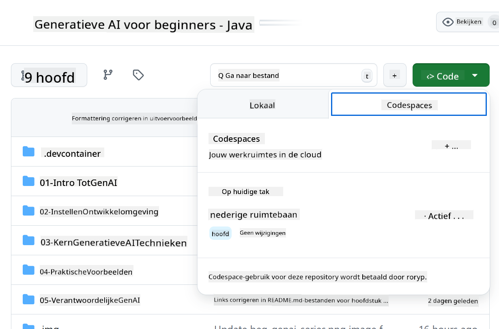

<!--
CO_OP_TRANSLATOR_METADATA:
{
  "original_hash": "bfdb4b4eadbee3a59ef742439f58326a",
  "translation_date": "2025-07-27T13:16:19+00:00",
  "source_file": "02-SetupDevEnvironment/getting-started-azure-openai.md",
  "language_code": "nl"
}
-->
# Het Instellen van de Ontwikkelomgeving voor Azure OpenAI

> **Snelle Start**: Deze handleiding is bedoeld voor het instellen van Azure OpenAI. Voor een directe start met gratis modellen, gebruik [GitHub Models met Codespaces](./README.md#quick-start-cloud).

Deze handleiding helpt je bij het instellen van Azure AI Foundry-modellen voor je Java AI-apps in deze cursus.

## Inhoudsopgave

- [Overzicht Snelle Setup](../../../02-SetupDevEnvironment)
- [Stap 1: Maak Azure AI Foundry Resources aan](../../../02-SetupDevEnvironment)
  - [Maak een Hub en Project](../../../02-SetupDevEnvironment)
  - [Implementeer GPT-4o-mini Model](../../../02-SetupDevEnvironment)
- [Stap 2: Maak je Codespace aan](../../../02-SetupDevEnvironment)
- [Stap 3: Configureer je Omgeving](../../../02-SetupDevEnvironment)
- [Stap 4: Test je Setup](../../../02-SetupDevEnvironment)
- [Wat Nu?](../../../02-SetupDevEnvironment)
- [Bronnen](../../../02-SetupDevEnvironment)
- [Aanvullende Bronnen](../../../02-SetupDevEnvironment)

## Overzicht Snelle Setup

1. Maak Azure AI Foundry-resources aan (Hub, Project, Model)
2. Maak een Codespace met een Java-ontwikkelcontainer
3. Configureer je .env-bestand met Azure OpenAI-referenties
4. Test je setup met het voorbeeldproject

## Stap 1: Maak Azure AI Foundry Resources aan

### Maak een Hub en Project

1. Ga naar [Azure AI Foundry Portal](https://ai.azure.com/) en log in
2. Klik op **+ Create** → **New hub** (of navigeer naar **Management** → **All hubs** → **+ New hub**)
3. Configureer je hub:
   - **Hubnaam**: bijv. "MijnAIHub"
   - **Abonnement**: Selecteer je Azure-abonnement
   - **Resourcegroep**: Maak een nieuwe of selecteer een bestaande
   - **Locatie**: Kies de dichtstbijzijnde locatie
   - **Opslagaccount**: Gebruik standaard of configureer aangepast
   - **Key vault**: Gebruik standaard of configureer aangepast
   - Klik op **Next** → **Review + create** → **Create**
4. Zodra de hub is aangemaakt, klik op **+ New project** (of **Create project** vanuit het huboverzicht)
   - **Projectnaam**: bijv. "GenAIJava"
   - Klik op **Create**

### Implementeer GPT-4o-mini Model

1. Ga in je project naar **Model catalog** en zoek naar **gpt-4o-mini**
   - *Alternatief: Ga naar **Deployments** → **+ Create deployment***
2. Klik op **Deploy** op de gpt-4o-mini modelkaart
3. Configureer de implementatie:
   - **Implementatienaam**: "gpt-4o-mini"
   - **Modelversie**: Gebruik de nieuwste
   - **Implementatietype**: Standaard
4. Klik op **Deploy**
5. Zodra het model is geïmplementeerd, ga naar het tabblad **Deployments** en kopieer de volgende waarden:
   - **Implementatienaam** (bijv. "gpt-4o-mini")
   - **Doel-URI** (bijv. `https://your-hub-name.openai.azure.com/`) 
      > **Belangrijk**: Kopieer alleen de basis-URL (bijv. `https://mijnhub.openai.azure.com/`) en niet het volledige eindpuntpad.
   - **Sleutel** (uit de sectie Keys and Endpoint)

> **Nog steeds problemen?** Bezoek de officiële [Azure AI Foundry Documentatie](https://learn.microsoft.com/azure/ai-foundry/how-to/create-projects?tabs=ai-foundry&pivots=hub-project)

## Stap 2: Maak je Codespace aan

1. Fork deze repository naar je GitHub-account
   > **Opmerking**: Als je de basisconfiguratie wilt aanpassen, bekijk dan de [Dev Container Configuratie](../../../.devcontainer/devcontainer.json)
2. Klik in je geforkte repo op **Code** → tabblad **Codespaces**
3. Klik op **...** → **New with options...**

4. Selecteer **Dev container configuration**: 
   - **Generative AI Java Development Environment**
5. Klik op **Create codespace**

## Stap 3: Configureer je Omgeving

Zodra je Codespace klaar is, stel je je Azure OpenAI-referenties in:

1. **Navigeer naar het voorbeeldproject vanuit de root van de repository:**
   ```bash
   cd 02-SetupDevEnvironment/examples/basic-chat-azure
   ```

2. **Maak je .env-bestand aan:**
   ```bash
   cp .env.example .env
   ```

3. **Bewerk het .env-bestand met je Azure OpenAI-referenties:**
   ```bash
   # Your Azure OpenAI API key (from Azure AI Foundry portal)
   AZURE_AI_KEY=your-actual-api-key-here
   
   # Your Azure OpenAI endpoint URL (e.g., https://myhub.openai.azure.com/)
   AZURE_AI_ENDPOINT=https://your-hub-name.openai.azure.com/
   ```

   > **Beveiligingsopmerking**: 
   > - Commit je `.env`-bestand nooit naar versiebeheer
   > - Het `.env`-bestand is al opgenomen in `.gitignore`
   > - Houd je API-sleutels veilig en roteer ze regelmatig

## Stap 4: Test je Setup

Voer de voorbeeldapplicatie uit om je Azure OpenAI-verbinding te testen:

```bash
mvn clean spring-boot:run
```

Je zou een reactie van het GPT-4o-mini model moeten zien!

> **VS Code Gebruikers**: Je kunt ook op `F5` drukken in VS Code om de applicatie uit te voeren. De startconfiguratie is al ingesteld om je `.env`-bestand automatisch te laden.

> **Volledig voorbeeld**: Zie de [End-to-End Azure OpenAI Voorbeeld](./examples/basic-chat-azure/README.md) voor gedetailleerde instructies en probleemoplossing.

## Wat Nu?

**Setup Compleet!** Je hebt nu:
- Azure OpenAI met gpt-4o-mini geïmplementeerd
- Lokale .env-bestandsconfiguratie
- Java-ontwikkelomgeving klaar

**Ga verder naar** [Hoofdstuk 3: Kerntechnieken voor Generatieve AI](../03-CoreGenerativeAITechniques/README.md) om AI-toepassingen te gaan bouwen!

## Bronnen

- [Azure AI Foundry Documentatie](https://learn.microsoft.com/azure/ai-services/)
- [Spring AI Azure OpenAI Documentatie](https://docs.spring.io/spring-ai/reference/api/clients/azure-openai-chat.html)
- [Azure OpenAI Java SDK](https://learn.microsoft.com/java/api/overview/azure/ai-openai-readme)

## Aanvullende Bronnen

- [Download VS Code](https://code.visualstudio.com/Download)
- [Haal Docker Desktop](https://www.docker.com/products/docker-desktop)
- [Dev Container Configuratie](../../../.devcontainer/devcontainer.json)

**Disclaimer**:  
Dit document is vertaald met behulp van de AI-vertalingsservice [Co-op Translator](https://github.com/Azure/co-op-translator). Hoewel we streven naar nauwkeurigheid, dient u zich ervan bewust te zijn dat geautomatiseerde vertalingen fouten of onnauwkeurigheden kunnen bevatten. Het originele document in de oorspronkelijke taal moet worden beschouwd als de gezaghebbende bron. Voor cruciale informatie wordt professionele menselijke vertaling aanbevolen. Wij zijn niet aansprakelijk voor misverstanden of verkeerde interpretaties die voortvloeien uit het gebruik van deze vertaling.