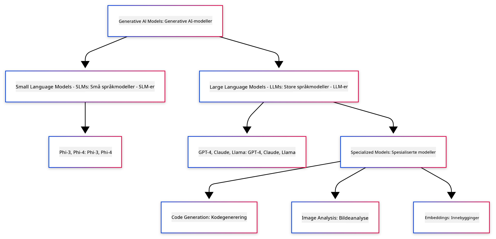
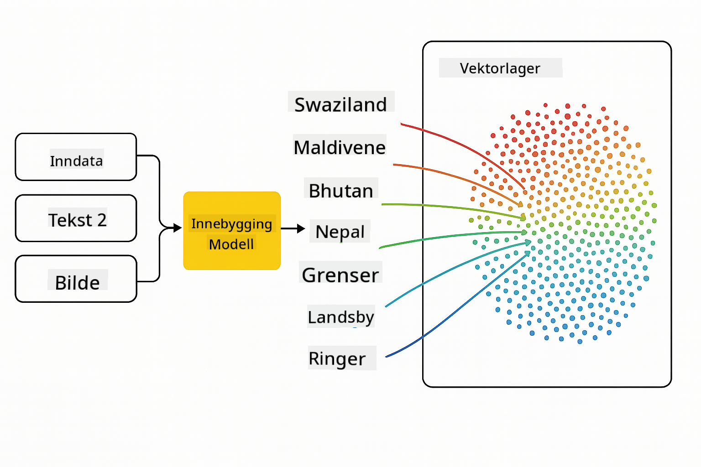
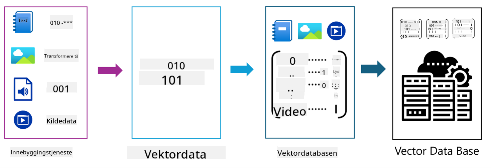

<!--
CO_OP_TRANSLATOR_METADATA:
{
  "original_hash": "006866db93a268a8769bb55f2e324291",
  "translation_date": "2025-07-28T10:54:26+00:00",
  "source_file": "01-IntroToGenAI/README.md",
  "language_code": "no"
}
-->
# Introduksjon til Generativ AI - Java-utgave

## Hva du vil lære

- **Grunnleggende om generativ AI**, inkludert LLM-er, prompt engineering, tokens, embeddings og vektordatabaser
- **Sammenligne Java AI-utviklingsverktøy**, inkludert Azure OpenAI SDK, Spring AI og OpenAI Java SDK
- **Oppdage Model Context Protocol** og dens rolle i kommunikasjon mellom AI-agenter

## Innholdsfortegnelse

- [Introduksjon](../../../01-IntroToGenAI)
- [En rask oppfriskning av generativ AI-konsepter](../../../01-IntroToGenAI)
- [Gjennomgang av prompt engineering](../../../01-IntroToGenAI)
- [Tokens, embeddings og agenter](../../../01-IntroToGenAI)
- [AI-utviklingsverktøy og biblioteker for Java](../../../01-IntroToGenAI)
  - [OpenAI Java SDK](../../../01-IntroToGenAI)
  - [Spring AI](../../../01-IntroToGenAI)
  - [Azure OpenAI Java SDK](../../../01-IntroToGenAI)
- [Oppsummering](../../../01-IntroToGenAI)
- [Neste steg](../../../01-IntroToGenAI)

## Introduksjon

Velkommen til første kapittel av Generativ AI for nybegynnere - Java-utgave! Denne grunnleggende leksjonen introduserer deg for kjernebegrepene innen generativ AI og hvordan du kan jobbe med dem ved hjelp av Java. Du vil lære om de essensielle byggesteinene i AI-applikasjoner, inkludert Large Language Models (LLMs), tokens, embeddings og AI-agenter. Vi vil også utforske de primære Java-verktøyene du vil bruke gjennom hele kurset.

### En rask oppfriskning av generativ AI-konsepter

Generativ AI er en type kunstig intelligens som skaper nytt innhold, som tekst, bilder eller kode, basert på mønstre og relasjoner lært fra data. Generative AI-modeller kan generere menneskelignende svar, forstå kontekst og noen ganger til og med skape innhold som virker menneskelig.

Når du utvikler Java AI-applikasjoner, vil du jobbe med **generative AI-modeller** for å skape innhold. Noen av egenskapene til generative AI-modeller inkluderer:

- **Tekstgenerering**: Lage menneskelignende tekst for chatbots, innhold og tekstfullføring.
- **Bildegenerering og analyse**: Produsere realistiske bilder, forbedre fotografier og identifisere objekter.
- **Kodegenerering**: Skrive kodebiter eller skript.

Det finnes spesifikke typer modeller som er optimalisert for ulike oppgaver. For eksempel kan både **Small Language Models (SLMs)** og **Large Language Models (LLMs)** håndtere tekstgenerering, hvor LLM-er vanligvis gir bedre ytelse for komplekse oppgaver. For bilde-relaterte oppgaver vil du bruke spesialiserte visjonsmodeller eller multimodale modeller.

Selvfølgelig er ikke svarene fra disse modellene alltid perfekte. Du har kanskje hørt om modeller som "hallusinerer" eller genererer feilaktig informasjon på en autoritativ måte. Men du kan hjelpe modellen med å generere bedre svar ved å gi klare instruksjoner og kontekst. Dette er hvor **prompt engineering** kommer inn.

#### Gjennomgang av prompt engineering

Prompt engineering er praksisen med å designe effektive input for å veilede AI-modeller mot ønskede resultater. Det innebærer:

- **Klarhet**: Gjøre instruksjonene tydelige og utvetydige.
- **Kontekst**: Gi nødvendig bakgrunnsinformasjon.
- **Begrensninger**: Spesifisere eventuelle begrensninger eller formater.

Noen beste praksiser for prompt engineering inkluderer promptdesign, klare instruksjoner, oppdeling av oppgaver, one-shot og few-shot læring, og prompt-tuning. Testing av ulike prompts er essensielt for å finne hva som fungerer best for din spesifikke brukssituasjon.

Når du utvikler applikasjoner, vil du jobbe med ulike typer prompts:
- **Systemprompts**: Setter grunnreglene og konteksten for modellens oppførsel
- **Brukerprompts**: Input-data fra applikasjonsbrukerne dine
- **Assistentprompts**: Modellens svar basert på system- og brukerprompts

> **Lær mer**: Lær mer om prompt engineering i [Prompt Engineering-kapittelet i GenAI for nybegynnere-kurset](https://github.com/microsoft/generative-ai-for-beginners/tree/main/04-prompt-engineering-fundamentals)

#### Tokens, embeddings og agenter

Når du jobber med generative AI-modeller, vil du støte på begreper som **tokens**, **embeddings**, **agenter** og **Model Context Protocol (MCP)**. Her er en detaljert oversikt over disse konseptene:

- **Tokens**: Tokens er den minste enheten av tekst i en modell. De kan være ord, tegn eller delord. Tokens brukes til å representere tekstdata i et format som modellen kan forstå. For eksempel kan setningen "The quick brown fox jumped over the lazy dog" bli tokenisert som ["The", " quick", " brown", " fox", " jumped", " over", " the", " lazy", " dog"] eller ["The", " qu", "ick", " br", "own", " fox", " jump", "ed", " over", " the", " la", "zy", " dog"] avhengig av tokeniseringsstrategien.

Tokenisering er prosessen med å bryte ned tekst i disse mindre enhetene. Dette er avgjørende fordi modeller opererer på tokens i stedet for rå tekst. Antallet tokens i en prompt påvirker modellens svarlengde og kvalitet, da modeller har tokenbegrensninger for deres kontekstvindu (f.eks. 128K tokens for GPT-4o's totale kontekst, inkludert både input og output).

  I Java kan du bruke biblioteker som OpenAI SDK for å håndtere tokenisering automatisk når du sender forespørsler til AI-modeller.

- **Embeddings**: Embeddings er vektorrepresentasjoner av tokens som fanger semantisk mening. De er numeriske representasjoner (typisk matriser av flyttallsverdier) som lar modeller forstå relasjoner mellom ord og generere kontekstuelt relevante svar. Lignende ord har lignende embeddings, noe som gjør det mulig for modellen å forstå konsepter som synonymer og semantiske relasjoner.

  I Java kan du generere embeddings ved hjelp av OpenAI SDK eller andre biblioteker som støtter embedding-generering. Disse embeddings er essensielle for oppgaver som semantisk søk, hvor du ønsker å finne lignende innhold basert på mening i stedet for eksakte tekstmatcher.

- **Vektordatabaser**: Vektordatabaser er spesialiserte lagringssystemer optimalisert for embeddings. De muliggjør effektiv likhetssøk og er avgjørende for Retrieval-Augmented Generation (RAG)-mønstre hvor du trenger å finne relevant informasjon fra store datasett basert på semantisk likhet i stedet for eksakte matcher.

> **Merk**: I dette kurset vil vi ikke dekke vektordatabaser, men de er verdt å nevne siden de ofte brukes i virkelige applikasjoner.

- **Agenter & MCP**: AI-komponenter som autonomt samhandler med modeller, verktøy og eksterne systemer. Model Context Protocol (MCP) gir en standardisert måte for agenter å sikkert få tilgang til eksterne datakilder og verktøy. Lær mer i vårt [MCP for nybegynnere](https://github.com/microsoft/mcp-for-beginners)-kurs.

I Java AI-applikasjoner vil du bruke tokens for tekstbehandling, embeddings for semantisk søk og RAG, vektordatabaser for datahenting, og agenter med MCP for å bygge intelligente systemer som bruker verktøy.

### AI-utviklingsverktøy og biblioteker for Java

Java tilbyr utmerkede verktøy for AI-utvikling. Det finnes tre hovedbiblioteker som vi vil utforske gjennom hele kurset - OpenAI Java SDK, Azure OpenAI SDK og Spring AI.

Her er en rask referansetabell som viser hvilket SDK som brukes i eksemplene i hvert kapittel:

| Kapittel | Eksempel | SDK |
|----------|----------|-----|
| 02-SetupDevEnvironment | github-models | OpenAI Java SDK |
| 02-SetupDevEnvironment | basic-chat-azure | Spring AI Azure OpenAI |
| 03-CoreGenerativeAITechniques | eksempler | Azure OpenAI SDK |
| 04-PracticalSamples | petstory | OpenAI Java SDK |
| 04-PracticalSamples | foundrylocal | OpenAI Java SDK |
| 04-PracticalSamples | calculator | Spring AI MCP SDK + LangChain4j |

**SDK-dokumentasjonslenker:**
- [Azure OpenAI Java SDK](https://github.com/Azure/azure-sdk-for-java/tree/azure-ai-openai_1.0.0-beta.16/sdk/openai/azure-ai-openai)
- [Spring AI](https://docs.spring.io/spring-ai/reference/)
- [OpenAI Java SDK](https://github.com/openai/openai-java)
- [LangChain4j](https://docs.langchain4j.dev/)

#### OpenAI Java SDK

OpenAI SDK er det offisielle Java-biblioteket for OpenAI API. Det gir et enkelt og konsistent grensesnitt for å samhandle med OpenAIs modeller, noe som gjør det enkelt å integrere AI-funksjonalitet i Java-applikasjoner. Kapittel 2s GitHub Models-eksempel, Kapittel 4s Pet Story-applikasjon og Foundry Local-eksempel demonstrerer OpenAI SDK-tilnærmingen.

#### Spring AI

Spring AI er et omfattende rammeverk som bringer AI-funksjonalitet til Spring-applikasjoner, og gir et konsistent abstraksjonslag på tvers av ulike AI-leverandører. Det integreres sømløst med Spring-økosystemet, noe som gjør det til det ideelle valget for bedrifts-Java-applikasjoner som trenger AI-funksjonalitet.

Spring AIs styrke ligger i sin sømløse integrasjon med Spring-økosystemet, noe som gjør det enkelt å bygge produksjonsklare AI-applikasjoner med kjente Spring-mønstre som avhengighetsinjeksjon, konfigurasjonsstyring og testrammeverk. Du vil bruke Spring AI i Kapittel 2 og 4 for å bygge applikasjoner som utnytter både OpenAI og Model Context Protocol (MCP) Spring AI-biblioteker.

##### Model Context Protocol (MCP)

[Model Context Protocol (MCP)](https://modelcontextprotocol.io/) er en fremvoksende standard som gjør det mulig for AI-applikasjoner å samhandle sikkert med eksterne datakilder og verktøy. MCP gir en standardisert måte for AI-modeller å få tilgang til kontekstuell informasjon og utføre handlinger i applikasjonene dine.

I Kapittel 4 vil du bygge en enkel MCP-kalkulatortjeneste som demonstrerer grunnleggende om Model Context Protocol med Spring AI, og viser hvordan du kan lage grunnleggende verktøyintegrasjoner og tjenestearkitekturer.

#### Azure OpenAI Java SDK

Azure OpenAI-klientbiblioteket for Java er en tilpasning av OpenAIs REST-API-er som gir et idiomatisk grensesnitt og integrasjon med resten av Azure SDK-økosystemet. I Kapittel 3 vil du bygge applikasjoner ved hjelp av Azure OpenAI SDK, inkludert chat-applikasjoner, funksjonskall og RAG (Retrieval-Augmented Generation)-mønstre.

> Merk: Azure OpenAI SDK ligger etter OpenAI Java SDK når det gjelder funksjoner, så for fremtidige prosjekter bør du vurdere å bruke OpenAI Java SDK.

## Oppsummering

**Gratulerer!** Du har med suksess:

- **Lært om grunnleggende generativ AI**, inkludert LLM-er, prompt engineering, tokens, embeddings og vektordatabaser
- **Sammenlignet Java AI-utviklingsverktøy**, inkludert Azure OpenAI SDK, Spring AI og OpenAI Java SDK
- **Oppdaget Model Context Protocol** og dens rolle i kommunikasjon mellom AI-agenter

## Neste steg

[Kapittel 2: Sette opp utviklingsmiljøet](../02-SetupDevEnvironment/README.md)

**Ansvarsfraskrivelse**:  
Dette dokumentet er oversatt ved hjelp av AI-oversettelsestjenesten [Co-op Translator](https://github.com/Azure/co-op-translator). Selv om vi streber etter nøyaktighet, vær oppmerksom på at automatiserte oversettelser kan inneholde feil eller unøyaktigheter. Det originale dokumentet på sitt opprinnelige språk bør anses som den autoritative kilden. For kritisk informasjon anbefales profesjonell menneskelig oversettelse. Vi er ikke ansvarlige for misforståelser eller feiltolkninger som oppstår ved bruk av denne oversettelsen.