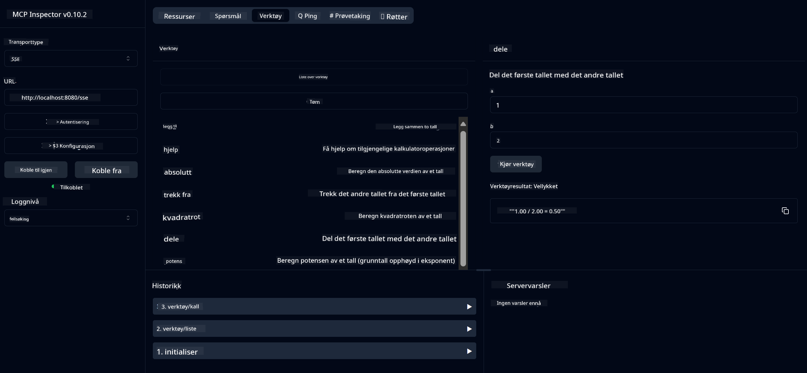

<!--
CO_OP_TRANSLATOR_METADATA:
{
  "original_hash": "5bd7a347d6ed1d706443f9129dd29dd9",
  "translation_date": "2025-07-25T09:39:54+00:00",
  "source_file": "04-PracticalSamples/mcp/calculator/README.md",
  "language_code": "no"
}
-->
# Grunnleggende Kalkulator MCP-tjeneste

>**Merk**: Dette kapittelet inkluderer en [**Veiledning**](./TUTORIAL.md) som guider deg gjennom eksemplene.

Velkommen til din første praktiske erfaring med **Model Context Protocol (MCP)**! I de tidligere kapitlene har du lært om grunnleggende generativ AI og satt opp ditt utviklingsmiljø. Nå er det på tide å bygge noe praktisk.

Denne kalkulatortjenesten viser hvordan AI-modeller trygt kan samhandle med eksterne verktøy ved hjelp av MCP. I stedet for å stole på AI-modellens tidvis upålitelige matematiske evner, vil vi vise hvordan man kan bygge et robust system der AI kan kalle spesialiserte tjenester for nøyaktige beregninger.

## Innholdsfortegnelse

- [Hva Du Vil Lære](../../../../../04-PracticalSamples/mcp/calculator)
- [Forutsetninger](../../../../../04-PracticalSamples/mcp/calculator)
- [Nøkkelkonsepter](../../../../../04-PracticalSamples/mcp/calculator)
- [Kom i Gang](../../../../../04-PracticalSamples/mcp/calculator)
- [Tilgjengelige Kalkulatoroperasjoner](../../../../../04-PracticalSamples/mcp/calculator)
- [Testklienter](../../../../../04-PracticalSamples/mcp/calculator)
  - [1. Direkte MCP-klient (SDKClient)](../../../../../04-PracticalSamples/mcp/calculator)
  - [2. AI-drevet Klient (LangChain4jClient)](../../../../../04-PracticalSamples/mcp/calculator)
- [MCP Inspector (Web UI)](../../../../../04-PracticalSamples/mcp/calculator)
  - [Trinn-for-Trinn Instruksjoner](../../../../../04-PracticalSamples/mcp/calculator)

## Hva Du Vil Lære

Ved å jobbe gjennom dette eksemplet vil du forstå:
- Hvordan lage MCP-kompatible tjenester med Spring Boot
- Forskjellen mellom direkte protokollkommunikasjon og AI-drevet interaksjon
- Hvordan AI-modeller bestemmer når og hvordan de skal bruke eksterne verktøy
- Beste praksis for å bygge AI-applikasjoner med verktøystøtte

Perfekt for nybegynnere som lærer MCP-konsepter og er klare til å bygge sin første AI-verktøyintegrasjon!

## Forutsetninger

- Java 21+
- Maven 3.6+
- **GitHub Token**: Kreves for den AI-drevne klienten. Hvis du ikke har satt opp dette ennå, se [Kapittel 2: Sette opp ditt utviklingsmiljø](../../../02-SetupDevEnvironment/README.md) for instruksjoner.

## Nøkkelkonsepter

**Model Context Protocol (MCP)** er en standardisert måte for AI-applikasjoner å trygt koble til eksterne verktøy. Tenk på det som en "bro" som lar AI-modeller bruke eksterne tjenester som vår kalkulator. I stedet for at AI-modellen prøver å gjøre matematiske beregninger selv (som kan være upålitelig), kan den kalle vår kalkulatortjeneste for å få nøyaktige resultater. MCP sikrer at denne kommunikasjonen skjer trygt og konsistent.

**Server-Sent Events (SSE)** muliggjør sanntidskommunikasjon mellom serveren og klientene. I motsetning til tradisjonelle HTTP-forespørsler der du spør og venter på svar, lar SSE serveren kontinuerlig sende oppdateringer til klienten. Dette er perfekt for AI-applikasjoner der svar kan bli strømmet eller ta tid å prosessere.

**AI-verktøy og Funksjonskalling** lar AI-modeller automatisk velge og bruke eksterne funksjoner (som kalkulatoroperasjoner) basert på brukerforespørsler. Når du spør "Hva er 15 + 27?", forstår AI-modellen at du ønsker addisjon, kaller automatisk vår `add`-funksjon med de riktige parameterne (15, 27), og returnerer resultatet i naturlig språk. AI fungerer som en intelligent koordinator som vet når og hvordan den skal bruke hvert verktøy.

## Kom i Gang

### 1. Naviger til kalkulatorapplikasjonskatalogen
```bash
cd Generative-AI-for-beginners-java/04-PracticalSamples/mcp/calculator
```

### 2. Bygg og Kjør
```bash
mvn clean install -DskipTests
java -jar target/calculator-server-0.0.1-SNAPSHOT.jar
```

### 2. Test med Klienter
- **SDKClient**: Direkte MCP-protokollinteraksjon
- **LangChain4jClient**: AI-drevet naturlig språkinteraksjon (krever GitHub-token)

## Tilgjengelige Kalkulatoroperasjoner

- `add(a, b)`, `subtract(a, b)`, `multiply(a, b)`, `divide(a, b)`
- `power(base, exponent)`, `squareRoot(number)`, `absolute(number)`
- `modulus(a, b)`, `help()`

## Testklienter

### 1. Direkte MCP-klient (SDKClient)
Tester rå MCP-protokollkommunikasjon. Kjør med:
```bash
mvn test-compile exec:java -Dexec.mainClass="com.microsoft.mcp.sample.client.SDKClient" -Dexec.classpathScope=test
```

### 2. AI-drevet Klient (LangChain4jClient)
Demonstrerer naturlig språkinteraksjon med GitHub-modeller. Krever GitHub-token (se [Forutsetninger](../../../../../04-PracticalSamples/mcp/calculator)).

**Kjør:**
```bash
mvn test-compile exec:java -Dexec.mainClass="com.microsoft.mcp.sample.client.LangChain4jClient" -Dexec.classpathScope=test
```

## MCP Inspector (Web UI)

MCP Inspector gir et visuelt webgrensesnitt for å teste din MCP-tjeneste uten å skrive kode. Perfekt for nybegynnere som ønsker å forstå hvordan MCP fungerer!

### Trinn-for-Trinn Instruksjoner:

1. **Start kalkulatorserveren** (hvis den ikke allerede kjører):
   ```bash
   java -jar target/calculator-server-0.0.1-SNAPSHOT.jar
   ```

2. **Installer og kjør MCP Inspector** i et nytt terminalvindu:
   ```bash
   npx @modelcontextprotocol/inspector
   ```

3. **Åpne webgrensesnittet**:
   - Se etter en melding som "Inspector running at http://localhost:6274"
   - Åpne den URL-en i nettleseren din

4. **Koble til kalkulatortjenesten din**:
   - I webgrensesnittet, sett transporttypen til "SSE"
   - Sett URL-en til: `http://localhost:8080/sse`
   - Klikk på "Connect"-knappen

5. **Utforsk tilgjengelige verktøy**:
   - Klikk på "List Tools" for å se alle kalkulatoroperasjoner
   - Du vil se funksjoner som `add`, `subtract`, `multiply`, osv.

6. **Test en kalkulatoroperasjon**:
   - Velg et verktøy (f.eks. "add")
   - Angi parametere (f.eks. `a: 15`, `b: 27`)
   - Klikk på "Run Tool"
   - Se resultatet returnert av din MCP-tjeneste!

Denne visuelle tilnærmingen hjelper deg med å forstå nøyaktig hvordan MCP-kommunikasjon fungerer før du bygger dine egne klienter.



---
**Referanse:** [MCP Server Boot Starter Docs](https://docs.spring.io/spring-ai/reference/api/mcp/mcp-server-boot-starter-docs.html)

**Ansvarsfraskrivelse**:  
Dette dokumentet er oversatt ved hjelp av AI-oversettelsestjenesten [Co-op Translator](https://github.com/Azure/co-op-translator). Selv om vi streber etter nøyaktighet, vær oppmerksom på at automatiserte oversettelser kan inneholde feil eller unøyaktigheter. Det originale dokumentet på sitt opprinnelige språk bør anses som den autoritative kilden. For kritisk informasjon anbefales profesjonell menneskelig oversettelse. Vi er ikke ansvarlige for misforståelser eller feiltolkninger som oppstår ved bruk av denne oversettelsen.